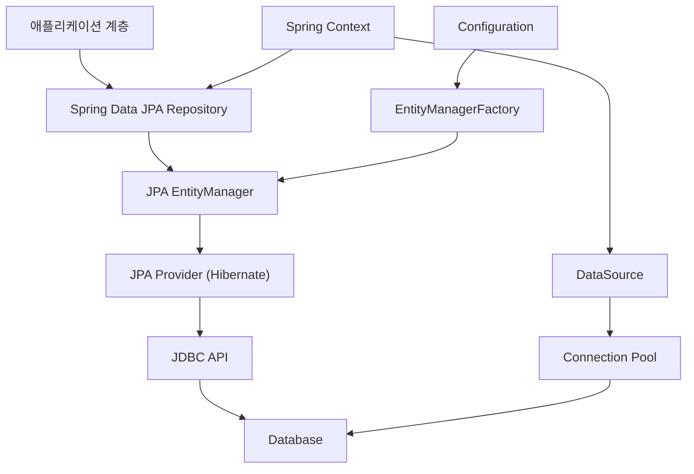
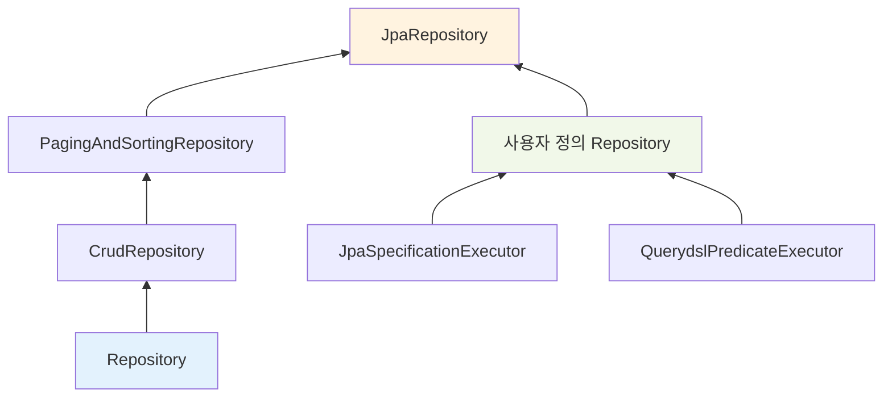
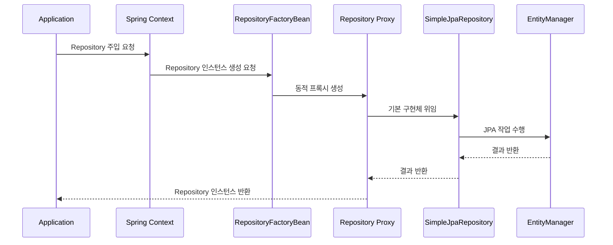
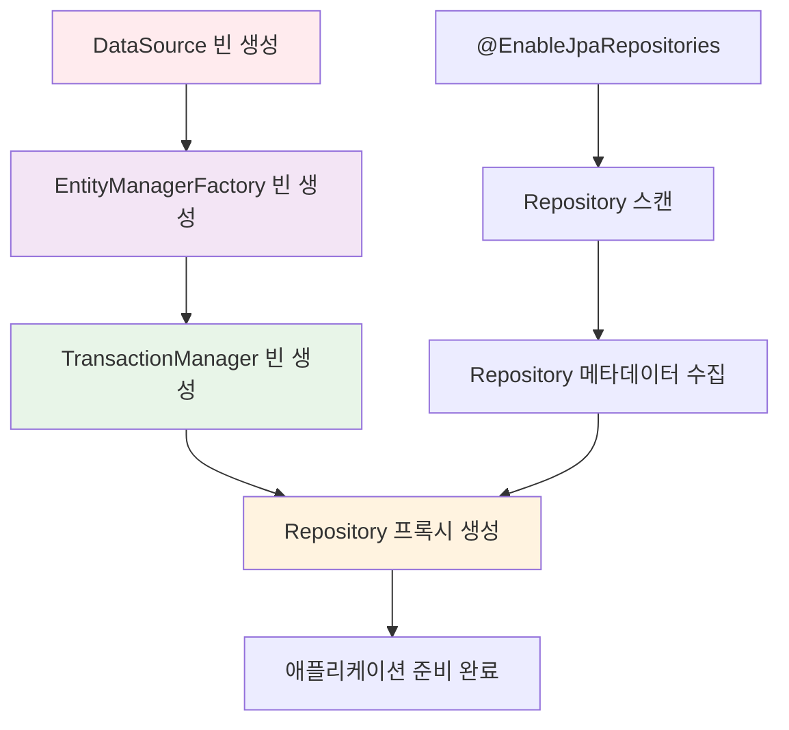

# Spring Data JPA의 구조와 핵심 컴포넌트

Spring Data JPA는 JPA 기반의 데이터 접근 계층 개발을 대폭 간소화해주는 스프링 프레임워크의 핵심 모듈입니다. 복잡한 JPA 설정과 boilerplate 코드를 줄여주면서도 강력한 데이터 접근 기능을 제공합니다. Spring Data JPA의 전체적인 구조를 이해하기 위해서는 각 컴포넌트가 어떻게 상호작용하며 동작하는지 파악하는 것이 중요합니다.

## Spring Data JPA의 계층 구조

Spring Data JPA는 여러 계층으로 구성되어 있으며, 각 계층이 명확한 역할을 담당합니다.



이 구조에서 각 컴포넌트는 서로 다른 추상화 레벨에서 동작하며, 상위 계층이 하위 계층의 복잡성을 감춰주는 역할을 합니다.

## 핵심 컴포넌트 분석

### DataSource - 데이터베이스 연결의 출발점

[[DataSource]]는 Spring Data JPA에서 데이터베이스와의 연결을 관리하는 가장 기본적인 컴포넌트입니다. 애플리케이션과 데이터베이스 사이의 연결 풀을 관리하며, 트랜잭션 경계 안에서 일관된 데이터베이스 연결을 보장합니다.

```java
@Configuration
public class DatabaseConfig {
    
    @Bean
    public DataSource dataSource() {
        EmbeddedDatabaseBuilder builder = new EmbeddedDatabaseBuilder();
        return builder.setType(EmbeddedDatabaseType.H2).build();
    }
}
```

DataSource는 직접 데이터베이스 커넥션을 제공하는 것이 아니라, 커넥션 풀을 통해 효율적으로 연결을 관리합니다. 자세한 내용은 [[Spring 데이터베이스 커넥션 관리]]를 참고해주세요.

### EntityManagerFactory - JPA의 핵심 팩토리

EntityManagerFactory는 JPA의 핵심 컴포넌트로, EntityManager 인스턴스를 생성하고 관리하는 팩토리 역할을 담당합니다. 이는 JPA 설정 정보와 메타데이터를 기반으로 생성되며, 애플리케이션 전체에서 단일 인스턴스로 공유됩니다.

```java
@Bean
public LocalContainerEntityManagerFactoryBean entityManagerFactory() {
    HibernateJpaVendorAdapter vendorAdapter = new HibernateJpaVendorAdapter();
    vendorAdapter.setGenerateDdl(true);
    
    LocalContainerEntityManagerFactoryBean factory = new LocalContainerEntityManagerFactoryBean();
    factory.setJpaVendorAdapter(vendorAdapter);
    factory.setPackagesToScan("com.example.domain");
    factory.setDataSource(dataSource());
    return factory;
}
```

EntityManagerFactory의 중요한 특징은 스레드 안전성입니다. 여러 스레드가 동시에 접근해도 안전하게 EntityManager를 생성할 수 있습니다. 자세한 설정 방법은 [[JPA EntityManagerFactory 설정]]을 참고해주세요.

### EntityManager - 영속성 컨텍스트의 관리자

[[EntityManager]]는 JPA에서 엔티티의 생명주기를 관리하고 [[영속성 컨텍스트(Persistence Context)]]를 다루는 핵심 인터페이스입니다. 모든 JPA 작업은 EntityManager를 통해 수행되며, Spring Data JPA 리포지토리도 내부적으로 EntityManager를 사용합니다.

EntityManager는 다음과 같은 주요 기능을 제공합니다:

1. **엔티티 생명주기 관리**: persist, merge, remove, find
2. **쿼리 실행**: JPQL, Criteria API, Native Query
3. **트랜잭션 관리**: 트랜잭션 범위 내에서의 변경 감지
4. **캐싱**: 1차 캐시를 통한 성능 최적화

```java
class UserRepositoryImpl implements UserRepositoryCustom {
    
    private final EntityManager em;
    
    @Autowired
    public UserRepositoryImpl(JpaContext context) {
        this.em = context.getEntityManagerByManagedType(User.class);
    }
    
    public List<User> findCustomUsers() {
        return em.createQuery("SELECT u FROM User u WHERE u.active = true", User.class)
                .getResultList();
    }
}
```

EntityManager의 상세한 활용법은 [[JPA EntityManager 활용법]]을 참고해주세요.

### JPA Provider - 실제 구현체

JPA는 스펙이며, 실제 구현은 JPA Provider가 담당합니다. Spring Data JPA에서는 주로 Hibernate를 사용하지만, EclipseLink, OpenJPA 등 다른 구현체도 사용할 수 있습니다.

JPA Provider는 다음과 같은 기능을 제공합니다:

- JPQL을 SQL로 변환
- 엔티티 매핑 처리
- 연관관계 관리
- 캐싱 전략 구현
- 성능 최적화

각 JPA Provider별 특징과 설정 방법은 [[JPA Provider 비교]]를 참고해주세요.

## Spring Data JPA Repository 계층

### Repository 인터페이스 계층구조

Spring Data JPA는 계층적인 Repository 인터페이스 구조를 제공합니다.



각 인터페이스는 다음과 같은 기능을 제공합니다:

1. **Repository**: 마커 인터페이스, 기본 타입 정보 제공
2. **CrudRepository**: 기본적인 CRUD 작업 메서드
3. **PagingAndSortingRepository**: 페이징과 정렬 기능 추가
4. **JpaRepository**: JPA 특화 기능 (배치 작업, 플러시 등)

### Repository 인스턴스 생성 과정

Spring Data JPA는 런타임에 Repository 인터페이스의 구현체를 동적으로 생성합니다.



이 과정에서 Spring Data JPA는 메서드 이름을 분석하여 적절한 쿼리를 생성하거나, @Query 어노테이션을 해석하여 실행합니다.

Repository 생성 과정의 상세한 내용은 [[Spring Data Repository 생성 메커니즘]]을 참고해주세요.

## 설정과 초기화 과정

### Java Configuration을 통한 설정

```java
@Configuration
@EnableJpaRepositories(basePackages = "com.example.repository")
@EnableTransactionManagement
public class JpaConfig {
    
    @Bean
    public DataSource dataSource() {
        EmbeddedDatabaseBuilder builder = new EmbeddedDatabaseBuilder();
        return builder.setType(EmbeddedDatabaseType.H2).build();
    }
    
    @Bean
    public LocalContainerEntityManagerFactoryBean entityManagerFactory() {
        HibernateJpaVendorAdapter vendorAdapter = new HibernateJpaVendorAdapter();
        vendorAdapter.setGenerateDdl(true);
        
        LocalContainerEntityManagerFactoryBean factory = new LocalContainerEntityManagerFactoryBean();
        factory.setJpaVendorAdapter(vendorAdapter);
        factory.setPackagesToScan("com.example.domain");
        factory.setDataSource(dataSource());
        return factory;
    }
    
    @Bean
    public PlatformTransactionManager transactionManager(EntityManagerFactory entityManagerFactory) {
        JpaTransactionManager txManager = new JpaTransactionManager();
        txManager.setEntityManagerFactory(entityManagerFactory);
        return txManager;
    }
}
```

### 컴포넌트 간 의존성과 초기화 순서

Spring Data JPA에서 컴포넌트들의 초기화 순서는 매우 중요합니다.



이 초기화 과정에서 발생할 수 있는 문제점과 해결방법은 [[Spring Data JPA 초기화 문제 해결]]을 참고해주세요.

## 트랜잭션 관리 메커니즘

### PlatformTransactionManager의 역할

Spring Data JPA는 [[Spring 트랜잭션 관리]]와 완전히 통합되어 있습니다. JpaTransactionManager가 EntityManager의 생명주기와 트랜잭션을 관리합니다.

```java
@Bean
public PlatformTransactionManager transactionManager(EntityManagerFactory entityManagerFactory) {
    JpaTransactionManager txManager = new JpaTransactionManager();
    txManager.setEntityManagerFactory(entityManagerFactory);
    return txManager;
}
```

### Repository 메서드별 트랜잭션 설정

```java
@Transactional(readOnly = true)
interface UserRepository extends JpaRepository<User, Long> {
    
    List<User> findByLastname(String lastname);
    
    @Modifying
    @Transactional
    @Query("delete from User u where u.active = false")
    void deleteInactiveUsers();
}
```

기본적으로 Repository의 읽기 메서드는 읽기 전용 트랜잭션으로 실행되며, 수정 작업은 쓰기 가능한 트랜잭션으로 실행됩니다.

트랜잭션 관리의 고급 기법은 [[Spring Data JPA 트랜잭션 전략]]을 참고해주세요.

## 쿼리 실행 메커니즘

### 메서드 이름 기반 쿼리 생성

Spring Data JPA는 메서드 이름을 분석하여 자동으로 쿼리를 생성합니다.

```java
public interface UserRepository extends Repository<User, Long> {
    
    // SELECT u FROM User u WHERE u.emailAddress = ?1 AND u.lastname = ?2
    List<User> findByEmailAddressAndLastname(String emailAddress, String lastname);
}
```

### @Query 어노테이션을 통한 커스텀 쿼리

```java
public interface UserRepository extends JpaRepository<User, Long> {
    
    @Query("select u from User u where u.firstname = :firstname or u.lastname = :lastname")
    User findByLastnameOrFirstname(@Param("lastname") String lastname,
                                   @Param("firstname") String firstname);
}
```

### 네이티브 쿼리 지원

```java
@Query(value = "SELECT * FROM users WHERE email_address = ?1", nativeQuery = true)
User findByEmailAddressNative(String emailAddress);
```

쿼리 실행 메커니즘의 내부 동작 원리는 [[Spring Data JPA 쿼리 생성 메커니즘]]을 참고해주세요.

## 고급 기능과 확장점

### Specifications을 통한 동적 쿼리

[[JPA Criteria API]]를 기반으로 한 동적 쿼리 생성을 지원합니다.

```java
public interface CustomerRepository extends CrudRepository<Customer, Long>, JpaSpecificationExecutor<Customer> {
    // Specification 메서드들이 자동으로 제공됨
}

// 사용 예시
List<Customer> customers = customerRepository.findAll(
    isLongTermCustomer().or(hasSalesOfMoreThan(amount))
);
```

Specifications의 활용법은 [[Spring Data JPA Specifications 활용]]을 참고해주세요.

### Custom Repository 구현

기본 제공 기능으로 해결할 수 없는 복잡한 요구사항은 커스텀 구현을 통해 해결할 수 있습니다.

```java
interface UserRepositoryCustom {
    List<User> findComplexUsers();
}

class UserRepositoryImpl implements UserRepositoryCustom {
    
    private final EntityManager em;
    
    public UserRepositoryImpl(EntityManager em) {
        this.em = em;
    }
    
    @Override
    public List<User> findComplexUsers() {
        // 복잡한 쿼리 로직 구현
        return em.createQuery("복잡한 쿼리", User.class).getResultList();
    }
}

interface UserRepository extends JpaRepository<User, Long>, UserRepositoryCustom {
    // 기본 메서드와 커스텀 메서드 모두 사용 가능
}
```

### 오디팅 기능

엔티티의 생성시간, 수정시간, 생성자, 수정자 등의 정보를 자동으로 관리합니다.

```java
@Configuration
@EnableJpaAuditing
class AuditConfig {
    
    @Bean
    public AuditorAware<String> auditorProvider() {
        return new AuditorAwareImpl();
    }
}

@Entity
@EntityListeners(AuditingEntityListener.class)
public class User {
    
    @CreatedDate
    private LocalDateTime createdDate;
    
    @LastModifiedDate
    private LocalDateTime lastModifiedDate;
    
    @CreatedBy
    private String createdBy;
    
    @LastModifiedBy
    private String lastModifiedBy;
}
```

오디팅 기능의 상세한 설정과 활용은 [[Spring Data JPA 오디팅]]을 참고해주세요.

## 성능 최적화 고려사항

### N+1 문제와 해결책

JPA를 사용할 때 가장 흔히 발생하는 성능 문제 중 하나가 N+1 문제입니다. Spring Data JPA는 이를 해결하기 위한 여러 방법을 제공합니다.

```java
public interface GroupRepository extends CrudRepository<GroupInfo, String> {
    
    @EntityGraph(attributePaths = { "members" })
    GroupInfo getByGroupName(String name);
}
```

### 페이징과 정렬 최적화

```java
public interface UserRepository extends PagingAndSortingRepository<User, Long> {
    
    Page<User> findByLastnameStartingWith(String lastname, Pageable pageable);
}

// 사용 예시
Pageable pageable = PageRequest.of(0, 10, Sort.by("lastname"));
Page<User> users = userRepository.findByLastnameStartingWith("김", pageable);
```

성능 최적화 방법의 자세한 내용은 [[Spring Data JPA 성능 최적화]]를 참고해주세요.

## 실제 사용 시나리오

### 간단한 CRUD 애플리케이션

```java
@Entity
public class User {
    @Id 
    @GeneratedValue(strategy = GenerationType.AUTO)
    private Long id;
    private String name;
    private String email;
    
    // getters and setters
}

public interface UserRepository extends JpaRepository<User, Long> {
    
    List<User> findByName(String name);
    
    @Query("SELECT u FROM User u WHERE u.email = ?1")
    Optional<User> findByEmail(String email);
}

@Service
@Transactional
public class UserService {
    
    private final UserRepository userRepository;
    
    public UserService(UserRepository userRepository) {
        this.userRepository = userRepository;
    }
    
    public User createUser(String name, String email) {
        User user = new User();
        user.setName(name);
        user.setEmail(email);
        return userRepository.save(user);
    }
    
    @Transactional(readOnly = true)
    public List<User> getUsersByName(String name) {
        return userRepository.findByName(name);
    }
}
```

### Spring Boot에서의 자동 설정

Spring Boot를 사용하면 대부분의 설정이 자동화됩니다.

```java
@SpringBootApplication
public class Application {
    
    public static void main(String[] args) {
        SpringApplication.run(Application.class, args);
    }
    
    @Bean
    CommandLineRunner demo(UserRepository repository) {
        return args -> {
            User user = new User();
            user.setName("John");
            user.setEmail("john@example.com");
            
            repository.save(user);
            
            User found = repository.findByEmail("john@example.com")
                .orElseThrow(NoSuchElementException::new);
            
            System.out.println("Found user: " + found.getName());
        };
    }
}
```

Spring Boot에서의 JPA 설정과 활용법은 [[Spring Boot JPA 자동 설정]]을 참고해주세요.

## 모니터링과 디버깅

### 쿼리 로깅과 성능 모니터링

```yaml
# application.yml
spring:
  jpa:
    show-sql: true
    properties:
      hibernate:
        format_sql: true
        generate_statistics: true
        
logging:
  level:
    org.hibernate.SQL: DEBUG
    org.hibernate.type.descriptor.sql.BasicBinder: TRACE
```

### JPA 메타데이터와 AOT 컴파일

Spring Data JPA는 AOT(Ahead-of-Time) 컴파일을 지원하여 네이티브 이미지 생성을 지원합니다.

```java
// AOT 메타데이터 생성을 위한 Repository 정의 예시
interface UserRepository extends CrudRepository<User, Integer> {
    
    List<User> findUserNoArgumentsBy();
    
    Page<User> findPageOfUsersByLastnameStartingWith(String lastname, Pageable page);
    
    @Query("select u from User u where u.emailAddress = ?1")
    User findAnnotatedQueryByEmailAddress(String username);
    
    @Procedure(value = "sp_add")
    Integer providedProcedure(@Param("arg") Integer arg);
}
```

## 마이그레이션과 버전 관리

### 엔티티 변경과 데이터베이스 스키마 관리

Spring Data JPA에서는 [[Flyway]] 또는 [[Liquibase]]와 같은 도구를 함께 사용하여 데이터베이스 스키마 변경을 관리하는 것이 좋습니다.

```java
# application.yml
spring:
  jpa:
    hibernate:
      ddl-auto: validate  # 운영 환경에서는 validate 사용
    database-platform: org.hibernate.dialect.H2Dialect
  
  flyway:
    enabled: true
    locations: classpath:db/migration
```

데이터베이스 마이그레이션 전략은 [[Spring JPA 마이그레이션 전략]]을 참고해주세요.

## 결론

Spring Data JPA는 복잡한 JPA 설정과 구현을 추상화하여 개발자가 비즈니스 로직에 집중할 수 있도록 도와주는 강력한 프레임워크입니다. DataSource부터 Repository까지의 각 계층이 명확한 역할 분담을 통해 유지보수성과 확장성을 보장합니다.

핵심 컴포넌트들의 상호작용을 이해하면 더 효율적인 데이터 접근 계층을 설계할 수 있으며, 성능 문제가 발생했을 때도 적절한 지점에서 최적화를 수행할 수 있습니다. 또한 Spring Boot의 자동 설정 기능을 활용하면 빠르게 프로토타입을 만들고 운영 환경으로 확장할 수 있습니다.

Spring Data JPA의 구조를 제대로 이해하고 활용한다면, 안정적이고 성능이 우수한 데이터 접근 계층을 구축할 수 있을 것입니다. 복잡한 요구사항이 생겼을 때도 적절한 확장점을 활용하여 유연하게 대응할 수 있으며, 이는 궁극적으로 전체 애플리케이션의 품질 향상으로 이어집니다.

## 참고 자료

- Spring Data JPA 공식 문서 (https://docs.spring.io/spring-data/jpa/docs/current/reference/html/)
- Spring Boot Reference Guide
- JPA 2.1 Specification
- Hibernate User Guide 