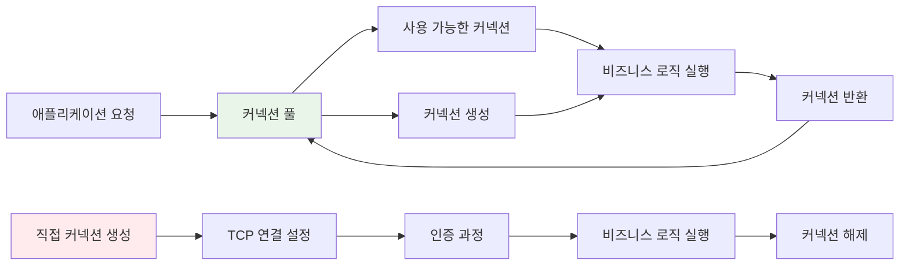
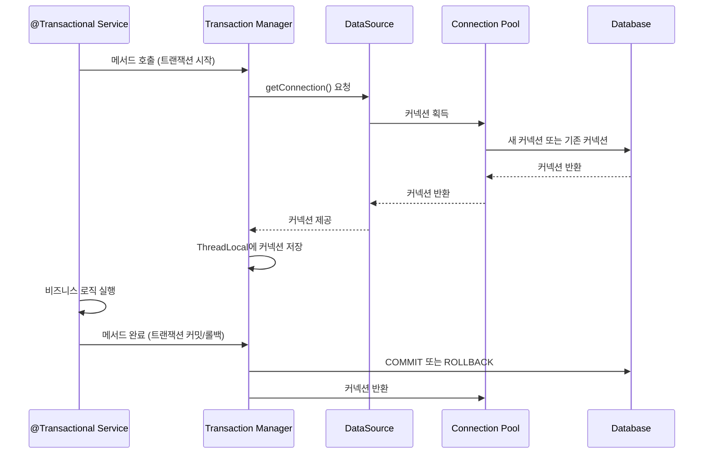

# Spring 데이터베이스 커넥션 관리

Spring 애플리케이션에서 데이터베이스 커넥션 관리는 성능과 안정성을 좌우하는 핵심 요소입니다. 효율적인 커넥션 관리 없이는 데이터베이스 연결 지연, 메모리 누수, 시스템 장애 등 다양한 문제가 발생할 수 있습니다. Spring은 이러한 복잡성을 추상화하여 개발자가 비즈니스 로직에 집중할 수 있도록 돕는 강력한 커넥션 관리 메커니즘을 제공합니다.

## DataSource의 역할과 중요성

DataSource는 Java EE 표준 인터페이스로, 데이터베이스 커넥션을 획득하는 표준화된 방법을 제공합니다. Spring에서 DataSource는 단순한 커넥션 제공자를 넘어서 트랜잭션 관리, 커넥션 풀링, 모니터링 등의 고급 기능을 통합하는 중심 역할을 담당합니다.

```java
@Configuration
public class DatabaseConfig {
    
    @Bean
    @Primary
    public DataSource primaryDataSource() {
        HikariConfig config = new HikariConfig();
        config.setJdbcUrl("jdbc:postgresql://localhost:5432/mydb");
        config.setUsername("user");
        config.setPassword("password");
        config.setDriverClassName("org.postgresql.Driver");
        
        // 커넥션 풀 설정
        config.setMaximumPoolSize(20);
        config.setMinimumIdle(5);
        config.setConnectionTimeout(30000);
        config.setIdleTimeout(600000);
        config.setMaxLifetime(1800000);
        
        return new HikariDataSource(config);
    }
}
```

DataSource의 핵심 기능은 다음과 같습니다:

1. **커넥션 생성과 관리**: 데이터베이스 연결의 생성, 풀링, 반환
2. **트랜잭션 지원**: 트랜잭션 경계 내에서 동일한 커넥션 보장
3. **리소스 관리**: 커넥션 누수 방지와 자동 정리
4. **성능 최적화**: 커넥션 재사용을 통한 오버헤드 감소

## 커넥션 풀의 필요성

데이터베이스 커넥션 생성은 상당한 비용이 드는 작업입니다. 매번 새로운 커넥션을 생성하고 해제하는 것은 성능에 심각한 영향을 미칩니다.



커넥션 풀 사용의 주요 이점은 다음과 같습니다:

- **성능 향상**: 커넥션 재사용으로 생성/해제 오버헤드 제거
- **리소스 제어**: 동시 커넥션 수 제한으로 데이터베이스 보호
- **안정성**: 커넥션 누수 방지와 자동 복구 메커니즘
- **모니터링**: 커넥션 사용량과 성능 지표 수집

자세한 커넥션 풀 동작 원리는 데이터베이스 커넥션 풀을 참고해주세요.

## Spring Boot에서의 자동 설정

Spring Boot는 클래스패스에 있는 데이터베이스 드라이버를 감지하여 자동으로 DataSource를 구성합니다.

```yaml
# application.yml
spring:
  datasource:
    url: jdbc:postgresql://localhost:5432/mydb
    username: user
    password: password
    driver-class-name: org.postgresql.Driver
    
    # HikariCP 설정 (Spring Boot 2.0+ 기본값)
    hikari:
      maximum-pool-size: 20
      minimum-idle: 5
      connection-timeout: 30000
      idle-timeout: 600000
      max-lifetime: 1800000
      pool-name: HikariPool-Main
```

Spring Boot의 자동 설정은 다음과 같은 우선순위로 커넥션 풀을 선택합니다:

1. **HikariCP** (기본값, Spring Boot 2.0+)
2. **Tomcat JDBC Pool** (Tomcat 환경)
3. **Apache Commons DBCP2** (fallback)

각 커넥션 풀의 특징과 설정 방법은 Spring Boot DataSource 자동 설정을 참고해주세요.

## 주요 커넥션 풀 구현체

### HikariCP - 고성능 커넥션 풀

HikariCP는 Spring Boot 2.0부터 기본 커넥션 풀로 채택된 고성능 라이브러리입니다.

```java
@Configuration
public class HikariConfig {
    
    @Bean
    public DataSource hikariDataSource() {
        HikariConfig config = new HikariConfig();
        
        // 기본 연결 설정
        config.setJdbcUrl("jdbc:postgresql://localhost:5432/mydb");
        config.setUsername("user");
        config.setPassword("password");
        
        // 성능 최적화 설정
        config.setMaximumPoolSize(20);           // 최대 커넥션 수
        config.setMinimumIdle(5);                // 최소 유지 커넥션 수
        config.setConnectionTimeout(30000);      // 커넥션 획득 대기 시간
        config.setIdleTimeout(600000);           // 유휴 커넥션 제거 시간
        config.setMaxLifetime(1800000);          // 커넥션 최대 생존 시간
        
        // 안정성 설정
        config.setLeakDetectionThreshold(60000); // 커넥션 누수 감지 임계값
        config.setConnectionTestQuery("SELECT 1"); // 커넥션 유효성 검사 쿼리
        
        return new HikariDataSource(config);
    }
}
```

HikariCP의 주요 특징:

- **Zero-Overhead**: 바이트코드 레벨 최적화
- **빠른 성능**: 다른 커넥션 풀 대비 월등한 성능
- **간단한 설정**: 최소한의 설정으로 최적 성능 제공
- **강력한 모니터링**: JMX를 통한 실시간 모니터링

### Tomcat JDBC Pool

```java
@Configuration
public class TomcatPoolConfig {
    
    @Bean
    public DataSource tomcatDataSource() {
        org.apache.tomcat.jdbc.pool.DataSource dataSource = 
            new org.apache.tomcat.jdbc.pool.DataSource();
        
        dataSource.setUrl("jdbc:postgresql://localhost:5432/mydb");
        dataSource.setUsername("user");
        dataSource.setPassword("password");
        dataSource.setDriverClassName("org.postgresql.Driver");
        
        // 풀 설정
        dataSource.setInitialSize(5);
        dataSource.setMaxActive(20);
        dataSource.setMaxIdle(10);
        dataSource.setMinIdle(5);
        
        // 검증 설정
        dataSource.setTestOnBorrow(true);
        dataSource.setValidationQuery("SELECT 1");
        dataSource.setValidationInterval(30000);
        
        return dataSource;
    }
}
```

각 커넥션 풀의 성능 비교와 선택 기준은 커넥션 풀 성능 비교를 참고해주세요.

## 트랜잭션과 커넥션 관리

Spring의 트랜잭션 관리자는 DataSource와 긴밀하게 연동하여 트랜잭션 경계 내에서 동일한 커넥션을 보장합니다.



### 트랜잭션 전파와 커넥션 공유

```java
@Service
@Transactional
public class UserService {
    
    private final UserRepository userRepository;
    private final AuditService auditService;
    
    public void createUserWithAudit(User user) {
        // 동일한 트랜잭션과 커넥션 사용
        userRepository.save(user);
        auditService.logUserCreation(user); // REQUIRED 전파 속성
    }
    
    @Transactional(propagation = Propagation.REQUIRES_NEW)
    public void logUserCreationSeparately(User user) {
        // 새로운 트랜잭션과 커넥션 사용
        auditService.logUserCreation(user);
    }
}
```

트랜잭션 전파 속성에 따른 커넥션 관리 전략은 Spring 트랜잭션 전파와 커넥션을 참고해주세요.

## 멀티 데이터소스 관리

복잡한 애플리케이션에서는 여러 데이터베이스를 사용해야 하는 경우가 있습니다.

```java
@Configuration
@EnableTransactionManagement
public class MultiDataSourceConfig {
    
    @Bean
    @Primary
    @ConfigurationProperties("spring.datasource.primary")
    public DataSource primaryDataSource() {
        return DataSourceBuilder.create().build();
    }
    
    @Bean
    @ConfigurationProperties("spring.datasource.secondary")
    public DataSource secondaryDataSource() {
        return DataSourceBuilder.create().build();
    }
    
    @Bean
    @Primary
    public PlatformTransactionManager primaryTransactionManager() {
        return new DataSourceTransactionManager(primaryDataSource());
    }
    
    @Bean
    public PlatformTransactionManager secondaryTransactionManager() {
        return new DataSourceTransactionManager(secondaryDataSource());
    }
}
```

### Repository별 데이터소스 분리

```java
@Repository
public class PrimaryUserRepository {
    
    @Autowired
    @Qualifier("primaryDataSource")
    private DataSource dataSource;
    
    @Transactional("primaryTransactionManager")
    public void saveUser(User user) {
        // Primary 데이터베이스 작업
    }
}

@Repository
public class SecondaryLogRepository {
    
    @Autowired
    @Qualifier("secondaryDataSource")
    private DataSource dataSource;
    
    @Transactional("secondaryTransactionManager")
    public void saveLog(LogEntry log) {
        // Secondary 데이터베이스 작업
    }
}
```

멀티 데이터소스 환경에서의 고급 관리 기법은 Spring 멀티 데이터소스 관리를 참고해주세요.

## 커넥션 풀 모니터링과 튜닝

### HikariCP 메트릭 수집

```java
@Configuration
public class HikariMonitoringConfig {
    
    @Bean
    public DataSource monitoredDataSource() {
        HikariConfig config = new HikariConfig();
        config.setJdbcUrl("jdbc:postgresql://localhost:5432/mydb");
        config.setUsername("user");
        config.setPassword("password");
        
        // 메트릭 수집 활성화
        config.setMetricRegistry(new MetricRegistry());
        config.setRegisterMbeans(true);
        
        return new HikariDataSource(config);
    }
    
    @Bean
    public MeterRegistry meterRegistry() {
        return new PrometheusMeterRegistry(PrometheusConfig.DEFAULT);
    }
}
```

### 커넥션 풀 상태 모니터링

```java
@Component
public class ConnectionPoolMonitor {
    
    @Autowired
    private DataSource dataSource;
    
    @EventListener
    @Async
    public void monitorConnectionPool(ApplicationReadyEvent event) {
        if (dataSource instanceof HikariDataSource) {
            HikariDataSource hikariDataSource = (HikariDataSource) dataSource;
            HikariPoolMXBean poolBean = hikariDataSource.getHikariPoolMXBean();
            
            // 주기적으로 메트릭 수집
            ScheduledExecutorService scheduler = Executors.newScheduledThreadPool(1);
            scheduler.scheduleAtFixedRate(() -> {
                int activeConnections = poolBean.getActiveConnections();
                int idleConnections = poolBean.getIdleConnections();
                int totalConnections = poolBean.getTotalConnections();
                int threadsAwaitingConnection = poolBean.getThreadsAwaitingConnection();
                
                log.info("Connection Pool Status - Active: {}, Idle: {}, Total: {}, Waiting: {}", 
                    activeConnections, idleConnections, totalConnections, threadsAwaitingConnection);
                
                // 임계값 확인 및 알림
                if (activeConnections > totalConnections * 0.8) {
                    log.warn("Connection pool usage is high: {}%", 
                        (activeConnections * 100.0 / totalConnections));
                }
            }, 0, 30, TimeUnit.SECONDS);
        }
    }
}
```

## 성능 최적화 전략

### 커넥션 풀 크기 설정

커넥션 풀의 적절한 크기를 결정하는 것은 중요한 성능 요소입니다.

```java
@Configuration
public class OptimizedDataSourceConfig {
    
    @Bean
    public DataSource optimizedDataSource() {
        HikariConfig config = new HikariConfig();
        
        // CPU 코어 수 기반 풀 크기 계산
        int coreCount = Runtime.getRuntime().availableProcessors();
        int optimalPoolSize = coreCount * 2 + 1; // 효율적인 처리를 위한 공식
        
        config.setMaximumPoolSize(optimalPoolSize);
        config.setMinimumIdle(Math.max(2, optimalPoolSize / 4));
        
        // 대기 시간 최적화
        config.setConnectionTimeout(5000);      // 5초
        config.setIdleTimeout(300000);          // 5분
        config.setMaxLifetime(900000);          // 15분
        
        return new HikariDataSource(config);
    }
}
```

### 커넥션 유효성 검사 최적화

```java
@Configuration
public class ConnectionValidationConfig {
    
    @Bean
    public DataSource validatedDataSource() {
        HikariConfig config = new HikariConfig();
        
        // PostgreSQL 최적화된 설정
        if (isDatabasePostgreSQL()) {
            config.setConnectionTestQuery("SELECT 1");
            config.setValidationTimeout(3000);
        }
        
        // MySQL 최적화된 설정
        if (isDatabaseMySQL()) {
            config.setConnectionTestQuery("/* ping */ SELECT 1");
            config.setValidationTimeout(1000);
        }
        
        return new HikariDataSource(config);
    }
}
```

성능 튜닝의 상세한 방법론은 데이터베이스 커넥션 풀 튜닝을 참고해주세요.

## 문제 해결과 디버깅

### 커넥션 누수 감지

```java
@Configuration
public class ConnectionLeakDetectionConfig {
    
    @Bean
    public DataSource leakDetectionDataSource() {
        HikariConfig config = new HikariConfig();
        
        // 커넥션 누수 감지 설정
        config.setLeakDetectionThreshold(30000); // 30초
        
        // 상세한 로깅 설정
        config.setLogWriter(new PrintWriter(System.out));
        
        return new HikariDataSource(config);
    }
}
```

### 커넥션 풀 고갈 문제 해결

```java
@Component
public class ConnectionPoolHealthIndicator implements HealthIndicator {
    
    @Autowired
    private DataSource dataSource;
    
    @Override
    public Health health() {
        if (dataSource instanceof HikariDataSource) {
            HikariDataSource hikariDataSource = (HikariDataSource) dataSource;
            HikariPoolMXBean poolBean = hikariDataSource.getHikariPoolMXBean();
            
            int activeConnections = poolBean.getActiveConnections();
            int totalConnections = poolBean.getTotalConnections();
            double usagePercentage = (double) activeConnections / totalConnections * 100;
            
            Health.Builder builder = new Health.Builder();
            
            if (usagePercentage > 90) {
                return builder.down()
                    .withDetail("reason", "Connection pool usage too high")
                    .withDetail("usage", usagePercentage + "%")
                    .withDetail("active", activeConnections)
                    .withDetail("total", totalConnections)
                    .build();
            }
            
            return builder.up()
                .withDetail("usage", usagePercentage + "%")
                .withDetail("active", activeConnections)
                .withDetail("total", totalConnections)
                .build();
        }
        
        return Health.unknown().build();
    }
}
```

### 일반적인 문제와 해결책

#### 1. 커넥션 타임아웃 문제

```java
// 문제: 너무 짧은 타임아웃 설정
config.setConnectionTimeout(1000); // 너무 짧음

// 해결: 적절한 타임아웃 설정
config.setConnectionTimeout(30000); // 30초
config.setValidationTimeout(5000);  // 5초
```

#### 2. 데이터베이스 연결 끊김 문제

```java
// 해결: 커넥션 유효성 검사와 재연결 설정
config.setConnectionTestQuery("SELECT 1");
config.setMaxLifetime(1800000); // 30분 후 커넥션 갱신
config.setIdleTimeout(600000);  // 10분 유휴 시 제거
```

일반적인 커넥션 문제와 해결 방법은 데이터베이스 커넥션 문제 해결을 참고해주세요.

## 보안 고려사항

### 커넥션 정보 암호화

```java
@Configuration
public class SecureDataSourceConfig {
    
    @Bean
    public DataSource secureDataSource() {
        HikariConfig config = new HikariConfig();
        
        // 환경변수 또는 암호화된 설정 사용
        config.setJdbcUrl(decryptProperty("database.url"));
        config.setUsername(decryptProperty("database.username"));
        config.setPassword(decryptProperty("database.password"));
        
        // SSL 연결 설정
        config.addDataSourceProperty("useSSL", "true");
        config.addDataSourceProperty("requireSSL", "true");
        config.addDataSourceProperty("sslMode", "REQUIRE");
        
        return new HikariDataSource(config);
    }
    
    private String decryptProperty(String propertyName) {
        // 암호화된 설정값 복호화 로직
        return encryptionService.decrypt(environment.getProperty(propertyName));
    }
}
```

### 권한 최소화 원칙

```sql
-- 애플리케이션 전용 사용자 생성
CREATE USER app_user WITH PASSWORD 'secure_password';

-- 필요한 최소 권한만 부여
GRANT SELECT, INSERT, UPDATE, DELETE ON user_table TO app_user;
GRANT USAGE ON SEQUENCE user_seq TO app_user;

-- 관리자 권한은 별도 사용자로 분리
REVOKE ALL PRIVILEGES ON SCHEMA public FROM app_user;
```

데이터베이스 보안 설정의 상세한 내용은 Spring 데이터베이스 보안을 참고해주세요.

## 클라우드 환경에서의 커넥션 관리

### AWS RDS 연결 최적화

```java
@Configuration
@Profile("aws")
public class AWSDataSourceConfig {
    
    @Bean
    public DataSource awsDataSource() {
        HikariConfig config = new HikariConfig();
        
        // RDS 최적화 설정
        config.setMaximumPoolSize(10); // RDS 커넥션 제한 고려
        config.setConnectionTimeout(5000);
        config.setIdleTimeout(240000); // 4분 (RDS idle timeout 고려)
        
        // AWS IAM 데이터베이스 인증 사용
        config.setJdbcUrl("jdbc:postgresql://rds-instance.region.rds.amazonaws.com:5432/mydb");
        config.addDataSourceProperty("authenticationPluginClassName", 
            "software.amazon.jdbc.plugin.iam.IamAuthenticationPlugin");
        
        return new HikariDataSource(config);
    }
}
```

### 컨테이너 환경에서의 고려사항

```yaml
# docker-compose.yml
version: '3.8'
services:
  app:
    image: myapp:latest
    environment:
      SPRING_DATASOURCE_HIKARI_MAXIMUM_POOL_SIZE: 5  # 컨테이너 리소스 제한 고려
      SPRING_DATASOURCE_HIKARI_MINIMUM_IDLE: 2
    depends_on:
      - postgres
      
  postgres:
    image: postgres:13
    environment:
      POSTGRES_DB: mydb
      POSTGRES_USER: user
      POSTGRES_PASSWORD: password
    ports:
      - "5432:5432"
```

클라우드 환경에서의 최적화 전략은 클라우드 데이터베이스 커넥션 최적화를 참고해주세요.

## 결론

Spring에서의 데이터베이스 커넥션 관리는 애플리케이션의 성능과 안정성을 직접적으로 좌우하는 중요한 요소입니다. 적절한 커넥션 풀 설정과 모니터링을 통해 다음과 같은 이점을 얻을 수 있습니다:

1. **성능 향상**: 커넥션 재사용을 통한 응답 시간 단축
2. **리소스 효율성**: 메모리와 데이터베이스 리소스의 효율적 사용
3. **안정성 확보**: 커넥션 누수 방지와 장애 복구 메커니즘
4. **확장성 보장**: 트래픽 증가에 대응할 수 있는 유연한 구조

현대적인 애플리케이션 개발에서는 HikariCP와 같은 고성능 커넥션 풀을 사용하고, Spring Boot의 자동 설정을 활용하되 운영 환경에 맞는 세밀한 튜닝이 필요합니다. 또한 지속적인 모니터링과 성능 분석을 통해 최적의 설정을 유지하는 것이 중요합니다.

클라우드 환경과 마이크로서비스 아키텍처가 일반화되면서 데이터베이스 커넥션 관리의 중요성은 더욱 커지고 있습니다. 적절한 커넥션 관리 전략을 통해 안정적이고 확장 가능한 애플리케이션을 구축할 수 있을 것입니다.

## 참고 자료

- HikariCP 공식 문서 (https://github.com/brettwooldridge/HikariCP)
- Spring Boot Reference Guide - Data Access
- PostgreSQL JDBC Driver Documentation
- AWS RDS Best Practices Guide 