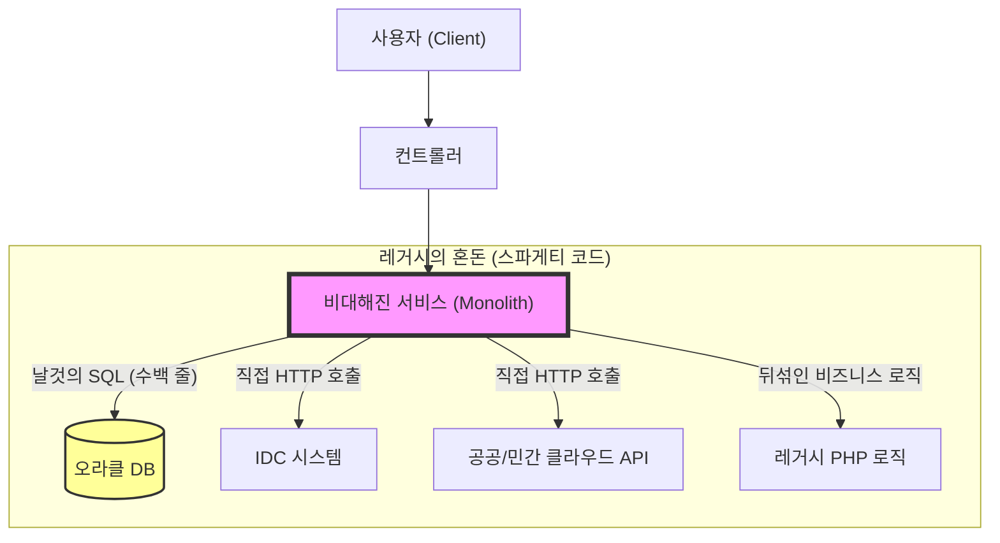
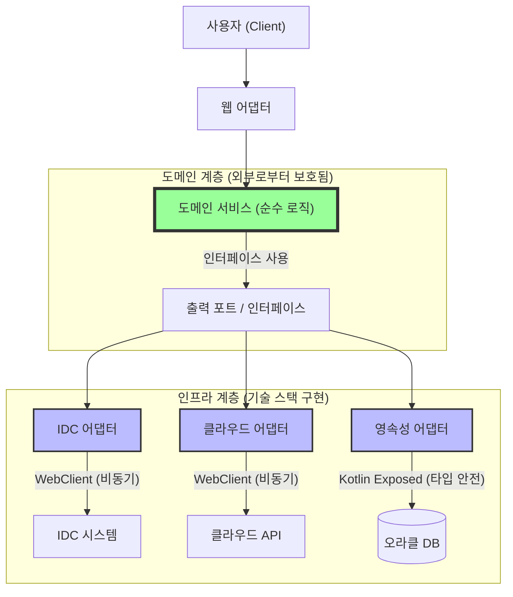

어느덧 한 해의 마지막 날이 다가왔다. 매년 다가오는 날이지만 매년 달라지는 나이기에 항상 아쉽고 새로움이 느껴지는 날이다. 지금까지 개인적으로 일간, 주간 그리고 월간 회고록을 작성해왔다. 이번에는 연간 회고록을 작성해서 블로그로 공유해보려고 한다.

이 블로그가 개발 블로그인 만큼 여기에는 개발자로서의 나에 대해서만 회고한다.

## 1. 복잡한 도메인, 그리고 3년 차의 도전

가비아에 입사한 지 3년 차, 지금까지 가장 어려운 점은 세월이 쌓은 복잡한 도메인이다. 가비아는 27년간 서비스를 확장해오면서 도메인도 매우 복잡해졌다. 현재 전사에서 사용하는 오라클 데이터베이스만 해도 3천 개의 유효한 테이블이 있으며, MSA로 분리된 서비스까지 고려하면 더 많은 엔티티가 존재할 것이다.

내가 올해 담당하는 프로젝트는 크게 두 가지다.

1. **보안 관제 서비스:** IDC, 호스팅, 각종 클라우드(민간/공공/차세대) 등 고객이 사용하는 서비스의 방화벽 및 백신 관리.
2. **자산 통합 관리 서비스:** 가비아의 모든 장비(서버, 방화벽), IP 자산, 그리고 각 서비스에 설치된 소프트웨어의 통합 관리.

문제는 이 '통합'이라는 키워드 뒤에 숨겨진 복잡성이었다. 서버 ID 하나만 해도 서비스마다 규칙이 달랐다(IDC는 번호, 클라우드는 `vm_{숫자}`, 차세대는 UUID 등). 부가서비스 번호는 모두 숫자인데 서비스마다 저장소가 달라 ID 충돌 위험이 있었고, 레거시 데이터가 잘못 쌓여 꼬인 실타래를 푸는 데만 한참이 걸렸다.

## 2. 고통의 원인: 데이터 중심의 레거시와 스파게티 코드

기존 시스템은 PHP로 작성된 전형적인 데이터 중심(Data-Driven) 구조였다.

장비 등록 함수 하나가 300줄이 넘었고, 그 안에서 수십 개의 쿼리와 외부 API 호출이 뒤엉켜 있었다.

- **강한 결합:** 비즈니스 로직이 DB 스키마나 외부 API 응답 구조에 종속되어 있었다. 외부 클라우드 정책이 바뀌어 IP 표기법이 달라지면, 우리 쪽 비즈니스 로직과 화면단까지 줄줄이 수정해야 했다.
- **유지보수의 어려움:** `if (service == 'HOSTING')` 같은 분기 처리가 코드 전반에 산재해 있어, 하나를 수정하면 다른 곳에서 사이드 이펙트(Side-effect)가 터지기 일쑤였다.

**기존 레거시 아키텍처**



## 3. 해결책: 안전한 통합 추상화를 위한 기술적 선택

올해 나는 이 악순환을 끊기 위해 **'도메인 중심의 사고'** 로 전환하고, 이를 뒷받침할 현대적인 기술 스택을 도입했다.

- **Language:** **Kotlin** (Null Safety와 간결한 문법을 통해 레거시의 불확실성을 제거)
- **Framework:** **Spring Boot WebFlux** (여러 클라우드 API를 동시에 호출하고 조합해야 하는 통합 서비스 특성상, Non-blocking I/O를 통한 성능 이점을 위해 선택)
- **ORM:** **Kotlin Exposed** (Type-safe DSL을 제공하여, 복잡한 쿼리를 컴파일 타임에 검증하고 SQL 오타로 인한 런타임 에러 방지)

이 기술들을 바탕으로 **'변하는 것(인프라)'과 '변하지 않는 것(도메인)'을 철저히 분리**하는 작업을 시작했다.

## 4. 외부의 혼돈을 내부의 질서로: 부패 방지 계층 (ACL)

가장 먼저 도입한 전략은 **부패 방지 계층(Anti-Corruption Layer, ACL)** 이었다.

외부 시스템(IDC, AWS, G-Cloud 등)이 어떤 ID 포맷이나 상태 값을 쓰든, 우리 시스템 내부로 들어올 때는 반드시 **변환기(Translator)**를 거쳐 **'표준 도메인 모델'**로 매핑되도록 강제했다.

- **ID 통합:** 제각각인 ID(`vm_123`, `UUID`)를 내부적으로 `UnifiedAssetId`라는 Value Object로 포장했다.
- **IP 구조화:** 문자열로 흩어져 있던 IP 정보를 `IpAddress` 객체와 `NetworkInterface` 컬렉션으로 구조화했다.

덕분에 외부 API의 필드명이 바뀌어도 변환기(Adapter)만 수정하면 되었고, 핵심 비즈니스 로직은 안전하게 보호받았다.

## 5. 인터페이스와 WebFlux/Exposed를 활용한 구현의 분리

'자산'이나 '보안'을 관리한다는 행위 자체를 인터페이스로 추상화했다. 그리고 구현체에서 각 기술 스택의 장점을 극대화했다.

```kotlin
interface AssetManager {
    fun fetchAssets(): Flow<Asset>
    suspend fun applySecurityPolicy(assetId: AssetId, policy: Policy): Result
}
```

기존에는 함수 하나가 모든 분기를 처리했지만, 이제는 각 인프라별로 구현체를 나누었다.

- **API 연동:** **WebFlux의 `WebClient`** 를 사용하여 수십 개의 클라우드 자산을 비동기로 빠르게 조회하여 병합했다.
- **데이터 제어:** **Kotlin Exposed**를 사용하여 DB 테이블과 객체를 매핑했다. 기존의 복잡한 문자열 쿼리 대신, 코틀린 코드로 쿼리를 작성함으로써 스키마 변경 시 컴파일 에러를 통해 즉시 문제를 파악할 수 있게 되었다.

**개선된 아키텍처**



## 6. 마무리

지난 1년, 3천 개의 테이블과 27년 묵은 레거시와 싸우며 얻은 가장 큰 수확은 **'복잡함을 제어하는 법'** 을 익힌 것이다.

단순히 코드를 예쁘게 짜는 것이 아니라, **"Kotlin과 WebFlux 같은 기술 도구를 적재적소에 활용하여, 변하는 것으로부터 변하지 않는 핵심 가치를 보호하는 것"** 이 아키텍처의 본질임을 깨달았다.

- **안정성 향상:** Kotlin Exposed 도입 후 런타임 SQL 에러가 사라졌고, 컴파일 타임 안정성이 확보되었다.
- **유지보수성 증대:** 신규 클라우드 상품 연동 시, 새로운 어댑터 클래스만 추가하면 되어 개발 시간이 절반 이하로 단축되었다.
- **심리적 안정:** 배포 버튼을 누를 때마다 느끼던 막연한 두려움이, 이제는 '테스트를 통과했으니 안전하다'는 확신으로 바뀌었다.

물론 모든 레거시를 걷어낸 것은 아니다. 하지만 올해 나는 이 거대한 진흙탕 속에 단단한 디딤돌을 놓았다.

다가오는 2026년은 이 디딤돌을 밟고 더 넓은 영역으로 리팩토링을 확장하고, 팀 동료들에게 **WebFlux와 Kotlin을 활용한 모던 아키텍처 경험**을 전파하여 팀 전체의 기술 부채를 갚아나가는 한 해로 만들고 싶다.

복잡한 도메인은 개발자를 괴롭게 하지만, 그만큼 성장시킨다. 올해의 고난이 헛되지 않았음을 이 회고를 통해 다시 한번 확신한다.
