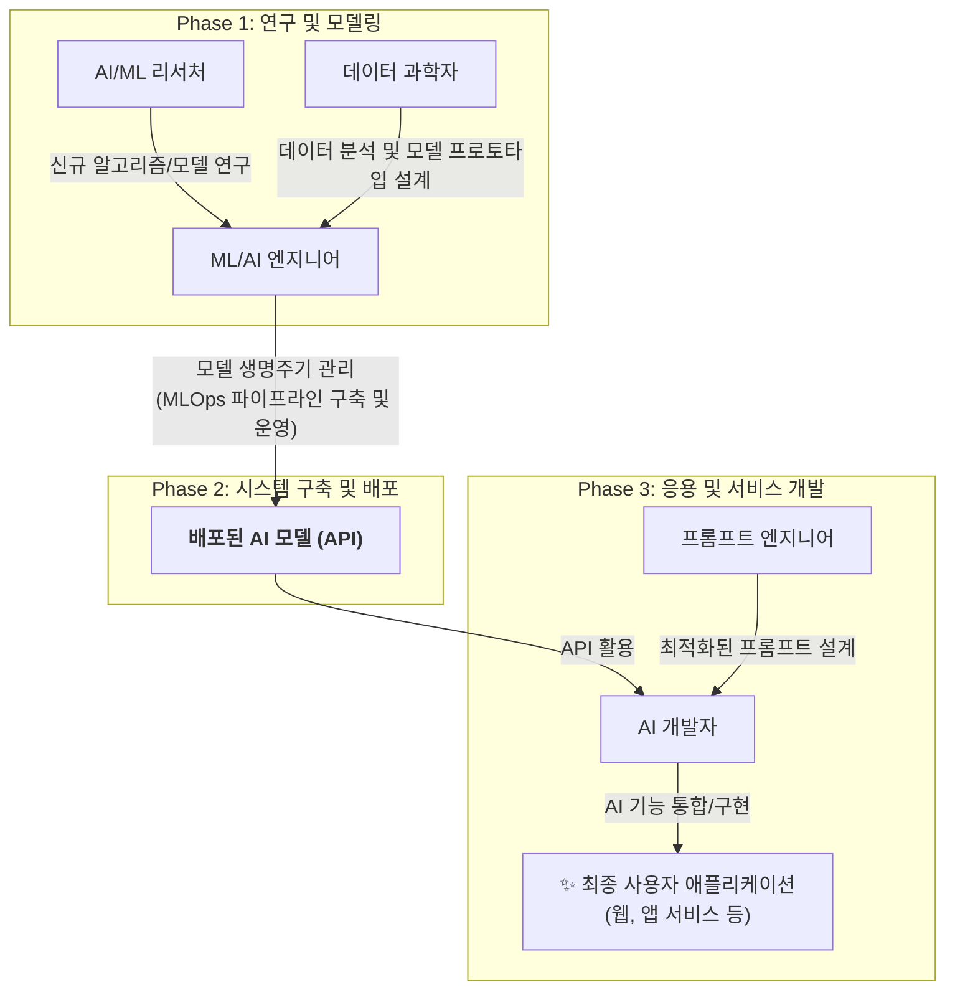

최근 인공지능(AI)과 거대 언어 모델(LLM)에 대한 관심이 급증하면서 관련 분야의 새로운 직무들이 속속 등장하고 있습니다. 하지만 **AI 개발자(AI Developer)**, **머신러닝/AI 엔지니어(ML/AI Engineer)** 등 주요 직무의 정의가 기업이나 매체마다 다소 모호하게 사용되어 혼선을 빚는 경우가 많습니다.

가령, IBM과 같은 글로벌 기업은 AI 개발자를 'AI 모델을 실제 소프트웨어 솔루션에 적용하는 역할'로 정의하는 반면, 일부 채용 공고나 기술 블로그에서는 '모델 설계부터 배포까지 전 과정을 담당하는 역할'로 설명하기도 합니다. 이 글에서는 공신력 있는 기관의 정보를 바탕으로 AI 및 LLM 분야의 주요 직무를 명확히 정의하고 그 역할과 차이를 심도 있게 분석하고자 합니다.

---

## AI 개발자 (AI Developer)

**AI 개발자**는 주로 이미 개발된 AI 모델과 알고리즘을 실제 소프트웨어 솔루션에 적용하고 통합하는 역할을 담당합니다. 이들은 새로운 모델을 연구하기보다는, 기존의 AI 기술을 활용하여 비즈니스 문제를 해결하는 데 집중합니다.

주요 업무는 다음과 같습니다.

- **AI 기능 구현 및 유지보수**: 개발된 AI 모델을 API 형태로 호출하여 웹이나 앱 등 다양한 애플리케이션에 AI 기반 기능을 구현하고, 지속적으로 관리합니다.
    
- **시스템 통합**: 기존 시스템에 AI 모델을 접목하여 프로세스를 자동화하거나 데이터 기반의 의사결정을 지원하는 등 시스템의 효율성과 지능을 높입니다.
    
- **소프트웨어 관점의 최적화**: 프롬프트 엔지니어링, API 통합, 모델 배포 및 테스트, 성능 최적화 등 소프트웨어 공학적 관점에서 AI 서비스의 완성도를 높이는 작업을 수행합니다.
    
- **협업**: 데이터 과학자, ML 엔지니어와 긴밀하게 협력하여 AI 기능을 모니터링하고 개선합니다.
    

이 직무는 Python, Java 등 능숙한 프로그래밍 능력과 함께 TensorFlow, PyTorch와 같은 머신러닝 프레임워크에 대한 깊은 이해를 필요로 합니다. IBM, Gartner 등 주요 기관에서는 AI 개발자를 **"AI 모델을 비즈니스 가치로 전환하는 소프트웨어 엔지니어"** 로 정의하고 있습니다.

---

## ML/AI 엔지니어 (ML/AI Engineer)

**ML/AI 엔지니어**는 AI 시스템의 전반적인 설계와 아키텍처 구축, 그리고 안정적인 운영에 중점을 둡니다. 이들은 머신러닝 모델의 전체 생명주기(Life-cycle)를 관리하며, 특히 MLOps(Machine Learning Operations) 파이프라인 구축을 통해 모델의 개발, 배포, 운영 과정을 자동화하고 최적화하는 핵심적인 역할을 수행합니다.

주요 업무는 다음과 같습니다.

- **모델 생명주기 관리**: 머신러닝 및 딥러닝 모델의 설계, 학습, 튜닝, 배포에 이르는 전 과정을 책임집니다.
    
- **인프라 구축 및 관리**: 대규모 데이터 파이프라인을 구축하고, 클라우드 환경에서 AI 모델이 안정적으로 서비스될 수 있도록 인프라를 설계하고 관리합니다.
    
- **성능 최적화 및 안정성 확보**: 배포된 모델의 성능을 지속적으로 모니터링하고 최적화하며, 실시간 업데이트와 운영 안정성을 확보합니다.
    
- **확장 가능한 아키텍처 설계**: 대규모 트래픽에도 안정적으로 운영될 수 있는 확장 가능한(scalable) AI 서비스 아키텍처를 설계합니다.
    

ML/AI 엔지니어는 소프트웨어 공학 역량은 물론, 대규모 시스템 설계 및 인프라 운영에 대한 깊이 있는 지식이 필수적입니다. 주요 기관들은 이들을 **"AI 시스템의 아키텍처와 확장성, 그리고 실제 운영 환경 배포에 특화된 엔지니어"** 로 규정합니다.

---
## 기타 주요 AI 직무

AI 생태계는 위 두 직무 외에도 다양한 전문가들의 협력으로 완성됩니다.

- **데이터 과학자 (Data Scientist)**: 방대한 데이터 속에서 비즈니스 인사이트를 발견하고, 통계적 기법과 머신러닝 모델링을 통해 가설을 검증하고 예측 모델을 설계하는 데 집중합니다.
    
- **AI/ML 리서처 (Research Scientist)**: 최신 AI 기술 동향을 연구하고, 새로운 알고리즘이나 모델 구조를 개발하여 기술의 한계를 넓히는 역할을 담당하며 주로 논문 발표 등의 학술적인 성과를 목표로 합니다.
    
- **프롬프트 엔지니어 (Prompt Engineer)**: 거대 언어 모델(LLM)이 최적의 결과물을 생성하도록 입력값인 프롬프트를 설계하고 테스트하며, 모델과 사용자 간의 상호작용을 최적화합니다.

---
## 결론 및 시사점

기관이나 기업의 특성에 따라 직무 정의에 차이가 존재할 수 있지만, 산업계의 표준은 점차 명확해지고 있습니다. **AI 개발자**는 **'AI 모델을 활용한 응용 소프트웨어 개발'** 에, **ML/AI 엔지니어**는 **'AI 모델 및 시스템의 설계, 구축, 운영'** 에 더 무게를 두는 방향으로 역할이 분화되고 있습니다.

## 참고 자료
1. [https://www.ibm.com/think/topics/ai-developer](https://www.ibm.com/think/topics/ai-developer)
2. [https://datascientest.com/en/exploring-the-role-of-an-ai-developer-responsibilities-skills-and-key-attributes](https://datascientest.com/en/exploring-the-role-of-an-ai-developer-responsibilities-skills-and-key-attributes)
3. [https://chcoc.gov/sites/default/files/The%20Artificial%20Intelligence%20Classification%20Policy%20and%20Talent%20Acquisition%20Guidance%20-%20The%20AI%20in%20Government%20Act%20of%202020.pdf](https://chcoc.gov/sites/default/files/The%20Artificial%20Intelligence%20Classification%20Policy%20and%20Talent%20Acquisition%20Guidance%20-%20The%20AI%20in%20Government%20Act%20of%202020.pdf)
4. [https://zydesoft.com/ai-developer-roles-and-responsibilities/](https://zydesoft.com/ai-developer-roles-and-responsibilities/)
5. [https://cloud.google.com/learn/certification/machine-learning-engineer](https://cloud.google.com/learn/certification/machine-learning-engineer)
6. [https://www.interface-eu.org/publications/technical-tiers-in-ai-talent](https://www.interface-eu.org/publications/technical-tiers-in-ai-talent)
7. [https://brainstation.io/career-guides/what-is-a-machine-learning-engineer](https://brainstation.io/career-guides/what-is-a-machine-learning-engineer)
8. [https://www.nobledesktop.com/careers/machine-learning-engineer/job-description](https://www.nobledesktop.com/careers/machine-learning-engineer/job-description)
9. [https://artoonsolutions.com/glossary/authoritative-source/](https://artoonsolutions.com/glossary/authoritative-source/)
10. [https://www.oecd.org/en/topics/artificial-intelligence.html](https://www.oecd.org/en/topics/artificial-intelligence.html)
11. [https://www.sciencedirect.com/topics/computer-science/authoritative-source](https://www.sciencedirect.com/topics/computer-science/authoritative-source)