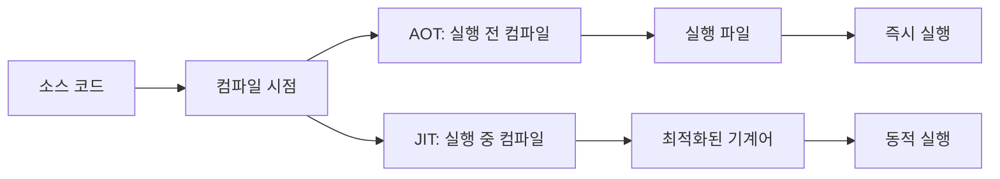

AOT(Ahead-of-Time) 컴파일은 프로그램 실행 전에 소스 코드 또는 중간 코드를 타겟 시스템의 기계어로 미리 변환하는 컴파일 기법입니다. 이는 [[JIT(Just-In-Time) 컴파일]]과는 대조적인 접근 방식으로, Java 생태계에서 GraalVM Native Image가 대표적인 AOT 컴파일 구현체입니다.

## AOT 컴파일 vs JIT 컴파일

AOT 컴파일과 JIT 컴파일의 주요 차이점은 컴파일이 수행되는 시점입니다:



### 주요 차이점

|특성|AOT 컴파일|JIT 컴파일|
|---|---|---|
|컴파일 시점|실행 전|실행 중|
|시작 시간|빠름|상대적으로 느림|
|메모리 사용량|낮음|높음|
|최적화 기회|정적 분석 기반|런타임 프로파일링 기반|
|최대 성능 도달|즉시|워밍업 기간 후|
|플랫폼 의존성|타겟 플랫폼 전용|크로스 플랫폼|

## AOT 컴파일의 작동 원리

AOT 컴파일러는 다음과 같은 단계로 작동합니다:

1. **코드 분석**: 전체 애플리케이션 코드와 의존성을 분석합니다.
2. **폐쇄 세계 가정(Closed World Assumption)**: 컴파일 시점에 모든 코드가 알려져 있다고 가정합니다.
3. **정적 분석**: 타입 정보, 메서드 호출, 클래스 계층 구조 등을 분석합니다.
4. **최적화**: 상수 폴딩, 인라이닝, 데드 코드 제거 등의 최적화를 수행합니다.
5. **네이티브 코드 생성**: 타겟 플랫폼의 기계어 코드를 생성합니다.

GraalVM의 Native Image는 이러한 AOT 컴파일 과정을 통해 Java 바이트코드를 독립적인 네이티브 실행 파일로 변환합니다. 이 과정에서 [[접근 가능성 분석(Reachability Analysis)]]을 사용하여 실제로 실행될 수 있는 코드만 포함시킵니다.

## AOT 컴파일의 장점

### 1. 빠른 시작 시간

AOT 컴파일된 애플리케이션은 이미 기계어로 컴파일되어 있어 즉시 실행될 수 있습니다. 이는 JVM 시작, 클래스 로딩, JIT 컴파일을 기다릴 필요가 없기 때문입니다.

### 2. 낮은 메모리 사용량

JIT 컴파일러, 클래스 로더, 메타데이터 등이 필요 없어 메모리 사용량이 크게 감소합니다.

### 3. 예측 가능한 성능

JIT 컴파일의 워밍업 단계가 없어 성능이 일관되고 예측 가능합니다.

### 4. 더 작은 배포 크기

실행에 필요한 코드만 포함되어 배포 크기가 작아질 수 있습니다.

### 5. 독립 실행형

별도의 런타임 환경(예: JRE) 설치 없이 실행 가능합니다.

## AOT 컴파일의 단점

### 1. 제한된 동적 기능

Java의 리플렉션, 동적 클래스 로딩, 동적 프록시 등의 기능이 제한됩니다.

### 2. 긴 빌드 시간

컴파일 시간이 일반 Java 컴파일보다 훨씬 오래 걸립니다.

### 3. 플랫폼 의존성

각 타겟 플랫폼별로 다른 실행 파일을 생성해야 합니다.

### 4. 제한된 런타임 최적화

런타임 동작 패턴에 기반한 최적화가 불가능합니다.

### 5. 디버깅 복잡성

생성된 네이티브 코드의 디버깅이 일반 Java 애플리케이션보다 복잡합니다.

## Java에서의 AOT 컴파일 솔루션

Java 생태계에서는 다양한 AOT 컴파일 솔루션이 존재합니다:

### 1. [[GraalVM Native Image]]

GraalVM의 Native Image 도구는 가장 널리 사용되는 Java AOT 컴파일 솔루션입니다. 완전한 네이티브 실행 파일을 생성하여 JVM 없이 실행 가능합니다.

```java
@SpringBootApplication
public class MyApplication {
    public static void main(String[] args) {
        SpringApplication.run(MyApplication.class, args);
    }
}
```

위 코드는 GraalVM Native Image로 컴파일하면 독립 실행 파일이 됩니다.

### 2. OpenJDK의 jaotc

JDK 9부터 도입된 실험적 AOT 컴파일러로, 바이트코드를 네이티브 코드로 사전 컴파일합니다. 그러나 완전한 독립 실행 파일을 생성하지는 않고, JVM과 함께 실행됩니다.

### 3. Android의 ART(Android Runtime)

안드로이드에서 사용되는 AOT 컴파일 시스템으로, 앱 설치 시 DEX 파일을 네이티브 코드로 컴파일합니다.

## AOT 컴파일과 동적 언어 기능

Java의 동적 기능들(리플렉션, 동적 프록시, JNI 등)은 AOT 컴파일에 도전 과제를 제시합니다. 이러한 기능들은 실행 시점에 결정되기 때문에 컴파일 시점에 완전한 정보를 얻기 어렵습니다.

GraalVM Native Image는 이러한 문제를 해결하기 위해 다음과 같은 접근 방식을 사용합니다:

### 1. 설정 파일

리플렉션, 동적 프록시, JNI 등에 대한 정보를 제공하는 JSON 설정 파일을 사용합니다:

```json
[
  {
    "name": "com.example.MyClass",
    "methods": [
      { "name": "methodName", "parameterTypes": [] }
    ],
    "fields": [
      { "name": "fieldName" }
    ]
  }
]
```

### 2. 트레이싱 에이전트

애플리케이션 실행 중 사용되는 리플렉션, 리소스 등을 추적하여 자동으로 설정 파일을 생성합니다:

```bash
java -agentlib:native-image-agent=config-output-dir=META-INF/native-image -jar myapp.jar
```

### 3. 런타임 초기화

일부 클래스는 빌드 시간이 아닌 런타임에 초기화되도록 지정할 수 있습니다:

```java
@NativeImageRuntimeInitialization
public class LazyInitClass {
    // 런타임에 초기화될 코드
}
```

## 스프링 프레임워크에서의 AOT 컴파일

스프링 프레임워크는 버전 6부터 AOT 엔진을 도입하여 GraalVM Native Image 빌드를 지원합니다. 이 엔진은 다음과 같은 작업을 수행합니다:

1. **빈 정보 수집**: 컴파일 시간에 모든 스프링 빈의 정보를 수집합니다.
2. **프록시 클래스 생성**: 런타임에 생성될 프록시 클래스를 미리 생성합니다.
3. **리플렉션 힌트 생성**: 필요한 리플렉션 정보를 힌트 파일로 생성합니다.
4. **설정 최적화**: 런타임 설정을 최적화하고 정적으로 변환합니다.

스프링 부트 3.0 이상에서는 네이티브 이미지 빌드를 쉽게 설정할 수 있습니다:

```java
@SpringBootApplication
@ImportRuntimeHints(MyRuntimeHints.class)
public class MyApplication {
    public static void main(String[] args) {
        SpringApplication.run(MyApplication.class, args);
    }
}

class MyRuntimeHints implements RuntimeHintsRegistrar {
    @Override
    public void registerHints(RuntimeHints hints, ClassLoader classLoader) {
        // 리플렉션 힌트 등록
        hints.reflection().registerType(MyClass.class);
    }
}
```

## AOT 컴파일 최적화 기법

AOT 컴파일에서는 다양한 최적화 기법이 적용됩니다:

### 1. 불필요한 코드 제거

접근 불가능한 코드를 식별하여 제거하는 [[데드 코드 제거(Dead Code Elimination)]] 기법을 적용합니다.

### 2. 메서드 인라이닝

작은 메서드를 호출 지점에 직접 삽입하여 호출 오버헤드를 줄입니다.

### 3. 상수 폴딩

컴파일 시간에 계산 가능한 표현식을 미리 계산합니다.

### 4. 탈가상화(Devirtualization)

다형성 메서드 호출을 직접 호출로 변환합니다.

### 5. 루프 최적화

루프 언롤링, 루프 벡터화 등의 기법을 적용합니다.

## AOT 컴파일 사용 시나리오

AOT 컴파일은 다음과 같은 시나리오에서 특히 유용합니다:

### 1. 마이크로서비스

빠른 시작 시간과 낮은 메모리 사용량이 중요한 마이크로서비스 아키텍처에 적합합니다.

### 2. 서버리스 함수

AWS Lambda, Azure Functions 등에서 콜드 스타트 시간을 줄이는 데 효과적입니다.

### 3. CLI 도구

즉각적인 응답이 필요한 명령줄 도구에 적합합니다.

### 4. 임베디드 시스템

제한된 리소스를 가진 환경에서 효율적으로 실행될 수 있습니다.

### 5. 컨테이너 배포

작은 이미지 크기와 빠른 시작 시간으로 컨테이너화에 이점이 있습니다.

## 결론

AOT(Ahead-of-Time) 컴파일은 Java와 같은 전통적으로 인터프리티드/JIT 컴파일 언어에 네이티브 성능과 리소스 효율성을 제공하는 강력한 기술입니다. 특히 클라우드 네이티브 환경, 마이크로서비스, 서버리스 컴퓨팅에서 중요한 역할을 하고 있습니다.

그러나 동적 기능 제한, 빌드 시간 증가, 플랫폼 의존성과 같은 단점도 존재하므로, 애플리케이션의 특성과 요구사항을 고려하여 AOT 컴파일 적용 여부를 결정해야 합니다. GraalVM과 스프링 프레임워크의 AOT 지원은 이러한 제약을 최소화하고 Java 개발자가 AOT 컴파일의 이점을 쉽게 활용할 수 있도록 돕고 있습니다.

AOT 컴파일은 Java 플랫폼의 발전 방향 중 하나로, 앞으로 더 많은 최적화와 도구 개선이 이루어질 것으로 예상됩니다.

## 참고 자료

- "Ahead-of-Time Compilation Techniques" - Christian Wimmer
- GraalVM Native Image 공식 문서(https://www.graalvm.org/reference-manual/native-image/)
- Spring AOT 엔진 문서(https://docs.spring.io/spring-framework/docs/current/reference/html/core.html#core.aot)
- "Understanding AOT Compilation" - Oleg Šelajev
- "Practical GraalVM Native Image" - Thomas Würthinger, Vojin Jovanovic