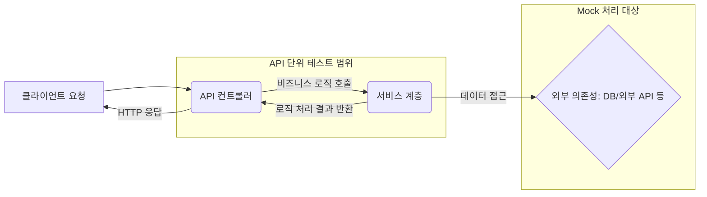

API 단위 테스트는 현대 소프트웨어 개발, 특히 [[마이크로서비스 아키텍처(Microservice Architecture)]]가 보편화되면서 그 중요성이 더욱 커지고 있는 테스트 방식입니다. API 단위 테스트는 개별 API 엔드포인트가 의도한 대로 정확하게 동작하는지를 검증하여, 시스템 전체의 안정성과 품질을 높이는 데 핵심적인 역할을 합니다. 이 글에서는 API 단위 테스트의 개념부터 작성 전략, 그리고 실제 Spring Boot 환경에서의 예시까지 상세하게 알아보겠습니다.

## API 단위 테스트란 무엇인가?

API 단위 테스트는 API의 각 기능 단위(개별 엔드포인트 또는 API를 구성하는 특정 로직 단위)가 독립적으로 올바르게 작동하는지 확인하는 테스트입니다. 이는 일반적으로 [[단위 테스트(Unit Test)]]의 한 형태로 간주되지만, 전통적인 단위 테스트가 클래스나 메서드 수준에 집중하는 것과 비교하여 API 단위 테스트는 API의 요청(Request)과 응답(Response) 전체 흐름을 검증하는 데 더 초점을 맞춥니다.

가장 중요한 점은 API 단위 테스트가 해당 API 엔드포인트의 **비즈니스 로직과 계약(Contract)을 검증**하는 데 그 목적이 있다는 것입니다. 외부 서비스 연동 부분이나 데이터베이스와 같은 외부 의존성(External Dependency)은 [[테스트 더블(Test Double)]](예: Mock 객체)을 사용하여 격리합니다. 이를 통해 테스트의 **신뢰성과 실행 속도**를 높일 수 있습니다.

## 왜 API 단위 테스트가 중요한가?

API 단위 테스트를 작성해야 하는 이유는 명확합니다.

1. **버그 조기 발견 및 비용 절감**: 개발 초기 단계에서 문제를 발견하여 수정함으로써, 프로덕션 환경에서 발생할 수 있는 심각한 오류와 그로 인한 비용을 크게 줄일 수 있습니다.
2. **안정적인 리팩토링 보장**: 코드 변경이나 기능 개선 시 기존 기능이 손상되지 않았음을 신속하게 확인할 수 있어, 안심하고 [[리팩토링(Refactoring)]]을 진행할 수 있습니다.
3. **API 명세의 살아있는 문서화**: 잘 작성된 테스트 코드는 그 자체로 API가 어떻게 동작해야 하는지에 대한 명확한 명세이자 문서가 됩니다.
4. **개발 생산성 향상**: 반복적인 수동 테스트 시간을 줄이고, CI/CD(Continuous Integration/Continuous Deployment) 파이프라인에 통합하여 배포 프로세스를 자동화하고 안정화할 수 있습니다.

## API 단위 테스트의 범위와 특징

API 단위 테스트는 일반적으로 HTTP 요청을 받아 특정 로직을 수행하고 HTTP 응답을 반환하는 컨트롤러(Controller) 계층에 집중합니다.


위 그림에서 볼 수 있듯이, API 단위 테스트는 **API 컨트롤러**와 필요한 경우 호출되는 **서비스 계층의 일부 로직**까지 포함할 수 있습니다. 그러나 서비스 계층이 의존하는 데이터베이스 접근 로직이나 외부 API 호출 등은 Mock 객체로 대체하여 컨트롤러의 순수한 로직 검증에 집중합니다.

**API 단위 테스트의 주요 특징:**

- **격리성(Isolation)**: 각 테스트는 다른 테스트에 영향을 주지 않고 독립적으로 실행됩니다. 외부 의존성을 Mocking함으로써 이를 보장합니다.
- **반복성(Repeatability)**: 동일한 조건에서는 항상 동일한 결과를 반환해야 합니다.
- **자동화(Automation)**: 테스트는 자동화된 방식으로 실행될 수 있어야 하며, 수동 개입이 필요 없어야 합니다.
- **신속성(Fast)**: 단위 테스트는 빠르게 실행되어야 개발 과정에서 자주 실행하며 피드백을 받을 수 있습니다.

## API 단위 테스트 작성 전략

효과적인 API 단위 테스트를 작성하기 위해서는 몇 가지 검증된 전략을 따르는 것이 좋습니다.

### 1. [[Given-When-Then 패턴 (Arrange-Act-Assert 패턴)]] 활용

테스트 코드의 가독성과 이해도를 높이는 데 매우 유용한 패턴입니다.

- **Given (Arrange)**: 테스트 실행을 위한 사전 조건을 설정합니다. (예: 요청 객체 생성, Mock 객체의 행동 정의)
- **When (Act)**: 테스트 대상이 되는 API를 호출(실행)합니다.
- **Then (Assert)**: 실행 결과를 검증합니다. (예: 응답 상태 코드, 응답 본문 내용 확인)

### 2. 테스트 케이스 설계

다양한 시나리오를 커버하기 위해 체계적인 테스트 케이스 설계가 필요합니다.

- **정상 케이스 (Happy Path)**: API가 의도한 대로 정상적으로 동작하는 경우를 검증합니다.
- **예외 케이스 (Unhappy Path/Edge Cases)**:
    - 잘못된 입력 값 (유효성 검사 실패)
    - 필수 값 누락
    - 권한 없는 접근
    - 기타 예상치 못한 오류 상황
- [[경계 값 분석(Boundary Value Analysis)]] 및 [[동등 분할(Equivalence Partitioning)]] 기법을 활용하여 효과적인 테스트 케이스를 도출할 수 있습니다.

## Spring Boot 환경에서 API 단위 테스트 작성하기 

Spring Boot는 API 단위 테스트를 손쉽게 작성할 수 있도록 강력한 지원을 제공합니다. 주로 `spring-boot-starter-test` 의존성에 포함된 JUnit 5, Mockito, Spring Test, MockMvc 등을 활용합니다.

### 1. 필요 의존성 확인

`build.gradle` 파일에 다음 의존성이 포함되어 있는지 확인합니다.

```groovy
dependencies {
    testImplementation 'org.springframework.boot:spring-boot-starter-test'
    // JSON Path 사용을 위해 추가 (선택 사항)
    testImplementation 'com.jayway.jsonpath:json-path'
}
```

### 2. `@WebMvcTest` 활용

`@WebMvcTest` 어노테이션은 MVC 계층(Controller, @JsonComponent, Converter, Filter, WebMvcConfigurer 등)에만 초점을 맞춰 테스트 환경을 구성합니다. `@Service`, `@Repository` 등의 컴포넌트는 스캔하지 않으므로, 필요한 서비스 의존성은 `@MockBean`을 사용하여 Mock 객체로 주입해야 합니다.

```java
import org.springframework.beans.factory.annotation.Autowired;
import org.springframework.boot.test.autoconfigure.web.servlet.WebMvcTest;
import org.springframework.boot.test.mock.mockito.MockBean;
import org.springframework.http.MediaType;
import org.springframework.test.web.servlet.MockMvc;
import org.springframework.test.web.servlet.ResultActions;

import static org.mockito.ArgumentMatchers.any;
import static org.mockito.BDDMockito.given;
import static org.springframework.test.web.servlet.request.MockMvcRequestBuilders.*;
import static org.springframework.test.web.servlet.result.MockMvcResultMatchers.*;
import static org.hamcrest.Matchers.is;

import com.fasterxml.jackson.databind.ObjectMapper; // JSON 변환을 위해
import org.junit.jupiter.api.DisplayName;
import org.junit.jupiter.api.Test;

// 예시를 위한 간단한 User DTO 와 Controller, Service
class User {
    private Long id;
    private String name;
    // Getters, Setters, Constructors 생략
    public User(Long id, String name) { this.id = id; this.name = name; }
    public Long getId() { return id; }
    public String getName() { return name; }
}

interface UserService {
    User createUser(User user);
    User getUserById(Long id);
}

@org.springframework.web.bind.annotation.RestController
@org.springframework.web.bind.annotation.RequestMapping("/api/users")
class UserController {
    private final UserService userService;
    public UserController(UserService userService) { this.userService = userService; }

    @org.springframework.web.bind.annotation.PostMapping
    public org.springframework.http.ResponseEntity<User> createUser(@org.springframework.web.bind.annotation.RequestBody User user) {
        User createdUser = userService.createUser(user);
        return org.springframework.http.ResponseEntity.status(org.springframework.http.HttpStatus.CREATED).body(createdUser);
    }

    @org.springframework.web.bind.annotation.GetMapping("/{id}")
    public org.springframework.http.ResponseEntity<User> getUserById(@org.springframework.web.bind.annotation.PathVariable Long id) {
        User user = userService.getUserById(id);
        if (user != null) {
            return org.springframework.http.ResponseEntity.ok(user);
        } else {
            return org.springframework.http.ResponseEntity.notFound().build();
        }
    }
}
// --- 테스트 코드 시작 ---
@WebMvcTest(UserController.class) // 테스트 대상 컨트롤러 지정
public class UserControllerTest {

    @Autowired
    private MockMvc mockMvc; // API를 호출하고 응답을 검증하는 데 사용

    @MockBean // UserService의 Mock 객체 생성 및 주입
    private UserService userService;

    @Autowired
    private ObjectMapper objectMapper; // 객체를 JSON 문자열로 변환하거나 그 반대로 변환

    @Test
    @DisplayName("사용자 생성 API 성공 테스트")
    void createUser_Success() throws Exception {
        // Given (사전 조건 설정)
        User userToCreate = new User(null, "Test User");
        User createdUser = new User(1L, "Test User");

        // Mockito를 사용하여 userService.createUser 메서드가 호출될 때의 행동 정의
        given(userService.createUser(any(User.class))).willReturn(createdUser);

        // When (API 호출)
        ResultActions resultActions = mockMvc.perform(post("/api/users")
                .contentType(MediaType.APPLICATION_JSON)
                .content(objectMapper.writeValueAsString(userToCreate)));

        // Then (결과 검증)
        resultActions.andExpect(status().isCreated()) // HTTP 상태 코드 201 (Created) 검증
                .andExpect(content().contentType(MediaType.APPLICATION_JSON))
                .andExpect(jsonPath("$.id", is(createdUser.getId().intValue()))) // 응답 본문의 id 검증
                .andExpect(jsonPath("$.name", is(createdUser.getName())));      // 응답 본문의 name 검증
    }

    @Test
    @DisplayName("ID로 사용자 조회 API 성공 테스트")
    void getUserById_Success() throws Exception {
        // Given
        Long userId = 1L;
        User foundUser = new User(userId, "Test User");
        given(userService.getUserById(userId)).willReturn(foundUser);

        // When
        ResultActions resultActions = mockMvc.perform(get("/api/users/{id}", userId)
                .accept(MediaType.APPLICATION_JSON));

        // Then
        resultActions.andExpect(status().isOk()) // HTTP 상태 코드 200 (OK) 검증
                .andExpect(content().contentType(MediaType.APPLICATION_JSON))
                .andExpect(jsonPath("$.id", is(foundUser.getId().intValue())))
                .andExpect(jsonPath("$.name", is(foundUser.getName())));
    }

    @Test
    @DisplayName("ID로 사용자 조회 API 실패 테스트 - 사용자를 찾을 수 없음")
    void getUserById_NotFound() throws Exception {
        // Given
        Long userId = 99L; // 존재하지 않는 사용자 ID
        given(userService.getUserById(userId)).willReturn(null); // null을 반환하도록 Mocking

        // When
        ResultActions resultActions = mockMvc.perform(get("/api/users/{id}", userId)
                .accept(MediaType.APPLICATION_JSON));

        // Then
        resultActions.andExpect(status().isNotFound()); // HTTP 상태 코드 404 (Not Found) 검증
    }
}
```

**예시 코드 설명:**

- `@WebMvcTest(UserController.class)`: `UserController`와 관련된 웹 계층 빈만 로드합니다.
- `@Autowired private MockMvc mockMvc;`: `MockMvc`는 실제 HTTP 서버를 실행하지 않고 스프링 MVC 동작을 재현하여 컨트롤러를 테스트할 수 있게 해줍니다.
- `@MockBean private UserService userService;`: `UserController`가 의존하는 `UserService`를 Mock 객체로 대체합니다. 이를 통해 `UserService`의 실제 로직이 실행되지 않고, 우리가 정의한 행동을 하도록 설정할 수 있습니다.
- `objectMapper.writeValueAsString()`: 요청 본문에 사용할 객체를 JSON 문자열로 변환합니다.
- `mockMvc.perform(...)`: 특정 HTTP 메서드(GET, POST 등)와 경로로 요청을 보냅니다.
    - `.contentType()`: 요청 본문의 타입을 지정합니다.
    - `.content()`: 요청 본문의 내용을 설정합니다.
    - `.accept()`: 클라이언트가 받을 수 있는 응답 타입을 지정합니다.
- `.andExpect(...)`: 응답 결과를 검증합니다.
    - `status().isCreated()`: HTTP 응답 코드가 201인지 확인합니다.
    - `content().contentType()`: 응답 본문의 타입을 확인합니다.
    - `jsonPath(...)`: JSONPath 표현식을 사용하여 응답 본문(JSON)의 특정 필드 값을 검증합니다.

더 자세한 MockMvc 사용법 및 검증 방법은 Spring MockMvc 활용법 문서를 참고해주세요.

Mockito를 활용한 Mock 객체 설정에 대한 상세 내용은 Mockito 사용 가이드를 참고하시면 도움이 될 것입니다.

## API 단위 테스트 작성 시 고려사항

- **의존성 관리 및 Mocking 전략**: 외부 시스템(DB, 다른 API 등)과의 연동 부분은 반드시 Mocking하여 테스트의 격리성과 속도를 보장해야 합니다.
- **테스트 데이터 관리**: 테스트에 사용될 데이터는 각 테스트에 독립적으로 준비되어야 하며, 테스트 간 의존성이 없도록 관리해야 합니다. 자세한 내용은 테스트 데이터 관리 전략을 참고해주세요.
- **테스트 실행 속도**: 단위 테스트는 빨라야 합니다. 느린 테스트는 개발자의 생산성을 저하시키므로, 불필요한 로직은 피하고 Mocking을 적극 활용해야 합니다.
- **테스트 커버리지(Test Coverage)**: 단순히 코드 라인 커버리지만 높이는 것보다, 중요한 비즈니스 로직과 다양한 시나리오를 충분히 검증하는 데 집중해야 합니다. JaCoCo와 같은 도구를 활용할 수 있습니다.

## API 단위 테스트와 API 통합 테스트와의 비교

API 단위 테스트는 개별 API 엔드포인트의 기능을 격리된 환경에서 검증하는 반면, [[통합 테스트(Integration Test)]]는 여러 컴포넌트 또는 서비스가 함께 올바르게 동작하는지, 실제 외부 의존성(예: 데이터베이스, 메시지 큐, 외부 API)을 연동하여 검증합니다.

|   |   |   |
|---|---|---|
|**특징**|**API 단위 테스트**|**API 통합 테스트**|
|**범위**|단일 API 엔드포인트, 컨트롤러 로직 중심|여러 컴포넌트 연동, 실제 외부 시스템 연동 포함|
|**의존성**|외부 의존성 Mock 처리|실제 의존성 사용 (또는 테스트용 인메모리 DB 등 사용)|
|**실행 속도**|빠름|상대적으로 느림|
|**목표**|개별 API 기능 및 로직의 정확성 검증|컴포넌트 간 연동 및 전체적인 흐름 검증|
|**피드백 주기**|즉각적 (개발 중 수시 실행)|상대적으로 김 (빌드 파이프라인, 특정 주기 실행)|

두 가지 테스트 유형은 상호 보완적이며, 견고한 애플리케이션을 구축하기 위해서는 모두 중요합니다. [[테스트 피라미드(Test Pyramid)]] 전략에 따라 단위 테스트를 가장 많이 작성하고, 그 위에 통합 테스트, UI 테스트 순으로 구성하는 것이 일반적입니다.

## 결론

API 단위 테스트는 단순히 버그를 찾는 것을 넘어, 잘 설계된 API를 만들고 유지보수 비용을 줄이며, 팀 전체의 개발 효율성을 높이는 핵심적인 활동입니다. Spring Boot와 같은 현대적인 프레임워크는 API 단위 테스트 작성을 위한 훌륭한 도구와 환경을 제공하므로, 이를 적극적으로 활용하여 더욱 견고하고 신뢰할 수 있는 API를 개발하시기를 바랍니다.

지속적인 테스트 작성 문화를 정착시키고, 테스트 자동화를 통해 개발 프로세스의 안정성을 확보하는 것이 중요합니다.

## 참고 자료

- Spring Boot Testing Documentation ([https://docs.spring.io/spring-boot/docs/current/reference/h1tml/features.html#features.testing](https://www.google.com/search?q=https://docs.spring.io/spring-boot/docs/current/reference/html/features.html%23features.testing))
- Mockito Documentation ([https://site.mockito.org/](https://site.mockito.org/))
- JUnit 5 User Guide ([https://junit.org/junit5/docs/current/user-guide/](https://junit.org/junit5/docs/current/user-guide/))
- Martin Fowler - Unit Test ([https://martinfowler.com/bliki/UnitTest.html](https://martinfowler.com/bliki/UnitTest.html))