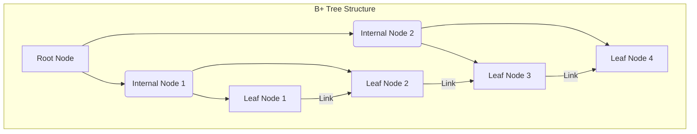

B+ 트리(B+ Tree)는 데이터베이스 및 파일 시스템에서 널리 사용되는 트리 기반의 자료구조입니다. 특히 대량의 데이터를 효율적으로 저장하고 검색하기 위한 인덱스 구조로 최적화되어 있습니다. B+ 트리는 B-트리의 변형으로, 디스크와 같은 블록 지향 저장 장치에 적합하도록 설계되었습니다.

## B+ 트리의 구조

B+ 트리는 다음과 같은 주요 특징을 가집니다:

1.  **모든 데이터는 리프 노드에 저장됩니다.**
    *   내부(Internal) 노드는 오직 키(Key)와 자식 노드에 대한 포인터만을 가집니다. 실제 데이터 레코드에 대한 포인터는 리프 노드에만 존재합니다.
    *   이는 내부 노드를 더 작게 유지하여 한 블록에 더 많은 키를 저장할 수 있게 하며, 트리의 높이를 낮춰 디스크 I/O 횟수를 줄이는 데 기여합니다.

2.  **리프 노드들은 연결 리스트(Linked List)로 연결되어 있습니다.**
    *   모든 리프 노드는 순서대로 양방향 또는 단방향 연결 리스트로 연결되어 있습니다.
    *   이러한 구조 덕분에 범위 검색(Range Query)이 매우 효율적입니다. 특정 범위의 데이터를 찾을 때, 시작점을 찾은 후 연결된 리프 노드를 따라가기만 하면 됩니다.

3.  **균형 트리(Balanced Tree)입니다.**
    *   모든 리프 노드는 루트 노드로부터 같은 거리에 있습니다. 즉, 모든 검색 경로의 길이가 동일합니다.
    *   이는 어떤 데이터를 검색하더라도 일관된 검색 성능을 보장합니다.

### 노드의 종류



*   **루트 노드(Root Node)**: 트리의 최상단 노드입니다.
*   **내부 노드(Internal Node)**: 루트 노드와 리프 노드 사이에 있는 노드들입니다. 키와 자식 노드 포인터를 가집니다.
*   **리프 노드(Leaf Node)**: 트리의 최하단 노드입니다. 실제 데이터 레코드에 대한 포인터(또는 실제 데이터)와 다음 리프 노드에 대한 포인터를 가집니다.

## B+ 트리의 동작 방식

### 검색 (Search)

1.  루트 노드에서 시작하여 검색하려는 키 값과 노드의 키 값들을 비교합니다.
2.  키 값에 따라 적절한 자식 노드로 이동합니다.
3.  이 과정을 리프 노드에 도달할 때까지 반복합니다.
4.  리프 노드에서 해당 키 값을 찾아 데이터 레코드에 접근합니다.

```python
class Node:
    def __init__(self, is_leaf=False):
        self.keys = []
        self.children = []
        self.is_leaf = is_leaf
        self.next_leaf = None # For linked list of leaf nodes

def search(key, node):
    if node.is_leaf:
        # In a real implementation, you'd search for the key within the leaf node's data
        # For simplicity, we assume data is directly associated with keys here.
        if key in node.keys:
            return f"Data associated with {key} found in leaf node."
        return "Key not found."
    else:
        # Find the smallest key_i such that key <= key_i
        i = 0
        while i < len(node.keys) and key > node.keys[i]:
            i += 1
        
        # Follow pointer to the appropriate child
        child_node = node.children[i]
        return search(key, child_node)
```

### 삽입 (Insertion)

1.  새로운 키-값 쌍이 삽입될 리프 노드를 검색합니다.
2.  리프 노드에 공간이 있으면 키-값 쌍을 삽입하고 정렬합니다.
3.  리프 노드가 가득 찼다면, 노드를 분할(Split)합니다.
    *   분할된 노드의 중간 키(또는 복사본)를 부모 노드로 올립니다.
    *   부모 노드도 가득 찼다면, 부모 노드도 분할하고 그 부모의 부모 노드로 키를 올리는 과정이 재귀적으로 반복될 수 있습니다.
    *   최종적으로 루트 노드가 분할되면 트리의 높이가 증가합니다.

```python
# Simplified insertion logic for demonstration. 
# A full B+ Tree implementation requires careful handling of node capacity, splitting, and merging.

class BPlusTree:
    def __init__(self, order):
        self.root = Node(is_leaf=True)
        self.order = order # Max number of children for internal nodes, max keys for leaf nodes

    def _find_leaf(self, key):
        node = self.root
        while not node.is_leaf:
            i = 0
            while i < len(node.keys) and key >= node.keys[i]:
                i += 1
            node = node.children[i]
        return node

    def insert(self, key, value):
        leaf = self._find_leaf(key)
        
        # Insert key-value pair into the leaf node
        # This simplified version assumes keys are unique and handles only basic insertion
        # Real B+ tree insertion involves finding the correct position and shifting elements
        # For simplicity, we'll just append and sort for now.
        leaf.keys.append((key, value))
        leaf.keys.sort()

        if len(leaf.keys) > self.order:
            self._split_leaf(leaf)

    def _split_leaf(self, leaf):
        new_leaf = Node(is_leaf=True)
        mid = len(leaf.keys) // 2
        
        new_leaf.keys = leaf.keys[mid:]
        leaf.keys = leaf.keys[:mid]

        new_leaf.next_leaf = leaf.next_leaf
        leaf.next_leaf = new_leaf

        # Promote the smallest key of the new leaf to the parent
        self._insert_into_parent(leaf, new_leaf.keys[0][0], new_leaf)

    def _insert_into_parent(self, left_node, key, right_node):
        if left_node == self.root and right_node == self.root: # This case should not happen in normal split
            new_root = Node()
            new_root.keys.append(key)
            new_root.children.append(left_node)
            new_root.children.append(right_node)
            self.root = new_root
            return

        # Find parent of left_node
        parent = None
        # This is a simplified way to find parent, in a real tree, nodes would have parent pointers
        # or we would traverse from root again.
        # For this example, we'll assume a simple parent finding mechanism.
        # In a full implementation, you'd pass parent down during insertion or have parent pointers.
        
        # For demonstration, let's assume we can find the parent by traversing from root
        current_node = self.root
        while current_node and not current_node.is_leaf:
            for i, child in enumerate(current_node.children):
                if child == left_node:
                    parent = current_node
                    break
                # If left_node is not a direct child, check its children
                if not child.is_leaf and left_node in child.children:
                    parent = child
                    break
            if parent: break
            # Move to the next level if parent not found yet
            # This part is highly simplified and would need a proper tree traversal
            # or parent pointers in a real implementation.
            if current_node.children:
                current_node = current_node.children[0] # Just for example, not accurate for all cases
            else:
                break

        if parent:
            # Insert key and right_node into parent
            # This part also needs proper insertion logic to maintain sorted order
            # and handle parent splits if it overflows.
            parent.keys.append(key)
            parent.keys.sort()
            parent.children.insert(parent.children.index(left_node) + 1, right_node)
            
            if len(parent.keys) > self.order:
                # Handle parent overflow (split internal node)
                # This is a recursive call to handle internal node splits
                pass # Placeholder for internal node split logic
        else:
            # This means left_node was the root and it split
            new_root = Node()
            new_root.keys.append(key)
            new_root.children.append(left_node)
            new_root.children.append(right_node)
            self.root = new_root

```

### 삭제 (Deletion)

1.  삭제할 키-값 쌍이 있는 리프 노드를 검색합니다.
2.  해당 키-값 쌍을 리프 노드에서 삭제합니다.
3.  삭제 후 노드의 키 개수가 최소 기준(보통 m/2)보다 적어지면, 재분배(Redistribution) 또는 병합(Merge)을 시도합니다.
    *   **재분배**: 인접한 형제 노드로부터 키를 빌려와 노드의 키 개수를 채웁니다.
    *   **병합**: 인접한 형제 노드와 병합하여 하나의 노드로 만듭니다. 이 경우 부모 노드에서 해당 키가 삭제됩니다.
    *   이 과정 또한 재귀적으로 루트 노드까지 전파될 수 있으며, 루트 노드의 자식이 하나만 남게 되면 트리의 높이가 감소할 수 있습니다.

```python
# Simplified deletion logic for demonstration.
# A full B+ Tree implementation requires careful handling of node capacity, splitting, and merging.

    def delete(self, key):
        leaf = self._find_leaf(key)
        found = False
        for i, (k, v) in enumerate(leaf.keys):
            if k == key:
                leaf.keys.pop(i)
                found = True
                break
        
        if not found:
            print(f"Key {key} not found.")
            return

        # Simplified underflow handling. In a real B+ tree, you'd check if the node
        # is below the minimum occupancy and then attempt redistribution or merging.
        # For this example, we'll just print a message if underflow occurs.
        min_keys = self.order // 2
        if len(leaf.keys) < min_keys:
            print(f"Leaf node underflow after deleting {key}. (Simplified: No redistribution/merge implemented)")
            # In a full implementation, you would call a _handle_underflow method here
            # self._handle_underflow(leaf)

    # Placeholder for a more complete _handle_underflow method
    # def _handle_underflow(self, node):
    #     if node == self.root:
    #         if not node.keys and len(node.children) == 1:
    #             self.root = node.children[0]
    #             return
    #     
    #     # Try to redistribute with a sibling
    #     # If redistribution is not possible, merge with a sibling
    #     # Propagate changes up to the parent if parent underflows
```

## B+ 트리의 장점

*   **효율적인 범위 검색**: 모든 데이터가 리프 노드에 순차적으로 연결되어 있어, 특정 범위의 데이터를 빠르게 스캔할 수 있습니다. 이는 데이터베이스에서 `WHERE` 절의 `BETWEEN`이나 `>` `<` 연산과 같은 범위 쿼리에 매우 유리합니다.
*   **디스크 I/O 최적화**: 내부 노드에 데이터가 없어 한 블록에 더 많은 키를 저장할 수 있으므로, 트리의 높이가 낮아집니다. 이는 데이터를 찾기 위해 디스크에서 읽어야 하는 블록의 수가 줄어들어 검색 성능이 향상됩니다.
*   **일관된 검색 성능**: 모든 리프 노드가 같은 깊이에 있으므로, 어떤 데이터를 검색하더라도 최악의 경우와 최상의 경우의 검색 시간이 거의 동일합니다.
*   **캐시 효율성**: 내부 노드가 작고 밀집되어 있어 CPU 캐시 효율성이 높아집니다.

## 참고 자료

*   데이터베이스 시스템 (Database System Concepts) - Abraham Silberschatz, Henry F. Korth, S. Sudarshan
*   운영체제 (Operating System Concepts) - Abraham Silberschatz, Peter B. Galvin, Greg Gagne
*   B+ Tree - Wikipedia: [https://en.wikipedia.org/wiki/B%2B_tree](https://en.wikipedia.org/wiki/B%2B_tree)
