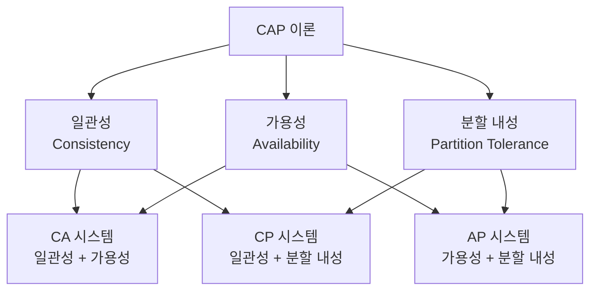

CAP 이론은 분산 시스템에서 세 가지 핵심 속성인 일관성(Consistency), 가용성(Availability), 분할 내성(Partition tolerance)을 동시에 모두 만족시키는 것이 수학적으로 불가능하다는 중요한 정리입니다. 2000년 컴퓨터 과학자 에릭 브루어(Eric Brewer)가 처음 제안한 이 이론은 분산 데이터베이스 및 시스템 설계에 있어 근본적인 제약 조건으로 작용합니다.

## CAP 이론의 세 가지 속성

CAP 이론의 핵심은 다음 세 가지 속성입니다:

### 1. 일관성 (Consistency)

모든 노드가 동시에 동일한 데이터를 볼 수 있는 상태를 의미합니다. 즉, 어떤 노드에서 데이터를 읽을 때마다 항상 최신 데이터(또는 오류)를 받아야 합니다. 일관성이 보장되는 시스템에서는 데이터 업데이트 후 모든 후속 읽기 작업이 해당 업데이트된 값을 반환합니다.

일관성은 [[선형성(Linearizability)]]과 유사한 개념으로, 분산 환경에서 단일 시스템처럼 동작하는 것을 목표로 합니다.

### 2. 가용성 (Availability)

모든 요청(읽기 및 쓰기)이 오류 없이 응답을 받을 수 있는 상태를 의미합니다. 즉, 시스템의 일부 노드가 실패하더라도 시스템은 계속해서 작동하며 응답해야 합니다. 가용성이 높은 시스템은 모든 정상 작동 중인 노드가 합리적인 시간 내에 요청에 응답할 수 있도록 보장합니다.

### 3. 분할 내성 (Partition Tolerance)

네트워크 분할(network partition)이 발생하더라도 시스템이 계속 작동할 수 있는 능력을 의미합니다. 네트워크 분할은 노드 간 통신이 일시적으로 끊어지는 상황을 말합니다. 네트워크 장애, 지연 또는 연결 손실로 인해 발생할 수 있으며, 분산 시스템에서는 항상 발생할 수 있는 문제입니다.

## CAP 이론의 핵심

CAP 이론에 따르면, 분산 시스템은 위의 세 가지 속성 중 최대 두 가지만 동시에 만족시킬 수 있습니다. 이는 수학적으로 증명된 사실입니다.



### CAP 이론에 따른 분산 시스템 유형

1. **CP (일관성 + 분할 내성)**: 네트워크 분할이 발생하면 가용성을 희생하여 일관성을 유지합니다. 일부 노드가 사용 불가능해질 수 있지만, 사용 가능한 노드는 항상 최신 데이터를 제공합니다.
    
2. **AP (가용성 + 분할 내성)**: 네트워크 분할이 발생하면 일관성을 희생하여 가용성을 유지합니다. 모든 노드가 항상 응답하지만, 일부 노드는 최신 데이터를 제공하지 못할 수 있습니다.
    
3. **CA (일관성 + 가용성)**: 이론적으로는 일관성과 가용성을 모두 제공하지만, 실제 분산 시스템에서는 네트워크 분할을 무시할 수 없기 때문에 현실적으로는 거의 존재하지 않습니다. 이는 단일 노드 시스템이나 모든 노드가 항상 안정적으로 연결된 상황에서만 가능합니다.
    

## 현실 세계의 적용

실제 분산 시스템에서는 네트워크 분할이 불가피하기 때문에 분할 내성(P)은 필수적으로 고려해야 합니다. 따라서 현실적인 선택은 CP와 AP 중 하나입니다.

### CP 시스템 예시

- **관계형 데이터베이스(RDBMS)**: PostgreSQL, MySQL 등은 기본적으로 일관성을 우선시합니다.
- **Google Cloud Spanner**: 전역적 분산 트랜잭션과 강한 일관성을 제공합니다.
- **HBase, MongoDB**: 설정에 따라 강한 일관성을 제공할 수 있습니다.
- **Zookeeper, etcd**: 분산 코디네이션 및 구성 관리 시스템으로, 일관성을 우선시합니다.

### AP 시스템 예시

- **Amazon DynamoDB**: 기본적으로 결과적 일관성을 제공하며 가용성을 우선시합니다.
- **Cassandra**: 가용성과 분할 내성을 우선하며 결과적 일관성을 제공합니다.
- **CouchDB**: 오프라인 작동과 나중에 동기화하는 기능을 가집니다.
- **Riak**: 고가용성을 위해 설계된 분산 NoSQL 데이터베이스입니다.

## CAP 이론의 한계와 확장

CAP 이론은 분산 시스템 설계에 있어 중요한 이론이지만, 몇 가지 한계와 오해가 있습니다:

### 1. 이분법적 접근의 한계

CAP 이론은 속성을 '모두 또는 전혀' 방식으로 표현하지만, 실제로는 다양한 수준의 일관성과 가용성이 존재합니다. 현대의 분산 시스템은 이 스펙트럼 내에서 움직입니다.

### 2. PACELC 이론

[[PACELC 이론]]은 CAP 이론의 확장으로, 네트워크 분할(P)이 발생할 경우 일관성(C)과 가용성(A) 사이의 선택(CAP의 영역)뿐만 아니라, 정상 작동 시(E)에도 지연 시간(L)과 일관성(C) 사이에 선택이 필요하다는 점을 강조합니다.

### 3. 일관성의 다양한 수준

실제 시스템에서는 [[강한 일관성(Strong Consistency)]], [[약한 일관성(Weak Consistency)]], [[결과적 일관성(Eventual Consistency)]] 등 다양한 일관성 모델이 존재합니다. CAP 이론의 C는 강한 일관성을 의미하지만, 시스템 설계자는 애플리케이션 요구사항에 따라 적절한 일관성 수준을 선택할 수 있습니다.

## 분산 시스템 설계 시 CAP 고려사항

분산 시스템을 설계할 때 CAP 이론을 고려하는 방법:

### 1. 요구사항 분석

애플리케이션이 일관성과 가용성 중 어떤 것을 더 우선시해야 하는지 판단합니다. 예를 들어:

- 금융 거래: 일관성이 더 중요합니다(CP).
- 소셜 미디어 피드: 가용성이 더 중요할 수 있습니다(AP).

### 2. 데이터 특성 고려

- 모든 데이터가 동일한 일관성 요구사항을 가지지 않습니다.
- 중요한 핵심 데이터는 강한 일관성이 필요할 수 있습니다.
- 덜 중요한 데이터는 결과적 일관성으로 충분할 수 있습니다.

### 3. 장애 시나리오 분석

네트워크 분할이 발생했을 때 시스템이 어떻게 동작해야 하는지 미리 계획합니다.

- 쓰기 작업을 거부할 것인가? (CP)
- 일관성이 없는 상태로 계속 작업할 것인가? (AP)

## 스프링 애플리케이션에서의 CAP 고려 사항

스프링 프레임워크로 분산 시스템을 개발할 때 CAP 이론을 고려하는 방법:

### 1. 데이터 저장소 선택

```java
@Configuration
public class DatabaseConfig {
    
    @Bean
    @Profile("high-consistency")
    public DataSource consistencyFocusedDataSource() {
        // 일관성 중심 데이터베이스 구성 (예: MySQL, PostgreSQL)
        return new DriverManagerDataSource();
    }
    
    @Bean
    @Profile("high-availability")
    public NoSQLClient availabilityFocusedClient() {
        // 가용성 중심 데이터베이스 구성 (예: Cassandra, DynamoDB)
        return new CassandraClient();
    }
}
```

### 2. 분산 트랜잭션 처리

분산 환경에서 트랜잭션 처리 방식은 CAP 선택에 큰 영향을 미칩니다:

- 2PC(2-Phase Commit): 강한 일관성을 제공하지만 가용성이 저하될 수 있습니다.
- Saga 패턴: 보상 트랜잭션을 통해 최종 일관성을 제공하며 가용성을 높입니다.

자세한 내용은 [[분산 트랜잭션 패턴]]을 참고해주세요.

## 결론

CAP 이론은 분산 시스템 설계의 근본적인 제약을 이해하는 데 중요한 개념입니다. 완벽한 시스템은 존재하지 않으며, 모든 설계는 트레이드오프의 결과입니다. 현대의 분산 시스템은 단순히 CAP 속성 중 두 가지를 선택하는 것이 아니라, 애플리케이션의 특성과 요구사항에 따라 다양한 수준의 일관성과 가용성을 제공합니다.

시스템 설계자는 CAP 이론을 이해하고 적용함으로써 분산 시스템의 제약 조건 내에서 최적의 선택을 할 수 있습니다. 또한 [[ACID 속성]], [[BASE 모델]]과 같은 관련 개념을 함께 고려하여 더 견고한 분산 시스템을 설계할 수 있습니다.

## 참고 자료

- "CAP Twelve Years Later: How the Rules Have Changed" - Eric Brewer
- "Designing Data-Intensive Applications" - Martin Kleppmann
- "NoSQL Distilled" - Pramod J. Sadalage and Martin Fowler
- "The CAP FAQ" - Henry Robinson (https://github.com/henryr/cap-faq)