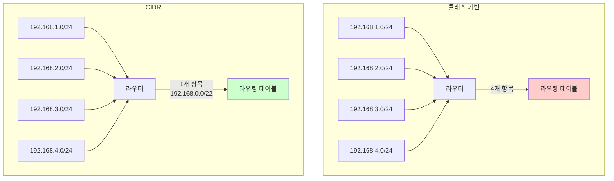
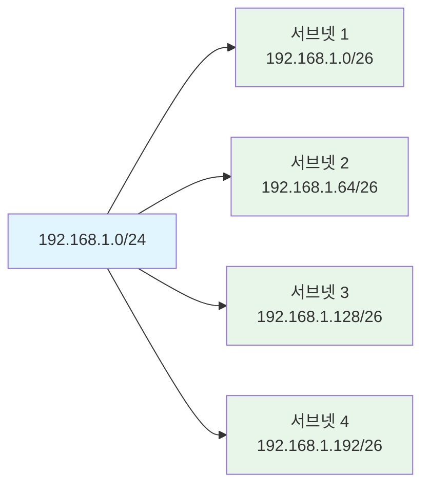

CIDR(Classless Inter-Domain Routing)은 클래스 기반 주소 할당의 한계를 극복하기 위해 도입된 IP 주소 할당 및 라우팅 방식입니다. CIDR은 고정된 클래스 경계 없이 서브넷 마스크를 사용하여 네트워크를 유연하게 분할하고, 라우팅 테이블의 크기를 줄여 네트워크 효율성을 향상시킵니다.

CIDR은 현대 인터넷의 핵심 기술로, IPv4 주소 공간을 효율적으로 활용하고 라우팅 성능을 최적화하는 데 필수적입니다. CIDR을 이해하기 위해서는 [[IP 주소]], [[서브넷 마스크(Subnet Mask)]], [[라우팅(Routing)]], [[Network]] 등의 개념을 함께 이해하는 것이 중요합니다.

## CIDR의 등장 배경

초기 IPv4 주소 체계는 클래스 기반 주소 할당(Classful Addressing)을 사용했습니다. 하지만 인터넷이 급속히 확장되면서 다음과 같은 심각한 문제들이 발생했습니다:

1. **주소 공간 낭비**: 클래스 A, B, C는 고정된 크기로 할당되어 실제 필요보다 훨씬 많은 주소가 할당되거나, 반대로 부족한 경우가 발생했습니다.
   - 클래스 C(254개 호스트)가 필요한 조직에 클래스 B(65,534개 호스트)를 할당하면 약 65,000개의 주소가 낭비됩니다.
   - 클래스 B가 필요한 조직에 클래스 C를 여러 개 할당하면 라우팅 테이블이 비대해집니다.

2. **라우팅 테이블 폭발**: 작은 네트워크가 많아지면서 라우팅 테이블의 항목 수가 기하급수적으로 증가했습니다. 이는 라우터의 메모리와 처리 성능에 부담을 주었습니다.

3. **유연성 부족**: 네트워크 크기에 맞게 주소를 할당할 수 없어, 네트워크 구조 변경 시 주소 재할당이 어려웠습니다.

4. **주소 고갈**: 비효율적인 주소 할당으로 인해 IPv4 주소가 빠르게 고갈되었습니다.

CIDR은 이러한 문제들을 해결하기 위해 1993년 RFC 1519에서 제안되었고, 이후 인터넷의 표준이 되었습니다.

## 클래스 기반 주소 할당의 문제점

### 클래스 기반 주소 할당 구조

클래스 기반 주소 할당은 IP 주소의 첫 번째 옥텟의 값에 따라 고정된 네트워크 크기를 가집니다:

| 클래스 | 첫 옥텟 범위 | 네트워크 비트 | 호스트 비트 | 네트워크 수 | 호스트 수/네트워크 |
|--------|------------|--------------|------------|------------|------------------|
| A | 0-127 | 8 | 24 | 128 | 16,777,214 |
| B | 128-191 | 16 | 16 | 16,384 | 65,534 |
| C | 192-223 | 24 | 8 | 2,097,152 | 254 |

### 문제점 예시

**예시 1: 주소 낭비**
- 한 조직이 500개의 호스트가 필요한 경우, 클래스 C(254개)로는 부족하고 클래스 B(65,534개)를 할당받아야 합니다.
- 결과적으로 약 65,000개의 주소가 낭비됩니다.

**예시 2: 라우팅 테이블 증가**
- 500개의 호스트가 필요한 조직 100개가 있다면:
  - 클래스 기반: 각 조직에 클래스 B를 할당 → 100개의 라우팅 테이블 항목
  - CIDR: 100개 조직을 하나의 큰 블록으로 요약 가능 → 1개의 라우팅 테이블 항목

## CIDR의 기본 원리

CIDR은 클래스 경계를 무시하고, [[서브넷 마스크(Subnet Mask)]]를 사용하여 네트워크를 임의의 크기로 분할할 수 있게 합니다.

### CIDR 표기법

CIDR은 IP 주소와 함께 슬래시(/) 뒤에 네트워크 비트 수를 표기하는 방식을 사용합니다:

**형식**: `IP주소/네트워크비트수`

**예시**:
- `192.168.1.0/24` → 24비트가 네트워크 ID, 8비트가 호스트 ID
- `10.0.0.0/8` → 8비트가 네트워크 ID, 24비트가 호스트 ID
- `172.16.0.0/16` → 16비트가 네트워크 ID, 16비트가 호스트 ID
- `203.0.113.0/28` → 28비트가 네트워크 ID, 4비트가 호스트 ID (14개 호스트)

### CIDR의 핵심 개념

#### 1. 클래스 없는 주소 할당

클래스 경계에 구애받지 않고 필요한 크기만큼 주소를 할당할 수 있습니다.

**예시**:
- 500개 호스트가 필요한 경우: `/23` (512개 주소, 510개 호스트 사용 가능)
- 1000개 호스트가 필요한 경우: `/22` (1024개 주소, 1022개 호스트 사용 가능)

#### 2. 주소 요약 (Route Aggregation)

여러 작은 네트워크를 하나의 큰 네트워크로 요약하여 라우팅 테이블의 크기를 줄입니다.



**요약 예시**:
```
192.168.0.0/24  (192.168.0.0 ~ 192.168.0.255)
192.168.1.0/24  (192.168.1.0 ~ 192.168.1.255)
192.168.2.0/24  (192.168.2.0 ~ 192.168.2.255)
192.168.3.0/24  (192.168.3.0 ~ 192.168.3.255)

→ 하나로 요약: 192.168.0.0/22
```

#### 3. 슈퍼넷팅 (Supernetting)

여러 작은 네트워크를 하나의 큰 네트워크로 통합하는 기법입니다. 슈퍼넷팅은 주소 요약의 한 형태로, 연속된 네트워크를 하나의 라우팅 항목으로 표현합니다.

## CIDR 블록 계산

### 네트워크 주소 계산

CIDR 표기법에서 네트워크 주소는 IP 주소와 서브넷 마스크를 AND 연산하여 계산합니다.

**예시**: `192.168.1.100/24`
```
IP 주소:       192.168.1.100  (11000000.10101000.00000001.01100100)
서브넷 마스크: 255.255.255.0  (11111111.11111111.11111111.00000000)
                              └──────── 24비트 ────────┘└─ 8비트 ─┘

AND 연산 결과: 192.168.1.0    (네트워크 주소)
```

### 사용 가능한 호스트 수 계산

**공식**: 사용 가능한 호스트 수 = 2^(32 - CIDR) - 2

- 2를 빼는 이유: 네트워크 주소와 브로드캐스트 주소는 호스트로 사용할 수 없습니다.

**예시**:
- `/24`: 2^(32-24) - 2 = 256 - 2 = 254개 호스트
- `/25`: 2^(32-25) - 2 = 128 - 2 = 126개 호스트
- `/26`: 2^(32-26) - 2 = 64 - 2 = 62개 호스트
- `/30`: 2^(32-30) - 2 = 4 - 2 = 2개 호스트 (점대점 링크용)

### CIDR 블록 범위 계산

**예시**: `192.168.1.0/24`
- 네트워크 주소: 192.168.1.0
- 첫 번째 사용 가능한 호스트: 192.168.1.1
- 마지막 사용 가능한 호스트: 192.168.1.254
- 브로드캐스트 주소: 192.168.1.255

**예시**: `10.0.0.0/8`
- 네트워크 주소: 10.0.0.0
- 첫 번째 사용 가능한 호스트: 10.0.0.1
- 마지막 사용 가능한 호스트: 10.255.255.254
- 브로드캐스트 주소: 10.255.255.255

## CIDR과 서브넷팅

CIDR을 사용하면 기존 네트워크를 더 작은 서브넷으로 분할할 수 있습니다. 이를 서브넷팅(Subnetting)이라고 합니다.

### 서브넷팅 예시

**원본 네트워크**: `192.168.1.0/24` (254개 호스트)

이를 4개의 서브넷으로 나누는 경우:

```
원본: 192.168.1.0/24

서브넷 1: 192.168.1.0/26   (62개 호스트: 192.168.1.1 ~ 192.168.1.62)
서브넷 2: 192.168.1.64/26  (62개 호스트: 192.168.1.65 ~ 192.168.1.126)
서브넷 3: 192.168.1.128/26 (62개 호스트: 192.168.1.129 ~ 192.168.1.190)
서브넷 4: 192.168.1.192/26 (62개 호스트: 192.168.1.193 ~ 192.168.1.254)
```

**계산 과정**:
- 원본: 24비트 네트워크, 8비트 호스트
- 서브넷: 26비트 네트워크, 6비트 호스트
- 추가된 네트워크 비트: 2비트 (2^2 = 4개의 서브넷)



## CIDR과 라우팅

CIDR은 라우팅 효율성을 크게 향상시킵니다. 라우터는 Longest Prefix Match(최장 접두사 일치) 원칙을 사용하여 가장 구체적인 경로를 선택합니다.

### Longest Prefix Match

라우터는 패킷의 목적지 IP 주소와 라우팅 테이블의 항목을 비교할 때, 가장 긴 네트워크 접두사(가장 구체적인 경로)를 선택합니다.

**예시**:
```
라우팅 테이블:
192.168.1.0/24    → 직접 연결
192.168.0.0/16    → 다음 홉: 10.0.0.1
0.0.0.0/0         → 기본 게이트웨이: 192.168.1.254

목적지 IP: 192.168.1.100
→ 192.168.1.0/24이 가장 구체적이므로 이 경로 선택

목적지 IP: 192.168.5.100
→ 192.168.0.0/16이 매칭되므로 이 경로 선택

목적지 IP: 203.0.113.1
→ 기본 게이트웨이(0.0.0.0/0) 사용
```

### 라우팅 테이블 최적화

CIDR을 사용하면 여러 작은 네트워크를 하나의 큰 네트워크로 요약하여 라우팅 테이블의 크기를 줄일 수 있습니다.

**예시**:
```
요약 전:
192.168.0.0/24
192.168.1.0/24
192.168.2.0/24
192.168.3.0/24
... (총 256개 항목)

요약 후:
192.168.0.0/16 (1개 항목)
```

## Java에서 CIDR 다루기

Java에서는 서드파티 라이브러리나 직접 구현을 통해 CIDR을 다룰 수 있습니다:

```java
import java.net.InetAddress;
import java.net.UnknownHostException;

public class CIDRExample {
    
    /**
     * CIDR 표기법 문자열을 파싱합니다.
     * 
     * @param cidr CIDR 표기법 (예: "192.168.1.0/24")
     * @return [0]: IP 주소, [1]: CIDR 비트 수
     */
    public static Object[] parseCIDR(String cidr) throws UnknownHostException {
        String[] parts = cidr.split("/");
        if (parts.length != 2) {
            throw new IllegalArgumentException("잘못된 CIDR 형식: " + cidr);
        }
        
        InetAddress ip = InetAddress.getByName(parts[0]);
        int prefixLength = Integer.parseInt(parts[1]);
        
        if (prefixLength < 0 || prefixLength > 32) {
            throw new IllegalArgumentException("CIDR 비트 수는 0-32 사이여야 합니다: " + prefixLength);
        }
        
        return new Object[]{ip, prefixLength};
    }
    
    /**
     * CIDR 블록의 네트워크 주소를 계산합니다.
     */
    public static InetAddress getNetworkAddress(String cidr) throws UnknownHostException {
        Object[] parsed = parseCIDR(cidr);
        InetAddress ip = (InetAddress) parsed[0];
        int prefixLength = (Integer) parsed[1];
        
        byte[] ipBytes = ip.getAddress();
        byte[] maskBytes = createSubnetMask(prefixLength);
        byte[] networkBytes = new byte[4];
        
        for (int i = 0; i < 4; i++) {
            networkBytes[i] = (byte) (ipBytes[i] & maskBytes[i]);
        }
        
        return InetAddress.getByAddress(networkBytes);
    }
    
    /**
     * CIDR 비트 수로 서브넷 마스크를 생성합니다.
     */
    public static byte[] createSubnetMask(int prefixLength) {
        byte[] mask = new byte[4];
        int maskInt = 0xffffffff << (32 - prefixLength);
        
        mask[0] = (byte) ((maskInt >>> 24) & 0xff);
        mask[1] = (byte) ((maskInt >>> 16) & 0xff);
        mask[2] = (byte) ((maskInt >>> 8) & 0xff);
        mask[3] = (byte) (maskInt & 0xff);
        
        return mask;
    }
    
    /**
     * CIDR 블록의 사용 가능한 호스트 수를 계산합니다.
     */
    public static long getAvailableHosts(int prefixLength) {
        int hostBits = 32 - prefixLength;
        return (long) Math.pow(2, hostBits) - 2;
    }
    
    /**
     * IP 주소가 CIDR 블록에 속하는지 확인합니다.
     */
    public static boolean isInCIDR(String ip, String cidr) throws UnknownHostException {
        InetAddress ipAddress = InetAddress.getByName(ip);
        InetAddress networkAddress = getNetworkAddress(cidr);
        
        Object[] parsed = parseCIDR(cidr);
        int prefixLength = (Integer) parsed[1];
        
        byte[] ipBytes = ipAddress.getAddress();
        byte[] networkBytes = networkAddress.getAddress();
        byte[] maskBytes = createSubnetMask(prefixLength);
        
        for (int i = 0; i < 4; i++) {
            if ((ipBytes[i] & maskBytes[i]) != (networkBytes[i] & maskBytes[i])) {
                return false;
            }
        }
        
        return true;
    }
    
    /**
     * CIDR 블록의 브로드캐스트 주소를 계산합니다.
     */
    public static InetAddress getBroadcastAddress(String cidr) throws UnknownHostException {
        InetAddress networkAddress = getNetworkAddress(cidr);
        Object[] parsed = parseCIDR(cidr);
        int prefixLength = (Integer) parsed[1];
        
        byte[] networkBytes = networkAddress.getAddress();
        byte[] maskBytes = createSubnetMask(prefixLength);
        byte[] broadcastBytes = new byte[4];
        
        for (int i = 0; i < 4; i++) {
            broadcastBytes[i] = (byte) ((networkBytes[i] & maskBytes[i]) | (~maskBytes[i] & 0xff));
        }
        
        return InetAddress.getByAddress(broadcastBytes);
    }
    
    public static void main(String[] args) throws UnknownHostException {
        String cidr = "192.168.1.0/24";
        
        // 네트워크 주소
        InetAddress network = getNetworkAddress(cidr);
        System.out.println("네트워크 주소: " + network.getHostAddress());
        
        // 브로드캐스트 주소
        InetAddress broadcast = getBroadcastAddress(cidr);
        System.out.println("브로드캐스트 주소: " + broadcast.getHostAddress());
        
        // 사용 가능한 호스트 수
        Object[] parsed = parseCIDR(cidr);
        int prefixLength = (Integer) parsed[1];
        long hosts = getAvailableHosts(prefixLength);
        System.out.println("사용 가능한 호스트 수: " + hosts);
        
        // IP 주소가 CIDR 블록에 속하는지 확인
        boolean inRange = isInCIDR("192.168.1.100", cidr);
        System.out.println("192.168.1.100이 " + cidr + "에 속하는가: " + inRange);
        
        boolean notInRange = isInCIDR("192.168.2.100", cidr);
        System.out.println("192.168.2.100이 " + cidr + "에 속하는가: " + notInRange);
    }
}
```

## 스프링에서 CIDR 활용

스프링 시큐리티에서는 CIDR 표기법을 사용하여 IP 기반 접근 제어를 구현할 수 있습니다:

```java
import org.springframework.security.config.annotation.web.builders.HttpSecurity;
import org.springframework.security.config.annotation.web.configuration.EnableWebSecurity;
import org.springframework.security.config.annotation.web.configuration.WebSecurityConfigurerAdapter;

@EnableWebSecurity
public class SecurityConfig extends WebSecurityConfigurerAdapter {
    
    @Override
    protected void configure(HttpSecurity http) throws Exception {
        http.authorizeRequests()
            // 특정 CIDR 블록에서만 접근 허용
            .antMatchers("/admin/**")
            .hasIpAddress("192.168.1.0/24") // 192.168.1.0 ~ 192.168.1.255
            .antMatchers("/api/**")
            .hasIpAddress("10.0.0.0/8") // 10.0.0.0 ~ 10.255.255.255
            .anyRequest().permitAll();
    }
}
```


## CIDR의 장단점

### 장점

1. **주소 공간 효율성**: 필요한 크기만큼만 주소를 할당하여 주소 낭비를 최소화합니다.
2. **라우팅 테이블 최적화**: 주소 요약을 통해 라우팅 테이블 크기를 크게 줄입니다.
3. **유연성**: 네트워크 크기에 맞게 유연하게 주소를 할당할 수 있습니다.
4. **확장성**: 네트워크 구조 변경 시 쉽게 대응할 수 있습니다.
5. **표준화**: 현대 인터넷의 표준 방식입니다.

### 단점

1. **복잡성**: 클래스 기반 방식보다 이해하고 구현하기 복잡합니다.
2. **계산 필요**: 네트워크 주소와 호스트 범위를 계산해야 합니다.
3. **호환성**: 오래된 시스템과의 호환성 문제가 있을 수 있습니다.

## CIDR 사용 시 주의사항

1. **올바른 CIDR 비트 수 선택**: 필요한 호스트 수에 맞는 적절한 CIDR 비트 수를 선택해야 합니다.

2. **주소 범위 겹침 방지**: 서브넷팅 시 주소 범위가 겹치지 않도록 주의해야 합니다.

3. **라우팅 테이블 관리**: 주소 요약 시 너무 많은 네트워크를 요약하면 라우팅 정밀도가 떨어질 수 있습니다.

4. **브로드캐스트 도메인**: 서브넷을 나눌 때 브로드캐스트 도메인도 함께 분리됩니다.

5. **라우터 설정**: CIDR을 지원하는 라우팅 프로토콜(OSPF, BGP 등)을 사용해야 합니다.

## 실제 활용 사례

1. **ISP 주소 할당**: 인터넷 서비스 제공자(ISP)가 고객에게 필요한 크기만큼 주소를 할당합니다.

2. **기업 네트워크**: 조직의 크기에 맞게 주소 블록을 할당하고, 부서별로 서브넷을 구성합니다.

3. **클라우드 환경**: 가상 네트워크에서 CIDR을 사용하여 리소스를 분리하고 관리합니다.

4. **VPN 구성**: 원격 사무실을 연결할 때 적절한 크기의 CIDR 블록을 할당합니다.

5. **보안 정책**: 방화벽 규칙에서 CIDR 표기법을 사용하여 IP 대역을 지정합니다.

## CIDR과 IPv6

IPv6에서도 CIDR 개념이 사용되며, IPv4와 동일한 원리로 동작합니다. 다만 IPv6는 128비트 주소 공간을 사용하므로 CIDR 비트 수는 0부터 128까지입니다.

**예시**:
- `2001:0db8::/32` → 32비트 네트워크, 96비트 호스트
- `2001:0db8:85a3::/48` → 48비트 네트워크, 80비트 호스트

## 결론

CIDR은 클래스 기반 주소 할당의 한계를 극복하고, IPv4 주소 공간을 효율적으로 활용하며, 라우팅 성능을 최적화하는 핵심 기술입니다. CIDR을 올바르게 이해하고 사용하면 네트워크를 효율적으로 설계하고 관리할 수 있습니다.

CIDR을 사용할 때는 [[IP 주소]], [[서브넷 마스크(Subnet Mask)]], [[라우팅(Routing)]], [[서브넷(Subnet)]], [[서브넷팅]] 등의 관련 개념들을 함께 이해하는 것이 중요하며, 네트워크 요구사항에 맞는 적절한 CIDR 블록을 선택하고 관리해야 합니다.

또한 현대적인 애플리케이션 개발에서는 스프링 시큐리티와 같은 프레임워크를 활용하여 CIDR 기반의 IP 접근 제어를 구현할 수 있습니다.

## 참고 자료

- RFC 1519 - Classless Inter-Domain Routing (CIDR): an Address Assignment and Aggregation Strategy
- RFC 4632 - Classless Inter-domain Routing (CIDR): The Internet Address Assignment and Aggregation Plan
- Computer Networks, 5th Edition - Andrew S. Tanenbaum
- CCNA Routing and Switching Study Guide - Todd Lammle

