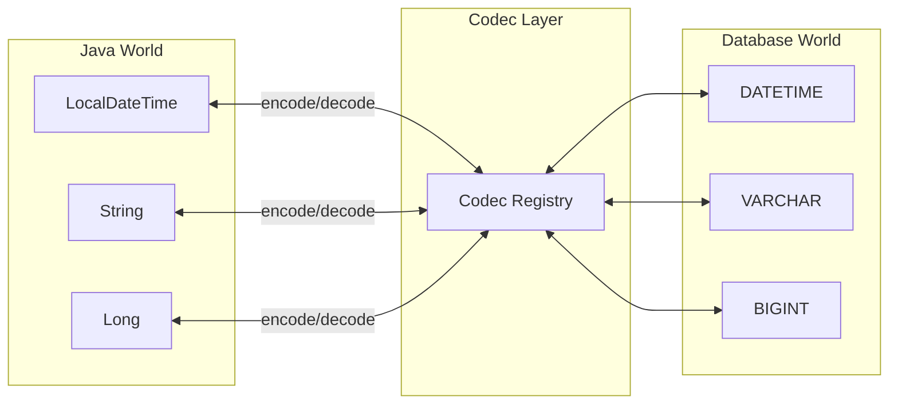
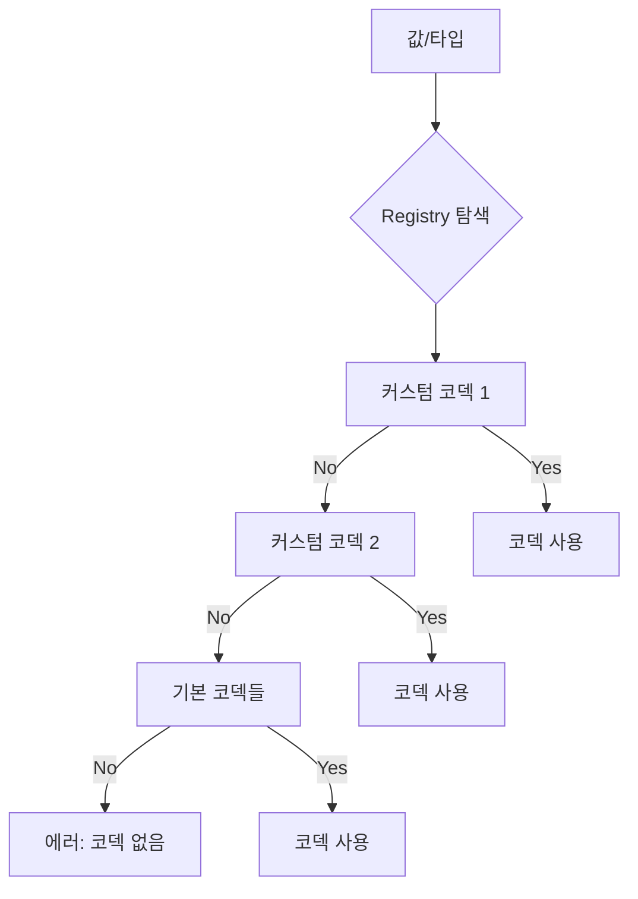

Codec은 R2DBC 드라이버에서 Java 타입과 데이터베이스 타입 간의 변환을 담당하는 컴포넌트다. 쿼리 파라미터를 인코딩하고, 결과 데이터를 디코딩하는 역할을 한다.

---

## 코덱의 역할



## r2dbc-mysql 코덱 구조

r2dbc-mysql은 약 30개의 기본 코덱을 제공한다. 코덱은 다음 인터페이스를 구현한다.

```java
public interface Codec<T> {
    // 디코딩: 데이터베이스 → Java
    T decode(ByteBuf value, MySqlColumnMetadata metadata,
             Class<?> target, boolean binary, CodecContext context);

    // 인코딩: Java → 데이터베이스
    MySqlParameter encode(Object value, CodecContext context);

    // 이 코덱이 해당 타입을 디코딩할 수 있는지
    boolean canDecode(MySqlColumnMetadata metadata, Class<?> target);

    // 이 코덱이 해당 값을 인코딩할 수 있는지
    boolean canEncode(Object value);
}
```

## 기본 제공 코덱

### 숫자 타입

| MySQL 타입 | Java 타입 | 비고 |
|-----------|----------|------|
| TINYINT | Byte, Boolean | TINYINT(1)은 Boolean으로도 가능 |
| SMALLINT | Short | |
| INT | Integer | |
| BIGINT | Long | |
| FLOAT | Float | |
| DOUBLE | Double | |
| DECIMAL | BigDecimal | 정밀도 보장 |

### 문자열 타입

| MySQL 타입 | Java 타입 | 비고 |
|-----------|----------|------|
| CHAR, VARCHAR | String | |
| TEXT | String | |
| ENUM | String, Enum | |
| SET | Set<String> | |
| JSON | String | JSON 문자열로 반환 |

### 날짜/시간 타입

| MySQL 타입 | Java 타입 | 비고 |
|-----------|----------|------|
| DATE | LocalDate | |
| TIME | LocalTime, Duration | |
| DATETIME | LocalDateTime | |
| TIMESTAMP | LocalDateTime, Instant | 서버 타임존 고려 |
| YEAR | Year, Integer | |

### 바이너리 타입

| MySQL 타입 | Java 타입 | 비고 |
|-----------|----------|------|
| BINARY, VARBINARY | byte[], ByteBuffer | |
| BLOB | ByteBuffer, Blob | Blob은 스트리밍 지원 |
| BIT | BitSet, byte[] | |

## LOB 스트리밍

BLOB과 CLOB은 스트리밍 방식으로 처리할 수 있다. 대용량 데이터를 메모리에 한 번에 로드하지 않고 청크 단위로 처리한다.

```java
// Blob 읽기 - 리액티브 스트림으로 처리
row.get("image", Blob.class)
    .stream()
    .subscribe(buffer -> {
        // ByteBuffer 청크 처리
    });

// Blob 쓰기
Blob blob = Blob.from(Flux.just(
    ByteBuffer.wrap(chunk1),
    ByteBuffer.wrap(chunk2)
));

connection.createStatement("INSERT INTO files (data) VALUES ($1)")
    .bind(0, blob)
    .execute();
```

## 코덱 등록 순서

CodecRegistry는 코덱을 순서대로 탐색하여 첫 번째로 매칭되는 코덱을 사용한다.



## 커스텀 코덱 구현

특별한 타입 변환이 필요하면 커스텀 코덱을 구현할 수 있다.

```java
public class UUIDCodec implements Codec<UUID> {

    @Override
    public boolean canDecode(MySqlColumnMetadata metadata, Class<?> target) {
        return metadata.getType() == MySqlType.VARCHAR
            && target.isAssignableFrom(UUID.class);
    }

    @Override
    public UUID decode(ByteBuf value, MySqlColumnMetadata metadata,
                       Class<?> target, boolean binary, CodecContext context) {
        String str = value.toString(StandardCharsets.UTF_8);
        return UUID.fromString(str);
    }

    @Override
    public boolean canEncode(Object value) {
        return value instanceof UUID;
    }

    @Override
    public MySqlParameter encode(Object value, CodecContext context) {
        UUID uuid = (UUID) value;
        return MySqlParameter.of(uuid.toString());
    }
}
```

### 코덱 등록

```java
// CodecRegistrar 구현
public class UUIDCodecRegistrar implements CodecRegistrar {
    @Override
    public void register(CodecRegistry registry) {
        registry.addFirst(new UUIDCodec());  // 우선순위 높게
    }
}

// META-INF/services/io.asyncer.r2dbc.mysql.extension.CodecRegistrar
// com.example.UUIDCodecRegistrar
```

## 타입 추론

명시적 타입 없이 `row.get("column")`을 호출하면 드라이버가 적절한 Java 타입을 추론한다.

```java
// 타입 추론 (드라이버가 결정)
Object value = row.get("column");

// 명시적 타입 지정 (권장)
Long id = row.get("id", Long.class);
String name = row.get("name", String.class);
```

명시적 타입 지정을 권장한다. 타입 추론은 드라이버 구현에 의존하며, 예상과 다른 타입이 반환될 수 있다.

## Text vs Binary 프로토콜

MySQL 드라이버는 두 가지 프로토콜을 지원하며, 코덱은 둘 다 처리해야 한다.

**Text Protocol**: 값이 문자열로 전송
```
"2024-01-15 10:30:00" → LocalDateTime.parse(...)
```

**Binary Protocol**: 값이 바이너리로 전송
```
[년][월][일][시][분][초][마이크로초] → LocalDateTime.of(...)
```

코덱은 `binary` 파라미터로 어떤 프로토콜인지 알 수 있다.

## References

- [[R2DBC 동작 원리]]
- [[Result]]
- [[MySQL 프로토콜]]
