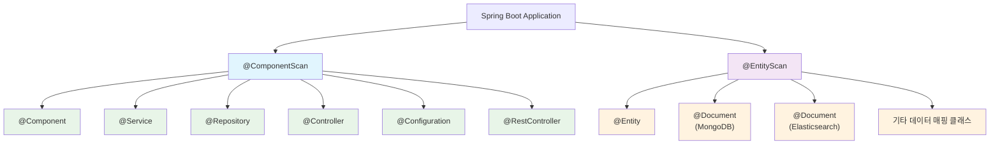

# @ComponentScan과 @EntityScan의 차이점

Spring Boot 개발에서 자주 혼동되는 두 어노테이션인 `@ComponentScan`과 `@EntityScan`의 차이점을 명확히 이해하는 것은 효율적인 애플리케이션 구성을 위해 매우 중요합니다. 이 두 어노테이션은 비슷해 보이지만 완전히 다른 목적과 역할을 가지고 있습니다.

## 기본 개념 비교

### @ComponentScan
`@ComponentScan`은 Spring의 핵심 어노테이션으로, Spring이 관리하는 빈(Bean) 객체들을 찾아서 애플리케이션 컨텍스트(Application Context)에 등록하는 역할을 합니다. 주로 비즈니스 로직을 담당하는 컴포넌트들을 스캔합니다.

### @EntityScan
`@EntityScan`은 Spring Boot에서 제공하는 어노테이션으로, JPA 엔티티 클래스들을 찾아서 JPA 엔티티 매니저(Entity Manager)에 등록하는 역할을 합니다. 데이터베이스 테이블과 매핑되는 엔티티 클래스들을 스캔합니다.

## 스캔 대상 비교



### @ComponentScan이 스캔하는 대상

```java
// 서비스 클래스
@Service
public class UserService {
    // 비즈니스 로직
}

// 컨트롤러 클래스
@RestController
public class UserController {
    // REST API 엔드포인트
}

// 리포지토리 클래스
@Repository
public class UserRepository {
    // 데이터 접근 로직
}

// 구성 클래스
@Configuration
public class AppConfig {
    // 빈 설정
}

// 일반 컴포넌트
@Component
public class EmailService {
    // 이메일 전송 로직
}
```

### @EntityScan이 스캔하는 대상

```java
// JPA 엔티티
@Entity
@Table(name = "users")
public class User {
    @Id
    @GeneratedValue(strategy = GenerationType.IDENTITY)
    private Long id;
    
    private String name;
    private String email;
    // getter, setter
}

// MongoDB 문서
@Document(collection = "products")
public class Product {
    @Id
    private String id;
    private String name;
    private BigDecimal price;
    // getter, setter
}

// Elasticsearch 문서
@Document(indexName = "search_logs")
public class SearchLog {
    @Id
    private String id;
    private String query;
    private LocalDateTime timestamp;
    // getter, setter
}
```

## 사용법 비교

### @ComponentScan 사용법

```java
// 기본 사용법
@SpringBootApplication
@ComponentScan("com.example.app.service")
public class MyApplication {
    public static void main(String[] args) {
        SpringApplication.run(MyApplication.class, args);
    }
}

// 여러 패키지 스캔
@SpringBootApplication
@ComponentScan({
    "com.example.app.service",
    "com.example.app.controller",
    "com.example.shared.utils"
})
public class MyApplication {
    // 애플리케이션 설정
}

// 필터 적용
@SpringBootApplication
@ComponentScan(
    basePackages = "com.example.app",
    excludeFilters = @ComponentScan.Filter(
        type = FilterType.ASSIGNABLE_TYPE,
        classes = {TestConfiguration.class}
    )
)
public class MyApplication {
    // 애플리케이션 설정
}
```

### @EntityScan 사용법

```java
// 기본 사용법
@SpringBootApplication
@EntityScan("com.example.app.domain")
public class MyApplication {
    public static void main(String[] args) {
        SpringApplication.run(MyApplication.class, args);
    }
}

// 여러 패키지 스캔
@SpringBootApplication
@EntityScan({
    "com.example.app.domain",
    "com.example.shared.entities"
})
public class MyApplication {
    // 애플리케이션 설정
}

// 베이스 클래스로 지정
@SpringBootApplication
@EntityScan(basePackageClasses = {User.class, Product.class})
public class MyApplication {
    // 애플리케이션 설정
}
```

## 기본 스캔 범위 비교

### @ComponentScan의 기본 동작

Spring Boot에서 `@SpringBootApplication` 어노테이션은 내부적으로 `@ComponentScan`을 포함하고 있습니다:

```java
@SpringBootApplication
// 내부적으로 다음과 같은 어노테이션들을 포함
// @SpringBootConfiguration
// @EnableAutoConfiguration
// @ComponentScan(excludeFilters = {...})
public class MyApplication {
    // 메인 클래스가 위치한 패키지와 하위 패키지를 모두 스캔
}
```

### @EntityScan의 기본 동작

`@EntityScan`을 명시적으로 지정하지 않으면, Spring Boot는 메인 클래스가 위치한 패키지와 하위 패키지에서 엔티티를 찾습니다:

```java
@SpringBootApplication
public class MyApplication {
    // @EntityScan을 명시하지 않으면
    // 메인 클래스 패키지와 하위 패키지에서 @Entity 클래스를 찾음
}
```

## 실제 프로젝트 구조에서의 활용

### 일반적인 프로젝트 구조

```
com.example.app
├── MyApplication.java          # 메인 클래스
├── controller/                 # @ComponentScan 대상
│   ├── UserController.java
│   └── ProductController.java
├── service/                    # @ComponentScan 대상
│   ├── UserService.java
│   └── ProductService.java
├── repository/                 # @ComponentScan 대상
│   ├── UserRepository.java
│   └── ProductRepository.java
└── domain/                     # @EntityScan 대상
    ├── User.java
    └── Product.java
```

이 구조에서는 별도의 스캔 설정 없이 기본 동작만으로 충분합니다:

```java
@SpringBootApplication
public class MyApplication {
    // 모든 하위 패키지가 자동으로 스캔됨
    public static void main(String[] args) {
        SpringApplication.run(MyApplication.class, args);
    }
}
```

### 복잡한 멀티모듈 프로젝트 구조

```
com.example
├── app/
│   └── MyApplication.java      # 메인 클래스
├── user/
│   ├── controller/             # @ComponentScan 필요
│   ├── service/                # @ComponentScan 필요
│   └── domain/                 # @EntityScan 필요
├── product/
│   ├── controller/             # @ComponentScan 필요
│   ├── service/                # @ComponentScan 필요
│   └── domain/                 # @EntityScan 필요
└── shared/
    ├── utils/                  # @ComponentScan 필요
    └── entities/               # @EntityScan 필요
```

이 경우 명시적인 스캔 설정이 필요합니다:

```java
@SpringBootApplication
@ComponentScan({
    "com.example.user.controller",
    "com.example.user.service",
    "com.example.product.controller",
    "com.example.product.service",
    "com.example.shared.utils"
})
@EntityScan({
    "com.example.user.domain",
    "com.example.product.domain",
    "com.example.shared.entities"
})
public class MyApplication {
    public static void main(String[] args) {
        SpringApplication.run(MyApplication.class, args);
    }
}
```

## 성능과 메모리 사용량 비교

### @ComponentScan의 성능 영향

```java
// 불필요한 패키지까지 스캔하는 경우
@ComponentScan("com.example")  // 너무 광범위한 스캔
public class MyApplication {
    // 애플리케이션 시작 시간이 증가할 수 있음
}

// 최적화된 스캔 설정
@ComponentScan({
    "com.example.app.service",
    "com.example.app.controller"
})
public class MyApplication {
    // 필요한 패키지만 스캔하여 성능 최적화
}
```

### @EntityScan의 성능 영향

```java
// 불필요한 엔티티까지 스캔하는 경우
@EntityScan("com.example")  // 모든 하위 패키지 스캔
public class MyApplication {
    // JPA 메타데이터 생성 시간이 증가할 수 있음
}

// 최적화된 엔티티 스캔
@EntityScan("com.example.app.domain")
public class MyApplication {
    // 필요한 엔티티만 스캔하여 최적화
}
```

## 테스트 환경에서의 차이점

### @ComponentScan 테스트 설정

```java
@SpringBootTest
@ComponentScan("com.example.app.test.service")
class ServiceTest {
    // 테스트에 필요한 서비스 컴포넌트만 스캔
    
    @Autowired
    private TestService testService;
    
    @Test
    void testBusinessLogic() {
        // 테스트 로직
    }
}
```

### @EntityScan 테스트 설정

```java
@DataJpaTest
@EntityScan("com.example.app.test.domain")
class RepositoryTest {
    // 테스트에 필요한 엔티티만 스캔
    
    @Autowired
    private TestEntityManager entityManager;
    
    @Test
    void testEntityMapping() {
        // 엔티티 매핑 테스트
    }
}
```

## 자주 발생하는 오해와 실수

### 1. 역할 혼동

```java
// 잘못된 사용 - 엔티티를 ComponentScan으로 스캔하려는 시도
@ComponentScan("com.example.app.domain")  // 엔티티 클래스는 스캔되지 않음
public class MyApplication {
    // @Entity 클래스는 @ComponentScan으로 스캔되지 않습니다
}

// 올바른 사용
@EntityScan("com.example.app.domain")  // 엔티티 스캔은 @EntityScan으로
@ComponentScan("com.example.app.service")  // 컴포넌트 스캔은 @ComponentScan으로
public class MyApplication {
    // 각각의 목적에 맞는 어노테이션 사용
}
```

### 2. 중복 스캔 문제

```java
// 문제가 될 수 있는 설정
@SpringBootApplication  // 내부적으로 @ComponentScan 포함
@ComponentScan("com.example.app")  // 중복 스캔 가능성
public class MyApplication {
    // 기본 스캔 범위와 중복될 수 있음
}

// 개선된 설정
@SpringBootApplication
public class MyApplication {
    // @SpringBootApplication의 기본 스캔만 사용
    // 또는 명시적으로 필요한 경우에만 추가 스캔 설정
}
```

## 실제 사용 시나리오

### 시나리오 1: 마이크로서비스 아키텍처

```java
// 사용자 서비스
@SpringBootApplication
@ComponentScan({
    "com.example.user.service",
    "com.example.user.controller",
    "com.example.shared.security"  // 공통 보안 컴포넌트
})
@EntityScan({
    "com.example.user.domain",
    "com.example.shared.audit"     // 공통 감사 엔티티
})
public class UserServiceApplication {
    public static void main(String[] args) {
        SpringApplication.run(UserServiceApplication.class, args);
    }
}
```

### 시나리오 2: 레거시 시스템 통합

```java
// 레거시 엔티티와 새로운 컴포넌트를 함께 사용
@SpringBootApplication
@ComponentScan({
    "com.example.newapp.service",
    "com.example.newapp.controller"
})
@EntityScan({
    "com.example.newapp.domain",
    "com.legacy.system.entities"    // 레거시 엔티티 포함
})
public class IntegratedApplication {
    public static void main(String[] args) {
        SpringApplication.run(IntegratedApplication.class, args);
    }
}
```

## 스프링 부트 자동 구성과의 관계

### 자동 구성 우선순위

```java
@SpringBootApplication
public class MyApplication {
    // 1. @SpringBootApplication 내부의 @ComponentScan이 먼저 적용
    // 2. 명시적인 @ComponentScan이 있다면 해당 설정이 우선
    // 3. @EntityScan을 명시하지 않으면 기본 패키지에서 엔티티 스캔
    // 4. 명시적인 @EntityScan이 있다면 해당 설정만 사용
}
```

### 자동 구성 무시

```java
@SpringBootApplication(scanBasePackages = "com.example.specific")
public class MyApplication {
    // scanBasePackages를 사용하면 기본 패키지 스캔을 무시하고
    // 지정된 패키지만 스캔합니다
}
```

## 모범 사례

### 1. 명확한 패키지 분리

```java
// 추천하는 패키지 구조
com.example.app
├── config/          # @Configuration 클래스
├── controller/      # @Controller, @RestController
├── service/         # @Service
├── repository/      # @Repository
├── domain/          # @Entity
└── dto/            # 데이터 전송 객체 (스캔 대상 아님)
```

### 2. 최소한의 스캔 범위 설정

```java
@SpringBootApplication
@EntityScan("com.example.app.domain")  // 엔티티만 포함된 패키지
@ComponentScan({
    "com.example.app.service",
    "com.example.app.controller",
    "com.example.app.repository"
})
public class MyApplication {
    // 필요한 패키지만 명시적으로 스캔
}
```

### 3. 테스트 환경 분리

```java
@TestConfiguration
@ComponentScan("com.example.app.test.service")
@EntityScan("com.example.app.test.domain")
public class TestConfig {
    // 테스트 전용 컴포넌트와 엔티티 스캔
}
```

## 결론

`@ComponentScan`과 `@EntityScan`은 Spring Boot 애플리케이션에서 서로 다른 목적을 가진 중요한 어노테이션입니다:

- **@ComponentScan**: Spring이 관리하는 빈 객체들을 스캔하여 애플리케이션 컨텍스트에 등록
- **@EntityScan**: 데이터베이스 매핑을 위한 엔티티 클래스들을 스캔하여 JPA 엔티티 매니저에 등록

이 두 어노테이션의 차이점을 명확히 이해하고 적절히 활용하면 애플리케이션 구조(Application Architecture)를 더욱 체계적으로 관리할 수 있으며, 성능 최적화와 유지보수성(Maintainability) 향상에도 도움이 됩니다.

특히 대규모 프로젝트나 멀티모듈 프로젝트에서는 각각의 역할을 정확히 이해하고 적절한 스캔 범위를 설정하는 것이 중요합니다. 자세한 내용은 [[EntityScan 어노테이션]]과 컴포넌트 스캔 최적화 방법을 참고해주세요.

## 참고 자료

- Spring Framework 공식 문서: Component Scanning
- Spring Boot 공식 문서: Auto-configuration
- Spring Boot 어노테이션 가이드
- JPA 엔티티 매핑 전략 