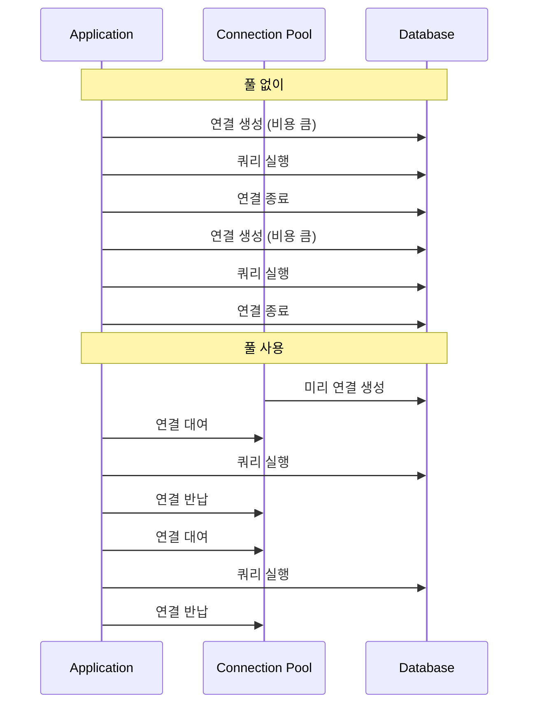
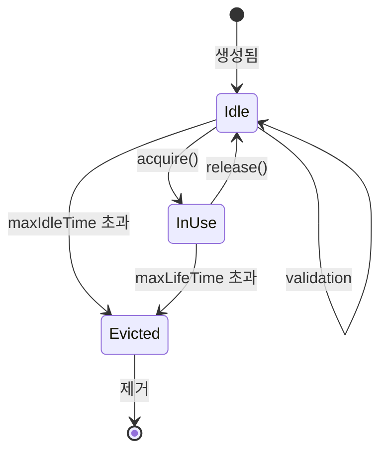

---
tags:
  - database
  - performance
---

Connection Pool은 데이터베이스 연결을 미리 생성해두고 재사용하는 기법이다. 연결 생성 비용을 줄이고 자원을 효율적으로 관리한다. R2DBC에서는 r2dbc-pool이 이 역할을 담당한다.

---

## 왜 필요한가

데이터베이스 연결 생성은 비용이 크다.

1. TCP 핸드셰이크 (3-way)
2. 인증 프로토콜
3. 세션 초기화
4. 캐릭터셋, 타임존 설정

매 요청마다 연결을 생성하고 닫으면 이 비용이 반복된다.



## r2dbc-pool

R2DBC 생태계의 표준 커넥션 풀이다.

```java
// 기존 ConnectionFactory 래핑
ConnectionFactory connectionFactory = ConnectionFactories.get("r2dbc:mysql://...");

ConnectionPoolConfiguration configuration = ConnectionPoolConfiguration.builder(connectionFactory)
    .maxSize(20)                        // 최대 커넥션 수
    .initialSize(5)                     // 시작 시 생성할 커넥션 수
    .maxIdleTime(Duration.ofMinutes(30)) // 유휴 커넥션 만료 시간
    .maxLifeTime(Duration.ofHours(1))   // 커넥션 최대 수명
    .maxAcquireTime(Duration.ofSeconds(5)) // 커넥션 획득 대기 시간
    .validationQuery("SELECT 1")        // 유효성 검사 쿼리
    .build();

ConnectionPool pool = new ConnectionPool(configuration);
```

### 사용 방법

`ConnectionPool`도 `ConnectionFactory`를 구현하므로 동일하게 사용한다.

```java
Mono.from(pool.create())
    .flatMap(connection -> {
        return Flux.from(connection.createStatement("SELECT * FROM users").execute())
            .flatMap(result -> result.map((row, meta) -> row.get("name", String.class)))
            .collectList()
            .doFinally(signal -> connection.close());  // 풀에 반납
    })
    .subscribe();
```

`connection.close()`는 실제로 연결을 닫지 않고 풀에 반납한다.

## 설정 옵션

| 옵션 | 설명 | 권장값 |
|------|------|--------|
| `maxSize` | 최대 커넥션 수 | CPU 코어 수 * 2 ~ 4 |
| `initialSize` | 초기 커넥션 수 | maxSize의 25% |
| `minIdle` | 최소 유휴 커넥션 | 0 또는 initialSize |
| `maxIdleTime` | 유휴 만료 시간 | 10~30분 |
| `maxLifeTime` | 최대 수명 | 30분~1시간 |
| `maxAcquireTime` | 획득 대기 시간 | 3~10초 |

## 내부 동작



### 커넥션 획득

```java
pool.create()  // Publisher<Connection> 반환
```

1. 유휴 커넥션이 있으면 즉시 반환
2. 없으면 새 커넥션 생성 (maxSize 이내)
3. maxSize에 도달하면 대기
4. maxAcquireTime 초과 시 에러

### 커넥션 반납

```java
connection.close()  // 풀에 반납
```

1. 유효성 검사 (선택적)
2. 상태 초기화
3. 풀에 반환

### 유효성 검사

연결이 여전히 살아있는지 확인한다.

```java
.validationQuery("SELECT 1")           // 쿼리로 검사
.validationDepth(ValidationDepth.LOCAL) // 또는 로컬 상태만 검사
```

## Spring Boot 통합

Spring Boot에서는 자동 설정을 통해 r2dbc-pool이 적용된다.

```yaml
spring:
  r2dbc:
    url: r2dbc:pool:mysql://localhost:3306/mydb
    username: user
    password: password
    pool:
      initial-size: 5
      max-size: 20
      max-idle-time: 30m
      validation-query: SELECT 1
```

## 모니터링

`ConnectionPool`은 메트릭을 제공한다.

```java
PoolMetrics metrics = pool.getMetrics().get();

int acquired = metrics.acquiredSize();    // 사용 중인 커넥션
int allocated = metrics.allocatedSize();  // 전체 할당된 커넥션
int idle = metrics.idleSize();           // 유휴 커넥션
int pending = metrics.pendingAcquireSize(); // 대기 중인 요청
```

## 주의사항

### 커넥션 누수

커넥션을 반납하지 않으면 풀이 고갈된다.

```java
// 잘못된 예 - close()가 호출되지 않을 수 있음
Mono.from(pool.create())
    .flatMap(conn -> conn.createStatement("SELECT 1").execute())
    .subscribe();

// 올바른 예 - 항상 close() 보장
Mono.from(pool.create())
    .flatMapMany(conn ->
        Flux.from(conn.createStatement("SELECT 1").execute())
            .doFinally(s -> conn.close())
    )
    .subscribe();

// 더 좋은 예 - using() 사용
Mono.usingWhen(
    pool.create(),
    conn -> Mono.from(conn.createStatement("SELECT 1").execute()),
    Connection::close
).subscribe();
```

### 적절한 풀 크기

너무 작으면 대기가 발생하고, 너무 크면 데이터베이스에 부하가 간다.

```
최적 크기 ≈ (코어 수 * 2) + 효과적인 디스크 스핀들 수
```

대부분의 경우 10~20개로 시작하여 모니터링하며 조정한다.

## References

- [r2dbc-pool GitHub](https://github.com/r2dbc/r2dbc-pool)
- [[ConnectionFactory]]
- [[R2DBC 동작 원리]]
