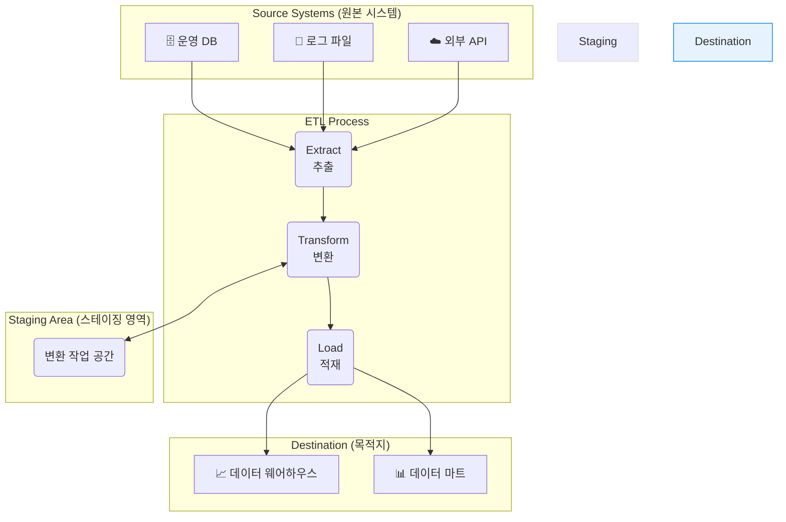

안녕하세요! 데이터 엔지니어링의 세계를 여행하다 보면 반드시 마주치게 되는 핵심 프로세스가 있습니다. 바로 **ETL**입니다. [[OLAP]]이나 [[데이터 웨어하우스]] 같은 데이터 분석 시스템을 구축하는 데 있어 뼈대와 같은 역할을 하죠.

"데이터 파이프라인", "데이터 통합"과 같은 용어를 들어보셨다면, 그 중심에 ETL이 있다고 보셔도 무방합니다. 이번 글에서는 ETL이 정확히 무엇이며, 어떤 단계로 이루어져 있는지 개발자의 시선으로 명확하게 파헤쳐 보겠습니다.

---

## 1. ETL (Extract, Transform, Load) 이란 무엇인가요?

**ETL**은 **Extract(추출), Transform(변환), Load(적재)**의 약자로, **다양한 소스에 흩어져 있는 데이터를 하나로 모아, 의미 있고 일관된 형태로 가공하여 최종 목적지에 저장하는 일련의 과정**을 의미합니다.

기업의 데이터는 한곳에 머무르지 않습니다. 서비스 운영 데이터베이스([[OLTP]] 시스템), 로그 파일, 외부 API, 파일 스토리지 등 여러 곳에 파편화되어 존재하죠. ETL은 이 파편화된 데이터 조각들을 모아 비즈니스 가치를 지닌 '보물 지도'로 만드는 연금술과 같습니다.

이 과정을 통해 데이터는 최종적으로 [[데이터 웨어하우스]]나 데이터 마트와 같은 분석용 스토리지에 저장되어, BI(Business Intelligence) 도구나 머신러닝 모델의 중요한 재료로 사용됩니다.

---

## 2. ETL의 3단계 프로세스

ETL 프로세스는 이름 그대로 추출, 변환, 적재라는 세 가지 단계를 순차적으로 거칩니다. 각 단계가 어떻게 유기적으로 연결되는지 시각화 자료와 함께 살펴보겠습니다.

### **1단계: Extract (추출)**

**추출(Extract)**은 ETL의 첫 번째 관문으로, **다양한 원본 시스템으로부터 필요한 데이터를 가져오는 단계**입니다. 여기서 핵심은 '필요한' 데이터를 선별하는 것입니다.

- **원본 시스템의 종류:**
    - **정형 데이터:** MySQL, PostgreSQL 같은 관계형 데이터베이스
    - **반정형 데이터:** JSON, XML, CSV 파일, 웹 서버 로그
    - **비정형 데이터:** 이미지, 텍스트 문서 (경우에 따라)
- **추출 방식:**
    - **전체 추출 (Full Extraction):** 원본 데이터를 처음 적재할 때나 데이터 양이 적을 때 사용합니다.
    - **증분 추출 (Incremental Extraction):** 마지막 추출 시점 이후로 변경되거나 추가된 데이터만 선택적으로 가져옵니다. 시스템 부하를 줄일 수 있어 가장 일반적으로 사용되는 방식입니다. (예: `updated_at` 타임스탬프 기준)

이 단계에서 추출된 데이터는 보통 원본 그대로의 '날것(Raw Data)' 상태이며, 곧바로 다음 단계인 '변환'을 위해 **스테이징 영역(Staging Area)**이라는 임시 공간으로 옮겨집니다.

### **2단계: Transform (변환)**

**변환(Transform)**은 **ETL의 심장**이라 불릴 만큼 가장 중요하고 복잡한 단계입니다. 스테이징 영역으로 가져온 데이터를 **분석에 적합한 형태로 가공하고 정제하는 모든 작업**이 여기서 이루어집니다.

이 단계의 주된 목표는 데이터의 **품질(Quality)**과 **일관성(Consistency)**을 확보하는 것입니다.

- **주요 변환 작업:**
    - **정제 (Cleansing):** 결측치(Null)를 채우거나, 오류 데이터를 수정/삭제합니다.
    - **표준화 (Standardization):** '서울', '서울특별시'처럼 제각각인 값을 '서울'로 통일하거나, 날짜/시간 형식을 일치시킵니다.
    - **통합 (Integration):** 여러 소스에서 온 데이터를 하나로 결합(Join)합니다. 예를 들어, 사용자 정보 테이블과 주문 정보 테이블을 합쳐 '어떤 사용자가 어떤 상품을 샀는지'에 대한 정보를 만듭니다.
    - **집계 (Aggregation):** 분석에 필요한 요약 데이터를 미리 계산합니다. 일별 매출 데이터를 월별, 분기별 매출 데이터로 집계하는 작업이 대표적입니다.
    - **새로운 속성 생성:** 기존 데이터를 조합하여 새로운 의미를 갖는 데이터를 만듭니다. (예: '매출액'과 '비용' 데이터로 '수익률' 계산)

이러한 변환 규칙들은 비즈니스 요구사항에 따라 결정되며, 잘 설계된 변환 로직은 데이터 분석의 정확성과 효율성을 극대화합니다.

### **3단계: Load (적재)**

**적재(Load)**는 변환 과정을 마친 데이터를 최종 목적지인 [[데이터 웨어하우스]]나 데이터 마트에 **저장하는 마지막 단계**입니다.

- **적재 방식:**
    - **전체 새로고침 (Full Refresh):** 기존 데이터를 모두 지우고 변환된 데이터 전체를 새로 쓰는 방식입니다. 간단하지만 데이터가 많을 경우 시간이 오래 걸립니다.
    - **증분 적재 (Incremental Load):** 변경된 데이터만 추가하거나 업데이트(Upsert)하는 방식입니다. OLAP 시스템에서 주로 사용되며, 데이터의 변경 이력을 추적 관리하는 데 용이합니다.

적재가 완료되면, 데이터는 비로소 분석가나 현업 사용자들이 BI 도구를 통해 자유롭게 탐색하고 인사이트를 얻을 수 있는 준비된 상태가 됩니다.

---

## 4. ETL, 그리고 ELT

최근 클라우드 기술이 발전하면서 ETL과 순서가 조금 다른 **ELT(Extract, Load, Transform)** 라는 방식도 주목받고 있습니다.

ELT는 원본 데이터를 일단 그대로 목적지(주로 데이터 레이크)에 적재(Load)한 뒤, 데이터 웨어하우스의 강력한 컴퓨팅 파워를 이용해 필요할 때마다 데이터를 변환(Transform)하는 방식입니다. 원본 데이터를 모두 보존할 수 있고, 변환 로직의 유연성이 높다는 장점이 있습니다.

두 방식의 차이점과 각각의 장단점에 대해서는 ETL과 ELT의 차이점 문서에서 더 자세히 다루어 보겠습니다.

---

## 마무리하며

지금까지 데이터 엔지니어링의 근간을 이루는 **ETL 프로세스**에 대해 알아보았습니다. ETL은 단순히 데이터를 복사-붙여넣기 하는 작업이 아닙니다. **여러 곳에 흩어진 원석 같은 데이터를 수집하고, 세공하여, 누구나 그 가치를 알아볼 수 있는 보석으로 만드는 정교한 파이프라인**입니다.

개발자로서 ETL의 원리를 이해한다면, 데이터 기반 애플리케이션을 만들거나 대규모 데이터 시스템 아키텍처를 설계할 때 훨씬 더 넓은 시야를 가질 수 있게 될 것입니다. 데이터가 흐르는 길을 직접 설계하고 최적화하는 경험은 데이터 엔지니어로서의 중요한 역량이 될 것입니다.