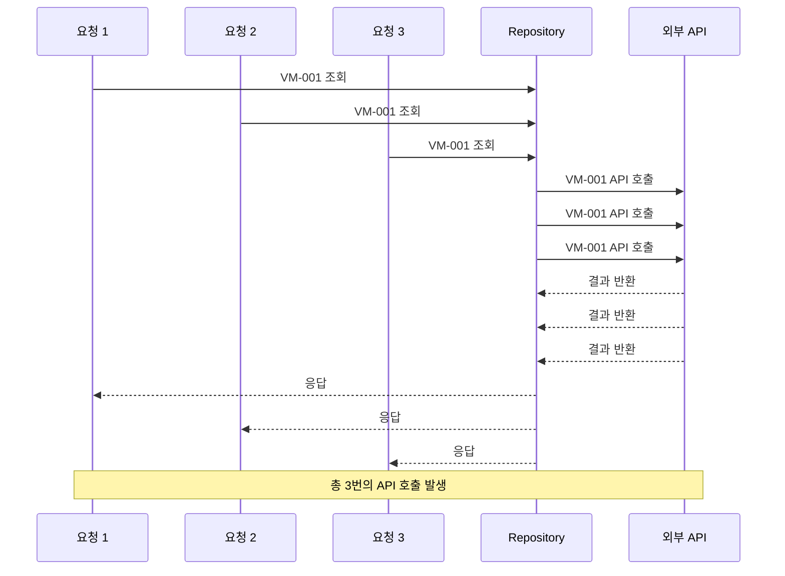
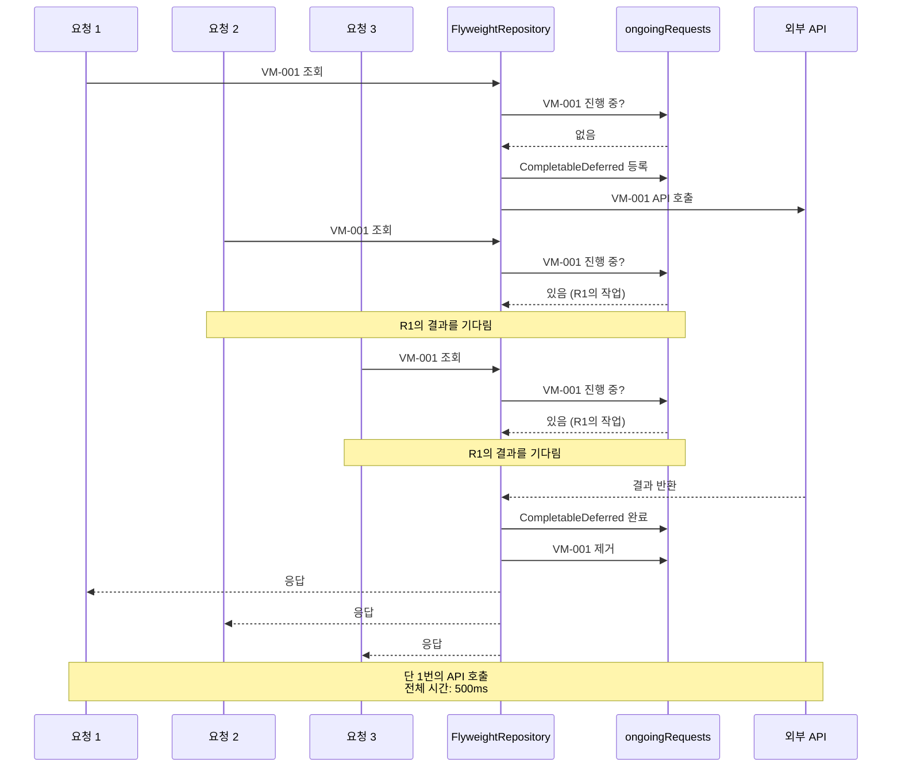

클라우드 VM 정보를 조회하는 API는 외부 시스템과 통신하기 때문에 응답 시간이 오래 걸립니다. 문제는 동일한 VM 정보를 여러 요청이 동시에 조회할 때, 각 요청마다 별도의 API 호출이 발생한다는 점입니다. 이 글에서는 **[[플라이웨이트 패턴(Flyweight Pattern)]]** 과 [[코루틴(Coroutine)]]을 활용하여 진행 중인 요청의 결과를 재사용함으로써 중복 API 호출을 제거한 방법을 소개합니다.
## 문제 
클라우드 VM 관리 시스템에서는 하나의 사용자 요청을 처리하기 위해 여러 개의 VM 정보를 조회해야 하는 경우가 빈번하게 발생합니다. 특히 대시보드나 모니터링 화면처럼 여러 컴포넌트가 동시에 로드되는 상황에서는 **동일한 VM에 대한 조회 요청이 동시에 여러 번 발생**합니다.

### 구체적인 문제점

1. **중복 API 호출**: 5개의 동시 요청이 같은 VM 정보를 조회하면, 외부 API가 5번 호출됩니다.
2. **긴 응답 시간**: 외부 VM 관리 시스템의 응답 시간이 길어, 중복 호출은 시스템 전체의 응답 속도를 크게 저하시킵니다.
3. **자원 낭비**: 불필요한 네트워크 트래픽과 외부 시스템 부하가 증가합니다.



---

## 검토한 해결 방안들

이 문제를 해결하기 위해 여러 방안을 검토했습니다.

### 1. 캐싱(Caching)

[[캐싱(Caching)]]을 사용하여 조회 결과를 일정 시간 동안 메모리에 저장하는 방법입니다.

**장점**
- 구현이 간단합니다.
- 반복적인 조회에 효과적입니다.

**단점**
- **캐시 TTL 설정의 딜레마**: TTL을 짧게 설정하면 효과가 적고, 길게 설정하면 데이터 **정합성 문제**가 발생합니다.
- **동시 요청 미해결**: 캐시가 비어있을 때 동시에 들어온 요청들은 여전히 중복 호출을 발생시킵니다.
- **메모리 관리**: VM 정보가 크고 개수가 많을 경우 메모리 부담이 증가합니다.

### 2. 전역 락(Global Lock)

메서드 전체에 [[동기화(Synchronization)]]를 적용하여 한 번에 하나의 요청만 처리하는 방법입니다.

**장점**
- 중복 호출을 확실하게 방지할 수 있습니다.

**단점**
- **성능 저하**: 서로 다른 VM을 조회하는 요청들도 순차적으로 처리되어 병렬성이 완전히 사라집니다.
- **확장성 문제**: 요청이 많아질수록 대기 시간이 기하급수적으로 증가합니다.

### 3. 요청 병합(Request Coalescing) + Flyweight 패턴

**동일한 파라미터로 진행 중인 요청이 있을 때, 새로운 요청은 기존 요청의 결과를 기다리는** 방식입니다. 이는 [[플라이웨이트 패턴(Flyweight Pattern)]]의 변형으로, 객체 대신 **진행 중인 비동기 작업을 공유**합니다.

**장점**
- **선택적 중복 제거**: 동일한 파라미터의 요청만 병합하므로 다른 요청들은 병렬로 처리됩니다.
- **메모리 효율성**: 결과를 장기 저장하지 않으므로 메모리 부담이 없습니다.
- **실시간성 보장**: 모든 요청이 최신 데이터를 받습니다.

**단점**
- 구현 복잡도가 상대적으로 높습니다.

---

## 채택한 해결방안: Flyweight 패턴 기반 요청 병합

세 번째 방안인 **요청 병합 방식**을 채택했습니다. 이 방식은 성능 향상, 자원 효율성, 데이터 정합성을 모두 충족하며, 우리 시스템의 요구사항에 가장 적합했습니다.

### 핵심 아이디어

1. **파라미터별 진행 상황 추적**: 각 조회 파라미터(VM ID, IP 접두사 등)마다 현재 진행 중인 요청이 있는지 추적합니다.
2. **결과 공유**: 동일한 파라미터로 요청이 들어오면 새로운 API 호출 대신 진행 중인 작업의 결과를 기다립니다.
3. **자동 정리**: 작업이 완료되면 즉시 추적 정보를 제거하여 메모리를 효율적으로 관리합니다.



### 구현의 핵심 요소

#### 1. CompletableDeferred를 이용한 비동기 결과 공유
기 결과 공유

**CompletableDeferred**는 코루틴에서 제공하는 Deferred의 구현체로, 미래에 완료될 값을 나타냅니다. 이를 통해 여러 코루틴이 하나의 작업 결과를 안전하게 공유할 수 있습니다.

```kotlin
private val ongoingVmRequests = ConcurrentHashMap<VmId, CompletableDeferred<Vm?>>()
```

- `ConcurrentHashMap`: Thread-Safe한 맵으로, 동시성 환경에서 안전하게 사용할 수 있습니다.
- `CompletableDeferred<Vm?>`: 비동기 작업의 결과를 담을 컨테이너입니다.

#### 2. Mutex를 활용한 동시성 제어

Mutex 는 코루틴에서 제공하는 동기화 도구로, 특정 코드 블록에 동시에 하나의 코루틴만 진입할 수 있도록 보장합니다.

```kotlin
private val vmRequestMutex = Mutex()
```

Mutex를 사용하여 `CompletableDeferred` 등록 과정에서 발생할 수 있는 [[경쟁 상태(Race Condition)]]를 방지합니다.

#### 3. 제네릭 함수로 중복 로직 제거

모든 조회 메서드가 동일한 패턴을 따르므로, 제네릭 함수 `awaitOrLaunch`로 공통 로직을 추출했습니다.

```kotlin
private suspend fun <K, T> awaitOrLaunch(  
    key: K,  
    cache: ConcurrentHashMap<K, CompletableDeferred<T>>,  
    mutex: Mutex,  
    block: suspend () -> T  
): T {  
    cache[key]?.let { existing -> return existing.await() }  
  
    val (deferred, isNewRequest) = mutex.withLock {  
        cache[key]?.let { existing -> return@withLock existing to false }  
        CompletableDeferred<T>().also { cache[key] = it } to true  
    }  
  
    if (!isNewRequest) {  
        return deferred.await()  
    }  
  
    return try {  
        block().also { result ->  
            deferred.complete(result)  
        }  
    } catch (t: Throwable) {  
        deferred.completeExceptionally(t)  
        throw t  
    } finally {  
        cache.remove(key, deferred)  
    }  
}
```

이 함수는 다음과 같은 흐름으로 동작합니다:

1. **첫 번째 확인**: 캐시에 진행 중인 요청이 있는지 확인합니다.
2. **락 획득**: Mutex를 통해 임계 영역에 진입합니다.
3. **두 번째 확인**: Double-Checked Locking 패턴을 적용하여 락 획득 중 다른 코루틴이 등록했을 가능성을 재확인합니다.
4. **작업 실행**: 새로운 요청이면 `CompletableDeferred`를 등록하고 실제 API 호출을 수행합니다.
5. **결과 공유**: 작업이 완료되면 모든 대기 중인 코루틴에 결과를 전달합니다.
6. **자동 정리**: finally 블록에서 캐시를 정리합니다.

### 상세 구현 분석

#### findById 메서드

단일 VM 조회 메서드입니다. VmId를 키로 사용하여 진행 중인 요청을 추적합니다.

```kotlin
override suspend fun findById(id: VmId): Vm? {
    return awaitOrLaunch(id, ongoingVmRequests, vmRequestMutex) {
        proxyVmRepository.findById(id)
    }
}
```

#### findVmIdByIpv4PrefixAndType 메서드

두 개의 파라미터를 조합하여 키를 생성하는 경우입니다. `Pair`를 사용하여 복합 키를 만듭니다.

```kotlin
override suspend fun findVmIdByIpv4PrefixAndType(ipv4Prefix: Ipv4Prefix, vmType: VmType): List<VmId> {
    val requestKey = Pair(ipv4Prefix, vmType)
    return awaitOrLaunch(requestKey, ongoingPrefixAndTypeRequests, prefixAndTypeRequestMutex) {
        proxyVmRepository.findVmIdByIpv4PrefixAndType(ipv4Prefix, vmType)
    }
}
```

#### findAll 메서드

파라미터가 없는 전체 조회의 경우, 별도의 플래그와 단일 `CompletableDeferred`로 관리합니다.

```kotlin
override suspend fun findAll(): List<Vm> {
    return findAllRequestMutex.withLock {
        if (isFindAllInProgress) {
            ongoingFindAllRequest.await()
        } else {
            isFindAllInProgress = true
            try {
                val result = proxyVmRepository.findAll()
                ongoingFindAllRequest.complete(result)
                result
            } catch (t: Throwable) {
                ongoingFindAllRequest.completeExceptionally(t)
                throw t
            } finally {
                isFindAllInProgress = false
            }
        }
    }
}
```

이 메서드는 `awaitOrLaunch`를 사용하지 않고 직접 구현되어 있습니다. 그 이유는 `findAll`은 파라미터가 없어서 항상 동일한 단일 키를 사용하므로, 별도의 맵 대신 단순한 플래그로 관리하는 것이 더 효율적이기 때문입니다.
