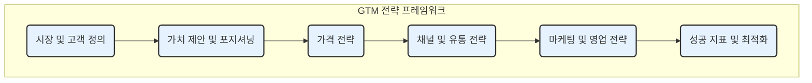

GTM(Go-to-Market) 전략은 신제품이나 서비스를 시장에 성공적으로 출시하고, 목표 고객에게 도달하여 경쟁 우위를 확보하기 위한 전반적인 실행 계획을 의미합니다. 이는 단순히 '어떻게 팔 것인가'를 넘어 '누구에게', '어떤 가치를', '어떤 방법으로' 전달할 것인지를 총체적으로 다루는 비즈니스의 핵심 로드맵입니다.

잘 설계된 GTM 전략은 실패의 위험을 줄이고, 자원을 효율적으로 사용하며, 조직 전체가 공동의 목표를 향해 나아가도록 돕습니다.

---

## GTM 전략의 핵심 구성 요소

효과적인 GTM 전략은 보통 다음과 같은 핵심 요소들을 포함하며, 이들은 서로 유기적으로 연결되어야 합니다. [[MECE 원칙]]에 입각하여 중복과 누락 없이 전략을 수립하는 것이 중요합니다.

### 1. 시장 및 고객 정의 (Market Definition)

모든 전략의 출발점입니다. 우리가 누구를 위해 제품을 만드는지를 명확히 해야 합니다.

- **타겟 시장**: 어떤 시장에 진입할 것인가? (예: 교육 시장, 핀테크 시장)
- **[[이상적인 고객 프로필(ICP)]]**: 우리 제품/서비스로부터 가장 큰 가치를 얻을 수 있는 고객은 누구인가? 기업의 규모, 산업, 지역, 특정 문제점 등을 기준으로 구체화합니다.
- **고객 페르소나**: ICP를 기반으로 실제 사용자의 특성, 목표, 문제점 등을 가상 인물로 상세히 묘사하여 고객에 대한 이해도를 높입니다.

### 2. 가치 제안 및 포지셔닝 (Value Proposition & Positioning)

고객이 왜 경쟁사가 아닌 우리 제품을 선택해야 하는지에 대한 명확한 답을 제시해야 합니다.

- **문제 해결**: 우리 제품이 고객의 어떤 'Pain Point(고충점)'를 해결해 주는가?
- **핵심 가치 제안**: 고객에게 제공하는 독특하고 차별화된 가치는 무엇인가? (예: 시간 절약, 비용 절감, 생산성 향상)
- **[[제품-시장 적합성(Product-Market Fit)]]**: 우리 제품이 시장이 원하는 가치를 실제로 제공하고 있는지 검증하는 과정입니다.
- **메시징 및 포지셔닝**: 정의된 가치를 어떤 메시지로 포장하여 시장에 우리 브랜드를 각인시킬 것인지 결정합니다.

### 3. 가격 전략 (Pricing Strategy)

제품의 가치, 시장 상황, 비즈니스 목표를 모두 고려하여 가격을 결정합니다.

- **가격 모델**: 구독 모델, 사용량 기반 모델, 일회성 구매 모델 등 제품 특성에 맞는 모델을 선택합니다.
- **가격 수준**: 경쟁사 가격, 고객이 느끼는 가치, 원가 등을 고려하여 구체적인 가격을 설정합니다.

### 4. 채널 및 유통 전략 (Channels & Distribution)

제품을 고객에게 어떻게 전달할 것인지를 결정합니다.

- **판매 채널**: 직접 영업팀, 내부 영업팀(Inside Sales), 파트너사, 온라인 판매 등 가장 효율적인 채널을 선택합니다.
- **유통 방식**: B2C와 B2B, 온라인과 오프라인 등 고객이 제품을 가장 쉽게 접하고 구매할 수 있는 경로를 설계합니다.

### 5. 마케팅 및 영업 전략 (Marketing & Sales Strategy)

잠재 고객의 인지도를 높이고 구매로 전환시키기 위한 구체적인 활동 계획입니다.

- **마케팅 계획**: 콘텐츠 마케팅, SEO, 광고, 소셜 미디어 등 어떤 활동을 통해 잠재 고객을 유치할 것인지 계획합니다.
- **영업 프로세스**: 잠재 고객 발굴부터 계약 체결까지의 과정을 정의하고, 각 단계에서 필요한 활동을 계획합니다.
- **영업 활성화(Sales Enablement)**: 영업팀이 더 효율적으로 판매 활동을 할 수 있도록 필요한 교육, 콘텐츠, 도구 등을 지원합니다.

### 6. 성공 지표 및 최적화 (Metrics & Optimization)

전략의 성공 여부를 측정하고 지속적으로 개선하기 위한 기준을 마련합니다.

- **핵심 성과 지표(KPIs)**: 고객 획득 비용(CAC), 고객 생애 가치(LTV), 전환율 등 전략의 성과를 측정할 핵심 지표를 설정합니다.
- **피드백 루프**: 시장과 고객의 피드백을 수집하고 분석하여 전략을 지속적으로 수정하고 최적화합니다.

---

## GTM 전략의 중요성

성공적인 GTM 전략은 단순히 제품을 출시하는 것을 넘어, 비즈니스의 지속 가능한 성장을 위한 기반을 마련합니다. 시장과 고객에 대한 깊은 이해를 바탕으로 모든 부서가 한 방향으로 움직일 때, 기업은 치열한 경쟁 속에서도 자신만의 길을 개척하고 목표를 달성할 수 있습니다.