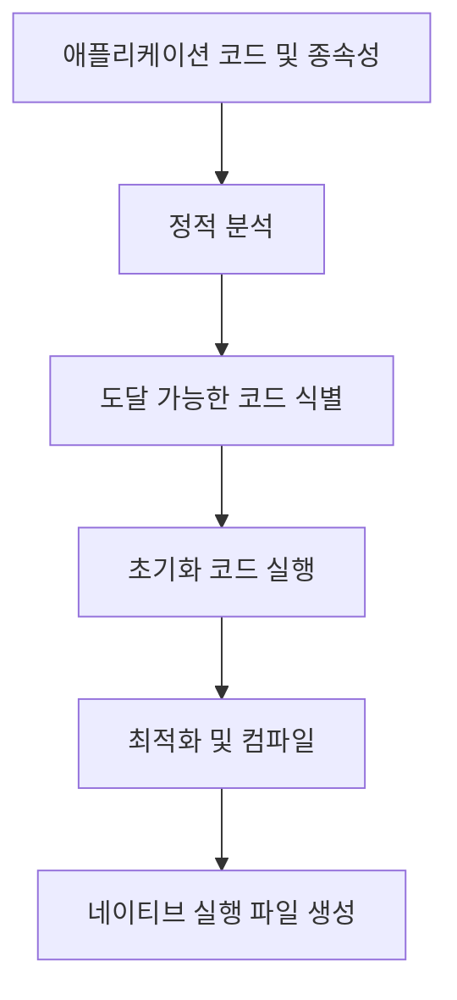

GraalVM Native Image는 Java 애플리케이션을 독립적인 네이티브 실행 파일로 변환하는 기술입니다. 전통적인 JVM 기반 애플리케이션과 달리, Native Image는 애플리케이션 클래스, 종속성, JDK 클래스 및 JVM 코드를 빌드 시점에 정적으로 분석하여 독립적으로 실행 가능한 바이너리로 컴파일합니다. 이를 통해 시작 시간 단축, 메모리 사용량 감소, 배포 단순화 등 다양한 이점을 제공합니다.

## Native Image의 작동 원리

Native Image 생성은 [[AOT(Ahead-of-Time) 컴파일]]을 기반으로 하며, 다음과 같은 주요 단계로 진행됩니다:



1. **정적 분석**: 애플리케이션의 모든 코드와 종속성을 분석하여 도달 가능한 메서드와 필드를 식별합니다.
2. **클로저 계산**: 애플리케이션의 진입점으로부터 시작하여 접근 가능한 모든 코드를 결정합니다.
3. **초기화 분할**: 빌드 시점에 실행할 수 있는 클래스 초기화와 런타임으로 연기해야 하는 초기화를 구분합니다.
4. **최적화 컴파일**: 식별된 모든 코드를 네이티브 코드로 변환합니다.
5. **링킹**: 필요한 런타임 지원 코드와 링크하여 최종 실행 파일을 생성합니다.

이 과정을 통해 Native Image는 Java 애플리케이션을 실행하는 데 필요한 최소한의 코드만 포함한 효율적인 바이너리를 생성합니다.

## Native Image의 장점

1. **빠른 시작 시간**: 기존 JVM 애플리케이션 대비 10배 이상 빠른 시작 속도를 제공합니다. 이는 특히 서버리스 환경이나 마이크로서비스 아키텍처에서 중요한 이점입니다.
2. **낮은 메모리 사용량**: 메모리 사용량이 크게 감소하여 리소스 효율성이 높아집니다.
3. **피크 성능 즉시 도달**: JIT 컴파일 없이 처음부터 최적화된 성능을 제공합니다.
4. **패키징 단순화**: JRE 없이 독립적으로 배포 가능한 단일 바이너리를 생성합니다.
5. **보안 향상**: 공격 표면이 감소하고, 필요한 코드만 포함되어 보안이 강화됩니다.

## Native Image의 제약 사항

Native Image는 정적 분석을 기반으로 하기 때문에 몇 가지 중요한 제약이 있습니다:

1. **제한된 리플렉션 지원**: 빌드 시점에 알 수 없는 리플렉션 사용은 명시적으로 구성해야 합니다.
2. **동적 클래스 로딩 제한**: 런타임에 새로운 클래스를 로드하는 기능이 제한됩니다.
3. **JNI 사용 제한**: 네이티브 라이브러리 사용을 위한 추가 구성이 필요합니다.
4. **동적 프록시 제한**: 런타임에 생성되는 프록시 클래스를 미리 지정해야 합니다.
5. **리소스 액세스 제한**: 애플리케이션 리소스에 대한 접근을 명시적으로 설정해야 합니다.

이러한 제약 사항에 대한 자세한 내용과 해결 방법은 Native Image 제약사항 해결 방법을 참고해주세요.

## Native Image 구성 파일

리플렉션, 동적 프록시, 리소스 액세스 등의 동적 기능을 사용하기 위해 다음과 같은 구성 파일을 제공해야 합니다:

1. **reflection-config.json**: 리플렉션을 통해 접근할 클래스, 메서드, 필드를 지정합니다.
    
    ```json
    [
      {
        "name": "com.example.MyClass",
        "allDeclaredConstructors": true,
        "allPublicConstructors": true,
        "allDeclaredMethods": true,
        "allPublicMethods": true,
        "allDeclaredFields": true,
        "allPublicFields": true
      }
    ]
    ```
    
2. **proxy-config.json**: 동적으로 생성할 프록시 인터페이스를 지정합니다.
    
    ```json
    [
      ["com.example.MyInterface"]
    ]
    ```
    
3. **resource-config.json**: 번들로 포함할 리소스를 지정합니다.
    
    ```json
    {
      "resources": [
        {"pattern": ".*\\.properties$"}
      ],
      "bundles": [
        {"name": "messages.Messages"}
      ]
    }
    ```
    
4. **jni-config.json**: JNI(Java Native Interface)를 통해 접근할 요소를 지정합니다.
    

이러한 구성 파일은 `META-INF/native-image/` 디렉토리에 위치시켜 자동으로 인식되도록 하거나, Native Image 빌드 명령에 직접 지정할 수 있습니다.

## 트레이싱 에이전트를 통한 자동 구성

수동으로 구성 파일을 작성하는 대신, GraalVM의 트레이싱 에이전트를 사용하여 애플리케이션의 동적 기능 사용을 자동으로 감지하고 필요한 구성을 생성할 수 있습니다:

```bash
java -agentlib:native-image-agent=config-output-dir=META-INF/native-image -jar application.jar
```

이 명령은 애플리케이션을 실행하면서 리플렉션, 프록시, 리소스 액세스 등의 사용을 추적하여 해당 구성 파일을 생성합니다. 운영 환경과 유사한 시나리오에서 애플리케이션을 실행하여 가능한 많은 경로를 테스트하는 것이 중요합니다.

자세한 트레이싱 에이전트 사용 방법은 GraalVM 트레이싱 에이전트 활용법을 참고해주세요.

## Native Image 빌드 방법

### 기본 명령줄 빌드

GraalVM SDK를 설치한 후, 다음 명령을 사용하여 JAR 파일을 네이티브 이미지로 컴파일할 수 있습니다:

```bash
native-image [옵션] -jar application.jar
```

주요 옵션은 다음과 같습니다:

- `-H:Name=<이름>`: 출력 파일 이름 지정
- `-H:+ReportExceptionStackTraces`: 예외 스택 트레이스 포함
- `--no-fallback`: 네이티브 이미지 생성이 실패할 경우 폴백 이미지 생성하지 않음
- `--verbose`: 자세한 빌드 정보 출력
- `-H:+PrintAnalysisCallTree`: 분석 호출 트리 출력 (디버깅용)
- `-H:IncludeResources=<패턴>`: 포함할 리소스 지정
- `-H:ReflectionConfigurationFiles=<파일>`: 리플렉션 구성 파일 지정

### Maven을 통한 빌드

Maven 프로젝트에서는 `native-image-maven-plugin`을 사용하여 네이티브 이미지를 빌드할 수 있습니다:

```xml
<plugin>
    <groupId>org.graalvm.nativeimage</groupId>
    <artifactId>native-image-maven-plugin</artifactId>
    <version>21.1.0</version>
    <executions>
        <execution>
            <goals>
                <goal>native-image</goal>
            </goals>
            <phase>package</phase>
        </execution>
    </executions>
    <configuration>
        <mainClass>com.example.Application</mainClass>
        <buildArgs>
            --no-fallback
            -H:+ReportExceptionStackTraces
        </buildArgs>
    </configuration>
</plugin>
```

### Gradle을 통한 빌드

Gradle 프로젝트에서는 `gradle-graal` 플러그인을 사용할 수 있습니다:

```groovy
plugins {
    id 'org.graalvm.buildtools.native' version '0.9.13'
}

graalvmNative {
    binaries {
        main {
            mainClass = 'com.example.Application'
            buildArgs.add('--no-fallback')
            buildArgs.add('-H:+ReportExceptionStackTraces')
        }
    }
}
```

빌드 도구 통합에 대한 자세한 내용은 GraalVM 빌드 도구 통합을 참고해주세요.

## 스프링 부트와 Native Image

Spring Boot 3.0 이상에서는 Native Image 지원이 크게 개선되었습니다. Spring Boot 애플리케이션을 네이티브 이미지로 빌드하는 방법은 다음과 같습니다:

### Maven을 사용한 빌드

```bash
./mvnw spring-boot:build-image -Pnative
```

### Gradle을 사용한 빌드

```bash
./gradlew bootBuildImage --imageName=myapp
```

Spring Boot는 내부적으로 Spring [[AOT(Ahead-of-Time) 컴파일]] 처리를 통해 네이티브 이미지 생성에 필요한 데이터를 자동으로 생성합니다. 이 과정에서 다음과 같은 작업이 수행됩니다:

1. **리플렉션 힌트 생성**: 스프링의 리플렉션 사용을 분석하여 구성 파일 생성
2. **프록시 클래스 사전 생성**: 동적 프록시 대신 정적 프록시 클래스 생성
3. **리소스 패턴 구성**: 필요한 리소스 패턴 식별 및 구성
4. **초기화 최적화**: 빌드 시간과 런타임 초기화 코드 분리

스프링 부트의 Native Image 지원에 대한 자세한 내용은 [[스프링 부트 네이티브 지원]]을 참고해주세요.

## Native Image 디버깅 및 모니터링

네이티브 이미지로 컴파일된 애플리케이션의 디버깅 및 모니터링은 일반 Java 애플리케이션과 다소 다릅니다:

### 디버깅 방법

1. **디버그 심볼 포함**: 디버그 정보를 포함한 네이티브 이미지 빌드
    
    ```bash
    native-image -g -jar application.jar
    ```
    
2. **네이티브 디버거 사용**: GDB 또는 LLDB와 같은 네이티브 디버거 활용
    
    ```bash
    gdb ./application
    ```
    
3. **Java 디버깅 프로토콜 활성화**: JDWP를 통한 원격 디버깅 지원 (제한적)
    
    ```bash
    native-image -jar application.jar -H:+IncludeJDWPAgent
    ./application -agentlib:jdwp=transport=dt_socket,server=y,suspend=y,address=8000
    ```
    

### 모니터링 옵션

1. **JFR(Java Flight Recorder)**: 제한된 JFR 기능 지원
    
    ```bash
    native-image -jar application.jar -H:+AllowVMInspection
    ./application -XX:+FlightRecorder -XX:StartFlightRecording=...
    ```
    
2. **JMX 지원**: 일부 JMX 기능 활성화
    
    ```bash
    native-image -jar application.jar -H:+AllowVMInspection -H:+JMX
    ```
    
3. **사용자 정의 메트릭**: 애플리케이션 내에서 Micrometer 등의 라이브러리를 사용하여 메트릭 수집
    

Native Image 디버깅에 대한 자세한 내용은 Native Image 디버깅 기법을 참고해주세요.

## Native Image 최적화 기법

네이티브 이미지 성능과 크기를 최적화하기 위한 몇 가지 주요 기법이 있습니다:

1. **불필요한 리플렉션 제거**: 리플렉션 사용을 최소화하여 이미지 크기 감소 및 성능 향상
2. **정적 초기화 활용**: 가능한 많은 초기화 코드를 빌드 시점으로 이동
    
    ```bash
    native-image -jar application.jar --initialize-at-build-time=com.example
    ```
    
3. **사용하지 않는 코드 제거**: `-H:+RemoveSaturatedTypeFlows` 옵션을 통한 추가 최적화
4. **C 라이브러리 정적 링킹**: 필요한 경우 외부 종속성을 정적으로 링크하여 호환성 개선
5. **특정 플랫폼 최적화**: 타겟 플랫폼에 맞춘 최적화 플래그 사용
    
    ```bash
    native-image -jar application.jar -march=native
    ```
    

최적화 기법에 대한 자세한 내용은 Native Image 최적화 전략을 참고해주세요.

## Native Image 활용 사례

GraalVM Native Image는 다양한 시나리오에서 효과적으로 활용될 수 있습니다:

1. **마이크로서비스**: 빠른 시작 시간과 낮은 메모리 사용량으로 컨테이너 환경에 적합
2. **서버리스 함수**: AWS Lambda, Azure Functions 등 서버리스 환경에서 콜드 스타트 시간 단축
3. **CLI 도구**: Picocli, Micronaut 등을 사용한 명령줄 도구 개발
4. **엣지 컴퓨팅**: 제한된 리소스 환경에서 Java 애플리케이션 실행
5. **임베디드 시스템**: 하드웨어 자원이 제한적인 임베디드 장치에서 사용

각 활용 사례별 장단점과 구현 예시는 Native Image 활용 사례 연구를 참고해주세요.

## 실전 예제: 스프링 부트 애플리케이션의 Native Image 변환

다음은 스프링 부트 REST API 애플리케이션을 Native Image로 변환하는 전체 과정입니다:

1. **프로젝트 설정**: `spring-boot-starter-parent` 버전 3.0 이상 사용
2. **GraalVM 네이티브 빌드 플러그인 추가**:
3. **리플렉션 힌트 추가**: 필요한 경우 수동으로 힌트 파일 작성
4. **트레이싱 에이전트로 구성 생성**: 테스트 실행을 통한 구성 파일 자동 생성
5. **네이티브 이미지 빌드**: Maven/Gradle 명령으로 빌드
6. **컨테이너 이미지 생성**: Docker를 통한 배포 이미지 생성
7. **성능 테스트 및 최적화**: 시작 시간, 메모리 사용량, 응답 시간 측정 및 개선

이 과정에 대한 자세한 단계별 가이드는 스프링 부트 Native Image 변환 가이드를 참고해주세요.

## 결론

GraalVM Native Image는 Java 애플리케이션 배포 방식에 혁신을 가져왔습니다. 빠른 시작 시간, 낮은 메모리 사용량, 향상된 보안성 등의 이점은 클라우드 네이티브 및 서버리스 환경에서 특히 가치가 있습니다.

하지만 모든 애플리케이션이 Native Image에 적합한 것은 아닙니다. 동적 언어 기능을 많이 사용하거나, 런타임에 코드를 생성하는 애플리케이션의 경우 추가 구성이 필요하거나 일부 제약이 있을 수 있습니다.

애플리케이션의 특성과 요구사항을 고려하여 Native Image 기술의 적용 여부를 결정하고, 필요한 경우 점진적으로 도입하는 것이 바람직합니다. 또한 지속적인 테스트와 성능 모니터링을 통해 최적의 결과를 얻을 수 있도록 하는 것이 중요합니다.

## 참고 자료

- GraalVM Native Image 공식 문서(https://www.graalvm.org/reference-manual/native-image/)
- Spring Native 공식 문서(https://docs.spring.io/spring-native/docs/current/reference/htmlsingle/)
- "Native Java: GraalVM Native Image" - Oleg Šelajev
- "Practical Java Development with GraalVM" - Scott Thompson
- "GraalVM Native Image Comprehensive Guide" - Oracle GraalVM Team