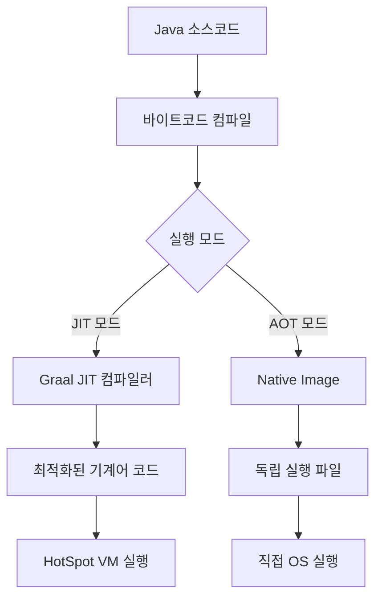

# GraalVM

GraalVM은 Oracle에서 개발한 고성능 런타임으로, 기존 JDK의 기능을 확장하여 향상된 성능과 다양한 언어 지원을 제공하는 플랫폼입니다. GraalVM의 가장 주목할 만한 특징은 [[AOT(Ahead-of-Time) 컴파일]]을 통한 Native Image 생성 기능입니다. 이 기능으로 Java 애플리케이션을 독립적인 실행 파일로 컴파일하여 시작 시간과 메모리 사용량을 크게 개선할 수 있습니다.

GraalVM을 이해하기 위해서는 먼저 [[JIT(Just-In-Time) 컴파일]]과 같은 전통적인 Java 실행 모델에 대한 이해가 필요합니다.

## GraalVM의 구성 요소

GraalVM은 다음과 같은 주요 구성 요소로 이루어져 있습니다:

1. **Graal 컴파일러**: 고급 JIT 컴파일러로, HotSpot VM의 C2 컴파일러를 대체합니다.
2. **네이티브 이미지(Native Image)**: Java 코드를 기본 실행 파일로 변환하는 도구입니다.
3. **Truffle 프레임워크**: 다양한 언어 구현을 위한 인터프리터 개발 프레임워크입니다.
4. **다국어 지원(Polyglot)**: Java, JavaScript, Python, R, Ruby 등 여러 프로그래밍 언어를 함께 실행할 수 있는 기능을 제공합니다.
5. **LLVM 런타임**: C/C++와 같은 LLVM 기반 언어를 지원합니다.

## GraalVM vs 전통적인 JVM

GraalVM과 전통적인 JVM의 가장 큰 차이점은 컴파일 방식과 실행 모델에 있습니다. 자세한 비교는 [[GraalVM vs 전통적인 JVM 비교]]를 참고해주세요.

## GraalVM의 동작 아키텍처

GraalVM의 내부 동작 구조를 이해하기 위해 아래 다이어그램을 참고해주세요.



## Native Image 개요

Native Image는 GraalVM의 가장 혁신적인 기능 중 하나로, Java 애플리케이션을 독립적인 네이티브 실행 파일로 변환합니다. 이 과정에서 애플리케이션과 필요한 종속성, JDK 라이브러리, JVM 구성 요소를 분석하여 하나의 실행 파일로 컴파일합니다.

Native Image 생성 과정에서 주요 단계는 다음과 같습니다:

1. **정적 분석**: 애플리케이션 클래스 경로를 분석하여 접근 가능한 모든 코드를 식별합니다.
2. **초기화 시간 분석**: 컴파일 시간에 실행할 수 있는 초기화 코드를 결정합니다.
3. **AOT 컴파일**: 모든 코드를 네이티브 코드로 컴파일합니다.
4. **이미지 생성**: 필요한 리소스와 메타데이터를 포함한 독립 실행 파일을 생성합니다.

Native Image 컴파일 시 고려해야 할 제약 사항과 최적화 방법에 대한 자세한 내용은 [[Native Image 제약사항과 최적화]]를 참고해주세요.

## GraalVM Native Image 사용 방법

GraalVM Native Image를 사용하여 Java 애플리케이션을 컴파일하는 기본 과정은 다음과 같습니다:

```bash
# Native Image 도구 설치
gu install native-image

# 애플리케이션 JAR 파일을 네이티브 이미지로 컴파일
native-image -jar application.jar
```

Maven이나 Gradle과 같은 빌드 도구를 사용하는 경우, 플러그인을 통해 빌드 프로세스에 통합할 수 있습니다. 자세한 설정 방법은 [[GraalVM 빌드 도구 통합]]을 참고해주세요.

## 리플렉션과 동적 프록시 처리

Java 애플리케이션은 종종 리플렉션, 동적 프록시, 리소스 접근 등 동적 기능을 사용합니다. 이러한 기능들은 정적 분석만으로는 완전히 파악하기 어렵기 때문에, Native Image 생성 시 추가 설정이 필요합니다.

GraalVM은 이를 위해 다음과 같은 설정 파일을 제공합니다:

1. **reflection-config.json**: 리플렉션을 통해 접근할 클래스와 메서드를 지정합니다.
2. **proxy-config.json**: 동적으로 생성할 프록시 인터페이스를 지정합니다.
3. **resource-config.json**: 번들로 포함할 리소스를 지정합니다.
4. **jni-config.json**: JNI(Java Native Interface)를 통해 접근할 요소를 지정합니다.

이러한 설정 파일은 수동으로 작성하거나 GraalVM의 트레이싱 에이전트를 사용하여 자동으로 생성할 수 있습니다:

```bash
java -agentlib:native-image-agent=config-output-dir=meta-inf/native-image -jar application.jar
```

리플렉션과 동적 기능 처리에 대한 자세한 내용은 [[GraalVM 리플렉션 처리]]를 참고해주세요.

## 스프링 프레임워크와 GraalVM 통합

스프링 프레임워크는 버전 6.0부터 GraalVM Native Image를 공식적으로 지원합니다. Spring Boot 3.0 이상에서는 네이티브 이미지 생성을 위한 전용 도구와 설정을 제공합니다.

스프링 부트 애플리케이션을 네이티브 이미지로 빌드하는 방법은 다음과 같습니다:

```bash
# Maven을 사용하는 경우
./mvnw spring-boot:build-image -Pnative

# Gradle을 사용하는 경우
./gradlew bootBuildImage -Pnative
```

Spring Boot 프로젝트에서 GraalVM을 사용할 때 고려해야 할 사항들이 있습니다:

1. **리플렉션 처리**: 스프링은 리플렉션을 많이 사용하므로, 해당 정보를 Native Image에 제공해야 합니다.
2. **지연 초기화**: 일부 빈은 컴파일 시간이 아닌 런타임에 초기화되어야 합니다.
3. **동적 프록시**: AOP 등에 사용되는 동적 프록시 정보를 제공해야 합니다.

스프링 6 이상에서는 이러한 요구사항을 자동으로 처리하기 위한 [[AOT 엔진]]을 제공합니다. 자세한 내용은 [[스프링 부트 네이티브 애플리케이션]]을 참고해주세요.

## GraalVM의 성능 특성

GraalVM의 성능 특성은 사용 모드에 따라 크게 달라집니다:

### JIT 모드 (Graal 컴파일러를 사용한 기존 JVM)

- **장점**: 더 공격적인 최적화로 장기 실행 애플리케이션에서 더 높은 최대 성능 달성 가능
- **단점**: 워밍업 시간이 필요하며, 메모리 사용량이 높을 수 있음

### Native Image 모드

- **장점**: 즉시 최대 성능 도달, 빠른 시작 시간, 낮은 메모리 사용량
- **단점**: 일부 장기 실행 워크로드에서 최대 처리량이 JIT 모드보다 낮을 수 있음

다양한 워크로드에서의 성능 비교 결과는 [[GraalVM 성능 분석]]을 참고해주세요.

## GraalVM 사용 사례

GraalVM은 다양한 시나리오에서 활용될 수 있습니다:

1. **마이크로서비스**: 빠른 시작 시간과 낮은 메모리 사용량 덕분에 컨테이너화된 마이크로서비스에 적합합니다.
2. **서버리스 함수**: AWS Lambda, Azure Functions 등의 서버리스 환경에서 콜드 스타트 시간을 줄일 수 있습니다.
3. **CLI 도구**: 명령줄 도구의 빠른 응답 시간을 제공합니다.
4. **엣지 컴퓨팅**: 제한된 리소스 환경에서 Java 애플리케이션을 실행할 수 있습니다.
5. **다국어 애플리케이션**: 여러 프로그래밍 언어를 하나의 애플리케이션에서 효율적으로 통합할 수 있습니다.

실제 기업 환경에서의 GraalVM 활용 사례는 [[GraalVM 실제 적용 사례]]를 참고해주세요.

## GraalVM의 장단점

### 장점

- **빠른 시작 시간**: Native Image는 일반 JVM보다 훨씬 빠르게 시작됩니다.
- **낮은 메모리 사용량**: 메모리 사용량이 크게 줄어들어 리소스 효율성이 높아집니다.
- **예측 가능한 성능**: 워밍업 없이 즉시 최대 성능에 도달합니다.
- **다국어 지원**: 여러 프로그래밍 언어를 단일 런타임에서 실행할 수 있습니다.
- **독립 실행 파일**: 별도의 JRE 설치 없이 애플리케이션을 배포할 수 있습니다.

### 단점

- **빌드 시간 증가**: Native Image 컴파일은 일반 Java 컴파일보다 시간이 오래 걸립니다.
- **제한된 동적 기능**: 리플렉션, 클래스 로딩 등 일부 동적 기능에 제약이 있습니다.
- **디버깅 복잡성**: 네이티브 이미지의 디버깅이 기존 Java 애플리케이션보다 복잡할 수 있습니다.
- **메모리 튜닝 제한**: 일부 JVM 메모리 튜닝 옵션이 Native Image에서는 사용할 수 없습니다.
- **모든 라이브러리 호환성 보장 안 됨**: 일부 Java 라이브러리가 GraalVM 제약 사항과 호환되지 않을 수 있습니다.

## GraalVM 적용 시 고려사항

GraalVM을 프로젝트에 적용할 때 고려해야 할 주요 사항들은 다음과 같습니다:

1. **애플리케이션 특성 분석**: GraalVM이 제공하는 이점이 애플리케이션 요구사항과 일치하는지 확인합니다.
2. **라이브러리 호환성 검토**: 사용 중인 라이브러리가 GraalVM Native Image와 호환되는지 확인합니다.
3. **빌드 파이프라인 조정**: 네이티브 이미지 빌드를 위한 CI/CD 파이프라인을 조정합니다.
4. **리소스 할당**: 네이티브 이미지 빌드에 필요한 추가 리소스(메모리, CPU)를 고려합니다.
5. **테스트 전략 수립**: 네이티브 이미지로 컴파일된 애플리케이션의 테스트 방법을 계획합니다.

구체적인 마이그레이션 전략과 팁은 [[GraalVM 마이그레이션 가이드]]를 참고해주세요.

## 디버깅 및 모니터링

GraalVM Native Image 애플리케이션의 디버깅 및 모니터링은 전통적인 JVM 애플리케이션과 다소 차이가 있습니다. GraalVM은 다음과 같은 디버깅 및 모니터링 도구를 제공합니다:

1. **네이티브 이미지 디버거**: GDB나 LLDB와 같은 네이티브 디버거를 사용할 수 있습니다.
2. **JFR(Java Flight Recorder)**: 제한된 JFR 기능이 Native Image에서도 사용 가능합니다.
3. **힙 덤프**: 네이티브 이미지에서도 힙 덤프를 생성하고 분석할 수 있습니다.
4. **프로파일링**: Native Image에 특화된 프로파일링 도구를 사용할 수 있습니다.

디버깅 및 모니터링에 대한 자세한 내용은 GraalVM 디버깅 및 모니터링을 참고해주세요.

## 결론

GraalVM은 Java 생태계에 혁신적인 변화를 가져온 기술로, 특히 빠른 시작 시간과 낮은 메모리 사용량이 중요한 시나리오에서 큰 이점을 제공합니다. 클라우드 네이티브 환경, 마이크로서비스 아키텍처, 서버리스 컴퓨팅이 주류가 되면서 GraalVM의 중요성은 계속 증가하고 있습니다.

그러나 모든 애플리케이션이 GraalVM의 이점을 동일하게 누릴 수 있는 것은 아닙니다. 동적 언어 기능을 많이 사용하는 애플리케이션이나 장기 실행 서버의 경우, 전통적인 JVM이 여전히 더 나은 선택일 수 있습니다. 따라서 애플리케이션의 특성과 요구사항을 고려하여 GraalVM 도입 여부를 결정해야 합니다.

GraalVM은 계속해서 발전하고 있으며, 앞으로 더 많은 최적화와 기능 개선이 이루어질 것으로 예상됩니다. Java 개발자라면 GraalVM의 기본 개념과 사용 방법을 숙지하고, 적절한 상황에서 이 강력한 도구를 활용하는 것이 좋습니다.

## 참고 자료

- GraalVM 공식 문서(https://www.graalvm.org/docs/)
- Spring Native 공식 문서(https://docs.spring.io/spring-native/docs/current/reference/htmlsingle/)
- "Native Images with GraalVM" - Oleg Šelajev
- "Practical GraalVM" - Thomas Würthinger
- "Optimizing Java" - Benjamin J. Evans, James Gough, Chris Newland