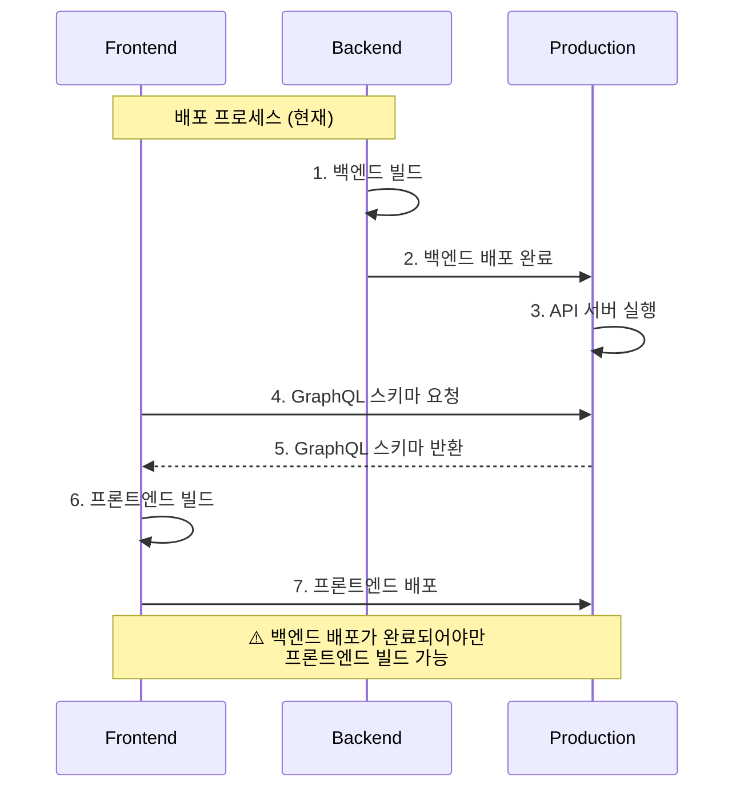
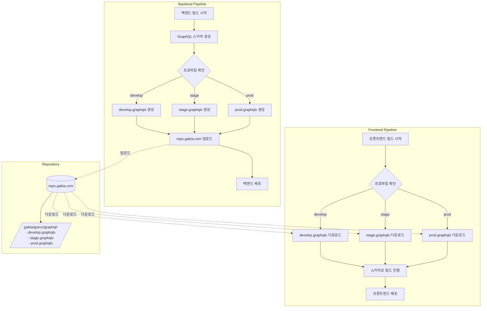
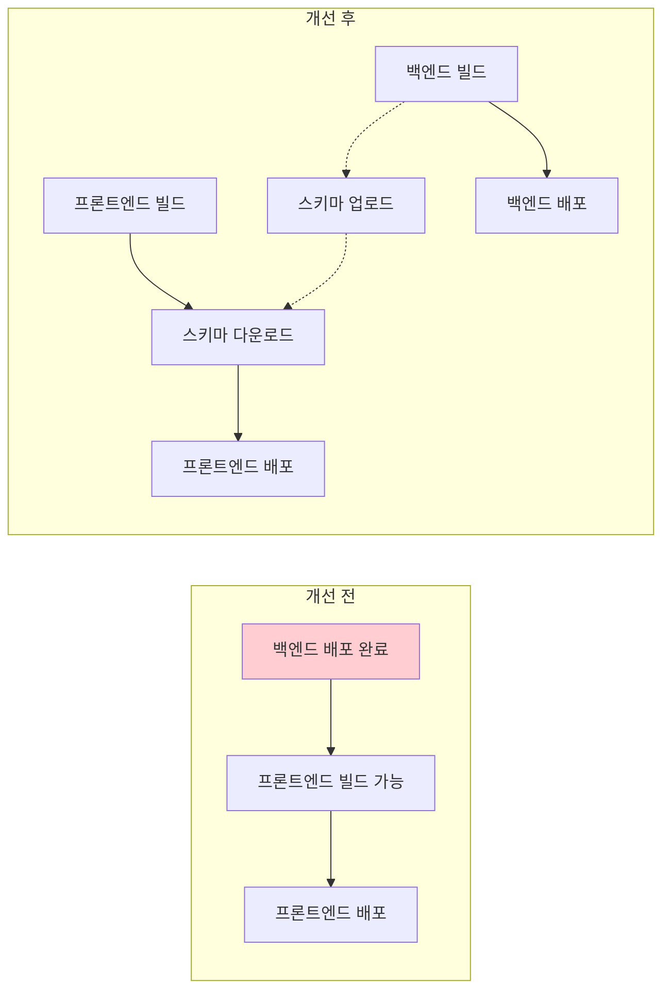

많은 조직에서 GraphQL을 도입하면서 프론트엔드와 백엔드 간의 유연한 데이터 통신을 구현하고 있습니다. 하지만 GraphQL 스키마를 동적으로 가져오는 방식은 때때로 프론트엔드와 백엔드의 배포 파이프라인에 강한 의존성을 야기하기도 합니다.

이 글에서는 백엔드 API 서버가 실행 중이어야만 스키마를 받아올 수 있었던 기존 구조의 문제점을 살펴보고, CI/CD 파이프라인을 개선하여 이 의존성을 제거한 과정을 공유하고자 합니다.

-----

## 1. 기존 아키텍처의 문제점 (AS-IS)

기존의 배포 프로세스는 프론트엔드 애플리케이션이 빌드되는 시점에 **실행 중인 백엔드 API 서버**에 GraphQL 스키마를 요청하는 방식이었습니다.



이 구조는 명확한 한계를 가지고 있었습니다.

  * **강한 배포 의존성:** 프론트엔드는 백엔드의 배포가 *완전히* 끝나고 API 서버가 정상적으로 응답할 수 있을 때까지 빌드를 시작조차 할 수 없었습니다.
  * **배포 시간 지연:** 백엔드 배포에 문제가 생기거나 시간이 지연되면, 프론트엔드 배포 역시 연쇄적으로 지연되었습니다.
  * **불필요한 대기:** 프론트엔드 개발이 완료되었음에도 불구하고, 단지 스키마를 받아오기 위해 백엔드 팀의 배포를 기다려야 했습니다.

-----

## 2\. 개선된 아키텍처 (TO-BE)

문제의 핵심은 스키마를 '실행 중인 런타임 API'에서 가져오는 것이었습니다. 저희는 이 접근 방식을 변경하여, GraphQL 스키마를 \*\*'빌드 시점에 생성되는 정적 파일(Artifact)'\*\*로 다루기로 결정했습니다.

개선된 아키텍처의 흐름은 다음과 같습니다.



1.  **백엔드 파이프라인:**
      * 빌드(Build) 단계에서 코드를 기반으로 GraphQL 스키마 파일을 생성합니다. (`.graphqls`)
      * `develop`, `stage`, `prod` 등 현재 빌드 프로파일에 맞는 스키마 파일을 생성합니다.
      * 생성된 스키마 파일을 사내 아티팩트 저장소(`repo.gabia.com`, Nexus)에 업로드합니다.
      * 스키마 업로드와 *관계없이* 백엔드 배포(Deploy)를 진행합니다.
2.  **프론트엔드 파이프라인:**
      * 빌드(Build) 단계에서 API 서버가 아닌 `repo.gabia.com`에 접근합니다.
      * 필요한 프로파일에 맞는 스키마 파일(`[profile].graphqls`)을 다운로드합니다.
      * 다운로드한 스키마를 기반으로 빌드를 수행하고 배포합니다.

-----

## 3\. 핵심 개선 효과

이러한 구조 변경을 통해 두 파이프라인의 의존성을 성공적으로 분리했습니다.



  * **배포 의존성 완전 제거:** 프론트엔드는 더 이상 백엔드의 *배포 완료*를 기다릴 필요가 없습니다. 백엔드 *빌드*가 완료되어 스키마 파일만 업로드되면 즉시 빌드를 시작할 수 있습니다.
  * **병렬 배포 가능:** 백엔드와 프론트엔드의 배포 파이프라인이 사실상 병렬로 실행될 수 있어, 전체 배포 시간이 단축되고 개발자 경험(DX)이 향상되었습니다.
  * **안정적인 스키마 관리:** 런타임 API에서 스키마를 가져올 때 발생할 수 있는 네트워크 오류나 서버 불안정성 문제를 원천적으로 차단하고, 버전 관리되는 안정적인 아티팩트 저장소를 사용하게 되었습니다.

-----

## 4\. 실제 구현 과정

이 아키텍처를 구현하기 위해 백엔드의 CI/CD 파이프라인과 Gradle 설정을 수정하고, 스키마 생성 전용의 경량 애플리케이션을 추가했습니다.
### 4-1. Gradle 태스크 정의 (`build.gradle.kts`)

`api` 모듈의 `build.gradle.kts` 파일에 `graphql-schema-generate`라는 이름의 `JavaExec` 태스크를 새로 정의했습니다. 이 태스크는 스키마 생성 전용 Java 애플리케이션을 실행하는 역할을 합니다.

```kotlin
// application/gsecu-api/build.gradle.kts

tasks.register<JavaExec>("graphql-schema-generate") {
    group = "graphql"
    description = "Generate GraphQL schema file and upload to Nexus (loads only GraphQL related beans)"
    mainClass.set("com.example.GraphQLSchemaGeneratorApplication")
    classpath = sourceSets["main"].runtimeClasspath
    args = listOf("--spring.graphql.schema.locations=classpath:graphql/**")
    
    // JVM 인코딩 설정 (한글 깨짐 방지)
    jvmArgs = listOf(
        "-Dfile.encoding=UTF-8",
        "-Dsun.jnu.encoding=UTF-8",
        "-Dclient.encoding.override=UTF-8"
    )
    
    // -Pprofile=develop 파라미터를 환경변수로 변환하여 Java 앱에 전달
    val profile = project.findProperty("profile") as String? ?: "develop"
    environment("PROFILE", profile)
    
}
```

### 4-3. 스키마 생성 전용 애플리케이션

단순히 스키마 파일 하나를 생성하기 위해 전체 백엔드 애플리케이션을 실행하는 것은 매우 비효율적입니다. 데이터베이스, 레디스, 보안 설정 등 불필요한 빈(Bean)까지 모두 로드되기 때문입니다.

저희는 이 문제를 해결하기 위해 **스키마 생성에 필요한 최소한의 빈만 로드**하는 경량 스프링 애플리케이션(`GraphQLSchemaGeneratorApplication`)을 별도로 만들었습니다.

핵심은 `@EnableAutoConfiguration`의 `exclude` 속성을 사용하여 불필요한 자동 설정을 모두 제외하는 것입니다.

```java
@Configuration
@EnableAutoConfiguration(exclude = {
		// DB, JPA, Redis, Security 등 스키마 생성에 불필요한 설정 제외
		DataSourceAutoConfiguration.class,
		DataSourceTransactionManagerAutoConfiguration.class,
		HibernateJpaAutoConfiguration.class,
		JpaRepositoriesAutoConfiguration.class,
		RedisAutoConfiguration.class,
		RedisRepositoriesAutoConfiguration.class,
		SecurityAutoConfiguration.class,
		UserDetailsServiceAutoConfiguration.class
})
// 스키마 생성에 필요한 설정 클래스만 스캔
@ComponentScan(basePackages = "com.example.graphql.schema.generator")
public class GraphQLSchemaGeneratorApplication {

	public static void main(String[] args) {
		new SpringApplicationBuilder(GraphQLSchemaGeneratorApplication.class)
				.web(WebApplicationType.NONE) // 웹 서버를 띄우지 않음
				.run(args);
	}

	@Bean
	CommandLineRunner generateSchema(GraphQlSource graphQlSource) {
		return args -> {
			// 1. 스키마 생성
			SchemaPrinter printer = new SchemaPrinter();
			String schema = printer.print(graphQlSource.schema());

			// 2. 파일로 저장
			Path outputPath = Paths.get("build/generated-schema.graphqls");
			Files.createDirectories(outputPath.getParent());
			Files.writeString(outputPath, schema, StandardCharsets.UTF_8);

			System.out.println("GraphQL schema generated successfully!");

			// 3. Nexus Repository에 업로드
			String profile = System.getenv("PROFILE");
			String nexusUsername = System.getenv("NEXUS_USERNAME");
			String nexusPassword = System.getenv("NEXUS_PASSWORD");

			if (profile != null && nexusUsername != null && nexusPassword != null) {
				System.out.println("Uploading schema to Nexus Repository (profile: " + profile + ")...");
				uploadToNexus(outputPath, profile, nexusUsername, nexusPassword);
			}
		};
	}
    
    // ... uploadToNexus 메서드 ...
}
```

또한, 스키마 생성에 꼭 필요한 `GraphQlSource` 빈을 등록하기 위한 별도의 설정 파일(`GraphQLSchemaConfiguration`)을 `ComponentScan` 경로에 추가했습니다.

```java


@Configuration
public class GraphQLSchemaConfiguration {

	@Bean
	public GraphQlSource graphQlSource() throws IOException {
		// .graphqls 파일들 로드
		PathMatchingResourcePatternResolver resolver = new PathMatchingResourcePatternResolver();
		Resource[] resources = resolver.getResources("classpath:graphql/**/*.graphqls");
		
		return GraphQlSource.schemaResourceBuilder()
			.schemaResources(resources)
			.configureRuntimeWiring(runtimeWiringBuilder -> {
				// 스키마 로드 시 TypeResolver가 필요하므로 빈 resolver 등록
				runtimeWiringBuilder
					.type("BaseEntity", typeWiring -> typeWiring.typeResolver(env -> null))
					.type("CommonPolicy", typeWiring -> typeWiring.typeResolver(env -> null));
			})
			.build();
	}
}
```

### 4-4. Nexus 업로드 및 UTF-8 BOM 처리

마지막으로, 생성된 스키마 파일을 `repo.example.com` (Nexus)으로 업로드하는 `uploadToNexus` 메서드입니다.

한 가지 중요한 점은, 업로드 시 파일 맨 앞에 \*\*UTF-8 BOM(Byte Order Mark)\*\*을 추가했다는 것입니다.

```java
// ...
private void uploadToNexus(Path schemaFilePath, String profile, String username, String password) {
    try {
        String nexusUrl = String.format(
                "https://repo.gabia.com/repository/raw-repository/gabia/gsecu/graphql/%s.graphqls",
                profile
        );

        byte[] fileBytes = Files.readAllBytes(schemaFilePath);
        
        // --- UTF-8 BOM (Byte Order Mark) 추가 ---
        // BOM: 0xEF, 0xBB, 0xBF
        // 브라우저가 이 파일을 열 때 자동으로 UTF-8로 해석하도록 유도합니다.
        ByteArrayOutputStream baos = new ByteArrayOutputStream();
        baos.write(0xEF); // UTF-8 BOM 첫 바이트
        baos.write(0xBB); // UTF-8 BOM 두 번째 바이트
        baos.write(0xBF); // UTF-8 BOM 세 번째 바이트
        baos.write(fileBytes); // 실제 파일 내용
        byte[] schemaBytes = baos.toByteArray();
        // --- ---
        
        URI uri = URI.create(nexusUrl);
        URL url = uri.toURL();
        HttpURLConnection connection = (HttpURLConnection) url.openConnection();

        // HTTP PUT 및 Basic Auth 설정
        connection.setRequestMethod("PUT");
        connection.setDoOutput(true);
        connection.setRequestProperty("Content-Type", "text/plain; charset=UTF-8");
        String auth = username + ":" + password;
        String encodedAuth = Base64.getEncoder().encodeToString(auth.getBytes(StandardCharsets.UTF_8));
        connection.setRequestProperty("Authorization", "Basic " + encodedAuth);

        // 파일 내용 전송
        try (OutputStream os = connection.getOutputStream()) {
            os.write(schemaBytes);
            os.flush();
        }

        // ... 응답 확인 로직 ...
        
        connection.disconnect();
    } catch (Exception e) {
        // ... 예외 처리 ...
    }
}
```

BOM을 추가한 이유는 일부 브라우저나 편집기에서 `.graphqls` 파일을 직접 열람할 때 발생할 수 있는 한글 깨짐 현상을 방지하고, 해당 파일이 UTF-8 인코딩임을 명시적으로 알려주기 위함입니다.

-----

## 5\. 결론

GraphQL 스키마를 런타임에 동적으로 조회하는 대신, CI 파이프라인의 **빌드 단계에서 정적 아티팩트로 생성**하여 공유 리포지토리에 업로드하도록 아키텍처를 변경했습니다.

이 개선 작업을 통해 프론트엔드와 백엔드의 배포 파이프라인 간의 강한 의존성을 성공적으로 제거할 수 있었습니다. 이제 두 팀은 서로의 배포 일정을 기다릴 필요 없이 독립적으로 빌드와 배포를 진행할 수 있게 되어, 전체적인 개발 생산성과 배포 안정성이 크게 향상되었습니다.