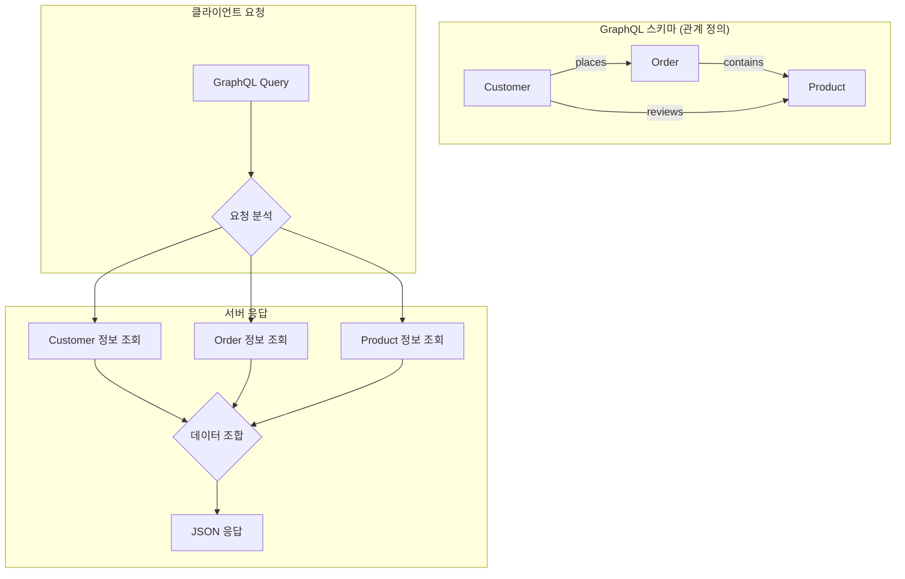
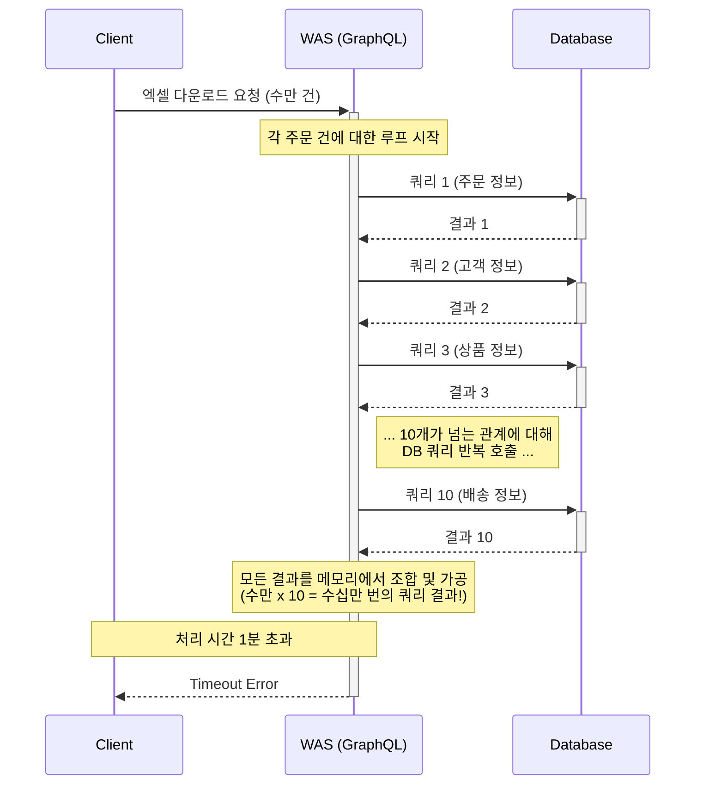
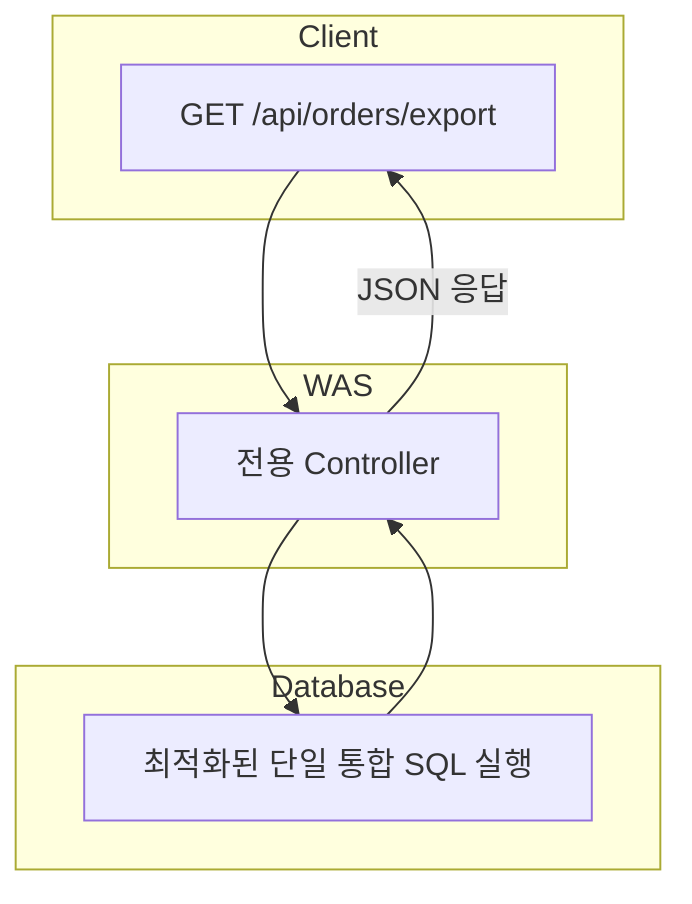

---
tags:
  - GraphQL
  - 성능개선
---


> 본 포스트는 사내에서 작성한 문서를 외부 공유하기 위해 LLM 을 이용해 가상의 도메인으로 교체한 것임을 밝힙니다.

개발자라면 누구나 한 번쯤 겪어봤을 법한 이야기가 있습니다. 로컬과 개발 서버에서는 완벽하게 작동하던 기능이, 실제 데이터가 쌓인 운영 환경에서 속절없이 무너지는 경험 말이죠. 저희에게는 '전체 주문 내역 엑셀 다운로드' 기능이 바로 그런 존재였습니다.

오늘은 클릭 후 1분 넘게 감감무소식이던 기능을 단 6초 만에 완료되는 기능으로 탈바꿈시킨 성능 개선 스토리를 공유해 드리고자 합니다.

### 유연함의 대명사, GraphQL을 만나다

저희가 개발하는 서비스는 수많은 도메인(사용자, 상품, 결제 등)과 얽혀 있는 복잡한 데이터 구조를 가지고 있습니다. 이런 환경에서 프론트엔드 개발자가 매번 필요한 데이터 조합을 위해 백엔드에 API 수정을 요청하는 것은 비효율의 극치였죠.

그래서 저희는 **GraphQL**을 도입했습니다.

GraphQL은 서버에 엔티티(Entity)와 그 관계(Relationship)만 잘 정의해두면, 클라이언트가 마치 SQL을 짜듯이 원하는 데이터의 구조를 직접 만들어 요청할 수 있는 강력한 도구입니다.



예를 들어, 프론트엔드에서 특정 주문(`Order`) 정보와 그 주문에 포함된 상품(`Product`)의 이름, 그리고 주문한 고객(`Customer`)의 이름이 필요하다면 아래와 같은 쿼리 하나로 모든 정보를 받아올 수 있습니다.

```graphql
query GetOrderDetails {
  orders {
    orderNumber
    orderDate
    product { # 연관된 상품 정보
      productName
      price
    }
    customer { # 연관된 고객 정보
      customerName
      grade
    }
  }
}
```

백엔드는 더 이상 프론트엔드의 요구사항 변경에 일일이 대응할 필요가 없어졌고, 프론트엔드는 필요한 데이터만 정확하게 받아올 수 있게 되었습니다. 정말 완벽해 보였죠. **그날이 오기 전까지는요.**

### 문제는 언제나 대용량 데이터에서 터진다

사건의 발단은 '전체 주문 내역 엑셀 다운로드' 기능이었습니다. 백오피스에서 수만 건의 데이터를 한 번에 조회해서 파일로 만들어야 하는 이 기능은 스테이징 환경에서 테스트를 시작하자마자 **타임아웃(Timeout)** 에러를 뿜어내기 시작했습니다. 로컬에서는 단 몇 초면 충분했는데 말이죠.

원인 분석에 들어간 저희는 우리가 사랑했던 GraphQL의 동작 방식이 바로 문제의 원흉이었음을 깨달았습니다.

GraphQL의 리졸버(Resolver)는 클라이언트의 쿼리를 받고, 정의된 관계에 따라 각 필드에 필요한 데이터를 조회합니다. 저희 엑셀 다운로드 기능은 하나의 주문(row) 데이터를 완성하기 위해 `고객`, `상품`, `결제`, `배송` 등 무려 **10개가 넘는 연관 엔티티 정보**를 필요로 했습니다.

이는 곧, **엑셀의 한 줄을 만들기 위해 DB에 10번의 개별 쿼리가 실행된다**는 의미였습니다.



설상가상으로 각 DB 쿼리는 그 자체로도 `여러 테이블을 JOIN`하는 무거운 작업이었습니다. 수만 건의 데이터에 대해 이 과정이 반복되니, WAS(Web Application Server)는 메모리에 모든 데이터를 올리고 조합하는 과정에서 엄청난 부하를 견디지 못하고 타임아웃을 발생시킨 것입니다. 소위 말하는 **'N+1 문제'의 끝판왕**을 마주한 셈이었죠.

### 유연함을 버리고, 성능을 얻다

GraphQL의 우아함과 유연성은 포기하기 아까웠지만, 기능 자체가 동작하지 않는 상황에서 다른 선택지는 없었습니다. 저희는 '전체 주문 내역 엑셀 다운로드'라는 특정 시나리오에만 집중하기로 했습니다.

**해결책은 단순 명쾌했습니다. "DB가 가장 잘하는 일은 DB에게 맡기자."**

1.  **단일 통합 SQL 쿼리 작성**: 엑셀 데이터에 필요한 모든 `JOIN`과 데이터 가공 로직을 담은, 거대하고 최적화된 단 하나의 SQL 쿼리를 작성했습니다.
2.  **전용 REST API 엔드포인트 개발**: 이 쿼리만을 실행하여 결과를 JSON으로 반환하는 가벼운 `GET` API를 새로 만들었습니다.

이 방식은 수만 번의 네트워크 왕복(WAS ↔ DB)을 단 한 번으로 줄이고, WAS의 메모리 부하를 DB로 이전시켜 성능을 극적으로 개선할 수 있습니다.

#### 개선된 아키텍처



이를 구현하기 위해서 `200줄의 단일 쿼리`를 작성했습니다. 수많은 집계, 마스킹 등의 로직을 `집계 연산과 CASE 문`을 이용해 DB 에서 처리할 수 있도록 구현했습니다.

### 결과: 1분 → 6초, 극적인 변화

결과는 놀라웠습니다.

-   **기존 방식 (GraphQL)**: **1분 이상 소요** (100% 타임아웃 발생)
-   **개선 방식 (전용 API + 단일 SQL)**: **평균 6초 소요**

마치 꽉 막힌 고속도로에 시원하게 톨게이트가 열린 기분이었습니다. 사용자들은 더 이상 기약 없는 기다림 끝에 에러 화면을 보지 않아도 되었고, 저희는 시스템 안정성을 확보할 수 있었습니다.

### 교훈: 모든 것을 해결하는 은탄환은 없다

이번 경험을 통해 값진 교훈을 얻었습니다. GraphQL은 분명 수많은 시나리오에서 개발 생산성을 극적으로 높여주는 훌륭한 도구입니다. 하지만 모든 문제를 해결해 주는 '은탄환(Silver Bullet)'은 아니었습니다.

-   **일반적인 데이터 조회**: 클라이언트의 요구사항이 다양하고 변경이 잦은 경우, **GraphQL**의 유연성은 빛을 발합니다.
-   **대용량 데이터 Export/리포팅**: 정해진 형식의 대량 데이터를 한 번에 가져와야 하는 경우, DB단에서 최적화된 **단일 쿼리와 전용 API**가 훨씬 효율적입니다.

결국 가장 중요한 것은 기술의 장단점을 명확히 이해하고, 현재 해결하려는 문제의 본질에 가장 적합한 도구를 선택하는 것이 아닐까 싶습니다.

긴 글 읽어주셔서 감사합니다.