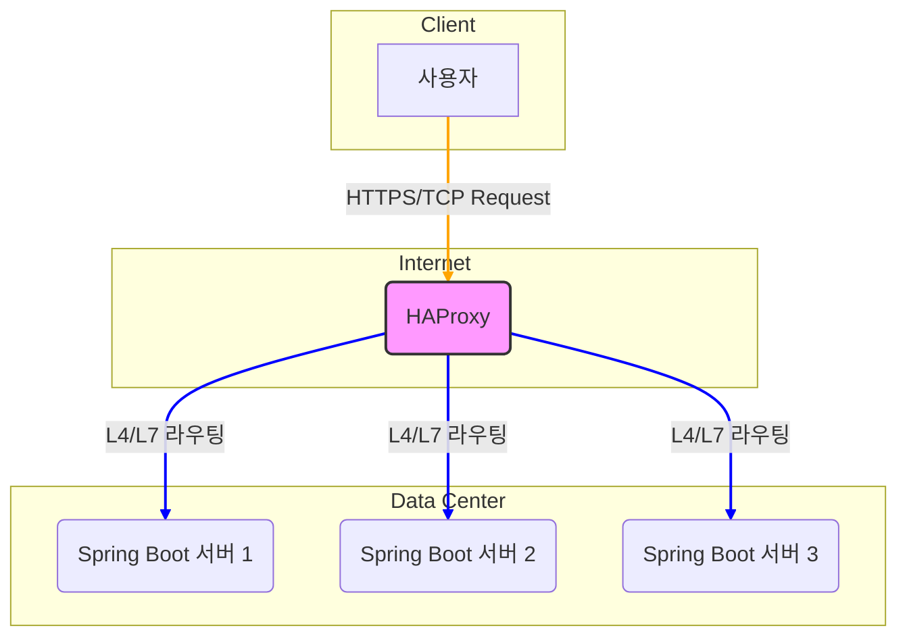
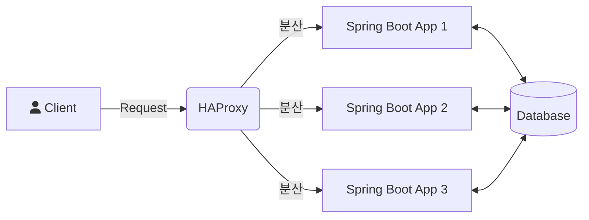

HAProxy는 **'High Availability Proxy'** 의 약자로, 이름에서 알 수 있듯이 [[고가용성(High Availability)]]을 제공하는 TCP/HTTP [[프록시(Proxy)]] 및 [[로드 밸런서(Load Balancer)]] 소프트웨어입니다. 오픈 소스로 제공되며, 아주 적은 리소스를 사용하면서도 뛰어난 성능과 안정성을 자랑하여 전 세계적으로 널리 사용되고 있습니다.

## HAProxy의 핵심 역할

HAProxy의 역할을 한마디로 정의하기는 어렵지만, 가장 중요한 두 가지 핵심 기능은 **로드 밸런싱**과 **프록시**입니다.

1. **로드 밸런싱**: 클라이언트로부터 들어오는 트래픽(요청)을 여러 대의 백엔드 서버에 효율적으로 분산하는 역할을 합니다. 이를 통해 단일 서버의 부하를 줄이고, 서비스의 전체적인 처리량을 높이며, 특정 서버에 장애가 발생하더라도 다른 서버가 요청을 처리하여 서비스 중단을 방지합니다.
    
2. **프록시**: 클라이언트와 서버 사이의 중개자 역할을 합니다. 클라이언트는 HAProxy에 요청을 보내고, HAProxy는 이 요청을 받아 백엔드 서버로 전달한 후, 서버의 응답을 다시 클라이언트에게 전달합니다. 이 과정에서 HAProxy는 트래픽을 감시하고, 변형하며, 특정 규칙에 따라 제어할 수 있습니다.
    

이 두 가지 역할을 통해 HAProxy는 웹 서비스의 **확장성(Scalability)**, **가용성(Availability)**, **보안성(Security)**을 크게 향상시킵니다.

---

## HAProxy 아키텍처의 이해

HAProxy의 뛰어난 성능 비결은 그 아키텍처에 있습니다. 바로 **이벤트 기반(Event-Driven), 단일 프로세스(Single-Process)** 모델입니다.

요청마다 새로운 프로세스나 스레드를 생성하는 다른 웹 서버들과 달리, HAProxy는 단일 프로세스 내에서 이벤트 루프를 통해 수많은 연결을 동시에 처리합니다. 이 방식은 [[Context Switching]] 비용이 거의 없고 메모리 사용량이 매우 적어, 대규모 트래픽 상황에서도 안정적인 성능을 보장합니다.

HAProxy는 OSI 7계층 중 4계층(Transport Layer)과 7계층(Application Layer)에서 동작할 수 있으며, 이에 따라 L4 로드 밸런서와 L7 로드 밸런서로 구분됩니다.

- **L4 (Transport Layer) 로드 밸런싱**: IP 주소와 포트 번호를 기반으로 패킷 레벨에서 트래픽을 분산합니다. 데이터의 내용을 확인하지 않기 때문에 속도가 매우 빠릅니다. [[TCP]], UDP 프로토콜의 로드 밸런싱이 여기에 해당합니다.
- **L7 (Application Layer) 로드 밸런싱**: HTTP 헤더, 쿠키, URL 등 애플리케이션 계층의 데이터를 기반으로 트래픽을 분산합니다. 요청의 내용을 분석하여 특정 URL 패턴에 따라 다른 서버로 보내는 등 훨씬 정교한 라우팅이 가능합니다.

어떤 계층의 로드 밸런서를 사용할지는 서비스의 특성과 요구사항에 따라 결정해야 합니다. 자세한 내용은 [[L4 vs L7 로드 밸런서 비교]] 문서를 참고해주세요.

---

## HAProxy의 주요 기능

HAProxy는 단순한 트래픽 분산을 넘어 다양한 고급 기능을 제공합니다.

- **다양한 로드 밸런싱 알고리즘**: Round Robin, Least Connections, Source IP Hashing 등 여러 알고리즘을 지원하여 트래픽을 가장 효율적으로 분산할 수 있는 방법을 선택할 수 있습니다. 자세한 내용은 [[HAProxy 로드 밸런싱 알고리즘]]에서 확인하실 수 있습니다.
- **헬스 체크 (Health Check)**: 백엔드 서버의 상태를 주기적으로 확인하여, 정상적으로 응답하지 않는 서버는 로드 밸런싱 대상에서 자동으로 제외합니다. 이를 통해 장애가 발생한 서버로 트래픽이 전송되는 것을 막습니다. [[HAProxy Health Check 설정 방법]]에서 더 자세히 알아보세요.
- **세션 지속성 (Session Persistence)**: 특정 클라이언트의 요청이 항상 동일한 서버로 전달되도록 보장하는 기능입니다. 사용자의 로그인 상태나 장바구니 정보 등을 유지해야 하는 서비스에 필수적입니다. [[세션 지속성(Session Persistence)]]에 대한 상세한 설명은 해당 노트를 참고해주세요.
- **SSL/TLS Termination**: 클라이언트와 HAProxy 사이의 SSL/TLS 암호화 통신을 처리하는 기능입니다. 백엔드 서버는 암호화/복호화 작업의 부담을 덜고 비즈니스 로직에만 집중할 수 있게 됩니다.
- **ACLs (Access Control Lists)**: 요청의 다양한 조건(IP, URL, HTTP 헤더 등)을 조합하여 유연하고 강력한 접근 제어 규칙을 만들 수 있습니다. 특정 IP를 차단하거나, 특정 경로의 요청만 다른 백엔드 그룹으로 보내는 등의 제어가 가능합니다.

---

## 스프링 부트 환경에서의 HAProxy 활용

그렇다면 우리가 자주 사용하는 스프링 부트(Spring Boot) 환경에서는 HAProxy를 어떻게 활용할 수 있을까요?

일반적으로 여러 대의 동일한 스프링 부트 애플리케이션 서버를 실행하고, 그 앞단에 HAProxy를 배치하는 구조를 사용합니다.

1. 사용자의 모든 요청은 먼저 HAProxy로 전달됩니다.
2. HAProxy는 설정된 로드 밸런싱 알고리즘과 헬스 체크 결과를 바탕으로 가장 적절한 스프링 부트 서버를 선택하여 요청을 전달합니다.
3. 만약 `App2` 서버에 장애가 발생하면, HAProxy의 헬스 체크 기능이 이를 감지하고 더 이상 `App2`로 트래픽을 보내지 않습니다. `App1`과 `App3`가 모든 요청을 처리하게 되어 서비스는 중단 없이 운영됩니다.
4. 서비스의 사용량이 늘어나면, 새로운 스프링 부트 서버(`App4`, `App5`...)를 추가하고 HAProxy 설정에 등록하기만 하면 손쉽게 수평 확장(Scale-out)이 가능합니다.

이처럼 HAProxy는 스프링 부트 애플리케이션의 **무중단 배포**와 **탄력적인 확장**을 구현하는 데 핵심적인 역할을 수행합니다.

---

## HAProxy의 장단점

### 장점

- **압도적인 성능**: 이벤트 기반 모델 덕분에 매우 적은 리소스로 높은 처리량을 보여줍니다.
- **높은 안정성**: 오랜 기간 검증된 소프트웨어로, 매우 안정적으로 동작합니다.
- **유연성과 기능성**: L4/L7 로드 밸런싱을 모두 지원하며, ACL을 통해 강력하고 세밀한 트래픽 제어가 가능합니다.
- **활발한 커뮤니티**: 오픈 소스로서 커뮤니티가 활성화되어 있어 자료를 찾기 쉽고 지속적으로 발전하고 있습니다.

### 단점

- **설정의 복잡성**: 기능이 다양한 만큼 초기 설정이나 고급 기능을 사용하기 위해서는 학습이 필요합니다.
- **[[단일 장애점(SPOF)]]**: HAProxy 자체에 장애가 발생하면 전체 서비스에 영향을 줄 수 있습니다. (이를 방지하기 위해 보통 HAProxy를 이중화하여 구성합니다. 자세한 내용은 [[HAProxy 이중화 구성 방법]]을 참고하세요.)

---

## 결론

HAProxy는 현대적인 웹 서비스 아키텍처에서 빼놓을 수 없는 강력한 도구입니다. 트래픽의 관문 역할을 하며 서비스의 안정성, 가용성, 확장성을 책임지는 핵심 컴포넌트라고 할 수 있습니다.

단순히 트래픽을 분산하는 것을 넘어, 정교한 라우팅, 보안 정책 적용, 성능 최적화 등 다양한 역할을 수행할 수 있는 HAProxy에 대해 깊이 이해하고 잘 활용한다면, 더욱 견고하고 신뢰성 높은 서비스를 구축할 수 있을 것입니다.

## 참고 자료

- HAProxy 공식 문서 ([https://www.haproxy.org/](https://www.haproxy.org/))
- HAProxy Configuration Manual ([https://cbonte.github.io/haproxy-dconv/2.8/configuration.html](https://www.google.com/search?q=https://cbonte.github.io/haproxy-dconv/2.8/configuration.html))