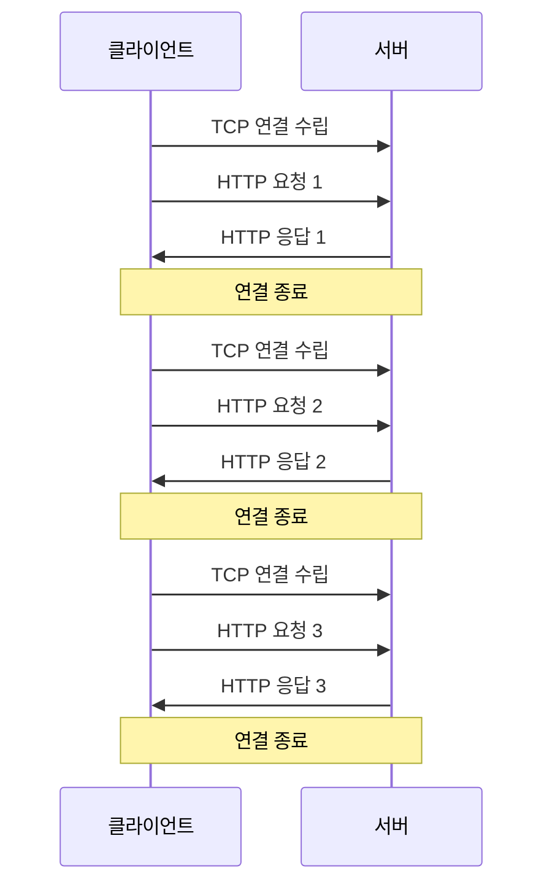

HTTP 1.0은 월드 와이드 웹(World Wide Web)에서 데이터를 전송하기 위한 프로토콜로, 1996년 5월에 RFC 1945로 공식화되었습니다. 인터넷의 기초를 형성한 이 프로토콜은 현대 웹 개발의 근간이 되었으며, 우리가 지금 사용하는 더 발전된 HTTP 버전들의 출발점이 되었습니다.

## HTTP의 기본 개념

HTTP(Hypertext Transfer Protocol)는 [[클라이언트-서버 모델]]을 기반으로 하는 통신 프로토콜입니다. 클라이언트(주로 웹 브라우저)가 서버에 요청(Request)을 보내면, 서버는 이에 대한 응답(Response)을 반환합니다. HTTP 1.0은 이러한 기본 메커니즘을 정의했습니다.

## HTTP 1.0의 주요 특징

### 1. 요청/응답 구조

HTTP 1.0의 통신은 다음과 같은 구조를 가집니다:

**HTTP 요청(Request) 구조:**

```
METHOD URI HTTP/1.0
Headers
(빈 줄)
Body(선택적)
```

**HTTP 응답(Response) 구조:**

```
HTTP/1.0 STATUS_CODE REASON_PHRASE
Headers
(빈 줄)
Body(선택적)
```

### 2. 요청 메서드(Request Methods)

HTTP 1.0은 다음 세 가지 주요 메서드를 정의했습니다:

- **GET**: 리소스를 요청합니다. (가장 일반적인 메서드)
- **POST**: 리소스를 생성하거나 데이터를 서버로 전송합니다.
- **HEAD**: GET과 유사하지만 헤더 정보만 반환합니다.

### 3. 상태 코드(Status Codes)

서버 응답의 상태를 나타내는 숫자 코드로, 크게 5가지 범주로 나뉩니다:

- **1xx**: 정보 제공 (HTTP 1.0에서는 미사용)
- **2xx**: 성공
    - 200 OK: 요청이 성공적으로 처리됨
- **3xx**: 리다이렉션
    - 301 Moved Permanently: 리소스가 영구적으로 다른 위치로 이동함
    - 302 Found: 리소스가 일시적으로 다른 위치에 있음
- **4xx**: 클라이언트 오류
    - 400 Bad Request: 잘못된 요청
    - 404 Not Found: 리소스를 찾을 수 없음
- **5xx**: 서버 오류
    - 500 Internal Server Error: 서버 내부 오류

### 4. 헤더(Headers)

HTTP 1.0은 메타데이터 전송을 위한 다양한 헤더를 도입했습니다:

**요청 헤더 예시:**

- `User-Agent`: 클라이언트 정보
- `Accept`: 클라이언트가 받을 수 있는 미디어 타입
- `If-Modified-Since`: 특정 날짜 이후에 수정된 경우에만 리소스 요청

**응답 헤더 예시:**

- `Server`: 서버 정보
- `Content-Type`: 반환되는 데이터의 MIME 타입
- `Content-Length`: 본문의 크기(바이트)
- `Last-Modified`: 리소스의 마지막 수정 시간
- `Expires`: 리소스의 만료 시간

## HTTP 1.0의 한계점

### 1. 비연결성(Connectionless)

HTTP 1.0은 기본적으로 비연결성 프로토콜입니다. 클라이언트가 요청을 보내고 서버가 응답한 후에는 연결이 종료됩니다. 같은 서버에 여러 리소스를 요청하려면 매번 새로운 TCP 연결을 생성해야 합니다. 이는 성능 저하의 주요 원인이 되었습니다.

### 2. 커넥션 관리 방식

HTTP 1.0에서는 `Connection: keep-alive` 헤더를 통해 지속적인 연결을 유지하려는 시도가 있었지만, 표준으로 완전히 확립되지는 않았습니다.



### 3. 캐싱(Caching) 메커니즘의 한계

HTTP 1.0의 캐싱 메커니즘은 제한적이었습니다. `If-Modified-Since`, `Expires` 같은 기본적인 헤더만 지원했으며, 세밀한 캐시 제어가 어려웠습니다.

### 4. 단방향 통신

서버는 클라이언트의 요청에 대한 응답만 할 수 있었으며, 서버에서 클라이언트로 먼저 통신을 시작할 수 없었습니다.

## HTTP 1.0의 실제 작동 예시

### 기본적인 HTTP 1.0 요청/응답 예시

**요청:**

```
GET /index.html HTTP/1.0
Host: www.example.com
User-Agent: Mozilla/5.0
Accept: text/html

```

**응답:**

```
HTTP/1.0 200 OK
Date: Fri, 31 Dec 2021 23:59:59 GMT
Content-Type: text/html
Content-Length: 1354
Last-Modified: Wed, 08 Jan 2021 23:11:55 GMT
Server: Apache/1.3.3

<!DOCTYPE html>
<html>
<head>
    <title>Example Page</title>
</head>
<body>
    <h1>Hello, World!</h1>
</body>
</html>
```

## HTTP 1.0에서 HTTP 1.1로의 발전

HTTP 1.0의 한계를 극복하기 위해 1997년 [[HTTP 1.1]](RFC 2068)이 발표되었습니다. 주요 개선 사항은 다음과 같습니다:

1. **영속적 연결(Persistent Connections)**: 기본적으로 연결을 유지하는 방식으로 변경
2. **파이프라이닝(Pipelining)**: 여러 요청을 동시에 보낼 수 있는 기능
3. **추가 메서드**: PUT, DELETE, OPTIONS, TRACE 등의 메서드 추가
4. **호스트 헤더 필수화**: 한 IP 주소에서 여러 도메인을 호스팅할 수 있게 함
5. **개선된 캐싱 메커니즘**: Cache-Control 헤더 도입

HTTP 1.0과 HTTP 1.1의 상세 비교는 [[HTTP 1.0과 1.1 비교]]를 참고해주세요.

## HTTP 1.0의 보안 측면

HTTP 1.0은 기본적으로 암호화를 제공하지 않았으며, 이는 중간자 공격(Man-in-the-Middle)에 취약했습니다. 이러한 문제는 나중에 HTTPS(SSL/TLS를 사용한 HTTP)의 도입으로 해결되었습니다.

보안 관련 상세 내용은 [[HTTP 보안 취약점과 대응책]]을 참고해주세요.

## 결론

HTTP 1.0은 초기 웹의 기초를 형성한 중요한 프로토콜입니다. 비록 현대 웹 개발에서는 더 발전된 버전(HTTP 1.1, HTTP/2, HTTP/3)을 사용하지만, HTTP 1.0은 웹 통신의 기본 개념과 구조를 확립했습니다.

HTTP 1.0의 한계점은 웹이 발전함에 따라 점차 개선되었으며, 이러한 발전 과정은 웹 기술의 진화를 이해하는 데 중요한 역사적 맥락을 제공합니다.

## 참고 자료

- RFC 1945 - HTTP/1.0 공식 명세
- HTTP: The Definitive Guide (O'Reilly)
- MDN Web Docs: HTTP 개요
- 자바 네트워크 프로그래밍 4판 (O'Reilly)