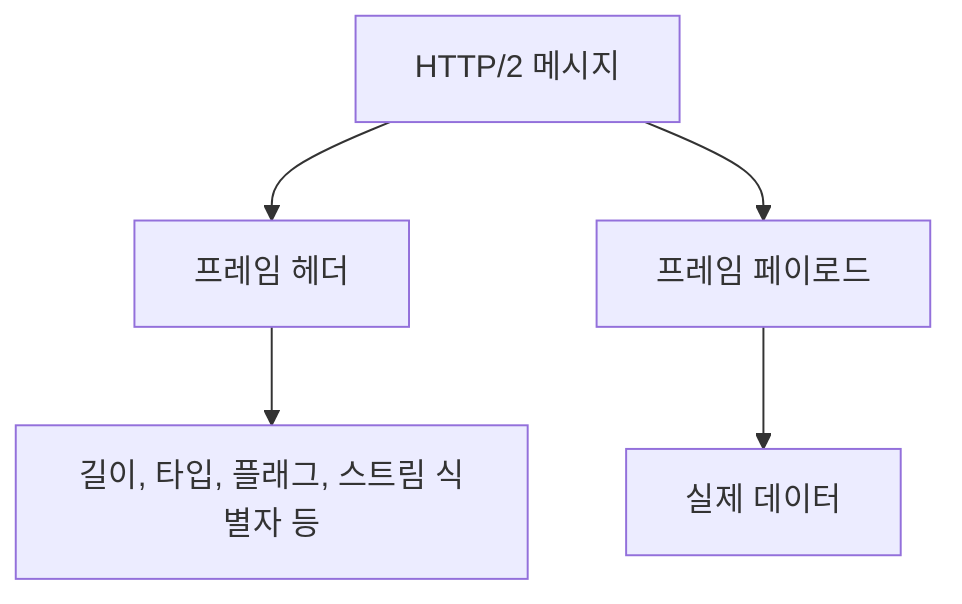
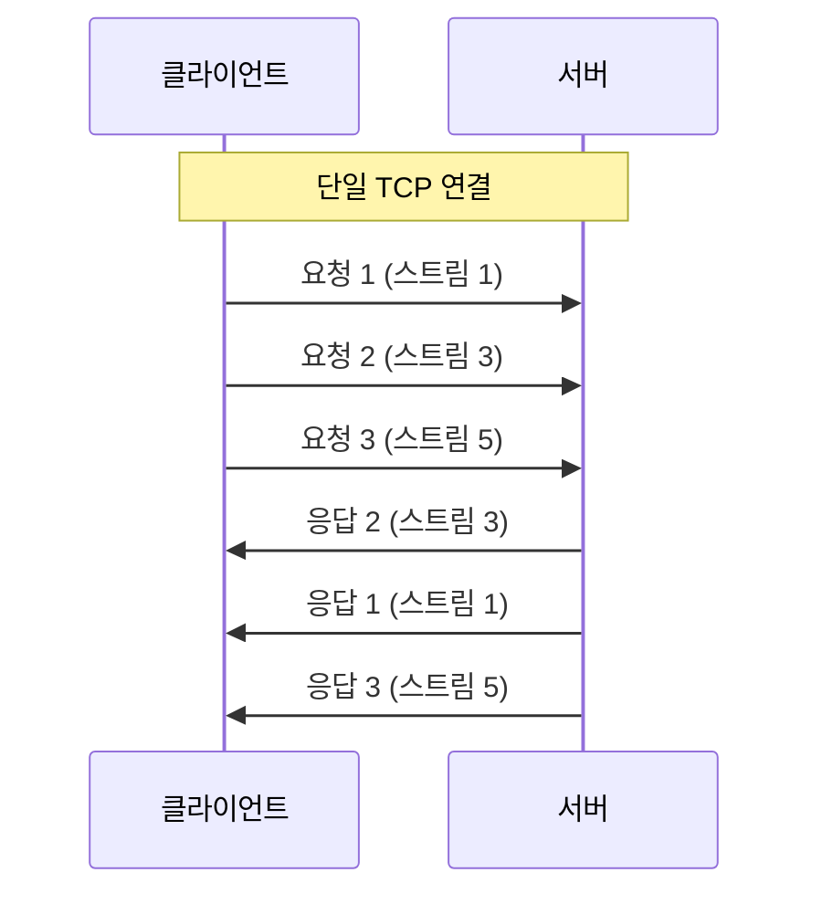
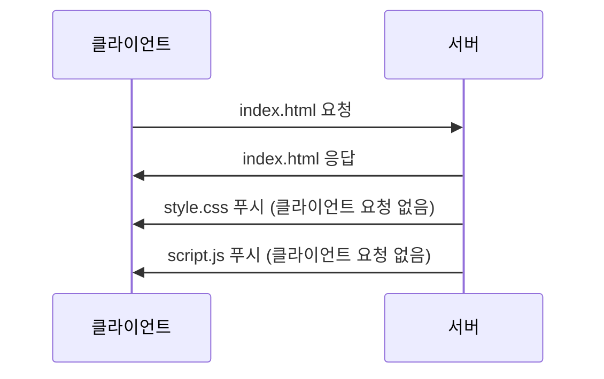

HTTP/2는 웹의 효율성과 속도를 높이기 위해 2015년에 정식 표준으로 발표된 네트워크 프로토콜입니다. [[HTTP 1.1]]의 한계를 극복하고자 설계되었으며, 현대 웹 환경에서 보다 빠르고 효율적인 통신을 가능하게 합니다.

## HTTP/2의 탄생 배경

HTTP/1.1은 1999년에 표준화된 이후 오랫동안 인터넷 통신의 기반이 되었습니다. 그러나 웹 애플리케이션이 복잡해지고 리소스 요청 수가 증가함에 따라 여러 한계점이 드러났습니다. Google은 이러한 문제를 해결하기 위해 2012년 SPDY(스피디) 프로토콜을 개발했고, 이것이 HTTP/2의 기초가 되었습니다.

HTTP/2는 기존 HTTP의 의미 체계를 유지하면서도 데이터 전송 방식을 획기적으로 개선했습니다. 2015년 5월 IETF(Internet Engineering Task Force)에 의해 공식 표준으로 발표되었습니다.

## HTTP/1.1의 한계

HTTP/1.1의 주요 한계점은 다음과 같습니다:

1. **HOL(Head of Line) 블로킹**: 하나의 TCP 연결에서 요청과 응답이 순차적으로 처리되어 앞선 요청이 완료될 때까지 다음 요청이 차단됩니다.
2. **비효율적인 TCP 연결 관리**: 병렬 요청을 위해 여러 TCP 연결을 생성해야 했습니다.
3. **중복된 헤더 정보**: 매 요청마다 반복되는 헤더 정보가 불필요한 대역폭을 소모합니다.
4. **단순 텍스트 프로토콜**: 텍스트 기반 통신은 처리 효율성이 낮습니다.

이러한 문제들은 현대 웹 애플리케이션의 성능을 저하시키는 주요 원인이었습니다.

## HTTP/2의 주요 특징

### 1. 바이너리 프로토콜

HTTP/2는 텍스트 기반이 아닌 이진(바이너리) 프로토콜입니다. 데이터를 프레임(Frame)이라는 작은 단위로 나누어 전송합니다. 이 바이너리 형식은 파싱이 더 효율적이고 오류 발생 가능성이 낮습니다.



### 2. 멀티플렉싱(Multiplexing)

HTTP/2의 가장 중요한 특징은 단일 TCP 연결 내에서 여러 요청과 응답을 동시에 처리할 수 있는 멀티플렉싱입니다. 이는 HOL 블로킹 문제를 해결하고 네트워크 리소스 활용을 최적화합니다.



각 요청과 응답은 고유한 스트림 ID로 식별되며, 서로 독립적으로 처리됩니다. 이를 통해 하나의 응답이 지연되더라도 다른 응답이 차단되지 않습니다.

### 3. 헤더 압축(HPACK)

HTTP/2는 HPACK이라는 헤더 압축 알고리즘을 사용합니다. 이 알고리즘은 Huffman 코딩을 통해 헤더 필드를 압축하고, 이전 요청과 중복되는 헤더 정보를 참조하여 중복 전송을 방지합니다.

클라이언트와 서버는 각각 이전에 전송된 헤더 테이블을 유지하고, 변경된 헤더만 전송함으로써 대역폭 사용을 최소화합니다.

### 4. 서버 푸시(Server Push)

HTTP/2에서는 서버가 클라이언트의 요청 없이도 필요할 것으로 예상되는 리소스를 미리 전송할 수 있습니다. 이를 서버 푸시라고 합니다.

예를 들어, HTML 페이지를 요청했을 때 서버는 해당 페이지에서 참조하는 CSS, JavaScript 파일 등을 클라이언트가 별도로 요청하기 전에 미리 보낼 수 있습니다.



이 기능을 통해 네트워크 왕복 시간을 줄이고 페이지 로딩 속도를 향상시킬 수 있습니다.

### 5. 스트림 우선순위(Stream Priority)

HTTP/2는 스트림에 우선순위를 부여할 수 있습니다. 이를 통해 중요한 리소스(예: 사용자에게 먼저 표시되는 콘텐츠)가 먼저 처리되도록 할 수 있습니다.

스트림 우선순위는 의존성(Dependency)과 가중치(Weight)로 정의됩니다:

- 의존성: 스트림 간의 관계를 정의
- 가중치: 동일한 부모에 종속된 스트림 간의 리소스 할당 비율

### 6. 흐름 제어(Flow Control)

HTTP/2는 스트림 레벨과 연결 레벨 모두에서 흐름 제어 메커니즘을 제공합니다. 수신자는 자신이 처리할 수 있는 데이터의 양을 지정할 수 있으며, 이를 통해 메모리 부족 문제를 방지하고 네트워크 리소스를 효율적으로 활용할 수 있습니다.

## HTTP/2의 구현과 적용

HTTP/2를 웹 애플리케이션에 적용하는 방법은 여러 가지가 있습니다.

### 서버 측 구현

대부분의 현대 웹 서버는 HTTP/2를 지원합니다:

- **Apache**: mod_http2 모듈을 통해 지원
- **Nginx**: 1.9.5 버전부터 지원
- **Tomcat**: 8.5 버전부터 지원
- **Jetty**: 9.3 버전부터 지원

일반적으로 HTTP/2를 활성화하는 설정은 간단합니다. 예를 들어, Nginx에서는 다음과 같이 구성할 수 있습니다:

```
server {
    listen 443 ssl http2;
    ssl_certificate    /path/to/certificate.crt;
    ssl_certificate_key /path/to/private.key;
    
    # 기타 설정...
}
```

### 클라이언트 측 지원

현대의 주요 웹 브라우저들은 모두 HTTP/2를 지원합니다:

- Chrome (v41+)
- Firefox (v36+)
- Safari (v9+)
- Edge (v12+)
- Opera (v28+)

### TLS와의 관계

대부분의 브라우저는 HTTP/2를 HTTPS(TLS)와 함께 사용할 것을 요구합니다. 이는 공식 규격에서 필수는 아니지만, 보안 강화와 기존 프록시 서버와의 호환성 문제로 인해 사실상 표준이 되었습니다.

## HTTP/2의 성능 이점

HTTP/2는 다음과 같은 성능 향상을 제공합니다:

1. **페이지 로딩 시간 단축**: 멀티플렉싱과 병렬 처리로 인해 특히 고지연 네트워크에서 효과적입니다.
2. **대역폭 사용 최적화**: 헤더 압축과 바이너리 프로토콜은 전송되는 데이터 양을 줄입니다.
3. **연결 수 감소**: 단일 연결을 통한 다중 요청으로 TCP 핸드셰이크와 TLS 협상이 줄어듭니다.
4. **서버 푸시를 통한 선제적 리소스 전송**: 클라이언트 요청 전에 필요한 리소스를 미리 전송합니다.

많은 대형 웹사이트들은 HTTP/2 도입 후 15-50%의 페이지 로딩 시간 단축을 보고했습니다.

## HTTP/2 사용 시 고려사항

### 1. 최적화 전략 변경

HTTP/1.1에서 사용하던 일부 최적화 기법들은 HTTP/2에서는 오히려 역효과를 낼 수 있습니다:

- **도메인 샤딩(Domain Sharding)**: 여러 도메인에서 리소스를 제공하는 기법은 HTTP/2의 단일 연결 멀티플렉싱에서는 불필요합니다.
- **파일 병합(File Concatenation)**: 여러 작은 파일을 하나로 합치는 것이 HTTP/2에서는 캐싱 효율성을 떨어뜨릴 수 있습니다.
- **이미지 스프라이트(Image Sprites)**: 여러 이미지를 하나로 합치는 기법도 HTTP/2에서는 덜 효과적일 수 있습니다.

### 2. 디버깅과 모니터링

HTTP/2는 바이너리 프로토콜이므로 디버깅이 더 복잡할 수 있습니다. 다행히 Chrome DevTools, Firefox Developer Tools와 같은 현대적인 개발자 도구들은 HTTP/2 트래픽을 분석하는 기능을 제공합니다.

### 3. 프록시와 중간자 문제

일부 오래된 프록시와 미들웨어는 HTTP/2를 제대로 지원하지 않을 수 있습니다. 이로 인해 연결 문제가 발생할 수 있으므로 네트워크 인프라를 확인해야 합니다.

## HTTP/2와 Spring 프레임워크

Spring 프레임워크에서는 HTTP/2를 쉽게 사용할 수 있습니다. Spring Boot 2.0부터는 내장 서버(Tomcat, Jetty, Undertow)에서 HTTP/2를 지원합니다.

아래는 Spring Boot에서 HTTP/2를 활성화하는 설정 예시입니다:

```java
@Configuration
public class ServerConfig {
    
    @Bean
    public ConfigurableServletWebServerFactory webServerFactory() {
        TomcatServletWebServerFactory factory = new TomcatServletWebServerFactory();
        factory.addConnectorCustomizers(connector -> {
            Http2Protocol http2 = new Http2Protocol();
            connector.addUpgradeProtocol(http2);
        });
        return factory;
    }
}
```

application.properties 또는 application.yml 파일에서도 설정할 수 있습니다:

```yaml
server:
  http2:
    enabled: true
  ssl:
    key-store: classpath:keystore.p12
    key-store-password: mypassword
    key-store-type: PKCS12
    key-alias: tomcat
```

HTTP/2의 구현에 대한 자세한 내용은 [[Spring에서 HTTP/2 구현하기]]를 참조해주세요.

## HTTP/2 성능 측정 및 테스트

HTTP/2의 성능을 테스트하고 측정하는 방법은 여러 가지가 있습니다:

1. **브라우저 개발자 도구**: 네트워크 탭에서 프로토콜 버전을 확인하고 성능을 분석할 수 있습니다.
2. **h2load**: nghttp2 프로젝트의 부분으로, HTTP/2 서버 벤치마킹 도구입니다.
3. **Lighthouse**: 구글의 오픈소스 자동화 도구로 웹 페이지의 품질을 개선하는 데 도움을 줍니다.
4. **WebPageTest**: 다양한 위치와 브라우저에서 웹사이트 성능을 테스트할 수 있습니다.

성능 테스트를 통해 HTTP/2 도입의 효과를 측정하고, 애플리케이션에 맞게 최적화할 수 있습니다.

## HTTP/3와의 비교

2019년에 IETF는 HTTP/3(이전 명칭: HTTP-over-QUIC)를 제안했습니다. HTTP/3는 TCP 대신 QUIC(UDP 기반 프로토콜)을 사용합니다. HTTP/3의 주요 이점은 다음과 같습니다:

- **연결 설정 시간 단축**: 0-RTT 연결 설정을 지원합니다.
- **향상된 혼잡 제어**: 패킷 손실에 더 효과적으로 대응합니다.
- **연결 마이그레이션**: 네트워크가 변경되어도 연결을 유지할 수 있습니다.

HTTP/3에 대한 자세한 내용은 [[HTTP/3 개요]]를 참조해주세요.

## 결론

HTTP/2는 웹 통신의 효율성과 성능을 크게 향상시킨 중요한 발전입니다. 멀티플렉싱, 헤더 압축, 서버 푸시와 같은 기능을 통해 현대 웹 애플리케이션의 요구사항에 더 잘 부응할 수 있게 되었습니다.

대부분의 브라우저와 서버가 이미 HTTP/2를 지원하고 있으며, 대형 웹사이트들은 이미 그 이점을 누리고 있습니다. 개발자는 HTTP/2의 특성을 이해하고 적절히 활용함으로써 사용자 경험을 크게 향상시킬 수 있습니다.

물론 HTTP/3가 등장하면서 웹 프로토콜은 계속 진화하고 있지만, HTTP/2는 현재 웹 환경에서 널리 사용되고 있으며 앞으로도 상당 기간 중요한 역할을 할 것입니다.

## 참고 자료

- RFC 7540 - HTTP/2 공식 명세
- High Performance Browser Networking - Ilya Grigorik
- HTTP/2 in Action - Barry Pollard
- Spring Framework 공식 문서(https://docs.spring.io/spring-boot/docs/current/reference/html/howto.html#howto.webserver.configure-http2)