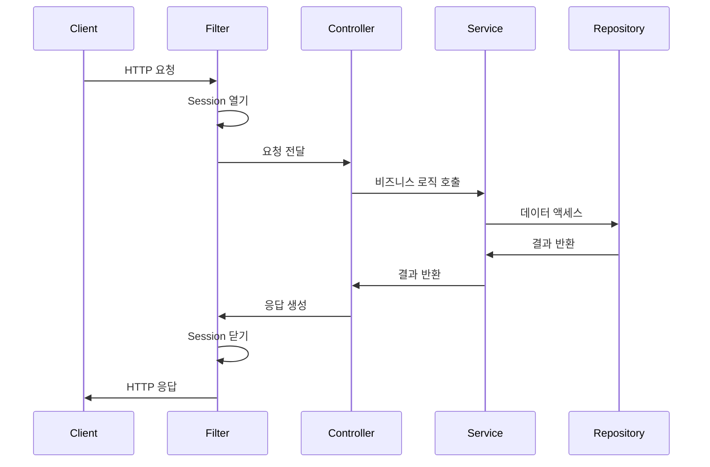
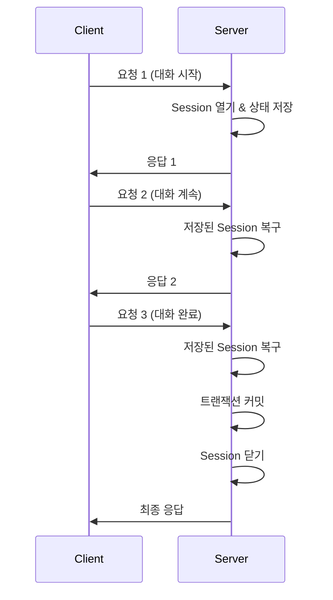
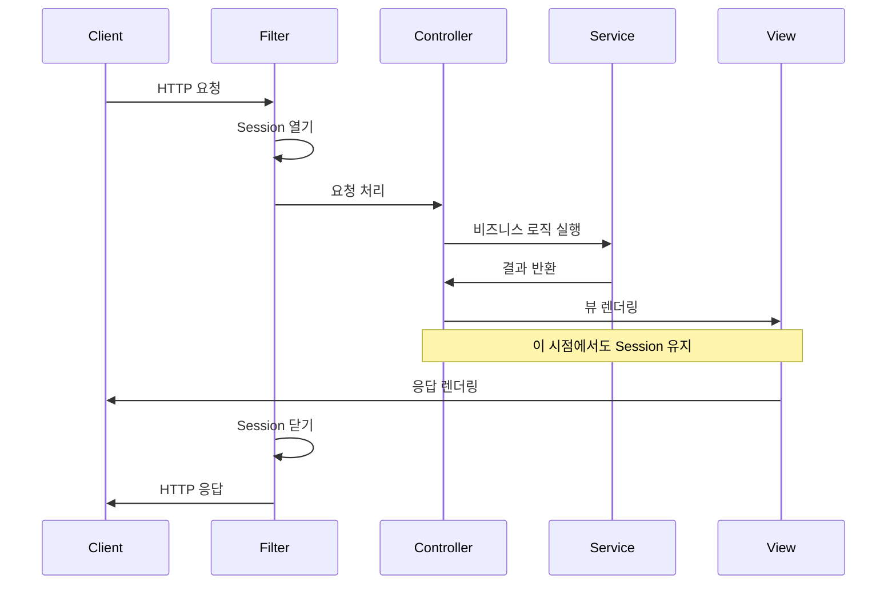

Hibernate Session의 효율적인 관리는 애플리케이션의 성능, 확장성 및 안정성에 직접적인 영향을 미칩니다. 적절한 Session 관리 전략을 선택하고 구현하는 것은 ORM 기반 애플리케이션의 성공에 핵심적인 요소입니다. 이 문서에서는 다양한 Hibernate Session 관리 전략과 각 전략의 장단점, 적용 시나리오에 대해 알아보겠습니다.

## Session 관리의 기본 원칙

효과적인 Hibernate Session 관리를 위한 기본 원칙은 다음과 같습니다:

1. **짧은 세션 유지**: Session은 가능한 짧게 유지하는 것이 좋습니다.
2. **리소스 해제 보장**: 모든 상황에서 Session이 적절히 닫히도록 보장해야 합니다.
3. **트랜잭션 범위와 일치**: Session 범위는 트랜잭션 범위와 일치시키는 것이 좋습니다.
4. **예외 처리**: 예외 발생 시 Session과 트랜잭션이 적절히 처리되어야 합니다.
5. **스레드 안전성 확보**: 멀티스레드 환경에서 Session은 스레드 간에 공유되지 않아야 합니다.

## 주요 Session 관리 전략

### 1. Session-per-Operation 패턴

가장 간단한 접근 방식으로, 각 데이터베이스 작업마다 새로운 Session을 열고 작업 완료 후 즉시 닫습니다.

```java
public User getUserById(Long id) {
    Session session = sessionFactory.openSession();
    try {
        return session.get(User.class, id);
    } finally {
        session.close();
    }
}

public void saveUser(User user) {
    Session session = sessionFactory.openSession();
    Transaction tx = null;
    try {
        tx = session.beginTransaction();
        session.save(user);
        tx.commit();
    } catch (Exception e) {
        if (tx != null) tx.rollback();
        throw e;
    } finally {
        session.close();
    }
}
```

**장점**:

- 구현이 단순합니다.
- 리소스 사용이 최소화됩니다.
- 메모리 누수 위험이 낮습니다.

**단점**:

- 여러 작업이 하나의 트랜잭션에 속해야 할 때 사용할 수 없습니다.
- 지연 로딩(Lazy Loading)을 활용하기 어렵습니다.
- N+1 쿼리 문제가 발생할 가능성이 높습니다.

**적합한 시나리오**:

- 단순한 CRUD 작업을 수행하는 소규모 애플리케이션
- 복잡한 비즈니스 로직이 없는 단순한 서비스

### 2. Session-per-Request 패턴

웹 애플리케이션에서 가장 일반적인 패턴으로, 각 HTTP 요청마다 하나의 Session을 열고 요청 처리가 완료된 후 Session을 닫습니다.



이 패턴은 일반적으로 필터나 인터셉터를 통해 구현됩니다:

```java
public class HibernateSessionFilter implements Filter {
    
    private SessionFactory sessionFactory;
    
    @Override
    public void doFilter(ServletRequest request, ServletResponse response, FilterChain chain) 
            throws IOException, ServletException {
        
        Session session = sessionFactory.openSession();
        try {
            // 현재 스레드에 Session 바인딩
            ThreadLocalSessionContext.bind(session);
            
            // 트랜잭션 시작
            session.beginTransaction();
            
            // 요청 처리
            chain.doFilter(request, response);
            
            // 트랜잭션 커밋
            session.getTransaction().commit();
            
        } catch (Exception e) {
            // 예외 발생 시 롤백
            session.getTransaction().rollback();
            throw e;
        } finally {
            // 스레드에서 Session 제거
            ThreadLocalSessionContext.unbind(sessionFactory);
            // Session 닫기
            session.close();
        }
    }
}
```

**장점**:

- 단일 요청 내에서 일관된 데이터 뷰를 제공합니다.
- 트랜잭션 관리가 용이합니다.
- 지연 로딩(Lazy Loading)을 활용할 수 있습니다.

**단점**:

- 장시간 실행되는 요청의 경우 Session이 오래 유지될 수 있습니다.
- 특히 대규모 데이터 로드 시 메모리 사용량이 증가할 수 있습니다.

**적합한 시나리오**:

- 단일 요청 내에서 완료되는 작업을 처리하는 웹 애플리케이션
- RESTful API

### 3. Session-per-Conversation 패턴

여러 요청에 걸쳐 하나의 논리적 작업(대화)을 처리해야 하는 경우 사용합니다. 예를 들어, 여러 단계의 양식 제출이나 마법사 인터페이스 등이 있습니다.



이 패턴은 일반적으로 클라이언트 세션에 Hibernate Session을 저장하거나, 분리된(detached) 엔티티를 사용하여 구현합니다:

```java
@Controller
public class OrderController {
    
    @Autowired
    private SessionFactory sessionFactory;
    
    @GetMapping("/order/start")
    public String startOrder(HttpSession httpSession) {
        // 새 주문 생성
        Session session = sessionFactory.openSession();
        Order order = new Order();
        session.save(order);
        
        // 주문 ID를 HTTP 세션에 저장
        httpSession.setAttribute("orderId", order.getId());
        
        session.close();
        return "orderForm";
    }
    
    @PostMapping("/order/addItem")
    public String addItem(@RequestParam Long itemId, HttpSession httpSession) {
        Long orderId = (Long) httpSession.getAttribute("orderId");
        
        Session session = sessionFactory.openSession();
        Transaction tx = session.beginTransaction();
        
        Order order = session.get(Order.class, orderId);
        Item item = session.get(Item.class, itemId);
        order.addItem(item);
        
        tx.commit();
        session.close();
        
        return "orderForm";
    }
    
    @PostMapping("/order/complete")
    public String completeOrder(HttpSession httpSession) {
        Long orderId = (Long) httpSession.getAttribute("orderId");
        
        Session session = sessionFactory.openSession();
        Transaction tx = session.beginTransaction();
        
        Order order = session.get(Order.class, orderId);
        order.setStatus(OrderStatus.COMPLETED);
        
        tx.commit();
        session.close();
        
        // 주문 완료 후 세션에서 주문 ID 제거
        httpSession.removeAttribute("orderId");
        
        return "orderConfirmation";
    }
}
```

**장점**:

- 여러 단계에 걸친 작업을 논리적으로 묶을 수 있습니다.
- 사용자 경험을 위한 유연성을 제공합니다.

**단점**:

- 구현이 복잡합니다.
- 메모리 사용량과 리소스 관리에 주의가 필요합니다.
- 병행성 문제가 발생할 수 있습니다.

**적합한 시나리오**:

- 다단계 양식이나 마법사 인터페이스
- 장바구니나 주문 프로세스와 같은 상태 유지가 필요한 기능

### 4. Open Session in View (OSIV) 패턴

프레젠테이션 계층(뷰)에서 지연 로딩을 가능하게 하기 위해 HTTP 요청 시작부터 뷰 렌더링 완료까지 Session을 열어두는 패턴입니다.



스프링 프레임워크에서는 OpenSessionInViewFilter/Interceptor를 통해 구현할 수 있습니다:

```java
@Configuration
public class HibernateConfig {
    
    @Bean
    public OpenSessionInViewFilter openSessionInViewFilter() {
        OpenSessionInViewFilter filter = new OpenSessionInViewFilter();
        filter.setSessionFactoryBeanName("sessionFactory");
        return filter;
    }
}
```

**장점**:

- LazyInitializationException 문제를 해결합니다.
- 뷰 렌더링 중에도 지연 로딩이 가능합니다.
- 개발자의 편의성을 높입니다.

**단점**:

- 데이터베이스 연결이 오래 유지되어 리소스 사용량이 증가합니다.
- 불필요한 쿼리가 실행될 가능성이 있습니다.
- 성능 문제의 원인을 파악하기 어렵게 만들 수 있습니다.
- 계층 간 분리가 모호해집니다.

**적합한 시나리오**:

- 프로토타입이나 작은 규모의 애플리케이션
- 성능보다 개발 편의성이 중요한 경우

### 5. 스프링의 Session 관리 접근법

스프링 프레임워크는 Hibernate Session 관리를 위한 다양한 추상화를 제공합니다.

#### 5.1. @Transactional 어노테이션 사용

```java
@Service
@Transactional
public class UserServiceImpl implements UserService {
    
    @Autowired
    private SessionFactory sessionFactory;
    
    @Override
    public User getUserById(Long id) {
        Session session = sessionFactory.getCurrentSession();
        return session.get(User.class, id);
    }
    
    @Override
    public void saveUser(User user) {
        Session session = sessionFactory.getCurrentSession();
        session.save(user);
    }
}
```

스프링의 `@Transactional` 어노테이션을 사용하면 트랜잭션 관리와 Session 관리가 자동으로 처리됩니다. `getCurrentSession()` 메서드는 현재 트랜잭션에 바인딩된 Session을 반환합니다.

#### 5.2. 스프링 부트의 자동 구성

스프링 부트는 설정을 더욱 간소화합니다:

```java
@SpringBootApplication
public class Application {
    public static void main(String[] args) {
        SpringApplication.run(Application.class, args);
    }
}

@Entity
public class User {
    @Id
    @GeneratedValue(strategy = GenerationType.IDENTITY)
    private Long id;
    // 필드, getter, setter
}

@Repository
public interface UserRepository extends JpaRepository<User, Long> {
    // 쿼리 메서드
}

@Service
@Transactional
public class UserService {
    
    @Autowired
    private UserRepository userRepository;
    
    public User getUserById(Long id) {
        return userRepository.findById(id).orElse(null);
    }
    
    public void saveUser(User user) {
        userRepository.save(user);
    }
}
```

**장점**:

- 보일러플레이트 코드가 최소화됩니다.
- 선언적 트랜잭션 관리가 가능합니다.
- Session 관리의 복잡성이 추상화됩니다.

**단점**:

- 내부 동작을 이해하지 못하면 문제 해결이 어려울 수 있습니다.
- 때로는 세밀한 제어가 필요한 경우가 있습니다.

## 스레드 안전성과 Session 관리

Hibernate Session은 스레드 안전(thread-safe)하지 않습니다. 따라서 멀티스레드 환경에서 Session 관리에 특별한 주의가 필요합니다.

### ThreadLocal 사용

```java
public class HibernateUtil {
    
    private static final SessionFactory sessionFactory;
    private static final ThreadLocal<Session> sessionThread = new ThreadLocal<>();
    
    static {
        try {
            sessionFactory = new Configuration().configure().buildSessionFactory();
        } catch (Exception e) {
            throw new ExceptionInInitializerError(e);
        }
    }
    
    public static Session getSession() {
        Session session = sessionThread.get();
        if (session == null) {
            session = sessionFactory.openSession();
            sessionThread.set(session);
        }
        return session;
    }
    
    public static void closeSession() {
        Session session = sessionThread.get();
        if (session != null) {
            session.close();
            sessionThread.remove();
        }
    }
}
```

ThreadLocal을 사용하면 각 스레드에 고유한 Session 인스턴스를 할당할 수 있습니다.

## 성능 최적화를 위한 Session 관리 기법

### 1. 배치 처리

대량의 데이터를 처리할 때 메모리 사용량을 관리하기 위한 배치 처리 기법입니다:

```java
Session session = sessionFactory.openSession();
Transaction tx = session.beginTransaction();

try {
    for (int i = 0; i < 100000; i++) {
        User user = new User("User " + i, "user" + i + "@example.com");
        session.save(user);
        
        if (i % 50 == 0) {
            // 일정 주기마다 flush하고 clear하여 메모리 관리
            session.flush();
            session.clear();
        }
    }
    tx.commit();
} catch (Exception e) {
    tx.rollback();
    throw e;
} finally {
    session.close();
}
```

### 2. 읽기 전용 세션

데이터 조회만 필요한 경우 읽기 전용 Session을 사용하여 불필요한 스냅샷과 더티 체킹을 방지할 수 있습니다:

```java
Session session = sessionFactory.openSession();
try {
    session.setDefaultReadOnly(true);
    List<User> users = session.createQuery("from User", User.class).list();
    return users;
} finally {
    session.close();
}
```

### 3. StatelessSession 사용

대량의 데이터를 처리하거나 벌크 작업 시 StatelessSession을 사용하여 메모리 사용량을 줄일 수 있습니다:

```java
StatelessSession statelessSession = sessionFactory.openStatelessSession();
Transaction tx = statelessSession.beginTransaction();

try {
    ScrollableResults users = statelessSession
        .createQuery("from User")
        .scroll(ScrollMode.FORWARD_ONLY);
    
    while (users.next()) {
        User user = (User) users.get(0);
        // 사용자 처리
        user.setEnabled(false);
        statelessSession.update(user);
    }
    
    tx.commit();
} catch (Exception e) {
    tx.rollback();
    throw e;
} finally {
    statelessSession.close();
}
```

StatelessSession은 1차 캐시, 더티 체킹, 캐스케이드 등의 기능을 제공하지 않으므로 메모리 사용량이 적지만, 이러한 기능이 필요한 경우에는 적합하지 않습니다.

## 자주 발생하는 문제와 해결 방법

### 1. LazyInitializationException

세션이 닫힌 후 지연 로딩을 시도할 때 발생하는 예외입니다.

**해결 방법**:

- **Open Session in View 패턴 사용**: 뷰 렌더링 시까지 세션 유지
- **즉시 로딩(Eager Loading) 사용**: `fetch = FetchType.EAGER` 설정
- **조인 페치(Join Fetch) 사용**: `JOIN FETCH` 쿼리 활용
- **DTO 변환**: 엔티티 대신 DTO로 변환하여 필요한 데이터만 로드

```java
// 조인 페치 예시
public User getUserWithAddresses(Long id) {
    Session session = sessionFactory.openSession();
    try {
        return session.createQuery(
            "SELECT u FROM User u JOIN FETCH u.addresses WHERE u.id = :id", 
            User.class)
            .setParameter("id", id)
            .uniqueResult();
    } finally {
        session.close();
    }
}
```

### 2. 메모리 누수

Session이 적절히 닫히지 않아 발생하는 메모리 누수 문제입니다.

**해결 방법**:

- **try-with-resources 구문 사용**:

```java
try (Session session = sessionFactory.openSession()) {
    Transaction tx = session.beginTransaction();
    try {
        // 작업 수행
        tx.commit();
    } catch (Exception e) {
        tx.rollback();
        throw e;
    }
}
```

- **스프링의 트랜잭션 관리 활용**
- **모든 경로에서 Session 닫기 보장**

## 권장 Session 관리 전략

애플리케이션 유형에 따른 권장 세션 관리 전략은 다음과 같습니다:

### 1. 웹 애플리케이션

- **기본 전략**: Session-per-Request 패턴
- **구현 방법**: 스프링의 `@Transactional`과 함께 `getCurrentSession()` 사용
- **주의 사항**: Open Session in View는 신중하게 사용, 필요한 경우에만 적용

### 2. 배치 프로그램

- **기본 전략**: Session-per-Batch 패턴
- **구현 방법**: 주기적인 flush/clear, StatelessSession 활용
- **주의 사항**: 메모리 사용량 모니터링, 적절한 배치 크기 설정

### 3. 마이크로서비스

- **기본 전략**: Session-per-Operation 또는 Session-per-Request 패턴
- **구현 방법**: 스프링 데이터 JPA 활용, 트랜잭션 범위 최소화
- **주의 사항**: 서비스 간 데이터 일관성 유지, 분산 트랜잭션 고려

## 결론

Hibernate Session 관리는 애플리케이션의 성능과 안정성에 직접적인 영향을 미칩니다. 적절한 Session 관리 전략을 선택하고 구현하는 것은 ORM 기반 애플리케이션 개발의 중요한 부분입니다.

일반적으로 다음 원칙을 따르는 것이 좋습니다:

1. 세션은 가능한 짧게 유지합니다.
2. 트랜잭션 범위와 세션 범위를 일치시킵니다.
3. 예외 처리와, 세션 닫기를 반드시 보장합니다.
4. 애플리케이션 요구사항에 맞는 적절한 패턴을 선택합니다.
5. 성능 모니터링과 최적화를 지속적으로 수행합니다.

스프링 프레임워크와 함께 사용할 경우, `@Transactional` 어노테이션과 스프링 데이터 JPA를 활용하면 대부분의 Session 관리 복잡성을 추상화할 수 있습니다. 이는 개발 생산성을 높이고 오류 발생 가능성을 줄이는 데 도움이 됩니다.

더 자세한 내용은 [[Hibernate 성능 최적화 기법]], [[분산 환경에서의 Hibernate 사용]], [[Hibernate 캐싱 전략]]을 참고해주세요.

## 참고 자료

- Java Persistence with Hibernate, Second Edition - Christian Bauer, Gavin King
- High-Performance Java Persistence - Vlad Mihalcea
- Hibernate 공식 문서 (https://hibernate.org/orm/documentation/)
- Spring Framework 공식 문서 (https://docs.spring.io/spring-framework/reference/data-access.html)