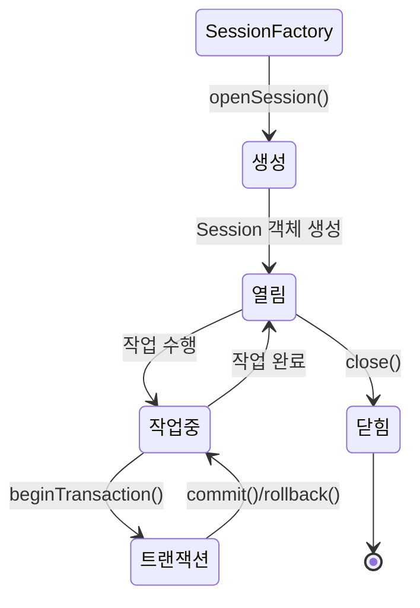
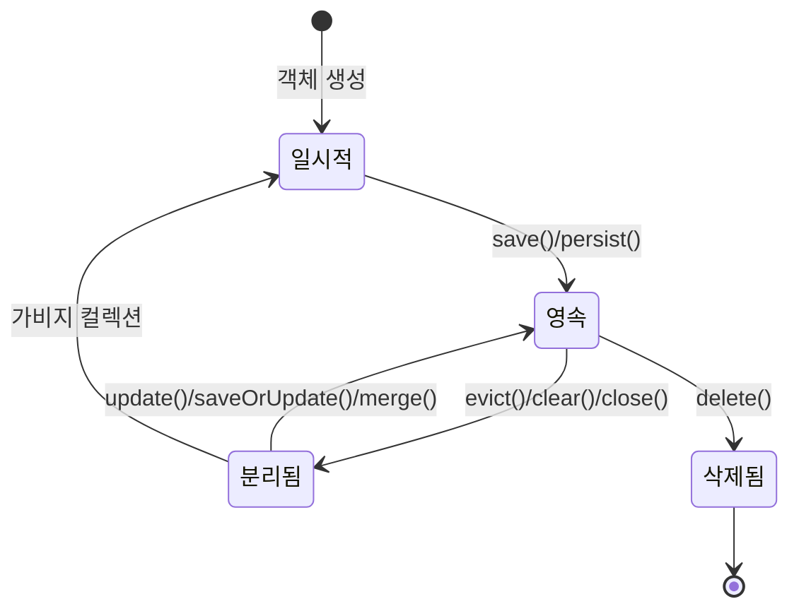

Hibernate Session은 Java 애플리케이션과 데이터베이스 사이의 연결을 나타내는 핵심 인터페이스입니다. Session은 특정 데이터베이스에 대한 연결을 캡슐화하고, 객체를 저장하고 조회하는 기본 단위로 작동합니다. 간단히 말해, Session은 데이터베이스 작업을 수행하기 위한 일종의 창구 역할을 합니다.

Hibernate에서 Session을 이해하는 것은 ORM(Object-Relational Mapping) 기반의 애플리케이션 개발에 필수적입니다. 효율적인 Session 관리는 애플리케이션의 성능과 안정성에 직접적인 영향을 미칩니다. 자세한 내용을 알아보기 전에 먼저 [[ORM(Object-Relational Mapping)]]에 대한 이해가 필요합니다.

## Session의 주요 특징

Session은 다음과 같은 특징을 가집니다:

1. **일시적(Transient)**: Session은 영구적이지 않으며, 짧은 단위의 작업을 수행하고 종료됩니다.
2. **격리(Isolation)**: 각 Session은 서로 독립적이며 격리되어 있습니다.
3. **일관성(Consistency)**: Session은 트랜잭션 경계 내에서 일관된 데이터 뷰를 제공합니다.
4. **캐싱**: Session은 1차 캐시를 포함하여 성능을 향상시킵니다.
5. **상태 추적**: [[엔티티(Entity)]]의 상태 변화를 추적합니다.

## Session의 생명주기

Session은 다음과 같은 생명주기를 가집니다:



1. **생성(Creation)**: SessionFactory를 통해 생성됩니다.
2. **열림(Open)**: 새로운 Session이 열리고 사용 가능한 상태가 됩니다.
3. **작업중(In Use)**: 데이터베이스 작업이 수행되는 상태입니다.
4. **트랜잭션(Transaction)**: 트랜잭션 내에서 작업이 수행됩니다.
5. **닫힘(Closed)**: 작업이 완료된 후 Session이 닫힙니다.

Session 생성 및 관리에 대한 자세한 방법은 [[Hibernate Session 관리 전략]]을 참고해주세요.

## SessionFactory와 Session의 관계

SessionFactory는 Session을 생성하는 팩토리 클래스로, 애플리케이션 전체에서 하나의 인스턴스만 유지하는 것이 일반적입니다. 반면 Session은 데이터베이스 작업을 위해 필요할 때마다 생성하고 사용 후 폐기하는 일시적인 객체입니다.

```java
// SessionFactory 생성 (애플리케이션 시작 시 한 번)
SessionFactory sessionFactory = new Configuration()
    .configure()
    .buildSessionFactory();

// Session 획득 (데이터베이스 작업이 필요할 때마다)
Session session = sessionFactory.openSession();
try {
    // 데이터베이스 작업 수행
    // ...
} finally {
    session.close(); // 사용 후 반드시 닫아야 함
}
```


## Session의 주요 메서드

Hibernate Session은 데이터베이스 작업을 위한 다양한 메서드를 제공합니다:

- **save()**: 새 엔티티를 저장합니다.
- **persist()**: 새 엔티티를 영속화합니다(save와 유사하지만 차이가 있음).
- **get()/load()**: 식별자로 엔티티를 조회합니다.
- **update()**: 분리된 엔티티를 업데이트합니다.
- **saveOrUpdate()**: 엔티티를 저장하거나 업데이트합니다.
- **delete()**: 엔티티를 삭제합니다.
- **createQuery()**: HQL 쿼리를 생성합니다.
- **createCriteria()**: Criteria 쿼리를 생성합니다(Hibernate 5.2부터 deprecated).
- **flush()**: 세션의 변경사항을 데이터베이스에 반영합니다.
- **clear()**: 세션을 비웁니다.
- **evict()**: 특정 엔티티를 세션에서 분리합니다.

## 엔티티의 상태

Hibernate에서 엔티티는 다음과 같은 상태를 가질 수 있습니다:



1. **일시적(Transient)**: 새로 생성된 객체로, 세션과 연관되지 않은 상태입니다.
2. **영속(Persistent)**: 세션에 연결되어 관리되는 상태로, 데이터베이스와 동기화됩니다.
3. **분리됨(Detached)**: 영속 상태였다가 세션이 닫히거나 evict() 등으로 분리된 상태입니다.
4. **삭제됨(Removed)**: 삭제가 예정된 상태로, 세션이 flush되면 실제로 데이터베이스에서 삭제됩니다.

엔티티 상태 관리에 대한 자세한 내용은 [[Hibernate 엔티티 상태 관리]]를 참고해주세요.

## 트랜잭션 관리

Session은 데이터베이스 [[트랜잭션(Transaction)]]과 밀접하게 관련되어 있습니다. Hibernate에서 트랜잭션을 관리하는 방법은 다음과 같습니다:

```java
Session session = sessionFactory.openSession();
Transaction tx = null;
try {
    tx = session.beginTransaction();
    
    // 데이터베이스 작업 수행
    User user = new User("username", "email@example.com");
    session.save(user);
    
    tx.commit();
} catch (Exception e) {
    if (tx != null) tx.rollback();
    throw e;
} finally {
    session.close();
}
```

스프링 프레임워크를 사용할 경우, 선언적 트랜잭션 관리를 통해 더 간편하게 트랜잭션을 관리할 수 있습니다:

```java
@Service
@Transactional
public class UserService {
    
    @Autowired
    private SessionFactory sessionFactory;
    
    public void saveUser(User user) {
        Session session = sessionFactory.getCurrentSession();
        session.save(user);
    }
}
```

트랜잭션 관리에 대한 자세한 전략은 [[Hibernate 트랜잭션 관리 전략]]을 참고해주세요.

## 캐싱 메커니즘

Hibernate Session은 내부적으로 1차 캐시(First-level Cache)를 제공합니다. 1차 캐시는 Session 범위 내에서만 유효하며, 동일한 엔티티를 여러 번 조회할 때 데이터베이스 접근을 줄여 성능을 향상시킵니다.

```java
// 첫 번째 조회: 데이터베이스에서 로드
User user1 = session.get(User.class, 1L);

// 두 번째 조회: 1차 캐시에서 바로 반환 (데이터베이스 접근 없음)
User user2 = session.get(User.class, 1L);

// user1과 user2는 같은 객체 인스턴스
System.out.println(user1 == user2); // true
```

Hibernate는 2차 캐시(Second-level Cache)도 제공하여 여러 Session 간에 데이터를 공유할 수 있습니다. 다양한 캐싱 제공자(EhCache, Infinispan 등)와 통합할 수 있습니다.

Hibernate의 캐싱 전략에 대한 자세한 내용은 [[Hibernate 캐싱 전략]]을 참고해주세요.

## Session 관리의 모범 사례

효율적인 Hibernate Session 관리를 위한 모범 사례는 다음과 같습니다:

1. **Session 수명 최소화**: Session은 필요한 작업을 수행한 후 즉시 닫아야 합니다.
2. **예외 처리**: try-catch-finally 블록을 사용하여 예외 발생 시에도 Session이 항상 닫히도록 합니다.
3. **배치 처리**: 대량의 데이터를 처리할 때는 배치 처리를 활용하여 메모리 사용량을 관리합니다.
4. **Flush 타이밍 제어**: 필요한 경우 flush() 메서드를 명시적으로 호출하여 성능을 최적화합니다.
5. **적절한 가져오기 전략**: join fetch, batch fetching 등을 활용하여 N+1 문제를 방지합니다.

```java
// 배치 처리 예시
Session session = sessionFactory.openSession();
Transaction tx = session.beginTransaction();

try {
    for (int i = 0; i < 100000; i++) {
        User user = new User("User " + i, "user" + i + "@example.com");
        session.save(user);
        
        if (i % 50 == 0) { // 50개 단위로 flush 및 clear
            session.flush();
            session.clear();
        }
    }
    tx.commit();
} catch (Exception e) {
    tx.rollback();
    throw e;
} finally {
    session.close();
}
```

더 많은 모범 사례와 성능 최적화 팁은 Hibernate 성능 최적화 기법을 참고해주세요.

## 스프링 프레임워크와 Hibernate Session 통합

스프링 프레임워크는 Hibernate Session 관리를 위한 편리한 추상화를 제공합니다. 스프링의 `HibernateTemplate` 또는 `@Repository` 어노테이션과 함께 사용할 수 있습니다:

```java
@Repository
public class UserDaoImpl implements UserDao {
    
    private SessionFactory sessionFactory;
    
    @Autowired
    public UserDaoImpl(SessionFactory sessionFactory) {
        this.sessionFactory = sessionFactory;
    }
    
    @Override
    public User findById(Long id) {
        return sessionFactory.getCurrentSession().get(User.class, id);
    }
    
    @Override
    public void save(User user) {
        sessionFactory.getCurrentSession().save(user);
    }
}
```

스프링 부트를 사용할 경우 더욱 간편하게 설정할 수 있습니다:

```java
@SpringBootApplication
public class Application {
    public static void main(String[] args) {
        SpringApplication.run(Application.class, args);
    }
}

@Entity
public class User {
    @Id
    @GeneratedValue(strategy = GenerationType.IDENTITY)
    private Long id;
    private String username;
    private String email;
    
    // 생성자, getter, setter 등
}

@Repository
public interface UserRepository extends JpaRepository<User, Long> {
    // 스프링 데이터 JPA가 구현을 자동으로 제공
}
```

스프링과 Hibernate의 통합에 대한 자세한 내용은 스프링과 Hibernate 통합을 참고해주세요.

## 자주 발생하는 문제와 해결 방법

Hibernate Session 사용 시 자주 발생하는 문제와 해결 방법은 다음과 같습니다:

1. **LazyInitializationException**: 세션이 닫힌 상태에서 지연 로딩을 시도할 때 발생합니다. 해결 방법: Open Session in View 패턴, 즉시 로딩(Eager Loading), DTO 변환 등을 고려합니다.
    
2. **N+1 쿼리 문제**: 연관 엔티티를 로딩할 때 다수의 추가 쿼리가 발생하는 문제입니다. 해결 방법: join fetch, EntityGraph, batch fetching 등을 활용합니다.
    
3. **StaleObjectStateException**: 동시성 문제로 인해 발생하는 예외입니다. 해결 방법: 낙관적 잠금(Optimistic Locking) 또는 비관적 잠금(Pessimistic Locking)을 적용합니다.
    
4. **메모리 누수**: 세션이 제대로 닫히지 않아 발생하는 문제입니다. 해결 방법: try-with-resources 구문 사용, 스프링의 트랜잭션 관리 활용 등을 고려합니다.
    

자주 발생하는 문제와 해결 방법에 대한 자세한 내용은 Hibernate 문제 해결 가이드를 참고해주세요.

## 결론

Hibernate Session은 Java 애플리케이션과 데이터베이스 간의 상호작용을 관리하는 핵심 컴포넌트입니다. 이를 효율적으로 관리하면 애플리케이션의 성능을 크게 향상시키고 안정성을 확보할 수 있습니다.

Session의 생명주기, 엔티티 상태 관리, 트랜잭션 처리, 캐싱 메커니즘을 잘 이해하고 적용하는 것이 중요합니다. 또한 스프링 프레임워크와의 통합을 통해 더욱 편리하게 Hibernate를 사용할 수 있습니다.

최신 Hibernate 버전과 스프링 부트를 활용하면 보다 간편하게 JPA 기반의 애플리케이션을 개발할 수 있으며, JPA와 Hibernate의 관계에 대한 이해도 중요합니다.

## 참고 자료

- Java Persistence with Hibernate, Second Edition - Christian Bauer, Gavin King
- Spring in Action, Sixth Edition - Craig Walls
- Hibernate 공식 문서 (https://hibernate.org/orm/documentation/)
- Spring 공식 문서 (https://docs.spring.io/spring-framework/docs/current/reference/html/data-access.html)