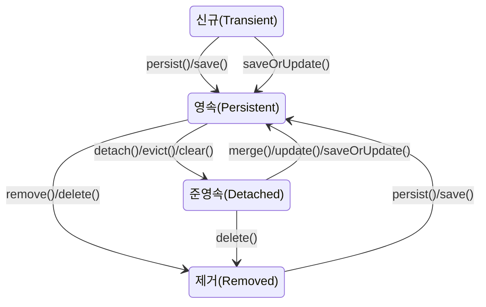

Hibernate는 Java 애플리케이션에서 객체와 관계형 데이터베이스 간의 매핑을 관리하는 [[ORM(Object-Relational Mapping)]] 프레임워크입니다. Hibernate의 핵심 개념 중 하나는 엔티티의 상태 관리입니다. 엔티티 객체는 생명주기 동안 여러 상태를 거치며, 이러한 상태에 따라 Hibernate가 해당 객체를 어떻게 처리할지가 결정됩니다.

## Hibernate 엔티티의 상태

Hibernate에서 엔티티는 다음 네 가지 주요 상태를 가질 수 있습니다:



1. **신규(Transient)**: 새로 생성된 객체로, 아직 Hibernate Session과 연관되지 않은 상태입니다. 데이터베이스와도 연결되어 있지 않습니다.
    
2. **영속(Persistent)**: Session에 의해 관리되는 상태입니다. 이 상태의 엔티티는 데이터베이스 레코드와 연결되어 있으며, Session의 변경 감지(Dirty Checking) 기능이 적용됩니다.
    
3. **준영속(Detached)**: 한때 영속 상태였지만, Session이 닫히거나 명시적으로 분리된 상태입니다. 데이터베이스 레코드와 연결은 되어 있지만, Session의 관리 대상에서 벗어났습니다.
    
4. **제거(Removed)**: 삭제 예정인 상태로, Session에서는 관리되지만 트랜잭션이 커밋될 때 데이터베이스에서 삭제됩니다.
    

## 상태 전이와 관련 메서드

### 신규(Transient) → 영속(Persistent)

엔티티 객체를 생성한 후 Session에 저장하면 영속 상태가 됩니다.

```java
User user = new User(); // 신규 상태
user.setUsername("홍길동");

session.save(user); // 또는 session.persist(user)
// 이제 user는 영속 상태
```

### 영속(Persistent) → 준영속(Detached)

Session에서 분리하거나 Session을 닫으면 준영속 상태가 됩니다.

```java
session.evict(user); // 특정 엔티티만 준영속 상태로 전환
// 또는
session.clear(); // 모든 엔티티를 준영속 상태로 전환
// 또는
session.close(); // Session 종료로 모든 엔티티가 준영속 상태가 됨
```

### 준영속(Detached) → 영속(Persistent)

준영속 상태의 엔티티를 다시 Session에 병합하면 영속 상태로 돌아갑니다.

```java
User mergedUser = (User) session.merge(user);
// 또는
session.update(user);
// 또는
session.saveOrUpdate(user);
```

### 영속(Persistent) → 제거(Removed)

영속 상태의 엔티티를 삭제하면 제거 상태가 됩니다.

```java
session.delete(user); // 또는 session.remove(user)
```

## 영속성 컨텍스트(Persistence Context)

영속성 컨텍스트는 엔티티를 관리하는 환경으로, Session을 통해 접근합니다. 이는 애플리케이션과 데이터베이스 사이의 중간 계층 역할을 합니다.

### 영속성 컨텍스트의 주요 기능

1. **1차 캐시**: 영속 상태의 엔티티는 영속성 컨텍스트 내부에 있는 1차 캐시에 저장됩니다. 동일한 엔티티를 조회할 때 데이터베이스 접근 없이 캐시에서 직접 반환합니다.
    
2. **변경 감지(Dirty Checking)**: 트랜잭션 커밋 시, 영속성 컨텍스트는 엔티티의 변경사항을 감지하여 자동으로 데이터베이스에 반영합니다.
    
3. **지연 로딩(Lazy Loading)**: 연관된 엔티티를 실제로 사용할 때까지 로딩을 지연시켜 성능을 최적화합니다.
    
4. **쓰기 지연(Write-Behind)**: SQL 쿼리를 바로 데이터베이스로 전송하지 않고, 트랜잭션 커밋 시점에 모아서 전송합니다.
    

## 스프링에서의 Hibernate 상태 관리

스프링 프레임워크와 함께 Hibernate를 사용할 때는 주로 JPA 표준 인터페이스를 통해 작업합니다. 스프링 데이터 JPA를 사용하면 다음과 같이 엔티티 상태를 관리할 수 있습니다:

```java
@Service
@Transactional
public class UserService {
    
    @Autowired
    private UserRepository userRepository;
    
    public User createUser(String username) {
        User user = new User(); // 신규 상태
        user.setUsername(username);
        return userRepository.save(user); // 영속 상태로 전환
    }
    
    public User updateUser(Long id, String newUsername) {
        User user = userRepository.findById(id).orElseThrow(); // 영속 상태
        user.setUsername(newUsername);
        // @Transactional 덕분에 변경 감지가 동작하여 별도의 save() 호출 불필요
        return user;
    }
    
    public void deleteUser(Long id) {
        userRepository.deleteById(id);
    }
}
```

## 주의할 점

### 준영속 상태와 LazyInitializationException

준영속 상태의 엔티티에서 지연 로딩(Lazy Loading)을 시도하면 `LazyInitializationException`이 발생합니다. 이는 Session이 이미 닫혀 있어 데이터베이스에 접근할 수 없기 때문입니다.

```java
// Session이 닫힌 후
User user = userService.getUser(id); // 이제 준영속 상태
// 지연 로딩으로 설정된 orders 컬렉션에 접근 시도
List<Order> orders = user.getOrders(); // LazyInitializationException 발생
```

이 문제를 해결하는 방법은 다음과 같습니다:

1. **Fetch Join 사용**: JPQL의 fetch join으로 연관 엔티티를 미리 로딩합니다.
    
    ```java
    @Query("SELECT u FROM User u JOIN FETCH u.orders WHERE u.id = :id")
    User findUserWithOrders(@Param("id") Long id);
    ```
    
2. **@Transactional 범위 확장**: 지연 로딩이 필요한 메서드까지 트랜잭션 범위를 확장합니다.
    
3. **Open Session In View 패턴**: 뷰 렌더링까지 Session을 열어두는 방식이지만, 성능 문제를 고려해야 합니다.
    

### 변경 감지와 merge

준영속 상태의 엔티티를 수정할 때는 주의가 필요합니다. 변경 감지는 영속 상태의 엔티티에만 적용되므로, 준영속 상태의 엔티티는 `merge()` 메서드를 통해 다시 영속 상태로 변환해야 합니다.

```java
// 트랜잭션 외부에서 엔티티 수정
User user = userRepository.findById(id).orElseThrow();
session.close(); // user는 이제 준영속 상태
user.setUsername("새이름");

// 다른 트랜잭션에서
User mergedUser = session.merge(user); // 영속 상태로 변환 및 변경사항 반영
// 또는 Spring Data JPA 사용 시
mergedUser = userRepository.save(user);
```

## Hibernate 캐시 수준

Hibernate는 두 가지 주요 캐시 수준을 제공합니다:

1. **1차 캐시(Session 수준)**: Session 내에서만 유효하며, 기본적으로 활성화되어 있습니다.
    
2. **2차 캐시(SessionFactory 수준)**: 여러 Session 간에 공유되는 캐시로, 별도 설정이 필요합니다.
    

자세한 내용은 [[Hibernate 캐싱 전략]]을 참고해주세요.

## Entity Manager와 Session

JPA의 EntityManager와 Hibernate의 Session은 동일한 역할을 합니다. 스프링에서 JPA를 사용할 때 내부적으로는 Hibernate Session이 사용됩니다.

```java
// JPA 표준 방식
@PersistenceContext
private EntityManager entityManager;

// Hibernate Session 가져오기 (필요한 경우)
Session session = entityManager.unwrap(Session.class);
```

## 결론

Hibernate의 엔티티 상태 관리를 이해하는 것은 ORM을 효과적으로 사용하는 데 매우 중요합니다. 엔티티의 상태 변화를 제대로 관리하면 성능을 최적화하고 예측 가능한 애플리케이션 동작을 보장할 수 있습니다. 특히 준영속 상태와 관련된 이슈들을 이해하고 적절히 대응하는 것이 중요합니다.

스프링과 같은 프레임워크를 사용할 때는 대부분의 상태 관리가 자동으로 이루어지지만, 내부 동작 원리를 이해하면 더 효율적인 코드를 작성하고 문제 해결 능력을 향상시킬 수 있습니다.

[[Hibernate 성능 최적화 기법]]과 [[JPA 영속성 관리]]에 대해 더 자세히 알아보는 것을 추천합니다.