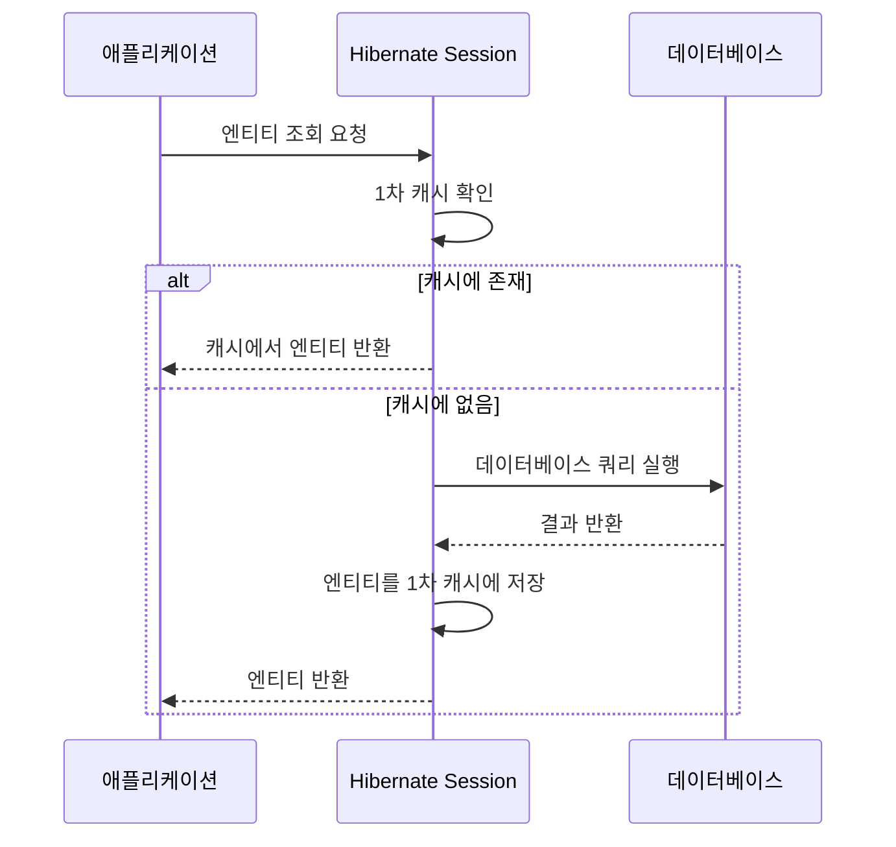
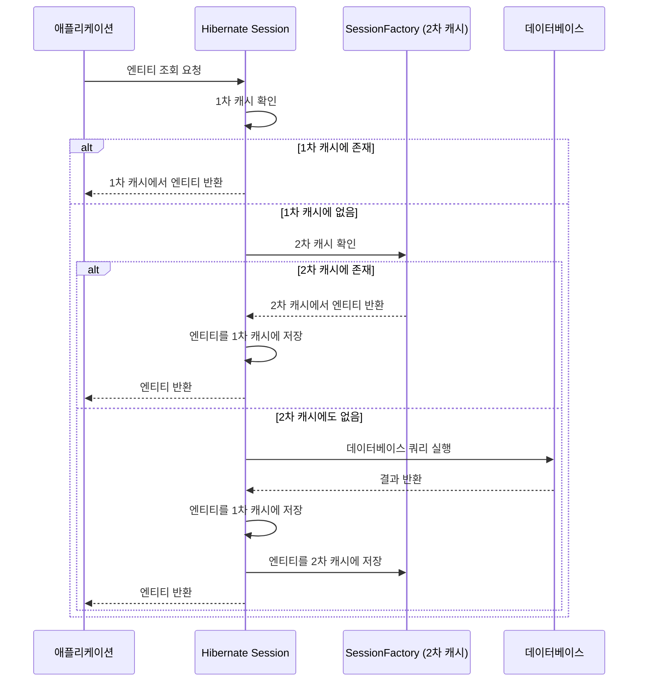

Hibernate는 자바 생태계에서 가장 널리 사용되는 [[ORM(Object-Relational Mapping)]] 프레임워크입니다. 데이터베이스 액세스의 효율성을 높이기 위해 Hibernate는 다양한 캐싱 전략을 제공하며, 이를 통해 애플리케이션의 성능을 크게 향상시킬 수 있습니다. 이 글에서는 Hibernate의 캐싱 메커니즘과 다양한 캐싱 전략에 대해 자세히 알아보겠습니다.

## Hibernate 캐싱이란?

Hibernate [[캐싱(Caching)]]은 데이터베이스 쿼리 수를 줄이고 애플리케이션 성능을 향상시키는 메커니즘입니다. 한번 조회한 데이터를 메모리에 저장해두고 동일한 데이터가 필요할 때 데이터베이스에 다시 접근하지 않고 메모리에서 가져오는 방식으로 작동합니다.

Hibernate는 크게 두 가지 수준의 캐시를 제공합니다:

1. **1차 캐시(Session 캐시)** - 기본 제공되며 비활성화할 수 없음
2. **2차 캐시(SessionFactory 캐시)** - 선택적으로 활성화할 수 있음

## 1차 캐시(Session 캐시)

1차 캐시는 [[Hibernate Session]]수준에서 작동하는 캐시입니다. Session이 열려있는 동안에만 유효하며, Session이 닫히면 캐시도 함께 소멸합니다.

### 1차 캐시의 특징

- **트랜잭션 범위** - 단일 트랜잭션 내에서만 유효합니다.
- **자동 활성화** - 별도의 설정 없이 항상 활성화되어 있습니다.
- **영속성 컨텍스트** - JPA의 영속성 컨텍스트 자체가 1차 캐시 역할을 합니다.

### 1차 캐시의 작동 방식



### 1차 캐시 예시

```java
// 동일한 ID로 두 번 조회할 경우, 두 번째는 DB 조회 없이 캐시에서 가져옴
Session session = sessionFactory.openSession();
try {
    // 첫 번째 조회 - 데이터베이스에서 로드
    User user1 = session.get(User.class, 1L);
    
    // 두 번째 조회 - 1차 캐시에서 로드 (DB 접근 없음)
    User user2 = session.get(User.class, 1L);
    
    // user1과 user2는 동일한 객체 참조
    System.out.println(user1 == user2); // true 출력
} finally {
    session.close(); // 세션 종료 시 1차 캐시도 제거됨
}
```

## 2차 캐시(SessionFactory 캐시)

2차 캐시는 SessionFactory 수준에서 작동하며, 여러 Session과 트랜잭션 간에 데이터를 공유할 수 있습니다. 애플리케이션 전체에서 공유되므로 더 넓은 범위의 캐싱을 제공합니다.

### 2차 캐시의 특징

- **애플리케이션 범위** - 애플리케이션 전체에서 공유됩니다.
- **선택적 활성화** - 명시적인 설정을 통해 활성화해야 합니다.
- **외부 캐시 제공자** - EhCache, Hazelcast, Redis 등의 외부 캐시 프로바이더를 사용합니다.

### 2차 캐시 구성 요소

2차 캐시는 다음과 같은 구성 요소로 이루어져 있습니다:

1. **엔티티 캐시** - 엔티티 객체를 캐싱합니다.
2. **컬렉션 캐시** - 엔티티의 컬렉션을 캐싱합니다.
3. **쿼리 캐시** - 쿼리와 그 결과를 캐싱합니다.

### 2차 캐시의 작동 방식



## Hibernate 캐싱 전략

Hibernate는 다양한 캐싱 전략을 제공하며, 각 전략은 특정 사용 사례에 맞게 최적화되어 있습니다.

### 1. 읽기 전용(Read-Only) 전략

변경되지 않는 데이터에 적합한 전략입니다. 캐시된 데이터는 절대 변경되지 않으므로 동시성 문제가 발생하지 않습니다.

- **장점**: 가장 성능이 좋고 오버헤드가 적습니다.
- **단점**: 캐시된 엔티티를 수정할 수 없습니다.
- **적합한 경우**: 참조 데이터, 코드 테이블, 설정 값 등 자주 변경되지 않는 데이터

### 2. 읽기-쓰기(Read-Write) 전략

데이터 변경이 가능하며, 트랜잭션 격리성을 보장합니다.

- **장점**: 데이터 일관성을 유지하면서 수정 가능합니다.
- **단점**: 읽기 전용보다 성능이 다소 떨어집니다.
- **적합한 경우**: 자주 읽지만 가끔 수정이 필요한 데이터

### 3. 비선점적(Nonstrict-Read-Write) 전략

읽기-쓰기보다 느슨한 일관성을 제공합니다. 데이터가 동시에 수정될 가능성이 낮은 경우 적합합니다.

- **장점**: 읽기-쓰기보다 성능이 좋습니다.
- **단점**: 엄격한 트랜잭션 격리성을 보장하지 않습니다.
- **적합한 경우**: 동시 수정 가능성이 낮은 데이터

### 4. 트랜잭션(Transactional) 전략

JTA(Java Transaction API) 환경에서 트랜잭션 격리 수준을 캐시에 반영합니다.

- **장점**: 높은 일관성과 트랜잭션 격리성을 제공합니다.
- **단점**: 복잡하며 JTA 환경이 필요합니다.
- **적합한 경우**: 엄격한 트랜잭션 격리가 필요한 다중 데이터베이스 환경

## 캐시 프로바이더

Hibernate는 다양한 캐시 프로바이더를 지원합니다. 각 프로바이더는 고유한 특징과 장단점을 가지고 있습니다.

### 1. EhCache

- **특징**: 가장 널리 사용되는 Hibernate 캐시 프로바이더입니다.
- **장점**: 설정이 간단하고 문서화가 잘 되어 있습니다.
- **적합한 경우**: 대부분의 단일 서버 애플리케이션

### 2. Hazelcast

- **특징**: 분산 캐싱 기능을 제공합니다.
- **장점**: 확장성이 좋고 클러스터링을 지원합니다.
- **적합한 경우**: 멀티 서버 환경과 클러스터링이 필요한 경우

### 3. Redis

- **특징**: 인메모리 데이터 구조 저장소로 고성능을 제공합니다.
- **장점**: 다양한 데이터 구조를 지원하고 영속성을 제공합니다.
- **적합한 경우**: 고성능과 영속성이 모두 필요한 대규모 애플리케이션

### 4. Infinispan

- **특징**: Red Hat에서 개발한 분산 캐시 솔루션입니다.
- **장점**: 트랜잭션 지원이 우수하고 JBoss와 통합이 쉽습니다.
- **적합한 경우**: JBoss/WildFly 환경의 애플리케이션

## Spring Boot에서 Hibernate 캐싱 설정

Spring Boot 애플리케이션에서 Hibernate 캐싱을 설정하는 방법을 살펴보겠습니다.

### 기본 설정

1. 의존성 추가 (build.gradle 또는 pom.xml)

```gradle
// EhCache 사용 시
implementation 'org.hibernate:hibernate-ehcache'
implementation 'net.sf.ehcache:ehcache'
```

2. application.properties 설정

```properties
# 2차 캐시 활성화
spring.jpa.properties.hibernate.cache.use_second_level_cache=true

# 쿼리 캐시 활성화
spring.jpa.properties.hibernate.cache.use_query_cache=true

# 캐시 프로바이더 설정 (EhCache)
spring.jpa.properties.hibernate.cache.region.factory_class=org.hibernate.cache.ehcache.EhCacheRegionFactory

# 캐싱 디버깅 (선택사항)
spring.jpa.properties.hibernate.generate_statistics=true
```

3. ehcache.xml 설정 (src/main/resources 디렉토리에 생성)

```xml
<ehcache>
    <diskStore path="java.io.tmpdir"/>
    
    <!-- 기본 캐시 설정 -->
    <defaultCache
        maxElementsInMemory="10000"
        eternal="false"
        timeToIdleSeconds="120"
        timeToLiveSeconds="120"
        overflowToDisk="true"
        diskPersistent="false"
        diskExpiryThreadIntervalSeconds="120"/>
    
    <!-- User 엔티티 캐시 -->
    <cache name="com.example.entity.User"
        maxElementsInMemory="10000"
        eternal="false"
        timeToIdleSeconds="300"
        timeToLiveSeconds="600"
        overflowToDisk="true"/>
        
    <!-- 쿼리 캐시 -->
    <cache name="org.hibernate.cache.internal.StandardQueryCache"
        maxElementsInMemory="5000"
        eternal="false"
        timeToLiveSeconds="120"
        overflowToDisk="true"/>
        
    <!-- 타임스탬프 캐시 -->
    <cache name="org.hibernate.cache.spi.UpdateTimestampsCache"
        maxElementsInMemory="5000"
        eternal="true"
        overflowToDisk="true"/>
</ehcache>
```

### 엔티티에 캐시 적용

```java
import org.hibernate.annotations.Cache;
import org.hibernate.annotations.CacheConcurrencyStrategy;

import javax.persistence.*;
import java.util.ArrayList;
import java.util.List;

@Entity
@Cacheable
@Cache(usage = CacheConcurrencyStrategy.READ_WRITE)
public class Product {
    
    @Id
    @GeneratedValue(strategy = GenerationType.IDENTITY)
    private Long id;
    
    private String name;
    private Double price;
    
    @OneToMany(mappedBy = "product", cascade = CascadeType.ALL)
    @Cache(usage = CacheConcurrencyStrategy.READ_WRITE)
    private List<Review> reviews = new ArrayList<>();
    
    // 생성자, 게터, 세터 생략
}
```

### 쿼리 캐시 사용

```java
@Repository
public class ProductRepository extends JpaRepository<Product, Long> {
    
    @QueryHints({@QueryHint(name = "org.hibernate.cacheable", value = "true")})
    @Query("SELECT p FROM Product p WHERE p.price > :minPrice")
    List<Product> findProductsAbovePrice(@Param("minPrice") Double minPrice);
}
```

## 캐싱 전략 선택 가이드

적절한 캐싱 전략과 설정을 선택하는 것은 애플리케이션의 성능에 큰 영향을 미칩니다. 다음은 상황별 캐싱 전략 선택 가이드입니다.

### 데이터 유형별 권장 전략

1. **자주 읽고 거의 수정하지 않는 데이터**
    
    - 권장 전략: 읽기 전용(Read-Only)
    - 예시: 국가 코드, 통화 코드, 카테고리 정보
2. **자주 읽고 가끔 수정하는 데이터**
    
    - 권장 전략: 읽기-쓰기(Read-Write)
    - 예시: 제품 정보, 사용자 프로필
3. **빈번하게 수정되는 데이터**
    
    - 권장 사항: 캐싱하지 않거나 매우 짧은 TTL(Time-To-Live) 설정
    - 예시: 재고 수량, 실시간 가격 정보

### 시스템 아키텍처별 권장 프로바이더

1. **단일 서버 애플리케이션**
    - 권장 프로바이더: EhCache
2. **다중 서버 환경 (클러스터링 필요)**
    - 권장 프로바이더: Hazelcast, Redis, Infinispan
3. **고가용성이 필요한 엔터프라이즈 환경**
    - 권장 프로바이더: Redis, Infinispan

자세한 캐싱 전략 선택 방법은 [[Hibernate 캐싱 전략]]를 참고해주세요.

## 성능 모니터링 및 최적화

Hibernate 캐싱을 최적화하기 위해서는 성능 모니터링이 필수적입니다.

### 캐시 통계 확인

```java
@Autowired
private EntityManagerFactory entityManagerFactory;

public void printCacheStatistics() {
    SessionFactory sessionFactory = entityManagerFactory.unwrap(SessionFactory.class);
    Statistics stats = sessionFactory.getStatistics();
    
    System.out.println("Second Level Cache Hit Count: " + stats.getSecondLevelCacheHitCount());
    System.out.println("Second Level Cache Miss Count: " + stats.getSecondLevelCacheMissCount());
    System.out.println("Second Level Cache Put Count: " + stats.getSecondLevelCachePutCount());
}
```

### 캐시 히트율 계산

```
캐시 히트율 = 캐시 히트 수 / (캐시 히트 수 + 캐시 미스 수) * 100
```

캐시 히트율이 낮다면 캐싱 설정을 재검토하고 최적화해야 합니다.

성능 모니터링 및 최적화에 대한 자세한 내용은 Hibernate 성능 모니터링과 최적화를 참고해주세요.

## 주의사항 및 모범 사례

Hibernate 캐싱을 사용할 때 몇 가지 주의해야 할 점들이 있습니다.

### 주의사항

1. **메모리 사용량 관리**
    
    - 너무 많은 데이터를 캐싱하면 메모리 부족 문제가 발생할 수 있습니다.
    - 캐시 사이즈와 만료 정책을 적절히 설정하세요.
2. **캐시 일관성**
    
    - 다중 서버 환경에서는 캐시 일관성 문제가 발생할 수 있습니다.
    - 분산 캐시 솔루션을 사용하거나 적절한 무효화 전략을 수립하세요.
3. **쿼리 캐시 사용 주의**
    
    - 쿼리 캐시는 오버헤드가 클 수 있으므로 자주 변경되지 않는 데이터에만 사용하세요.
    - 테이블 수정 시 관련 쿼리 캐시가 모두 무효화됩니다.

### 모범 사례

1. **선택적 캐싱**
    
    - 모든 엔티티를 캐싱하지 말고, 필요한 엔티티만 선택적으로 캐싱하세요.
    - 자주 접근하지만 자주 변경되지 않는 데이터를 우선적으로 캐싱하세요.
2. **적절한 캐시 사이즈 설정**
    
    - 캐시 사이즈를 너무 크게 설정하면 가비지 컬렉션 오버헤드가 발생할 수 있습니다.
    - 실제 데이터 양과 애플리케이션 메모리를 고려하여 적절히 설정하세요.
3. **캐시 만료 정책 설정**
    
    - 데이터의 변경 빈도에 따라 적절한 TTL을 설정하세요.
    - 참조 데이터는 길게, 자주 변경되는 데이터는 짧게 설정하세요.

자세한 모범 사례는 Hibernate 캐싱 모범 사례를 참고해주세요.

## 결론

Hibernate 캐싱은 애플리케이션 성능을 향상시키는 강력한 도구입니다. 1차 캐시를 통해 단일 트랜잭션 내에서의 성능을, 2차 캐시를 통해 전체 애플리케이션의 성능을 최적화할 수 있습니다.

하지만 캐싱은 만능이 아니며, 적절한 전략과 설정이 필요합니다. 데이터의 특성, 접근 패턴, 변경 빈도 등을 고려하여 최적의 캐싱 전략을 선택하고, 지속적인 모니터링과 튜닝을 통해 최적의 성능을 유지하는 것이 중요합니다.

적절히 설계된 캐싱 전략은 데이터베이스 부하를 줄이고, 응답 시간을 개선하며, 시스템의 확장성을 높여줍니다. Hibernate 캐싱을 효과적으로 활용하여 고성능 애플리케이션을 구축하세요.

## 참고 자료

- Hibernate 공식 문서 (https://hibernate.org/orm/documentation/)
- Spring Data JPA 공식 문서 (https://docs.spring.io/spring-data/jpa/docs/current/reference/html/)
- 'High-Performance Java Persistence' - Vlad Mihalcea
- 'Java Persistence with Hibernate' - Christian Bauer, Gavin King