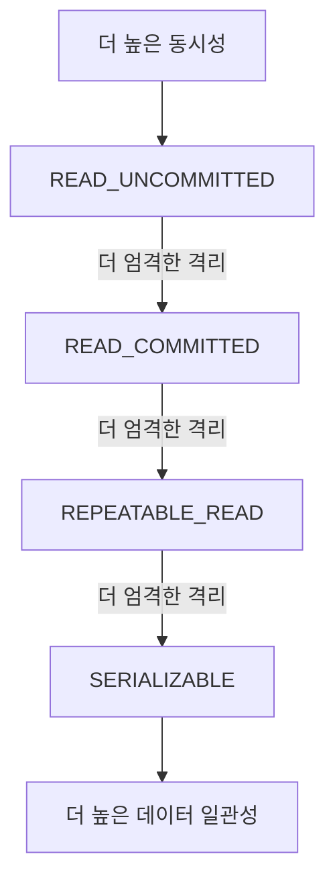

Hibernate에서 [[트랜잭션(Transaction)]]을 관리하는 방법은 크게 두 가지로 나눌 수 있습니다:

1. **로컬 트랜잭션 관리**: [[Hibernate Session]]을 직접 사용하는 방식
2. **글로벌(JTA) 트랜잭션 관리**: [[Java Transaction API (JTA)]]를 사용하는 방식

각 방식의 특징과 사용법에 대해 자세히 알아보겠습니다.

## 로컬 트랜잭션 관리

로컬 트랜잭션은 단일 데이터베이스에 대한 작업에 적합합니다. Hibernate Session 인터페이스를 통해 직접 트랜잭션을 관리합니다.

```java
Session session = sessionFactory.openSession();
Transaction tx = null;

try {
    tx = session.beginTransaction();
    
    // 데이터베이스 작업 수행
    Employee employee = new Employee();
    employee.setName("홍길동");
    employee.setDepartment("개발팀");
    
    session.save(employee);
    
    tx.commit();
} catch (Exception e) {
    if (tx != null) {
        tx.rollback();
    }
    e.printStackTrace();
} finally {
    session.close();
}
```

로컬 트랜잭션은 구현이 간단하지만, 여러 데이터베이스나 JMS와 같은 다른 트랜잭션 리소스와 함께 사용할 수 없는 한계가 있습니다.

## 글로벌(JTA) 트랜잭션 관리

JTA(Java Transaction API)를 사용한 글로벌 트랜잭션은 여러 트랜잭션 리소스(다중 데이터베이스, JMS 큐 등)에 걸친 작업이 필요할 때 사용합니다. 이를 위해서는 JTA 호환 트랜잭션 매니저가 필요합니다.

```java
@Autowired
private UserTransaction userTransaction;

@Autowired
private SessionFactory sessionFactory;

public void performTransactionalOperation() throws Exception {
    userTransaction.begin();
    
    try {
        Session session = sessionFactory.getCurrentSession();
        
        // 데이터베이스 작업 수행
        Employee employee = new Employee();
        employee.setName("홍길동");
        employee.setDepartment("개발팀");
        
        session.save(employee);
        
        // 다른 트랜잭션 리소스에 대한 작업도 가능
        
        userTransaction.commit();
    } catch (Exception e) {
        userTransaction.rollback();
        throw e;
    }
}
```

글로벌 트랜잭션은 구현이 복잡하지만, 분산 트랜잭션을 지원하여 시스템 통합에 유리합니다.

## 스프링과 함께 사용하는 Hibernate 트랜잭션 관리

스프링 프레임워크는 Hibernate의 트랜잭션 관리를 크게 단순화합니다. 스프링의 선언적 트랜잭션 관리를 사용하면 코드 내에서 트랜잭션 경계를 명시적으로 정의할 필요가 없습니다.

### @Transactional 어노테이션

스프링에서는 `@Transactional` 어노테이션을 사용하여 트랜잭션 경계를 선언적으로 정의할 수 있습니다:

```java
@Service
public class EmployeeService {
    
    @Autowired
    private EmployeeRepository employeeRepository;
    
    @Transactional
    public void addEmployee(Employee employee) {
        employeeRepository.save(employee);
        
        // 예외가 발생하면 자동으로 롤백됩니다
        if (employee.getName() == null) {
            throw new IllegalArgumentException("이름은 필수 입력 항목입니다.");
        }
    }
}
```

`@Transactional` 어노테이션을 사용하려면 스프링 설정에서 트랜잭션 관리자를 정의해야 합니다:

```java
@Configuration
@EnableTransactionManagement
public class HibernateConfig {
    
    @Bean
    public LocalSessionFactoryBean sessionFactory() {
        // SessionFactory 설정
    }
    
    @Bean
    public PlatformTransactionManager hibernateTransactionManager() {
        HibernateTransactionManager transactionManager = new HibernateTransactionManager();
        transactionManager.setSessionFactory(sessionFactory().getObject());
        return transactionManager;
    }
}
```

스프링의 선언적 트랜잭션 관리에 대한 자세한 내용은 [[스프링 트랜잭션 관리]]를 참고해주세요.

## 트랜잭션 전파(Propagation) 속성

트랜잭션 전파는 이미 진행 중인 트랜잭션이 있을 때 새로운 트랜잭션 메서드가 호출되었을 때의 동작을 정의합니다. 스프링에서는 다음과 같은 전파 속성을 제공합니다:

1. **REQUIRED**: 기본값으로, 현재 트랜잭션이 있으면 그 트랜잭션을 사용하고, 없으면 새 트랜잭션을 생성합니다.
2. **REQUIRES_NEW**: 항상 새로운 트랜잭션을 생성하며, 기존 트랜잭션은 일시 중단됩니다.
3. **SUPPORTS**: 현재 트랜잭션이 있으면 그 트랜잭션을 사용하고, 없으면 트랜잭션 없이 실행합니다.
4. **NOT_SUPPORTED**: 트랜잭션 없이 실행하며, 현재 트랜잭션이 있으면 일시 중단합니다.
5. **MANDATORY**: 현재 트랜잭션이 있어야 하며, 없으면 예외가 발생합니다.
6. **NEVER**: 트랜잭션 없이 실행하며, 현재 트랜잭션이 있으면 예외가 발생합니다.
7. **NESTED**: 현재 트랜잭션이 있으면 중첩 트랜잭션을 생성하고, 없으면 REQUIRED와 같이 동작합니다.

```java
@Transactional(propagation = Propagation.REQUIRES_NEW)
public void processPayment(Payment payment) {
    // 항상 새로운 트랜잭션에서 실행됩니다
}
```

트랜잭션 전파에 대한 자세한 내용은 [[트랜잭션 전파 속성]]을 참고해주세요.

## 트랜잭션 격리 수준(Isolation Level)

격리 수준은 동시에 실행되는 트랜잭션들 사이의 상호작용을 정의합니다. 낮은 격리 수준은 더 높은 동시성을 제공하지만 더 많은 [[트랜잭션 이상 현상(Transaction Anomalies)]]을 허용합니다.



스프링에서는 다음과 같은 격리 수준을 제공합니다:

1. **DEFAULT**: 데이터베이스의 기본 격리 수준을 사용합니다.
2. **READ_UNCOMMITTED**: 다른 트랜잭션의 커밋되지 않은 변경사항을 읽을 수 있습니다.
3. **READ_COMMITTED**: 다른 트랜잭션의 커밋된 변경사항만 읽을 수 있습니다.
4. **REPEATABLE_READ**: 한 트랜잭션 내에서 같은 데이터를 여러 번 읽을 때 일관된 결과를 보장합니다.
5. **SERIALIZABLE**: 가장 엄격한 격리 수준으로, 완전한 데이터 일관성을 보장하지만 동시성이 크게 저하됩니다.

```java
@Transactional(isolation = Isolation.READ_COMMITTED)
public List<Employee> getAllEmployees() {
    return employeeRepository.findAll();
}
```

격리 수준에 대한 자세한 내용은 [[트랜잭션 격리 수준]]을 참고해주세요.

## 트랜잭션 타임아웃 및 읽기 전용 속성

스프링은 트랜잭션의 타임아웃과 읽기 전용 속성을 설정할 수 있는 기능을 제공합니다:

```java
@Transactional(timeout = 30, readOnly = true)
public List<Employee> getEmployeesByDepartment(String department) {
    return employeeRepository.findByDepartment(department);
}
```

- **timeout**: 트랜잭션의 최대 실행 시간(초)을 지정합니다. 초과 시 롤백됩니다.
- **readOnly**: 트랜잭션이 데이터를 수정하지 않음을 나타냅니다. 일부 데이터베이스에서는 최적화에 도움이 됩니다.

## Hibernate 세션 관리와 트랜잭션

Hibernate 세션은 데이터베이스 연결을 추상화하고 영속성 컨텍스트(Persistence Context)를 제공합니다. 트랜잭션 관리에서 세션 관리는 중요한 역할을 합니다.

### 세션 관리 패턴

1. **트랜잭션당 세션 패턴(Session-per-transaction)**: 각 트랜잭션마다 새로운 세션을 생성하고 트랜잭션이 끝나면 세션을 닫습니다.
2. **요청당 세션 패턴(Session-per-request)**: HTTP 요청과 같은 클라이언트 요청마다 하나의 세션을 사용합니다.
3. **대화당 세션 패턴(Session-per-conversation)**: 여러 요청에 걸쳐 하나의 세션을 유지합니다.

스프링과 Hibernate를 함께 사용할 때는 일반적으로 OpenSessionInViewFilter 또는 OpenSessionInViewInterceptor를 사용하여 요청당 세션 패턴을 구현합니다.

세션 관리 패턴에 대한 자세한 내용은 [[Hibernate 세션 관리 패턴]]을 참고해주세요.

## 낙관적 락(Optimistic Locking)과 비관적 락(Pessimistic Locking)

Hibernate는 동시성 제어를 위해 두 가지 락킹 전략을 제공합니다:

### 낙관적 락(Optimistic Locking)

낙관적 락은 충돌이 드물게 발생한다고 가정하며, 버전 번호나 타임스탬프를 사용하여 충돌을 감지합니다.

```java
@Entity
public class Employee {
    @Id
    @GeneratedValue
    private Long id;
    
    private String name;
    
    @Version
    private Integer version;
    
    // getters and setters
}
```

### 비관적 락(Pessimistic Locking)

비관적 락은 충돌이 자주 발생한다고 가정하며, 데이터베이스 수준의 락을 사용하여 동시 접근을 제한합니다.

```java
@Transactional
public Employee updateEmployeeSalary(Long id, BigDecimal newSalary) {
    Employee employee = entityManager.find(
        Employee.class, id, LockModeType.PESSIMISTIC_WRITE);
    
    employee.setSalary(newSalary);
    return employee;
}
```

락킹 전략에 대한 자세한 내용은 [[Hibernate 락킹 전략]]을 참고해주세요.

## 트랜잭션 관리의 모범 사례

효과적인 Hibernate 트랜잭션 관리를 위한 몇 가지 모범 사례를 소개합니다:

1. **트랜잭션은 짧게 유지**: 트랜잭션 시간이 길수록 락 유지 시간이 늘어나고 동시성이 저하됩니다.
2. **서비스 계층에서 트랜잭션 관리**: 비즈니스 로직이 있는 서비스 계층에서 트랜잭션 경계를 설정합니다.
3. **적절한 격리 수준 선택**: 애플리케이션 요구사항에 맞는 최소한의 격리 수준을 선택합니다.
4. **명시적 잠금 최소화**: 가능한 낙관적 락을 사용하고 비관적 락은 필요한 경우에만 사용합니다.
5. **예외 처리 전략 수립**: 트랜잭션 실패 시 어떻게 처리할지 명확한 전략을 수립합니다.

자세한 모범 사례는 [[Hibernate 트랜잭션 관리 모범 사례]]를 참고해주세요.

## 스프링 부트에서의 트랜잭션 관리

스프링 부트는 자동 설정을 통해 Hibernate 트랜잭션 관리를 더욱 단순화합니다. 기본적으로 DataSource와 EntityManagerFactory가 설정되어 있으면 트랜잭션 관리자도 자동으로 설정됩니다.

```java
@SpringBootApplication
public class Application {
    
    public static void main(String[] args) {
        SpringApplication.run(Application.class, args);
    }
}

@Service
public class EmployeeService {
    
    @Autowired
    private EmployeeRepository employeeRepository;
    
    @Transactional
    public void transferDepartment(Long employeeId, String newDepartment) {
        Employee employee = employeeRepository.findById(employeeId)
            .orElseThrow(() -> new NotFoundException("직원을 찾을 수 없습니다."));
        
        employee.setDepartment(newDepartment);
        employeeRepository.save(employee);
    }
}
```

스프링 부트의 트랜잭션 관리에 대한 자세한 내용은 [[스프링 부트 트랜잭션 관리]]를 참고해주세요.

## 분산 트랜잭션과 XA

여러 데이터 소스에 걸친 작업이 필요한 경우, JTA를 사용한 분산 트랜잭션(XA)을 고려할 수 있습니다. 하지만 분산 트랜잭션은 성능 오버헤드가 크므로 가능하면 대안을 고려하는 것이 좋습니다.

분산 트랜잭션의 대안으로는 [[보상 트랜잭션(Compensating Transaction)]]이나 [[이벤트 기반 트랜잭션]]과 같은 패턴이 있습니다.

분산 트랜잭션에 대한 자세한 내용은 [[분산 트랜잭션 관리]]를 참고해주세요.

## 트랜잭션 모니터링 및 디버깅

Hibernate 트랜잭션을 모니터링하고 디버깅하는 방법에는 여러 가지가 있습니다:

1. **로깅 활성화**: Hibernate SQL 로깅을 활성화하여 실행되는 SQL 문을 확인합니다.
    
    ```properties
    logging.level.org.hibernate.SQL=DEBUG
    logging.level.org.hibernate.type.descriptor.sql.BasicBinder=TRACE
    ```
    
2. **트랜잭션 관련 메트릭 수집**: Micrometer와 같은 도구를 사용하여 트랜잭션 성능 메트릭을 수집합니다.
    
3. **데이터베이스 모니터링 도구 활용**: 데이터베이스 모니터링 도구를 사용하여 트랜잭션 동작을 관찰합니다.
    

트랜잭션 모니터링에 대한 자세한 내용은 [[Hibernate 트랜잭션 모니터링]]을 참고해주세요.

## 결론

Hibernate 트랜잭션 관리는 데이터 일관성을 유지하고 애플리케이션 성능을 최적화하는 데 중요한 역할을 합니다. 로컬 트랜잭션과 글로벌 트랜잭션 중 애플리케이션 요구사항에 맞는 방식을 선택하고, 스프링과 같은 프레임워크를 활용하여 트랜잭션 관리를 단순화할 수 있습니다.

효과적인 트랜잭션 관리를 위해서는 트랜잭션 전파, 격리 수준, 락킹 전략 등에 대한 이해가 필요하며, 이러한 지식을 바탕으로 애플리케이션의 데이터 무결성과 성능을 모두 만족시키는 전략을 수립할 수 있습니다.

## 참고 자료

- Java Persistence with Hibernate, Second Edition - Christian Bauer, Gavin King
- 스프링 공식 문서(https://docs.spring.io/spring-framework/docs/current/reference/html/data-access.html)
- Hibernate 공식 문서(https://hibernate.org/orm/documentation/)