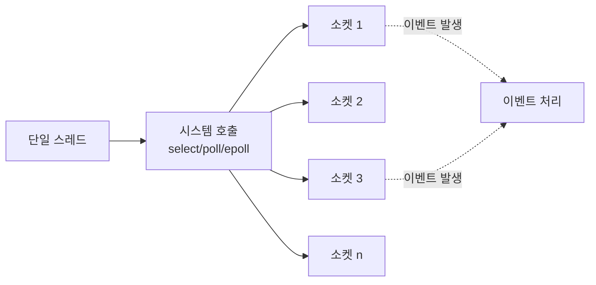
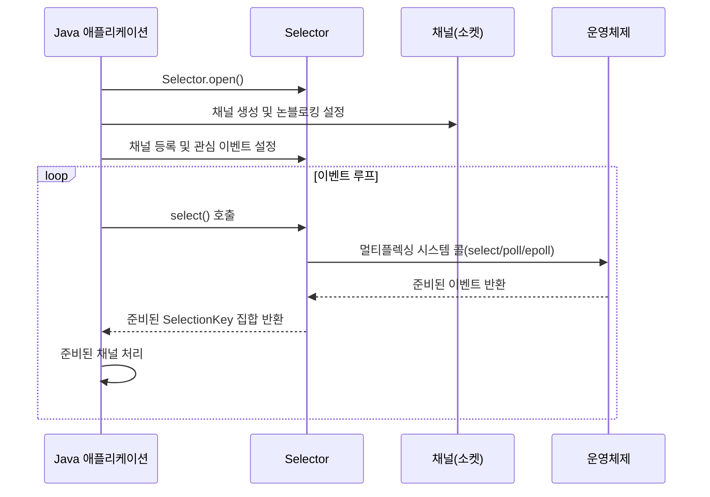

I/O 멀티플렉싱은 단일 프로세스(또는 스레드)가 여러 입출력 채널을 동시에 모니터링하고 처리할 수 있게 하는 기술입니다. 이 기술은 고성능 네트워크 서버 개발에서 핵심적인 역할을 하며, 제한된 시스템 리소스로 수천 개의 연결을 효율적으로 처리할 수 있게 합니다. I/O 멀티플렉싱의 이해를 위해서는 [[동기(Synchronous)]]와 [[비동기(Asynchronous)]]및 [[블로킹(blocking)]]과 [[논블로킹(Non-blocking)]]의 개념을 이해하는 것이 중요합니다.

## I/O 멀티플렉싱의 기본 개념

I/O 멀티플렉싱은 기본적으로 하나의 스레드가 여러 I/O 소스를 감시하다가, 특정 소스에서 이벤트가 발생하면 해당 이벤트를 처리하는 방식으로 동작합니다. 이는 각 연결마다 별도의 스레드를 할당하는 전통적인 방식과 대비됩니다.



멀티플렉싱의 핵심은 여러 I/O 작업을 동시에 감시하는 것입니다. 시스템은 I/O 작업이 준비될 때까지 블로킹하지만, 단일 I/O 작업이 아닌 여러 I/O 작업 중 어느 하나라도 준비되면 즉시 반환합니다.

## I/O 멀티플렉싱 메커니즘

운영 체제는 다양한 I/O 멀티플렉싱 메커니즘을 제공합니다:

### 1. select 시스템 콜

가장 오래된 멀티플렉싱 메커니즘으로, POSIX 표준의 일부입니다.

```c
int select(int nfds, fd_set *readfds, fd_set *writefds, fd_set *exceptfds, struct timeval *timeout);
```

- **원리**: 파일 디스크립터 집합을 모니터링하고, 하나 이상의 디스크립터가 준비되면 반환합니다.
- **한계**: 감시할 수 있는 파일 디스크립터 수에 제한이 있으며(보통 1024개), 호출할 때마다 모든 디스크립터를 검사하므로 비효율적입니다.

### 2. poll 시스템 콜

select의 개선된 버전으로, 파일 디스크립터 제한이 없습니다.

```c
int poll(struct pollfd *fds, nfds_t nfds, int timeout);
```

- **원리**: pollfd 구조체 배열을 사용하여 감시할 파일 디스크립터와 이벤트를 지정합니다.
- **한계**: 여전히 모든 디스크립터를 순회해야 하므로 대규모 연결에서는 성능 저하가 있습니다.

### 3. epoll (Linux)

Linux에서 제공하는 고성능 I/O 이벤트 알림 메커니즘입니다.

```c
int epoll_create(int size);
int epoll_ctl(int epfd, int op, int fd, struct epoll_event *event);
int epoll_wait(int epfd, struct epoll_event *events, int maxevents, int timeout);
```

- **원리**: 관심 있는 파일 디스크립터를 등록하고, 준비된 디스크립터만 반환받아 처리합니다.
- **장점**: O(1) 시간 복잡도로 이벤트를 감지하므로 대규모 연결에서 효율적입니다.

### 4. kqueue (BSD)

BSD 계열 시스템에서 제공하는 고성능 I/O 이벤트 알림 메커니즘입니다.

```c
int kqueue(void);
int kevent(int kq, const struct kevent *changelist, int nchanges, struct kevent *eventlist, int nevents, const struct timespec *timeout);
```

### 5. IOCP (Windows)

Windows 환경에서 제공하는 비동기 I/O 완료 포트입니다.

```c
HANDLE CreateIoCompletionPort(HANDLE FileHandle, HANDLE ExistingCompletionPort, ULONG_PTR CompletionKey, DWORD NumberOfConcurrentThreads);
```

## Java에서의 I/O 멀티플렉싱 구현

Java NIO(New I/O)는 Selector 클래스를 통해 I/O 멀티플렉싱을 지원합니다. 이는 운영 체제의 기본 멀티플렉싱 메커니즘을 추상화한 인터페이스입니다.



### Java NIO Selector 예제

```java
import java.io.IOException;
import java.net.InetSocketAddress;
import java.nio.ByteBuffer;
import java.nio.channels.SelectionKey;
import java.nio.channels.Selector;
import java.nio.channels.ServerSocketChannel;
import java.nio.channels.SocketChannel;
import java.util.Iterator;

public class NIOMultiplexingServer {
    public static void main(String[] args) throws IOException {
        // Selector 생성
        Selector selector = Selector.open();
        
        // 서버 소켓 채널 생성
        ServerSocketChannel serverChannel = ServerSocketChannel.open();
        serverChannel.socket().bind(new InetSocketAddress(8080));
        serverChannel.configureBlocking(false);
        
        // 서버 채널을 셀렉터에 등록 (연결 수락 이벤트)
        serverChannel.register(selector, SelectionKey.OP_ACCEPT);
        
        System.out.println("서버가 시작되었습니다. 포트: 8080");
        
        ByteBuffer buffer = ByteBuffer.allocate(1024);
        
        while (true) {
            // 이벤트 발생 대기 (블로킹)
            int readyChannels = selector.select();
            
            if (readyChannels == 0) {
                continue;
            }
            
            // 준비된 이벤트 처리
            Iterator<SelectionKey> keyIterator = selector.selectedKeys().iterator();
            
            while (keyIterator.hasNext()) {
                SelectionKey key = keyIterator.next();
                
                // 이미 처리된 키 제거
                keyIterator.remove();
                
                if (!key.isValid()) {
                    continue;
                }
                
                if (key.isAcceptable()) {
                    // 새 클라이언트 연결 수락
                    handleAccept(key, selector);
                } else if (key.isReadable()) {
                    // 클라이언트로부터 데이터 읽기
                    handleRead(key, buffer);
                } else if (key.isWritable()) {
                    // 클라이언트로 데이터 쓰기
                    handleWrite(key, buffer);
                }
            }
        }
    }
    
    private static void handleAccept(SelectionKey key, Selector selector) throws IOException {
        ServerSocketChannel serverChannel = (ServerSocketChannel) key.channel();
        SocketChannel clientChannel = serverChannel.accept();
        clientChannel.configureBlocking(false);
        
        // 새 클라이언트 채널을 셀렉터에 등록 (읽기 이벤트)
        clientChannel.register(selector, SelectionKey.OP_READ);
        
        System.out.println("클라이언트 연결됨: " + clientChannel.getRemoteAddress());
    }
    
    private static void handleRead(SelectionKey key, ByteBuffer buffer) throws IOException {
        SocketChannel clientChannel = (SocketChannel) key.channel();
        buffer.clear();
        
        int bytesRead;
        try {
            bytesRead = clientChannel.read(buffer);
        } catch (IOException e) {
            // 연결 종료됨
            System.out.println("클라이언트 연결 종료: " + e.getMessage());
            key.cancel();
            clientChannel.close();
            return;
        }
        
        if (bytesRead == -1) {
            // 클라이언트가 연결을 종료함
            System.out.println("클라이언트가 연결을 종료함");
            key.cancel();
            clientChannel.close();
            return;
        }
        
        // 읽은 데이터 처리
        buffer.flip();
        byte[] data = new byte[buffer.limit()];
        buffer.get(data);
        
        String message = new String(data);
        System.out.println("수신: " + message.trim());
        
        // 에코 응답 보내기 (쓰기 이벤트로 변경)
        buffer.flip();
        key.interestOps(SelectionKey.OP_WRITE);
        key.attach(buffer);
    }
    
    private static void handleWrite(SelectionKey key, ByteBuffer buffer) throws IOException {
        SocketChannel clientChannel = (SocketChannel) key.channel();
        ByteBuffer attachedBuffer = (ByteBuffer) key.attachment();
        
        clientChannel.write(attachedBuffer);
        
        // 버퍼의 모든 데이터를 썼는지 확인
        if (!attachedBuffer.hasRemaining()) {
            // 다시 읽기 모드로 변경
            key.interestOps(SelectionKey.OP_READ);
        }
    }
}
```

이 예제는 단일 스레드에서 NIO Selector를 사용하여 여러 클라이언트 연결을 처리하는 에코 서버를 보여줍니다. 자세한 NIO 활용법은 Java NIO 심화를 참고해주세요.

## I/O 멀티플렉싱 이벤트 유형

Java NIO에서 지원하는 주요 이벤트 유형은 다음과 같습니다:

1. **OP_ACCEPT**: 새로운 연결을 수락할 준비가 됨 (ServerSocketChannel에서 사용)
2. **OP_CONNECT**: 연결 작업이 완료됨 (SocketChannel에서 연결 시도 시 사용)
3. **OP_READ**: 데이터를 읽을 준비가 됨
4. **OP_WRITE**: 데이터를 쓸 준비가 됨

이러한 이벤트는 비트 마스크로 조합하여 사용할 수 있습니다. 예를 들어, 읽기와 쓰기 모두를 감시하려면 `SelectionKey.OP_READ | SelectionKey.OP_WRITE`를 사용합니다.

## I/O 멀티플렉싱의 장단점

### 장점

1. **리소스 효율성**: 적은 수의 스레드로 많은 연결을 처리할 수 있어 메모리 사용량과 컨텍스트 스위칭 오버헤드가 감소합니다.
2. **확장성**: 스레드 수에 제한받지 않고 수천 개의 연결을 처리할 수 있습니다.
3. **세밀한 제어**: 특정 소켓에서 특정 이벤트만 감시할 수 있어 세밀한 제어가 가능합니다.
4. **대기 시간 감소**: 여러 소켓을 동시에 모니터링하므로 응답 지연 시간이 줄어듭니다.

### 단점

1. **복잡성**: 블로킹 I/O보다 구현이 복잡하고 이해하기 어렵습니다.
2. **디버깅 어려움**: 비동기적 특성으로 인해 디버깅이 어려울 수 있습니다.
3. **CPU 사용량**: 많은 소켓을 감시할 경우 CPU 사용량이 증가할 수 있습니다.
4. **코드 복잡성**: 상태 관리와 이벤트 처리 로직이 복잡해질 수 있습니다.

## I/O 멀티플렉싱 성능 고려사항

### 1. 버퍼 관리

효율적인 버퍼 관리는 I/O 멀티플렉싱 성능에 큰 영향을 미칩니다. 다음 사항을 고려해야 합니다:

- **적절한 버퍼 크기**: 너무 작으면 시스템 호출 횟수가 증가하고, 너무 크면 메모리 낭비가 발생합니다.
- **직접 버퍼(Direct Buffer) 활용**: JVM 외부 메모리를 사용하는 직접 버퍼는 네이티브 I/O 작업에 효율적입니다.
- **버퍼 풀링**: 버퍼를 재사용하여 메모리 할당 및 가비지 컬렉션 오버헤드를 줄입니다.

### 2. 이벤트 처리 전략

이벤트 처리 방식에 따라 성능이 달라질 수 있습니다:

- **반응자(Reactor) 패턴**: 이벤트 루프가 이벤트를 감지하고 적절한 핸들러로 전달합니다.
- **작업자 스레드 풀**: I/O 이벤트 감지는 단일 스레드로 하고, 실제 처리는 작업자 스레드 풀로 위임합니다.
- **파이프라인 처리**: 이벤트 처리를 여러 단계로 나누어 처리합니다.

### 3. 시스템 한계 설정

운영 체제의 한계를 조정하여 성능을 최적화할 수 있습니다:

- **파일 디스크립터 제한**: 대규모 연결을 처리하려면 운영 체제의 파일 디스크립터 제한을 늘려야 합니다.
- **소켓 버퍼 크기**: TCP 소켓 버퍼 크기를 조정하여 네트워크 처리량을 최적화할 수 있습니다.
- **타임아웃 설정**: 적절한 타임아웃을 설정하여 유휴 연결을 정리합니다.

## I/O 멀티플렉싱의 실제 사용 사례

I/O 멀티플렉싱은 다양한 고성능 시스템에서 활용됩니다:

1. **웹 서버**: Nginx는 이벤트 기반 아키텍처와 I/O 멀티플렉싱을 사용하여 높은 동시성을 처리합니다.
2. **데이터베이스**: Redis, PostgreSQL 등은 내부적으로 멀티플렉싱을 사용하여 다중 연결을 관리합니다.
3. **리버스 프록시 및 로드 밸런서**: 대량의 클라이언트 연결을 효율적으로 처리합니다.
4. **채팅/메시징 서버**: 많은 사용자 연결을 유지하면서 실시간 메시지를 처리합니다.
5. **게임 서버**: 많은 플레이어의 연결과 상태를 동시에 관리합니다.

## 고급 I/O 멀티플렉싱 프레임워크

현대적인 애플리케이션에서는 저수준 I/O 멀티플렉싱을 직접 다루기보다는 고수준 프레임워크를 사용하는 것이 일반적입니다:

### 1. Netty

Netty는 Java 기반의 비동기 이벤트 기반 네트워크 애플리케이션 프레임워크로, NIO를 추상화하여 더 쉽게 사용할 수 있게 합니다.

```java
import io.netty.bootstrap.ServerBootstrap;
import io.netty.channel.*;
import io.netty.channel.nio.*;
import io.netty.channel.socket.SocketChannel;
import io.netty.channel.socket.nio.NioServerSocketChannel;
import io.netty.handler.codec.string.*;

public class NettyServer {
    public static void main(String[] args) throws Exception {
        EventLoopGroup bossGroup = new NioEventLoopGroup(1);
        EventLoopGroup workerGroup = new NioEventLoopGroup();
        
        try {
            ServerBootstrap b = new ServerBootstrap();
            b.group(bossGroup, workerGroup)
             .channel(NioServerSocketChannel.class)
             .childHandler(new ChannelInitializer<SocketChannel>() {
                 @Override
                 protected void initChannel(SocketChannel ch) {
                     ChannelPipeline p = ch.pipeline();
                     p.addLast(new StringDecoder());
                     p.addLast(new StringEncoder());
                     p.addLast(new EchoServerHandler());
                 }
             });
            
            ChannelFuture f = b.bind(8080).sync();
            f.channel().closeFuture().sync();
        } finally {
            workerGroup.shutdownGracefully();
            bossGroup.shutdownGracefully();
        }
    }
    
    static class EchoServerHandler extends SimpleChannelInboundHandler<String> {
        @Override
        protected void channelRead0(ChannelHandlerContext ctx, String msg) {
            System.out.println("수신: " + msg);
            ctx.writeAndFlush(msg); // 에코 응답
        }
        
        @Override
        public void exceptionCaught(ChannelHandlerContext ctx, Throwable cause) {
            cause.printStackTrace();
            ctx.close();
        }
    }
}
```

### 2. Vert.x

Vert.x는 JVM 상에서 동작하는 반응형 애플리케이션 플랫폼으로, 이벤트 루프 기반의 비동기 처리를 지원합니다.

```java
import io.vertx.core.AbstractVerticle;
import io.vertx.core.Vertx;
import io.vertx.core.net.NetServer;

public class VertxServer extends AbstractVerticle {
    public static void main(String[] args) {
        Vertx.vertx().deployVerticle(new VertxServer());
    }
    
    @Override
    public void start() {
        NetServer server = vertx.createNetServer();
        
        server.connectHandler(socket -> {
            // 데이터 수신 핸들러
            socket.handler(buffer -> {
                String data = buffer.toString();
                System.out.println("수신: " + data);
                
                // 에코 응답
                socket.write(buffer);
            });
            
            // 연결 종료 핸들러
            socket.closeHandler(v -> {
                System.out.println("클라이언트 연결 종료");
            });
        });
        
        server.listen(8080, result -> {
            if (result.succeeded()) {
                System.out.println("서버가 시작되었습니다. 포트: 8080");
            } else {
                System.out.println("서버 시작 실패: " + result.cause());
            }
        });
    }
}
```

### 3. Spring WebFlux

Spring WebFlux는 스프링의 리액티브 웹 프레임워크로, Project Reactor와 Netty를 기반으로 비동기 논블로킹 웹 애플리케이션을 구축할 수 있습니다.

```java
import org.springframework.boot.SpringApplication;
import org.springframework.boot.autoconfigure.SpringBootApplication;
import org.springframework.web.bind.annotation.GetMapping;
import org.springframework.web.bind.annotation.RestController;
import reactor.core.publisher.Mono;

@SpringBootApplication
public class WebFluxApplication {
    public static void main(String[] args) {
        SpringApplication.run(WebFluxApplication.class, args);
    }
    
    @RestController
    public class EchoController {
        @GetMapping("/echo")
        public Mono<String> echo(String message) {
            return Mono.just("에코: " + message);
        }
    }
}
```

## I/O 멀티플렉싱 디버깅 및 모니터링

I/O 멀티플렉싱 기반 애플리케이션의 디버깅과 모니터링은 다음과 같은 방법으로 수행할 수 있습니다:

1. **로깅**: 중요한 이벤트와 상태 변화를 로깅합니다.
2. **메트릭 수집**: 연결 수, 처리량, 지연 시간 등의 메트릭을 수집하여 모니터링합니다.
3. **프로파일링**: 애플리케이션의 CPU 및 메모리 사용량을 프로파일링합니다.
4. **네트워크 분석**: Wireshark와 같은 도구로 네트워크 트래픽을 분석합니다.

자세한 디버깅 및 모니터링 기법은 비동기 애플리케이션 디버깅 및 모니터링을 참고해주세요.

## 결론

I/O 멀티플렉싱은 단일 스레드로 여러 I/O 채널을 효율적으로 처리할 수 있게 하는 강력한 기술입니다. 대규모 동시 연결을 처리해야 하는 현대적인 네트워크 애플리케이션에서 필수적인 패턴이지만, 구현 복잡성이 증가하는 단점이 있습니다.

Java NIO의 Selector나 Netty, Vert.x와 같은 고수준 프레임워크를 활용하면 I/O 멀티플렉싱의 복잡성을 추상화하여 더 쉽게 사용할 수 있습니다. 적절한 상황에서 I/O 멀티플렉싱을 활용하면 리소스 효율성과 확장성이 뛰어난 애플리케이션을 구축할 수 있습니다.

## 참고 자료

- Unix Network Programming, Volume 1 - W. Richard Stevens
- Java NIO - Ron Hitchens
- Netty in Action - Norman Maurer
- Linux 프로그래밍 인터페이스 - Michael Kerrisk
- 스프링 공식 문서(https://docs.spring.io/spring-framework/docs/current/reference/html/web-reactive.html)