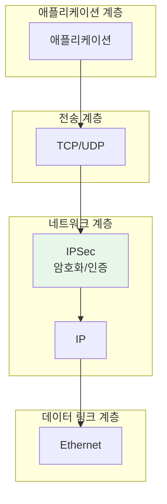
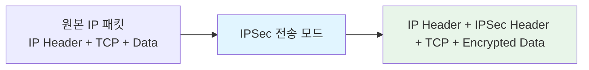
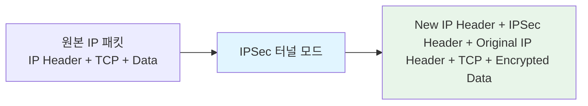
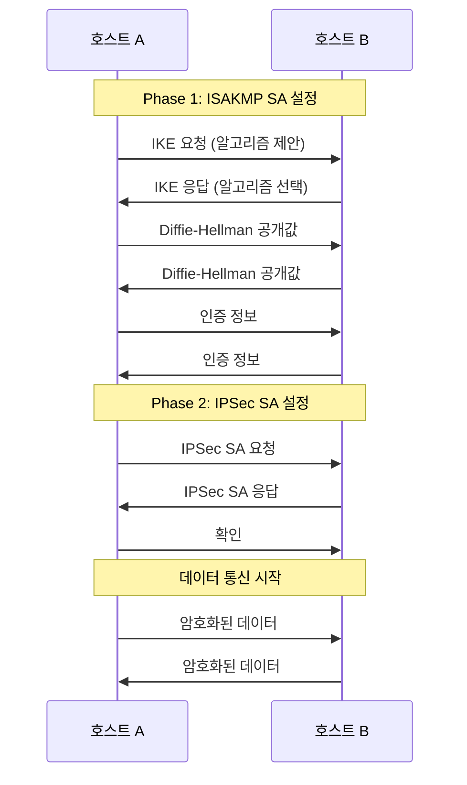

IPSec(IP Security)은 IP 계층([[OSI 모델]]의 네트워크 계층, 3계층)에서 동작하는 보안 프로토콜 모음입니다. IPSec은 IP 패킷의 인증, 무결성, 기밀성을 보장하여 안전한 통신을 제공합니다.

IPSec은 VPN(Virtual Private Network) 구축, 원격 접근 보안, 사이트 간 보안 통신 등에 널리 사용되며, 네트워크 계층에서의 종단 간 보안을 제공하는 핵심 기술입니다. IPSec을 이해하기 위해서는 [[IP 주소]], [[Network]], [[OSI 모델]], [[라우팅(Routing)]], [[프로토콜]] 등의 개념을 함께 이해하는 것이 중요합니다.

## IPSec의 등장 배경

초기 IP 프로토콜은 보안 기능이 없어 다음과 같은 심각한 보안 문제들이 있었습니다:

1. **데이터 도청**: IP 패킷이 평문으로 전송되어 중간에 가로채면 내용을 읽을 수 있었습니다.
2. **데이터 변조**: 전송 중 패킷이 변조되어도 감지할 수 없었습니다.
3. **위장 공격**: 공격자가 다른 IP 주소로 위장하여 패킷을 전송할 수 있었습니다.
4. **재전송 공격**: 이전에 전송된 패킷을 재전송하여 공격할 수 있었습니다.
5. **인증 부재**: 패킷의 발신자를 확인할 방법이 없었습니다.

이러한 문제들은 인터넷이 확산되면서 더욱 심각해졌고, 특히 기업 간 통신이나 원격 접근 시 보안이 필수적이 되었습니다. IPSec은 이러한 문제들을 해결하기 위해 1995년 RFC 1825에서 처음 제안되었고, 이후 여러 RFC를 통해 표준화되었습니다.

## IPSec의 기본 개념

### IPSec의 목적

IPSec은 다음과 같은 보안 서비스를 제공합니다:

1. **기밀성(Confidentiality)**: 데이터를 암호화하여 제3자가 읽을 수 없게 합니다.
2. **무결성(Integrity)**: 데이터가 전송 중 변조되지 않았음을 보장합니다.
3. **인증(Authentication)**: 통신 상대방의 신원을 확인합니다.
4. **재전송 방지(Anti-replay)**: 이전에 전송된 패킷의 재전송을 방지합니다.

### IPSec의 동작 계층

IPSec은 네트워크 계층(3계층)에서 동작하므로, 상위 계층의 애플리케이션이나 프로토콜을 변경하지 않고도 보안을 제공할 수 있습니다. 이는 다음과 같은 장점을 제공합니다:

- **투명성**: 애플리케이션 수정 없이 보안 적용 가능
- **범용성**: 모든 IP 트래픽에 적용 가능
- **효율성**: 상위 계층에서 개별적으로 보안을 구현할 필요 없음



## IPSec의 구성 요소

IPSec은 다음과 같은 주요 구성 요소로 이루어져 있습니다:

### 1. AH (Authentication Header)

AH는 패킷의 인증과 무결성을 제공하지만, 기밀성(암호화)은 제공하지 않습니다.

**기능**:
- 데이터 인증: 패킷의 발신자를 확인
- 무결성 검증: 데이터가 변조되지 않았음을 확인
- 재전송 방지: 시퀀스 번호를 사용하여 재전송 공격 방지

**AH 헤더 구조**:
```
0                   1                   2                   3
0 1 2 3 4 5 6 7 8 9 0 1 2 3 4 5 6 7 8 9 0 1 2 3 4 5 6 7 8 9 0 1
+-+-+-+-+-+-+-+-+-+-+-+-+-+-+-+-+-+-+-+-+-+-+-+-+-+-+-+-+-+-+-+-+
| Next Header   |  Payload Len  |          RESERVED             |
+-+-+-+-+-+-+-+-+-+-+-+-+-+-+-+-+-+-+-+-+-+-+-+-+-+-+-+-+-+-+-+-+
|                 Security Parameters Index (SPI)               |
+-+-+-+-+-+-+-+-+-+-+-+-+-+-+-+-+-+-+-+-+-+-+-+-+-+-+-+-+-+-+-+-+
|                    Sequence Number Field                      |
+-+-+-+-+-+-+-+-+-+-+-+-+-+-+-+-+-+-+-+-+-+-+-+-+-+-+-+-+-+-+-+-+
|                    Authentication Data (variable)              |
+-+-+-+-+-+-+-+-+-+-+-+-+-+-+-+-+-+-+-+-+-+-+-+-+-+-+-+-+-+-+-+-+
```

### 2. ESP (Encapsulating Security Payload)

ESP는 기밀성, 무결성, 인증을 모두 제공합니다.

**기능**:
- 데이터 암호화: 패킷의 페이로드를 암호화
- 무결성 검증: 데이터가 변조되지 않았음을 확인
- 인증: 선택적으로 인증 기능 제공
- 재전송 방지: 시퀀스 번호를 사용하여 재전송 공격 방지

**ESP 헤더 구조**:
```
0                   1                   2                   3
0 1 2 3 4 5 6 7 8 9 0 1 2 3 4 5 6 7 8 9 0 1 2 3 4 5 6 7 8 9 0 1
+-+-+-+-+-+-+-+-+-+-+-+-+-+-+-+-+-+-+-+-+-+-+-+-+-+-+-+-+-+-+-+-+
|               Security Parameters Index (SPI)                 |
+-+-+-+-+-+-+-+-+-+-+-+-+-+-+-+-+-+-+-+-+-+-+-+-+-+-+-+-+-+-+-+-+
|                      Sequence Number                          |
+-+-+-+-+-+-+-+-+-+-+-+-+-+-+-+-+-+-+-+-+-+-+-+-+-+-+-+-+-+-+-+-+
|                    Payload Data (variable)                    |
~                                                               ~
+-+-+-+-+-+-+-+-+-+-+-+-+-+-+-+-+-+-+-+-+-+-+-+-+-+-+-+-+-+-+-+-+
|                    Padding (0-255 bytes)                      |
+-+-+-+-+-+-+-+-+-+-+-+-+-+-+-+-+-+-+-+-+-+-+-+-+-+-+-+-+-+-+-+-+
|                    Padding Length | Next Header               |
+-+-+-+-+-+-+-+-+-+-+-+-+-+-+-+-+-+-+-+-+-+-+-+-+-+-+-+-+-+-+-+-+
|                    Authentication Data (variable)              |
+-+-+-+-+-+-+-+-+-+-+-+-+-+-+-+-+-+-+-+-+-+-+-+-+-+-+-+-+-+-+-+-+
```

### 3. IKE (Internet Key Exchange)

IKE는 IPSec 통신에 필요한 암호화 키를 안전하게 교환하는 프로토콜입니다.

**기능**:
- 키 교환: 통신 상대방과 암호화 키를 안전하게 교환
- 인증: 통신 상대방의 신원 확인
- SA(Security Association) 협상: 보안 파라미터 협상

**IKE 버전**:
- IKEv1: 초기 버전, 현재도 널리 사용됨
- IKEv2: 개선된 버전, 더 간단하고 효율적

### 4. SA (Security Association)

SA는 통신 상대방과의 보안 통신을 위한 파라미터 집합입니다.

**SA의 구성 요소**:
- SPI (Security Parameters Index): SA를 식별하는 고유 번호
- 암호화 알고리즘: 사용할 암호화 방식 (예: AES, 3DES)
- 인증 알고리즘: 사용할 인증 방식 (예: HMAC-SHA256)
- 키: 암호화 및 인증에 사용할 키
- 수명: SA의 유효 기간

## IPSec 모드

IPSec은 두 가지 모드로 동작할 수 있습니다:

### 1. 전송 모드 (Transport Mode)

전송 모드는 호스트 간 통신에 사용되며, IP 헤더는 그대로 두고 페이로드만 보호합니다.

**특징**:
- 원본 IP 헤더 유지
- 페이로드(데이터)만 암호화/인증
- 주로 호스트 간 통신에 사용
- NAT와 호환성 문제 가능



**패킷 구조**:
```
원본: [IP Header] [TCP Header] [Data]
전송 모드: [IP Header] [AH/ESP Header] [TCP Header] [Encrypted Data]
```

### 2. 터널 모드 (Tunnel Mode)

터널 모드는 게이트웨이 간 통신이나 VPN에 사용되며, 전체 IP 패킷을 보호합니다.

**특징**:
- 전체 IP 패킷을 새로운 IP 패킷으로 캡슐화
- 원본 IP 헤더도 암호화됨
- 주로 사이트 간 VPN에 사용
- NAT와 호환 가능



**패킷 구조**:
```
원본: [IP Header] [TCP Header] [Data]
터널 모드: [New IP Header] [AH/ESP Header] [Original IP Header] [TCP Header] [Encrypted Data]
```

## IPSec 프로토콜 비교

### AH vs ESP

| 기능 | AH | ESP |
|------|----|-----|
| 인증 | 예 | 예 (선택) |
| 무결성 | 예 | 예 |
| 기밀성(암호화) | 아니오 | 예 |
| 재전송 방지 | 예 | 예 |
| NAT 통과 | 어려움 | 가능 (터널 모드) |

**사용 권장사항**:
- **ESP만 사용**: 대부분의 경우 ESP만으로 충분합니다 (기밀성 + 무결성 + 인증)
- **AH + ESP**: 매우 높은 보안이 필요한 경우 (중복 인증)
- **AH만 사용**: 암호화가 불필요하지만 인증이 필요한 경우 (드물게 사용)

## IPSec 암호화 알고리즘

### 대칭키 암호화 알고리즘

IPSec에서 사용하는 주요 대칭키 암호화 알고리즘:

1. **AES (Advanced Encryption Standard)**
   - 가장 널리 사용됨
   - 키 길이: 128, 192, 256비트
   - 빠르고 안전함

2. **3DES (Triple DES)**
   - 레거시 시스템에서 사용
   - 키 길이: 168비트 (효과적)
   - AES보다 느림

3. **DES**
   - 더 이상 권장되지 않음 (보안 취약)

### 인증 알고리즘

IPSec에서 사용하는 주요 인증 알고리즘:

1. **HMAC-SHA256, HMAC-SHA384, HMAC-SHA512**
   - 가장 널리 사용됨
   - 강력한 보안 제공

2. **HMAC-MD5**
   - 레거시 시스템에서 사용
   - 보안 강도가 낮아 권장되지 않음

## IKE (Internet Key Exchange)

IKE는 IPSec 통신을 위해 필요한 보안 파라미터와 키를 안전하게 교환하는 프로토콜입니다.

### IKE의 단계

#### Phase 1: ISAKMP SA 설정

통신 상대방과의 보안 채널을 설정합니다.

**과정**:
1. 알고리즘 협상: 암호화, 해시, 인증 방법 협상
2. Diffie-Hellman 키 교환: 공개키를 사용한 키 교환
3. 인증: 상대방의 신원 확인

**모드**:
- **Main Mode**: 6개의 메시지 교환, 더 안전함
- **Aggressive Mode**: 3개의 메시지 교환, 더 빠름

#### Phase 2: IPSec SA 설정

실제 데이터 통신에 사용할 IPSec SA를 설정합니다.

**과정**:
1. 알고리즘 협상: IPSec에 사용할 알고리즘 협상
2. 키 생성: Phase 1에서 생성한 키를 기반으로 새 키 생성
3. SA 설정: IPSec SA 생성

**모드**:
- **Quick Mode**: 일반적으로 사용되는 모드



### IKEv1 vs IKEv2

| 특징 | IKEv1 | IKEv2 |
|------|-------|-------|
| 복잡성 | 복잡함 | 간단함 |
| 메시지 수 | 많음 | 적음 |
| NAT 지원 | 제한적 | 완전 지원 |
| 모바일 지원 | 제한적 | 완전 지원 |
| DoS 방어 | 약함 | 강함 |

현재는 IKEv2 사용을 권장합니다.

## IPSec의 활용

### 1. 사이트 간 VPN (Site-to-Site VPN)

두 개의 네트워크를 안전하게 연결합니다.

**예시**:
- 본사와 지사 간 네트워크 연결
- 데이터 센터 간 연결


### 2. 원격 접근 VPN (Remote Access VPN)

원격 사용자가 안전하게 회사 네트워크에 접근합니다.

**예시**:
- 재택 근무자 접근
- 모바일 사용자 접근

### 3. 호스트 간 보안 통신

두 호스트 간의 직접적인 보안 통신을 제공합니다.

**예시**:
- 서버 간 보안 통신
- 중요한 데이터 전송

### 4. 네트워크 보안 강화

일반 IP 통신에 보안을 추가합니다.

**예시**:
- 클라우드 환경의 보안 통신
- 컨테이너 간 보안 통신

## Java에서 IPSec 활용

Java에서는 직접적으로 IPSec을 구현하기보다는, 상위 계층의 보안 프로토콜을 사용하거나 네트워크 라이브러리를 활용합니다. 하지만 IPSec의 개념을 이해하고 적용할 수 있습니다:

```java
import javax.net.ssl.SSLContext;
import javax.net.ssl.SSLSocket;
import javax.net.ssl.SSLSocketFactory;
import java.io.*;

/**
 * IPSec과 유사한 보안 통신을 SSL/TLS로 구현한 예시
 * 실제 IPSec은 운영체제 레벨에서 구현됩니다.
 */
public class SecureIPCommunication {
    
    /**
     * SSL/TLS를 사용한 보안 소켓 통신
     * (IPSec은 네트워크 계층에서 동작하지만, 
     *  애플리케이션 레벨에서는 SSL/TLS를 사용)
     */
    public static void secureCommunication(String host, int port) throws Exception {
        // SSL 컨텍스트 생성
        SSLContext sslContext = SSLContext.getDefault();
        SSLSocketFactory factory = sslContext.getSocketFactory();
        
        // 보안 소켓 생성
        SSLSocket socket = (SSLSocket) factory.createSocket(host, port);
        
        // 암호화 스위트 설정
        String[] enabledCipherSuites = {
            "TLS_AES_256_GCM_SHA384",
            "TLS_AES_128_GCM_SHA256"
        };
        socket.setEnabledCipherSuites(enabledCipherSuites);
        
        // 핸드셰이크 시작
        socket.startHandshake();
        
        // 데이터 전송
        PrintWriter out = new PrintWriter(
            new OutputStreamWriter(socket.getOutputStream()), true
        );
        BufferedReader in = new BufferedReader(
            new InputStreamReader(socket.getInputStream())
        );
        
        out.println("Hello, Secure World!");
        String response = in.readLine();
        System.out.println("Response: " + response);
        
        socket.close();
    }
    
    /**
     * 메시지 무결성 검증 (HMAC 사용)
     * IPSec의 인증 기능과 유사
     */
    public static void verifyMessageIntegrity(byte[] message, byte[] key, byte[] receivedMAC) 
            throws Exception {
        javax.crypto.Mac mac = javax.crypto.Mac.getInstance("HmacSHA256");
        javax.crypto.spec.SecretKeySpec secretKey = 
            new javax.crypto.spec.SecretKeySpec(key, "HmacSHA256");
        mac.init(secretKey);
        
        byte[] calculatedMAC = mac.doFinal(message);
        
        if (java.util.Arrays.equals(calculatedMAC, receivedMAC)) {
            System.out.println("메시지 무결성 검증 성공");
        } else {
            throw new SecurityException("메시지 무결성 검증 실패");
        }
    }
}
```

## 스프링에서 보안 통신

스프링에서는 HTTPS를 통해 보안 통신을 구현할 수 있습니다:

```java
import org.springframework.context.annotation.Bean;
import org.springframework.context.annotation.Configuration;
import org.springframework.web.client.RestTemplate;
import org.springframework.http.client.ClientHttpRequestFactory;
import org.springframework.http.client.HttpComponentsClientHttpRequestFactory;
import org.apache.http.impl.client.CloseableHttpClient;
import org.apache.http.impl.client.HttpClients;
import org.apache.http.ssl.SSLContextBuilder;

import javax.net.ssl.SSLContext;
import java.security.KeyStore;

@Configuration
public class SecureRestTemplateConfig {
    
    @Bean
    public RestTemplate secureRestTemplate() throws Exception {
        // SSL 컨텍스트 설정
        SSLContext sslContext = SSLContextBuilder
            .create()
            .loadTrustMaterial(null, (certificate, authType) -> true)
            .build();
        
        // HTTP 클라이언트 생성
        CloseableHttpClient httpClient = HttpClients.custom()
            .setSSLContext(sslContext)
            .build();
        
        // 요청 팩토리 설정
        HttpComponentsClientHttpRequestFactory factory = 
            new HttpComponentsClientHttpRequestFactory();
        factory.setHttpClient(httpClient);
        
        return new RestTemplate(factory);
    }
}
```

## IPSec의 장단점

### 장점

1. **투명성**: 애플리케이션 수정 없이 보안 적용 가능
2. **범용성**: 모든 IP 트래픽에 적용 가능
3. **강력한 보안**: 기밀성, 무결성, 인증 제공
4. **표준화**: 널리 사용되는 표준 프로토콜
5. **VPN 지원**: 사이트 간 및 원격 접근 VPN 구축 가능

### 단점

1. **복잡성**: 설정과 관리가 복잡함
2. **성능 오버헤드**: 암호화/복호화로 인한 성능 저하
3. **NAT 호환성**: 일부 모드에서 NAT와 호환성 문제
4. **키 관리**: 키 관리가 복잡함
5. **디버깅 어려움**: 암호화로 인한 패킷 분석 어려움

## IPSec 구현 시 주의사항

1. **알고리즘 선택**: 강력하고 표준화된 알고리즘 사용 (AES, SHA-256 등)

2. **키 관리**: 키를 안전하게 관리하고 정기적으로 갱신해야 합니다.

3. **SA 수명**: SA의 수명을 적절히 설정하여 보안과 성능의 균형을 유지해야 합니다.

4. **NAT 고려**: NAT 환경에서는 터널 모드 사용을 고려해야 합니다.

5. **성능 최적화**: 하드웨어 가속을 사용하여 성능을 향상시킬 수 있습니다.

6. **모니터링**: IPSec 연결 상태와 오류를 모니터링해야 합니다.

7. **정책 설정**: 적절한 보안 정책을 설정하여 필요한 트래픽만 보호해야 합니다.

## 실제 활용 사례

1. **기업 VPN**: 본사와 지사를 안전하게 연결
2. **원격 접근**: 재택 근무자나 모바일 사용자의 안전한 접근
3. **클라우드 연결**: 온프레미스와 클라우드 간 보안 연결
4. **서버 간 통신**: 중요한 데이터를 전송하는 서버 간 보안 통신
5. **컨테이너 보안**: 컨테이너 간 통신 보안

## IPSec과 다른 보안 프로토콜 비교

### IPSec vs SSL/TLS

| 특징 | IPSec | SSL/TLS |
|------|-------|---------|
| 계층 | 네트워크 계층 (3계층) | 전송 계층 (4계층) |
| 투명성 | 애플리케이션에 투명 | 애플리케이션 수정 필요 |
| 범위 | 모든 IP 트래픽 | 특정 애플리케이션 |
| VPN | 사이트 간 VPN 지원 | 원격 접근 VPN 주로 사용 |

### IPSec vs VPN 프로토콜

- **IPSec VPN**: 강력한 보안, 사이트 간 VPN에 적합
- **SSL VPN**: 웹 기반, 원격 접근에 적합
- **PPTP**: 구식, 보안 취약 (사용 비권장)
- **L2TP/IPSec**: PPTP의 개선 버전

## 결론

IPSec은 네트워크 계층에서 동작하는 강력한 보안 프로토콜로, IP 통신의 기밀성, 무결성, 인증을 제공합니다. IPSec을 올바르게 이해하고 구현하면 안전한 네트워크 통신을 구축할 수 있습니다.

IPSec을 구현할 때는 적절한 알고리즘 선택, 키 관리, SA 설정 등을 종합적으로 고려해야 하며, [[IP 주소]], [[Network]], [[OSI 모델]], [[라우팅(Routing)]], [[프로토콜]] 등의 관련 개념들을 함께 이해하는 것이 중요합니다.

또한 현대적인 애플리케이션 개발에서는 IPSec을 직접 구현하기보다는 운영체제나 네트워크 장비에서 제공하는 IPSec 기능을 활용하거나, 애플리케이션 레벨에서는 SSL/TLS를 사용하는 것이 일반적입니다.

## 참고 자료

- RFC 4301 - Security Architecture for the Internet Protocol
- RFC 4302 - IP Authentication Header (AH)
- RFC 4303 - IP Encapsulating Security Payload (ESP)
- RFC 4306 - Internet Key Exchange (IKEv2) Protocol
- RFC 7296 - Internet Key Exchange Protocol Version 2 (IKEv2)
- Computer Networks, 5th Edition - Andrew S. Tanenbaum
- Network Security Essentials, 5th Edition - William Stallings

