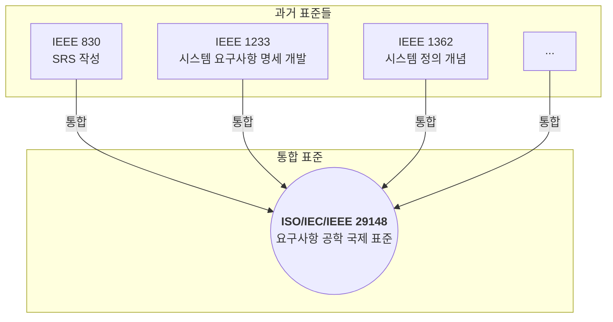

이름이 길고 복잡해서 조금 낯설게 느껴질 수 있지만, 이 표준은 시스템과 소프트웨어 개발의 '요구사항'을 다루는 방식을 현대화한 매우 중요한 약속입니다. 만약 여러분이 이전에 IEEE 830 표준에 익숙하다면, 이제는 그 다음 세대인 이 표준에 주목해야 할 시간입니다.

---

## 🚀 ISO/IEC/IEEE 29148이란?

**ISO/IEC/IEEE 29148**은 시스템 및 소프트웨어 공학의 수명 주기 프로세스 중 **요구사항 공학(Requirements Engineering)**에 대한 절차를 정의한 국제 표준입니다.

쉽게 말해, '요구사항'이라는 매우 중요하지만 다루기 까다로운 대상을 어떻게 발견(도출)하고, 분석하고, 문서화(명세)하며, 검증하고, 관리할지에 대한 **포괄적인 가이드라인**을 제공합니다. 이는 소프트웨어뿐만 아니라 하드웨어를 포함하는 복잡한 '시스템' 전체의 요구사항을 다루는 것을 목표로 합니다.

이 표준의 가장 큰 의의는 여러 기관에서 개별적으로 발전해오던 요구사항 관련 표준들을 하나로 통합하고 조화시켰다는 점에 있습니다.

**결론적으로, 이 표준은 과거에 널리 쓰이던 `IEEE 830`을 포함한 여러 표준을 공식적으로 대체합니다.** 따라서 오늘날 국제적인 기준에 맞는 [[요구사항 명세서(Software Requirements Specification, SRS)]]]를 이야기할 때는 ISO/IEC/IEEE 29148을 기준으로 삼는 것이 맞습니다.

---

## 🧩 표준의 핵심 프로세스

ISO/IEC/IEEE 29148은 요구사항 공학을 체계적인 프로세스의 연속으로 정의합니다. 각 프로세스는 프로젝트의 성공을 위해 유기적으로 연결됩니다.

1. **요구사항 도출 (Requirements Elicitation)**

    - 이해관계자(고객, 사용자 등)로부터 요구사항을 수집하고 발견하는 활동입니다. 인터뷰, 설문조사, 워크숍, 기존 문서 분석 등 다양한 기법이 사용됩니다.
2. **요구사항 분석 (Requirements Analysis)**
    
    - 도출된 요구사항의 명확성을 높이고, 서로 충돌하는 부분은 없는지 파악하며, 우선순위를 정하는 활동입니다. 요구사항의 타당성을 검토하고 모델링을 통해 구체화합니다.
3. **요구사항 명세 (Requirements Specification)**
    
    - 분석된 요구사항을 체계적인 형식에 맞춰 문서화하는 과정입니다. 이 단계에서 바로 [[요구사항 명세서(Software Requirements Specification, SRS)]]와 같은 산출물이 탄생합니다. 이 표준은 SRS뿐만 아니라 다음과 같은 다양한 수준의 요구사항 문서를 정의합니다.
        - **이해관계자 요구사항 명세서 (StRS, Stakeholder Requirements Specification)**: 이해관계자의 관점에서 그들의 요구와 기대를 기술합니다.
        - **시스템 요구사항 명세서 (SyRS, System Requirements Specification)**: StRS를 바탕으로, 개발될 시스템이 충족해야 할 기술적인 요구사항을 상세히 정의합니다. 소프트웨어만 있다면 이 문서가 SRS의 역할을 합니다.
4. **요구사항 검증 (Requirements Validation)**
    
    - 작성된 요구사항 명세서가 정말 이해관계자가 원했던 것이 맞는지, 완전하고 일관성이 있으며 테스트가 가능한지를 확인하는 활동입니다.
5. **요구사항 관리 (Requirements Management)**
    
    - 프로젝트가 진행되는 동안 발생하는 요구사항의 변경을 체계적으로 추적하고 통제하는 모든 활동을 의미합니다.

---

## 📋 ISO/IEC/IEEE 29148이 제시하는 SRS 구조

이 표준에서 제안하는 SRS(여기서는 SyRS에 해당)의 구조는 IEEE 830의 정신을 계승하면서도 더 체계적으로 발전했습니다. 일반적인 구조는 다음과 같습니다.

- **1. 서론 (Introduction)**: 문서의 목적, 범위, 용어 정의, 참고 자료 등을 기술
- **2. 전체 설명 (Overall Description)**: 시스템의 배경, 비즈니스 목적, 운영 환경, 사용자 특징, 제약 조건 등을 기술
- **3. 상세 요구사항 (Specific Requirements)**:
    - **기능 요구사항 (Functional Requirements)**: 시스템이 수행해야 할 기능
    - **사용성 요구사항 (Usability Requirements)**: 사용자가 시스템을 얼마나 쉽게 배우고 사용할 수 있는지에 대한 요구사항
    - **성능 요구사항 (Performance Requirements)**: 응답 시간, 처리량 등 성능에 대한 요구사항
    - **시스템 인터페이스 (System Interfaces)**: 다른 시스템, 하드웨어, 소프트웨어와의 연동 방식
    - **시스템 오퍼레이션 (System Operations)**: 시스템 운영 및 관리에 대한 요구사항
    - **시스템 모드와 상태 (System Modes and States)**: 시스템이 가질 수 있는 다양한 상태(ex. 정상, 오류, 점검)와 상태 간 전환 조건
    - **물리적 특성 (Physical Characteristics)**: 하드웨어의 크기, 무게, 재질 등에 대한 요구사항
    - **환경 조건 (Environmental Conditions)**: 시스템이 동작해야 할 온도, 습도 등 환경적 제약
    - **보안 요구사항 (Security Requirements)**: 접근 제어, 데이터 보호 등 보안에 대한 요구사항
    - **정보 관리 (Information Management)**: 데이터의 생성, 저장, 폐기 등 정보 관리에 대한 요구사항
    - **정책 및 규제 (Policies and Regulations)**: 반드시 준수해야 할 법률이나 조직의 정책
    - **시스템 생명주기 (System Life Cycle)**: 시스템의 개발, 유지보수, 폐기 등 전체 수명주기에 대한 요구사항

좀 더 자세히 이해하기 위해서는 [[시스템 요구사항 명세서 (SRS) 예시, 회의실 예약 시스템]]자료를 참고해주세요

---

## ✨ 마치며

ISO/IEC/IEEE 29148은 단순히 '문서 양식'을 넘어, 성공적인 제품 개발을 위해 **'요구사항'이라는 복잡한 대상을 어떻게 과학적이고 체계적으로 다룰 것인가**에 대한 깊은 통찰을 담고 있습니다. 모든 내용을 당장 적용하기는 어렵더라도, 이 표준이 제시하는 프로세스와 원칙을 이해하는 것만으로도 프로젝트의 리스크를 줄이고 품질을 높이는 데 큰 도움이 될 것입니다.

---

### 📚 참고 자료

1. ISO/IEC/IEEE 29148:2018 - Systems and software engineering — Life cycle processes — Requirements engineering: [https://www.iso.org/standard/72052.html](https://www.iso.org/standard/72052.html)
2. Wikipedia - Software requirements specification: [https://en.wikipedia.org/wiki/Software_requirements_specification](https://en.wikipedia.org/wiki/Software_requirements_specification)
3. ReqView - ISO/IEC/IEEE 29148 Requirements Specification Templates: [https://www.reqview.com/doc/iso-iec-ieee-29148-templates/](https://www.reqview.com/doc/iso-iec-ieee-29148-templates/)