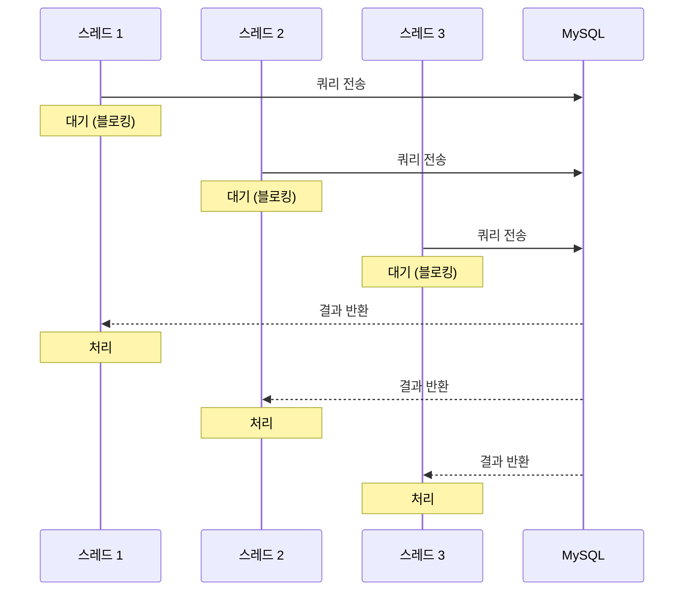
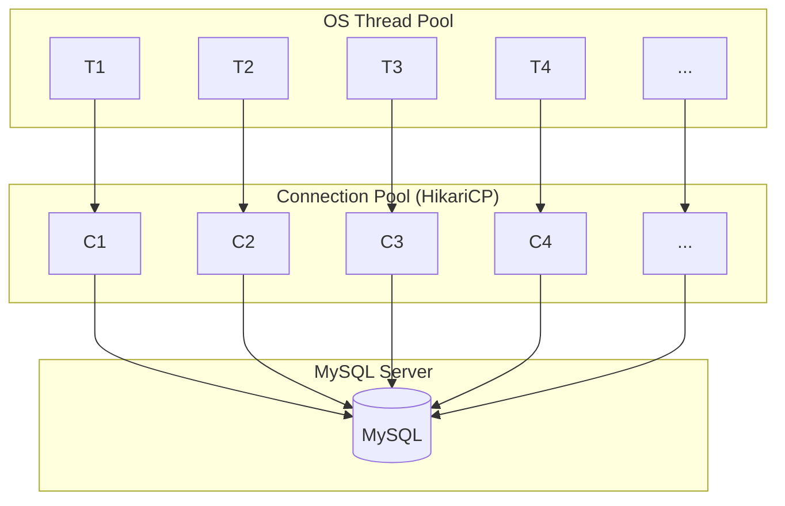
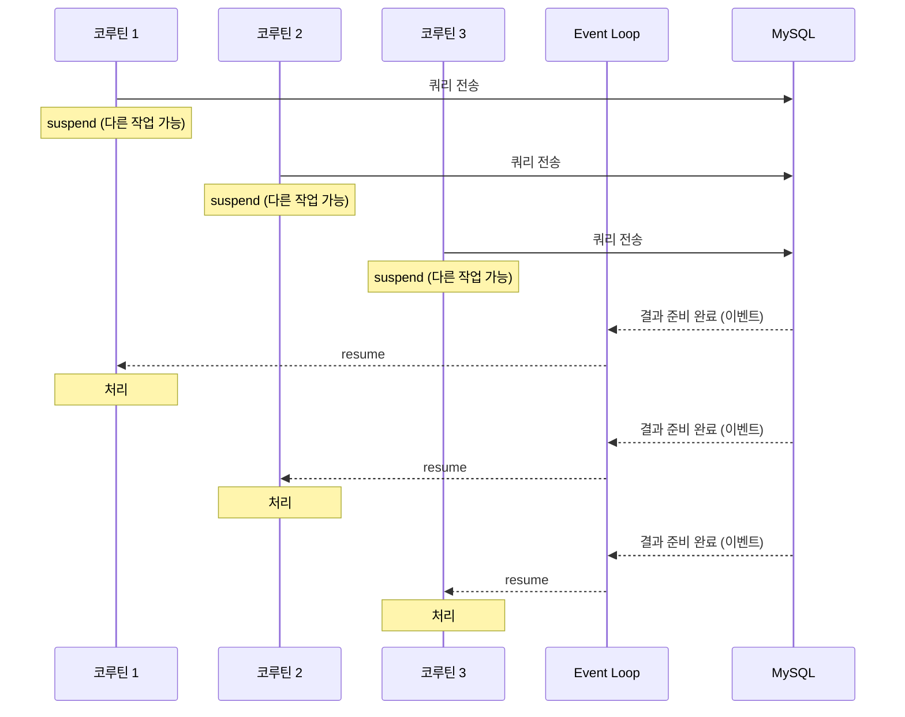
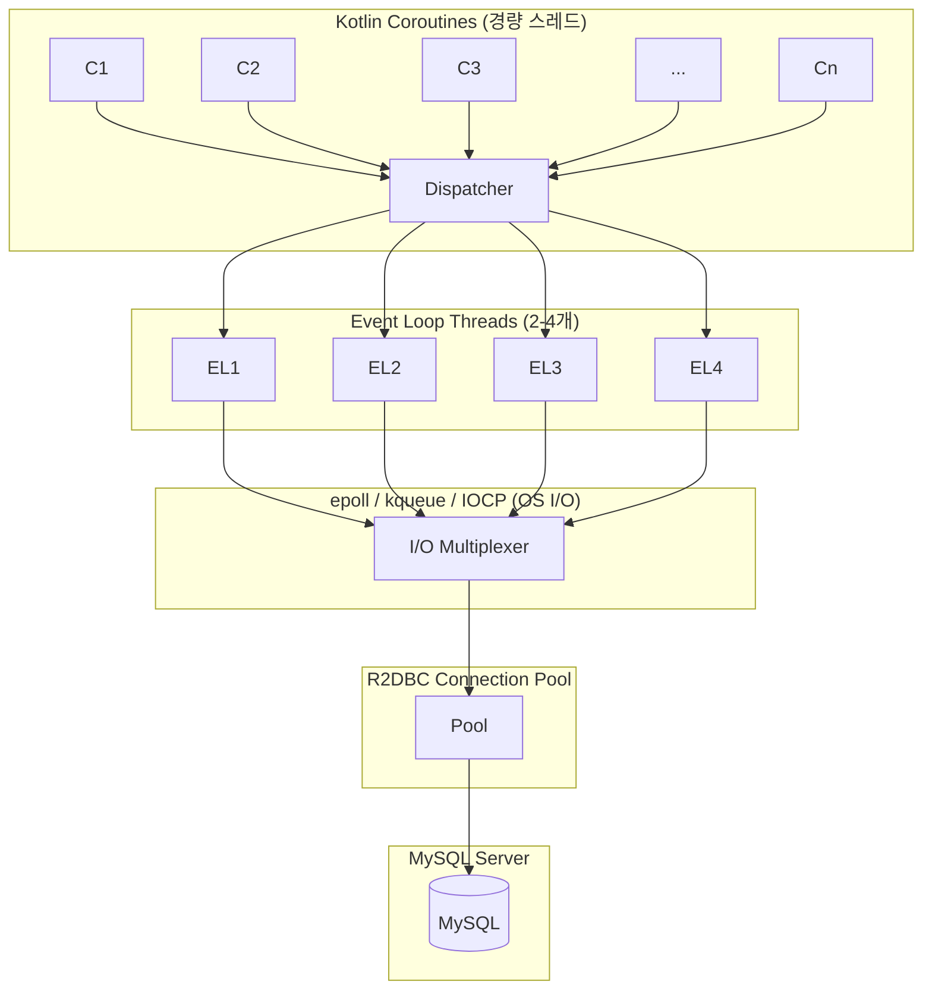

## 개요

JDBC(Java Database Connectivity)와 R2DBC(Reactive Relational Database Connectivity)는 관계형 데이터베이스에 접근하는 두 가지 주요 방식이다. JDBC는 전통적인 동기 블로킹 방식이고, R2DBC는 비동기 논블로킹 방식을 지원하는 리액티브 드라이버다. 이 문서에서는 실제 벤치마크를 통해 두 방식의 성능 차이를 비교하고, 그 결과가 나온 기술적 원인을 OS 및 알고리즘 레벨에서 분석한다.

## 테스트 환경

벤치마크는 다음 환경에서 수행되었다:

- **데이터베이스**: MySQL 8.0 (Testcontainers 기반)
- **JDBC 구현체**: Exposed Framework + HikariCP
- **R2DBC 구현체**: R2DBC MySQL + R2DBC Pool
- **애플리케이션**: Kotlin + Coroutines
- **테스트 데이터**: Users, Products, Orders 등 다양한 테이블

```kotlin
// JDBC Repository 예시 (Exposed DSL)
class JdbcUserRepository(private val database: Database) {
    fun findById(id: Long): User? = transaction(database) {
        Users.selectAll()
            .where { Users.id eq id }
            .map { it.toUser() }
            .singleOrNull()
    }
}

// R2DBC Repository 예시 (비동기)
class R2dbcUserRepository(private val connectionFactory: ConnectionFactory) {
    suspend fun findById(id: Long): User? {
        return Mono.usingWhen(
            Mono.from(connectionFactory.create()),
            { connection ->
                Mono.from(connection.createStatement("SELECT * FROM users WHERE id = ?")
                    .bind(0, id).execute())
                    .flatMap { result -> Mono.from(result.map { row, _ -> row.toUser() }) }
            },
            { connection -> Mono.from(connection.close()) }
        ).awaitFirstOrNull()
    }
}
```

## 벤치마크 결과

### 1. 동시 읽기 성능 (Concurrent Reads)

5개에서 200개까지의 동시 스레드(코루틴)로 읽기 작업을 수행했을 때의 처리량 비교다.

![[img/jdbc-r2dbc-concurrent-reads.png]]

| 동시성 | JDBC (ops/s) | R2DBC (ops/s) | 성능 향상 |
|--------|--------------|---------------|-----------|
| 5 | 704 | 1,201 | +70.6% |
| 50 | 2,219 | 9,432 | +325.1% |
| 100 | 2,729 | 9,482 | +247.5% |
| 150 | 3,043 | 9,779 | +221.4% |
| 200 | 3,417 | 12,133 | +255.1% |

**분석 결과**: R2DBC가 JDBC 대비 평균 **250% 이상**의 처리량 향상을 보였다. 특히 동시성이 높아질수록 R2DBC의 이점이 더욱 명확해진다.

### 2. 동시 쓰기 성능 (Concurrent Writes)

![[img/jdbc-r2dbc-concurrent-writes.png]]

| 동시성 | JDBC (ops/s) | R2DBC (ops/s) | 성능 향상 |
|--------|--------------|---------------|-----------|
| 50 | 2,874 | 6,494 | +126.0% |
| 100 | 4,032 | 7,042 | +74.6% |
| 150 | 4,202 | 7,109 | +69.2% |
| 200 | 4,357 | 7,092 | +62.8% |

**분석 결과**: 쓰기 작업에서도 R2DBC가 우수한 성능을 보이지만, 읽기에 비해 상대적 향상폭은 낮다. 이는 쓰기 작업이 데이터베이스 측의 락(Lock)과 디스크 I/O에 더 많이 의존하기 때문이다.

### 3. N+1 쿼리 문제 시나리오

주문 데이터를 조회할 때 각 주문의 상세 아이템을 추가 쿼리로 조회하는 N+1 패턴의 성능을 측정했다.

![[img/jdbc-r2dbc-nplusone.png]]

| 주문 수 | JDBC (ms) | R2DBC (ms) | 성능 차이 |
|---------|-----------|------------|-----------|
| 5 | 20.3 | 30.3 | -49.2% |
| 25 | 57.7 | 53.3 | +7.5% |
| 50 | 91.0 | 92.3 | -1.5% |
| 75 | 140.7 | 128.3 | +8.8% |
| 100 | 176.0 | 154.7 | +12.1% |

**분석 결과**: N+1 패턴에서는 주문 수가 적을 때 JDBC가 오히려 더 빠르다. 그러나 데이터량이 증가할수록 R2DBC가 점차 우위를 보인다.

### 4. 페이지네이션 성능

![[img/jdbc-r2dbc-pagination-pagesize.png]]
![[img/jdbc-r2dbc-pagination-offset.png]]

페이지네이션에서는 페이지 크기와 오프셋에 따라 결과가 다양하게 나타났으며, 일반적인 케이스에서 두 방식의 차이는 크지 않았다.

## 결과 분석: 왜 이런 차이가 발생하는가?

### 1. 스레드 모델의 근본적 차이

#### JDBC (블로킹 I/O)



JDBC는 **동기 블로킹 모델**을 사용한다. 각 데이터베이스 요청마다 스레드가 할당되고, 해당 스레드는 응답이 올 때까지 **커널의 대기 상태(Wait State)**에 들어간다.

**OS 레벨 동작**:
1. 스레드가 `read()` 시스템 콜 호출
2. 커널이 스레드를 **TASK_INTERRUPTIBLE** 상태로 전환
3. 네트워크 패킷 도착 시 인터럽트 발생
4. 커널이 스레드를 **TASK_RUNNING** 상태로 전환
5. **컨텍스트 스위칭** 발생 (1~10μs 오버헤드)



**문제점**:
- 동시 요청 수 = 필요한 스레드 수
- 스레드당 약 1MB 스택 메모리 할당
- 컨텍스트 스위칭 오버헤드 누적
- 스레드 풀 크기가 처리량의 상한선

#### R2DBC (논블로킹 I/O)



R2DBC는 **비동기 논블로킹 모델**을 사용한다. I/O 작업이 진행되는 동안 스레드는 다른 작업을 처리할 수 있다.

**OS 레벨 동작**:
1. `epoll_ctl()`로 파일 디스크립터 등록
2. `epoll_wait()`로 이벤트 대기 (소수의 이벤트 루프 스레드만 블록)
3. 네트워크 이벤트 발생 시 해당 작업의 콜백 실행
4. **컨텍스트 스위칭 없이** 코루틴 상태 전환



**장점**:
- 수천 개의 동시 요청을 소수의 스레드로 처리
- 코루틴은 힙 메모리에 수 KB만 사용
- 컨텍스트 스위칭 오버헤드 최소화
- 이벤트 루프 기반의 효율적인 I/O 멀티플렉싱

### 2. 메모리 관리 차이

#### 스택 할당 (JDBC)

```
┌──────────────────────┐
│ Thread Stack (1MB)   │
├──────────────────────┤
│ Local Variables      │
│ Method Call Stack    │
│ Return Addresses     │
│ ...                  │
└──────────────────────┘
× 100 threads = 100MB
```

#### 힙 할당 (R2DBC + Coroutines)

```
┌──────────────────────┐
│ Continuation Object  │
│ (수 KB)              │
├──────────────────────┤
│ Captured Variables   │
│ State Machine Index  │
└──────────────────────┘
× 10,000 coroutines ≈ 수십 MB
```

Kotlin 코루틴은 `suspend` 함수를 **상태 머신(State Machine)**으로 변환한다. 각 일시 중단 지점이 하나의 상태가 되어, 최소한의 정보만 `Continuation` 객체에 저장한다.

### 3. 컨텍스트 스위칭 비용 분석

| 구분 | JDBC (OS Thread) | R2DBC (Coroutine) |
|------|------------------|-------------------|
| 스위칭 유형 | Kernel-level | User-level |
| 소요 시간 | 1~10μs | 수십 ns |
| 캐시 영향 | TLB 무효화, 캐시 미스 | 최소한의 영향 |
| 시스템 콜 | 매번 필요 | 거의 불필요 |

**커널 레벨 컨텍스트 스위칭 과정**:
1. 현재 스레드의 레지스터 저장 (rax, rbx, ..., rip, rsp 등)
2. 메모리 맵 전환 (CR3 레지스터 업데이트)
3. TLB(Translation Lookaside Buffer) 플러시
4. 새 스레드의 레지스터 복원
5. 명령어 파이프라인 플러시

**코루틴 전환 과정**:
1. 힙에 현재 상태 저장 (지역 변수, 다음 실행 위치)
2. 다른 코루틴의 상태 로드
3. 함수 호출과 유사한 단순 점프

### 4. I/O 멀티플렉싱의 효율성

Linux의 `epoll`을 예로 들면:

```c
// JDBC 스타일 (스레드당 하나의 연결)
while (true) {
    int n = read(socket_fd, buffer, size);  // 블로킹
    process(buffer);
}

// R2DBC 스타일 (이벤트 기반)
epoll_ctl(epfd, EPOLL_CTL_ADD, socket_fd, &event);
while (true) {
    int n = epoll_wait(epfd, events, MAX_EVENTS, timeout);
    for (int i = 0; i < n; i++) {
        process_event(events[i]);  // 논블로킹
    }
}
```

`epoll`은 **O(1)** 시간 복잡도로 준비된 파일 디스크립터를 감지한다. 수천 개의 연결을 단일 스레드에서 효율적으로 관리할 수 있다.

### 5. N+1 시나리오에서 JDBC가 빠른 이유

소량의 순차 쿼리에서 JDBC가 더 빠른 이유:

1. **동기 코드의 단순성**: 함수 호출-반환의 직접적인 흐름
2. **Connection 재사용**: 트랜잭션 내에서 동일 연결 유지
3. **R2DBC 오버헤드**: Reactor 파이프라인 구성, 콜백 체인 관리
4. **JIT 최적화**: 동기 코드는 JVM 최적화에 더 유리

```kotlin
// JDBC: 단순한 순차 실행
transaction(database) {
    val orders = Orders.selectAll().toList()
    orders.forEach { order ->
        OrderItems.select { OrderItems.orderId eq order.id }.toList()
    }
}

// R2DBC: Reactor 파이프라인 오버헤드
orders.forEach { order ->
    Mono.usingWhen(
        connectionFactory.create(),
        { conn -> /* 쿼리 실행 */ },
        { conn -> conn.close() }
    ).awaitSingle()
}
```

그러나 데이터량이 증가하면 네트워크 I/O 대기 시간이 지배적이 되어 R2DBC의 논블로킹 이점이 발현된다.

## 언제 어떤 것을 사용해야 하는가?

### JDBC를 선택해야 하는 경우

1. **단순한 CRUD 애플리케이션**
   - 동시 사용자 수가 적고 (수십~수백 명)
   - 요청당 쿼리 수가 적으며
   - 개발 생산성이 중요한 경우

2. **트랜잭션 복잡도가 높은 경우**
   - 분산 트랜잭션 (XA)
   - Savepoint를 활용한 세밀한 롤백
   - 비관적 락(Pessimistic Lock) 패턴

3. **기존 생태계 활용**
   - JPA/Hibernate, MyBatis 등 성숙한 ORM
   - 풍부한 모니터링/디버깅 도구
   - 팀의 기존 경험과 노하우

4. **CPU 바운드 작업이 많은 경우**
   - 데이터베이스 접근보다 비즈니스 로직 처리가 오래 걸림
   - 복잡한 계산, 데이터 변환이 주요 병목

### R2DBC를 선택해야 하는 경우

1. **높은 동시성이 필요한 경우**
   - 수천~수만 개의 동시 요청 처리
   - 실시간 알림, 채팅, 스트리밍 서비스
   - API 게이트웨이, 프록시 서버

2. **I/O 바운드 작업이 지배적인 경우**
   - 외부 API 호출과 DB 접근이 혼합된 워크플로우
   - 마이크로서비스 간 통신이 빈번한 아키텍처

3. **리소스 효율성이 중요한 경우**
   - 컨테이너/서버리스 환경에서 메모리 제약
   - 인프라 비용 최적화가 필요한 경우

4. **Reactive Stack을 이미 사용 중인 경우**
   - Spring WebFlux 기반 애플리케이션
   - Kotlin Flow, Project Reactor 활용 중

## 사용 시 주의사항

### JDBC 주의사항

1. **커넥션 풀 크기 설정**
   ```properties
   # HikariCP 설정 예시
   maximumPoolSize=50  # 동시 요청 상한선
   minimumIdle=10
   connectionTimeout=30000
   ```
   - 풀 크기 = 동시 처리 가능한 요청 수
   - 너무 크면 DB 연결 자원 낭비, 너무 작으면 대기 발생

2. **스레드 풀과 커넥션 풀 조율**
   - 일반적으로 `스레드 풀 크기 ≈ 커넥션 풀 크기`
   - 비동기 작업 혼합 시 별도 고려 필요

3. **블로킹 코드 격리**
   - 리액티브 코드와 JDBC 혼용 시 `Schedulers.boundedElastic()` 사용
   - 블로킹 호출이 이벤트 루프를 막지 않도록 주의

### R2DBC 주의사항

1. **연결 누수 방지**
   ```kotlin
   // 항상 usingWhen 패턴으로 연결 관리
   Mono.usingWhen(
       connectionFactory.create(),
       { connection -> /* 작업 */ },
       { connection -> connection.close() }  // 반드시 반환
   )
   ```

2. **블로킹 코드 주의**
   ```kotlin
   // 잘못된 예: 리액티브 파이프라인에서 블로킹 호출
   mono.map {
       jdbcRepository.findById(it.id)  // 블로킹!
   }

   // 올바른 예: 별도 스케줄러에서 실행
   mono.flatMap {
       Mono.fromCallable { jdbcRepository.findById(it.id) }
           .subscribeOn(Schedulers.boundedElastic())
   }
   ```

3. **에러 처리**
   - 비동기 파이프라인에서 예외는 전통적인 try-catch로 잡히지 않음
   - `onErrorResume`, `onErrorReturn` 등 리액티브 연산자 활용

4. **트랜잭션 관리**
   ```kotlin
   // R2DBC 트랜잭션
   connection.beginTransaction()
       .then(/* 쿼리들 */)
       .then(connection.commitTransaction())
       .onErrorResume { connection.rollbackTransaction() }
   ```

5. **디버깅의 어려움**
   - 스택 트레이스가 비동기 경계에서 끊어짐
   - Hooks.onOperatorDebug() 또는 ReactorDebugAgent 활용
   - 충분한 로깅과 메트릭 수집 필수

6. **생태계 한계**
   - JPA/Hibernate 미지원 (R2DBC SPI 별도)
   - 일부 DB 기능 미구현 (벤더별 차이)
   - 상대적으로 적은 레퍼런스와 문서

## 결론

벤치마크 결과, R2DBC는 높은 동시성 환경에서 JDBC 대비 **2~3배 이상**의 처리량을 보였다. 이는 논블로킹 I/O, 코루틴 기반의 경량 스레드, 이벤트 루프 모델이 가져다주는 근본적인 효율성 차이에서 비롯된다.

그러나 모든 상황에서 R2DBC가 우월한 것은 아니다. 단순한 순차 작업, 낮은 동시성 환경, 복잡한 트랜잭션이 필요한 경우에는 JDBC가 더 적합할 수 있다. 기술 선택은 항상 **실제 워크로드 특성**, **팀의 역량**, **운영 환경**을 종합적으로 고려해야 한다.

## 소스 코드

벤치마크에 사용된 전체 소스 코드 링크: https://github.com/BEOKS/exposed-jdbc-vs-r2dbc

## 참고 자료

- [[CPU 바운드 vs IO 바운드 작업]]
- [[코루틴 동작 방식 (하드웨어 및 OS 레벨)]]
- [[리액티브 스트림 인터페이스(Reactive Stream Interface)]]
- [R2DBC 공식 문서](https://r2dbc.io/)
- [Exposed Framework](https://github.com/JetBrains/Exposed)
- [HikariCP](https://github.com/brettwooldridge/HikariCP)
