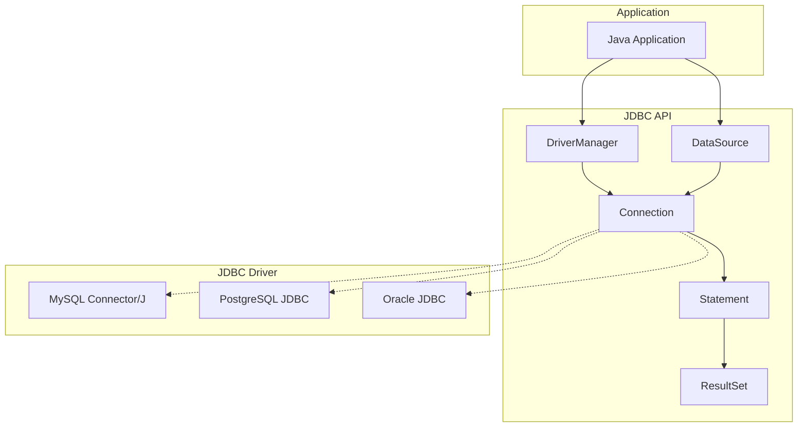
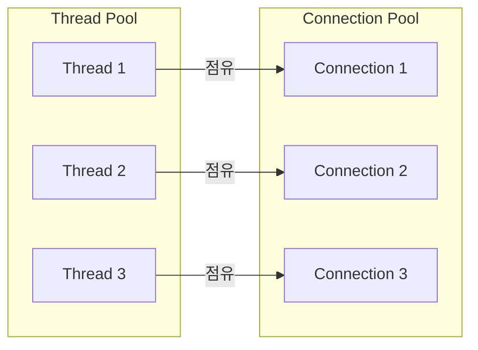

JDBC(Java Database Connectivity)는 Java에서 관계형 데이터베이스에 접근하기 위한 표준 API다. 1997년 Java 1.1과 함께 도입되어 지금까지 사용되고 있다. [[R2DBC 동작 원리|R2DBC]]는 JDBC의 블로킹 한계를 극복하기 위해 만들어졌다.

---

## 동작 방식

JDBC는 동기적, 블로킹 방식으로 동작한다.

```java
// Connection 획득 - 블로킹
Connection conn = DriverManager.getConnection(url, user, password);

// Statement 실행 - 블로킹
Statement stmt = conn.createStatement();
ResultSet rs = stmt.executeQuery("SELECT * FROM users");  // 결과 올 때까지 대기

// 결과 처리
while (rs.next()) {  // 다음 행 가져올 때까지 대기
    String name = rs.getString("name");
}
```

각 메서드 호출에서 데이터베이스 응답을 기다리는 동안 스레드가 차단된다.

## 구조



## 핵심 인터페이스

| 인터페이스 | 역할 |
|-----------|------|
| `Connection` | 데이터베이스 연결 |
| `Statement` | SQL 문 실행 |
| `PreparedStatement` | 파라미터화된 SQL 문 |
| `CallableStatement` | 저장 프로시저 호출 |
| `ResultSet` | 쿼리 결과 |

## 스레드 모델

JDBC의 "one thread per connection" 모델이다.



동시 요청이 많아지면.
- 더 많은 스레드가 필요
- 더 많은 커넥션이 필요
- 대부분의 스레드가 대기 상태

## R2DBC와의 비교

| 측면 | JDBC | R2DBC |
|------|------|-------|
| 패러다임 | 동기, 블로킹 | 비동기, 논블로킹 |
| 스레드 사용 | 연결당 스레드 점유 | 이벤트 루프 공유 |
| 결과 처리 | ResultSet 순회 | Publisher 스트림 |
| Backpressure | 없음 | 지원 |
| 메모리 효율 | 결과 전체 로드 | 스트리밍 가능 |
| 복잡도 | 단순 | 리액티브 학습 필요 |
| 생태계 | 성숙함 | 발전 중 |

## 언제 JDBC를 사용하나

모든 상황에서 R2DBC가 나은 것은 아니다.

**JDBC가 적합한 경우:**
- 동시 요청이 적은 애플리케이션
- 기존 블로킹 코드베이스
- Spring MVC (Servlet 기반) 사용
- 간단한 CRUD 작업
- 트랜잭션이 복잡한 경우

**R2DBC가 적합한 경우:**
- 높은 동시성이 필요한 경우
- Spring WebFlux 사용
- 대용량 데이터 스트리밍
- 마이크로서비스 아키텍처
- 리액티브 스택과의 일관성

## References

- [JDBC 공식 문서](https://docs.oracle.com/javase/tutorial/jdbc/)
- [[R2DBC 동작 원리]]
- [[Connection Pool]]
