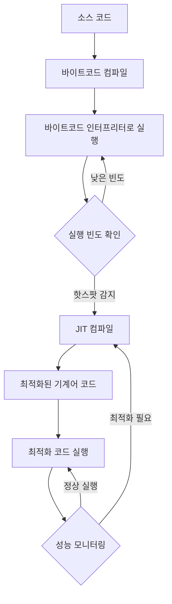

IT(Just-In-Time) 컴파일은 프로그램을 실행하는 시점에 기계어로 변환하는 컴파일 기법입니다. 이 방식은 전통적인 [[인터프리터(Interpreter)]] 방식과 [[정적 컴파일(Static Compilation)]] 방식의 장점을 결합한 하이브리드 접근법으로, 현대 프로그래밍 언어 실행 환경에서 널리 사용되고 있습니다.

JIT 컴파일은 Java의 성능 향상에 크게 기여했으며, 이를 이해하기 위해서는 먼저 [[컴파일 방식의 종류]]에 대한 기본 지식이 필요합니다.

## JIT 컴파일의 작동 원리

JIT 컴파일러는 다음과 같은 단계로 작동합니다:



1. **바이트코드 생성**: 소스 코드는 먼저 플랫폼 독립적인 바이트코드로 컴파일됩니다.
2. **인터프리터 실행**: 프로그램 시작 시 바이트코드는 인터프리터에 의해 실행됩니다.
3. **핫스팟 감지**: 런타임 환경이 자주 실행되는 코드 영역(핫스팟)을 식별합니다.
4. **JIT 컴파일**: 핫스팟으로 식별된 바이트코드를 최적화된 기계어 코드로 컴파일합니다.
5. **최적화 코드 실행**: 이후 해당 코드가 실행될 때는 더 빠른 기계어 코드가 사용됩니다.
6. **프로파일링 기반 재최적화**: 실행 패턴에 따라 필요시 코드를 재최적화합니다.

## JIT vs 다른 컴파일 방식

JIT 컴파일은 다른 코드 실행 방식과 비교하여 고유한 특성을 가지고 있습니다.

### JIT vs 인터프리터

|특성|JIT 컴파일|인터프리터|
|---|---|---|
|실행 속도|최적화 후 빠름|상대적으로 느림|
|시작 시간|중간|빠름|
|메모리 사용량|중간~높음|낮음|
|실행 환경 적응성|높음|제한적|

### JIT vs AOT(Ahead-of-Time) 컴파일

|특성|JIT 컴파일|AOT 컴파일|
|---|---|---|
|컴파일 시점|실행 중|실행 전|
|시작 시간|느림|빠름|
|최적화 수준|런타임 정보 활용 가능|제한적|
|플랫폼 종속성|낮음|높음|
|실행 파일 크기|작음|큼|

AOT 컴파일에 대한 자세한 내용은 [[AOT(Ahead-of-Time) 컴파일]]을 참고해주세요.

## Java HotSpot VM의 JIT 컴파일러

Java의 HotSpot VM은 두 가지 주요 JIT 컴파일러를 포함하고 있습니다:

1. **C1 컴파일러(클라이언트 컴파일러)**:
    
    - 빠른 시작 시간과 기본적인 최적화에 중점
    - 간단한 최적화를 빠르게 적용
    - 주로 클라이언트 애플리케이션에 적합
2. **C2 컴파일러(서버 컴파일러)**:
    
    - 공격적인 최적화와 최대 성능에 중점
    - 심층적인 코드 분석과 고급 최적화 적용
    - 장기 실행 서버 애플리케이션에 적합

Java 8부터는 이 두 컴파일러를 함께 사용하는 **티어드 컴파일(Tiered Compilation)** 방식이 기본으로 적용되어, 애플리케이션 시작 시간과 최대 성능을 모두 개선합니다.

## JIT 컴파일러의 최적화 기법

JIT 컴파일러는 다양한 최적화 기법을 적용하여 코드 실행 성능을 향상시킵니다:

### 1. 인라인화(Inlining)

메서드 호출 오버헤드를 제거하기 위해 호출되는 메서드의 코드를 호출 지점에 직접 삽입합니다.

```java
// 원본 코드
public int add(int a, int b) {
    return a + b;
}

public int compute() {
    return add(5, 10);
}

// 인라인화 후 (논리적 변환)
public int compute() {
    return 5 + 10;  // add 메서드 호출이 제거됨
}
```

### 2. 루프 최적화(Loop Optimization)

반복문을 더 효율적으로 실행하도록 변환합니다. 주요 기법으로는 루프 언롤링, 루프 퓨전, 루프 벡터화 등이 있습니다.

### 3. 탈가상화(Devirtualization)

런타임에 다형성 메서드 호출을 직접 호출로 변환하여 가상 메서드 테이블 검색 오버헤드를 제거합니다.

### 4. 탈이스케이프 분석(Escape Analysis)

객체가 메서드 밖으로 '탈출'하지 않는 경우, 힙 할당을 스택 할당으로 대체하거나 객체 할당 자체를 제거합니다.

### 5. 투기적 최적화(Speculative Optimization)

런타임 동작을 예측하여 최적화를 적용하고, 예측이 틀린 경우 원래 코드로 돌아가는 기법입니다.

최적화 기법에 대한 자세한 내용은 [[JIT 컴파일러 최적화 기법]]을 참고해주세요.

## JIT 컴파일의 장단점

### 장점

- **더 나은 성능**: 실행 패턴에 따라 최적화를 적용하여 정적 컴파일보다 더 나은 성능을 발휘할 수 있습니다.
- **플랫폼 독립성**: 하나의 바이트코드가 여러 플랫폼에서 실행될 수 있습니다.
- **동적 최적화**: 실행 중 수집된 프로파일링 정보를 기반으로 최적화를 적용할 수 있습니다.
- **적응형 최적화**: 실행 패턴이 변경되면 새로운 패턴에 맞게 재최적화를 수행할 수 있습니다.
- **보안**: 코드가 실행 시에만 기계어로 변환되므로 원본 소스 코드 보호에 도움이 됩니다.

### 단점

- **시작 지연**: 초기 최적화 과정으로 인해 애플리케이션 시작 시간이 느려질 수 있습니다.
- **메모리 사용량 증가**: JIT 컴파일러와 최적화된 코드 캐시로 인해 메모리 사용량이 증가합니다.
- **예측 불가능한 성능**: 최적화 타이밍에 따라 성능이 일시적으로 변동될 수 있습니다.
- **리소스 경쟁**: JIT 컴파일러가 CPU와 메모리 리소스를 애플리케이션과 공유합니다.
- **디버깅 복잡성**: 최적화된 코드는 원본 코드와 크게 달라져 디버깅이 어려울 수 있습니다.

## Java에서의 JIT 컴파일 설정

Java에서는 다양한 JVM 옵션을 통해 JIT 컴파일 동작을 제어할 수 있습니다:

```bash
# 티어드 컴파일 활성화 (Java 8 이상에서는 기본 활성화)
java -XX:+TieredCompilation

# 티어드 컴파일 비활성화
java -XX:-TieredCompilation

# 인터프리터 모드만 사용 (JIT 컴파일 비활성화)
java -Xint

# 컴파일 임계값 설정 (메서드가 10,000번 호출될 때 컴파일)
java -XX:CompileThreshold=10000

# C2 컴파일러만 사용
java -XX:-TieredCompilation -XX:+UseCompiler
```

JIT 컴파일러 설정에 대한 더 자세한 내용은 [[JVM 성능 튜닝]]을 참고해주세요.

## 다른 언어/플랫폼의 JIT 컴파일

JIT 컴파일은 Java 외에도 여러 언어와 플랫폼에서 사용됩니다:

1. **.NET Framework/Core**: CLR(Common Language Runtime)은 MSIL(Microsoft Intermediate Language) 코드를 JIT 컴파일합니다.
2. **JavaScript 엔진**: V8(Chrome, Node.js), SpiderMonkey(Firefox), JavaScriptCore(Safari) 등은 JIT 컴파일을 사용합니다.
3. **Python**: PyPy는 빠른 실행을 위해 JIT 컴파일을 사용합니다.
4. **Julia**: 처음부터 JIT 컴파일을 고려하여 설계된 언어입니다.
5. **Android**: ART(Android Runtime)는 AOT와 JIT 컴파일을 혼합하여 사용합니다.

## JIT 컴파일의 미래 트렌드

JIT 컴파일 기술은 계속 발전하고 있으며, 다음과 같은 방향으로 진화하고 있습니다:

1. **프로파일 가이드 최적화(PGO)**: 이전 실행에서 수집된 프로파일 정보를 활용하여 더 나은 최적화를 적용합니다.
2. **AOTC와 JIT의 결합**: 일부 코드는 AOT로 컴파일하고 나머지는 JIT로 컴파일하는 하이브리드 접근 방식이 증가하고 있습니다.
3. **병렬 JIT 컴파일**: 별도의 스레드에서 JIT 컴파일을 수행하여 주 실행 스레드의 지연을 최소화합니다.
4. **기계 학습 기반 최적화**: 실행 패턴을 예측하고 최적의 최적화 전략을 결정하는 데 기계 학습을 활용합니다.
5. **하드웨어 지원 JIT**: 새로운 CPU 기능을 활용하여 JIT 컴파일 성능을 향상시킵니다.

JIT 컴파일 기술의 최신 동향에 대한 자세한 내용은 [[최신 JIT 컴파일 트렌드]]를 참고해주세요.

## 실제 사용 사례

JIT 컴파일은 다양한 분야에서 활용되고 있습니다:

1. **엔터프라이즈 Java 애플리케이션**: 대규모 서버 애플리케이션은 JIT 컴파일의 장기 실행 최적화 이점을 활용합니다.
2. **웹 브라우저**: JavaScript 엔진의 JIT 컴파일로 웹 애플리케이션 성능이 크게 향상되었습니다.
3. **모바일 애플리케이션**: 안드로이드의 ART는 배터리 사용량과 성능 간의 균형을 위해 JIT를 활용합니다.
4. **게임 엔진**: 일부 게임 엔진은 스크립팅 언어의 성능을 높이기 위해 JIT 컴파일을 사용합니다.
5. **수치 계산 및 과학 컴퓨팅**: Julia와 같은 언어는 과학 컴퓨팅을 위해 JIT 컴파일을 핵심으로 활용합니다.

## 결론

JIT 컴파일은 현대 프로그래밍 언어 실행 환경의 핵심 요소로, 플랫폼 독립성과 고성능의 균형을 제공합니다. 특히 Java 생태계에서 JIT 컴파일은 "한 번 작성하고 어디서나 실행(Write Once, Run Anywhere)" 철학을 실현하면서도 네이티브 코드에 근접한 성능을 제공하는 핵심 기술입니다.

최근 [[GraalVM]]과 같은 새로운 기술은 JIT와 AOT 컴파일의 경계를 모호하게 만들고 있으며, 각 접근 방식의 장점을 최대한 활용하려는 시도가 계속되고 있습니다. 개발자는 자신의 애플리케이션 특성과 요구사항에 따라 적절한 컴파일 전략을 선택하는 것이 중요합니다.

## 참고 자료

- Java Virtual Machine Specification
- "Java Performance: The Definitive Guide" - Scott Oaks
- "The Java Virtual Machine" - Jon Meyer and Troy Downing
- "JVM Internals" - Bill Venners
- Oracle JVM 튜닝 가이드(https://docs.oracle.com/javase/8/docs/technotes/guides/vm/gctuning/)