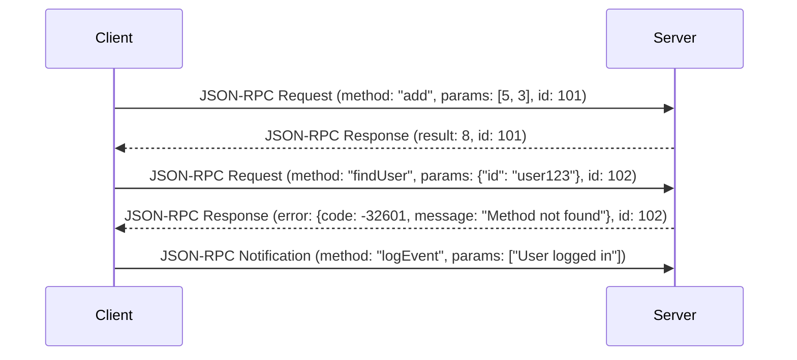

JSON-RPC는 JSON (JavaScript Object Notation) 형식을 사용하여 원격에 있는 서버의 함수나 프로시저를 호출할 수 있게 해주는 간단하고 가벼운 RPC (Remote Procedure Call) 프로토콜입니다. 복잡한 설정 없이, HTTP나 TCP/IP 위에서 손쉽게 서버와 클라이언트 간의 통신을 구현하고 싶을 때 훌륭한 선택지가 될 수 있습니다.

핵심은 **미리 정해진 규칙에 따라 JSON 데이터를 주고받는 것**에 있습니다. 이 규칙이 매우 단순하여 학습 곡선이 낮고, 다양한 프로그래밍 언어에서 쉽게 구현할 수 있다는 장점이 있습니다. 이 글에서는 JSON-RPC 2.0 스펙을 기준으로 핵심 개념과 사용법을 알아보겠습니다.

---

## JSON-RPC의 핵심 구조

JSON-RPC는 크게 **요청(Request) 객체**와 **응답(Response) 객체**라는 두 가지 구조로 통신합니다. 클라이언트는 서버에 요청 객체를 보내고, 서버는 그에 대한 응답 객체를 클라이언트에게 돌려줍니다.

### 1. 요청 (Request) 객체

클라이언트가 서버의 특정 기능을 실행시키기 위해 보내는 메시지입니다.

- **`jsonrpc`**: 사용하는 JSON-RPC 프로토콜의 버전을 명시합니다. 반드시 `"2.0"`이어야 합니다.
- **`method`**: 호출하고자 하는 원격 프로시저(메서드)의 이름입니다. (예: `"math.add"`)
- **`params`**: 호출하는 메서드에 전달할 인자(parameter)입니다. 배열(`[]`) 또는 객체(`{}`) 형태를 사용할 수 있습니다.
- **`id`**: 요청을 식별하기 위한 고유한 값입니다. 서버는 이 `id`를 응답에 포함하여 어떤 요청에 대한 응답인지 클라이언트가 알 수 있도록 해야 합니다. 숫자나 문자열을 사용할 수 있습니다.
    - `id`가 없는 요청은 '알림(Notification)'으로 간주되며, 서버는 이에 대해 응답을 보내지 않습니다. 자세한 내용은 JSON-RPC 알림(Notification) 노트를 참고해주세요.

**예시 코드 (위치 기반 파라미터):**

```json
{
  "jsonrpc": "2.0",
  "method": "subtract",
  "params": [42, 23],
  "id": 1
}
```

### 2. 응답 (Response) 객체

서버가 클라이언트의 요청을 처리한 후 보내는 결과 메시지입니다.

- **`jsonrpc`**: 요청과 마찬가지로 `"2.0"`을 명시합니다.
- **`result`**: 요청이 성공적으로 처리되었을 경우, 그 결과값을 담습니다. 에러가 발생했을 경우에는 이 필드가 포함되지 않습니다.
- `error`**: 요청 처리 중 에러가 발생했을 경우, 에러 객체를 담습니다. 요청이 성공했을 경우에는 이 필드가 포함되지 않습니다. 자세한 내용은 JSON-RPC 에러 코드를 참고해주세요.
- **`id`**: 반드시 원본 요청의 `id`와 동일한 값이어야 합니다. `id`가 없는 요청(알림)에는 응답하지 않습니다.

**성공 응답 예시:**

```json
{
  "jsonrpc": "2.0",
  "result": 19,
  "id": 1
}
```

**에러 응답 예시:**

```json
{
  "jsonrpc": "2.0",
  "error": { "code": -32602, "message": "Invalid params" },
  "id": 1
}
```

---

## 통신 흐름 시각화

클라이언트와 서버가 JSON-RPC를 통해 통신하는 과정은 다음과 같이 간단하게 시각화할 수 있습니다.



---

## JSON-RPC 와 REST API

JSON-RPC는 종종 [[RESTful API]]와 비교되곤 합니다. 두 방식 모두 HTTP를 기반으로 통신할 수 있지만, 근본적인 철학에 차이가 있습니다.

가장 큰 차이점은 **JSON-RPC가 '행위(Action)' 중심**인 반면, **REST는 '자원(Resource)' 중심**이라는 점입니다.

자세한 내용은 [[JSON-RPC와 REST API의 차이점]] 노트를 참고해주세요.

---

## 스프링 프레임워크를 이용한 구현 예시

스프링 부트 환경에서 별도의 라이브러리 없이 간단한 JSON-RPC 엔드포인트를 구현하는 예시입니다.

### 1. 요청/응답 DTO(Data Transfer Object) 정의

JSON-RPC의 구조에 맞춰 요청과 응답을 처리할 자바 클래스를 정의합니다.

**JsonRpcRequest.java**

```java
import java.util.List;

public class JsonRpcRequest {
    private String jsonrpc;
    private String method;
    private List<Object> params;
    private String id;

    // Getters and Setters
}
```

**JsonRpcResponse.java**

```java
public class JsonRpcResponse {
    private String jsonrpc = "2.0";
    private Object result;
    private Object error;
    private String id;
    
    // Constructors, Getters and Setters
    
    // 성공 응답을 위한 정적 팩토리 메서드
    public static JsonRpcResponse createSuccessResponse(String id, Object result) {
        JsonRpcResponse response = new JsonRpcResponse();
        response.setId(id);
        response.setResult(result);
        return response;
    }

    // 에러 응답을 위한 정적 팩토리 메서드
    public static JsonRpcResponse createErrorResponse(String id, Object error) {
        JsonRpcResponse response = new JsonRpcResponse();
        response.setId(id);
        response.setError(error);
        return response;
    }
}
```

### 2. 컨트롤러 구현

`@RestController`를 사용하여 JSON-RPC 요청을 받고, `method` 이름에 따라 분기하여 처리하는 단일 엔드포인트를 만듭니다.

**JsonRpcController.java**

```java
import org.springframework.web.bind.annotation.PostMapping;
import org.springframework.web.bind.annotation.RequestBody;
import org.springframework.web.bind.annotation.RestController;

import java.util.List;
import java.util.Map;

@RestController
public class JsonRpcController {

    @PostMapping("/jsonrpc")
    public JsonRpcResponse handleJsonRpcRequest(@RequestBody JsonRpcRequest request) {
        if (!"2.0".equals(request.getJsonrpc())) {
            return JsonRpcResponse.createErrorResponse(request.getId(), Map.of("code", -32600, "message", "Invalid Request"));
        }

        switch (request.getMethod()) {
            case "add":
                return handleAdd(request);
            case "subtract":
                return handleSubtract(request);
            default:
                return JsonRpcResponse.createErrorResponse(request.getId(), Map.of("code", -32601, "message", "Method not found"));
        }
    }

    private JsonRpcResponse handleAdd(JsonRpcRequest request) {
        try {
            List<Object> params = request.getParams();
            int a = ((Number) params.get(0)).intValue();
            int b = ((Number) params.get(1)).intValue();
            int result = a + b;
            return JsonRpcResponse.createSuccessResponse(request.getId(), result);
        } catch (Exception e) {
            return JsonRpcResponse.createErrorResponse(request.getId(), Map.of("code", -32602, "message", "Invalid params"));
        }
    }
    
    private JsonRpcResponse handleSubtract(JsonRpcRequest request) {
        // 빼기 로직 구현
        try {
            List<Object> params = request.getParams();
            int a = ((Number) params.get(0)).intValue();
            int b = ((Number) params.get(1)).intValue();
            int result = a - b;
            return JsonRpcResponse.createSuccessResponse(request.getId(), result);
        } catch (Exception e) {
            return JsonRpcResponse.createErrorResponse(request.getId(), Map.of("code", -32602, "message", "Invalid params"));
        }
    }
}
```

위 예시는 가장 기본적인 형태로, 실제 프로덕션 환경에서는 `method` 이름과 서비스 로직을 매핑하는 부분을 더 정교하게 설계해야 합니다.

---

## JSON-RPC의 장단점

### 장점

- **단순함**: 프로토콜 스펙이 매우 간단하고 명확하여 이해하고 구현하기 쉽습니다.
- **유연성**: 특정 전송 프로토콜(HTTP, TCP 등)에 종속되지 않습니다.
- **가독성**: JSON을 사용하므로 사람이 읽고 디버깅하기 편리합니다.
- **언어 독립성**: 대부분의 주요 프로그래밍 언어에서 JSON 파싱을 지원하므로 이기종 시스템 간의 연동이 용이합니다.

### 단점

- **기능 부족**: 파일 전송, 인증 등 복잡한 기능을 위한 표준 스펙이 없습니다.
- **서비스 탐색 부재**: 특정 서버가 어떤 메서드들을 제공하는지 알 수 있는 표준적인 방법(Discovery)이 없습니다.
- **단일 요청/응답 구조**: 하나의 HTTP 요청으로 여러 개의 RPC 호출을 묶어서 처리하는 표준적인 방법(Batch)은 있지만, GraphQL처럼 복잡한 데이터 요구사항을 한 번에 처리하기에는 부족합니다.

## 결론

JSON-RPC는 가볍고 빠른 원격 호출이 필요할 때, 특히 마이크로서비스 간 내부 통신이나 간단한 API를 제공하는 경우에 매우 효과적인 프로토콜입니다. REST의 복잡한 규칙이나 GraphQL의 높은 학습 곡선이 부담스럽다면, JSON-RPC는 합리적이고 실용적인 대안이 될 수 있습니다. 명확한 규칙과 단순함이 바로 JSON-RPC의 가장 큰 매력입니다.

## 참고 자료

- [JSON-RPC 2.0 Specification](https://www.jsonrpc.org/specification)
- [Wikipedia - JSON-RPC](https://en.wikipedia.org/wiki/JSON-RPC)