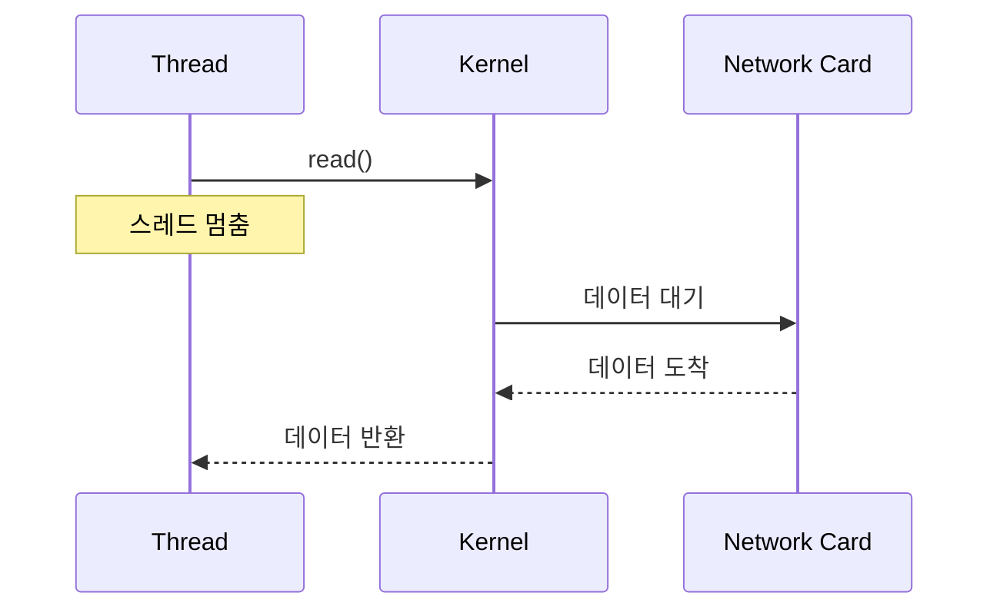
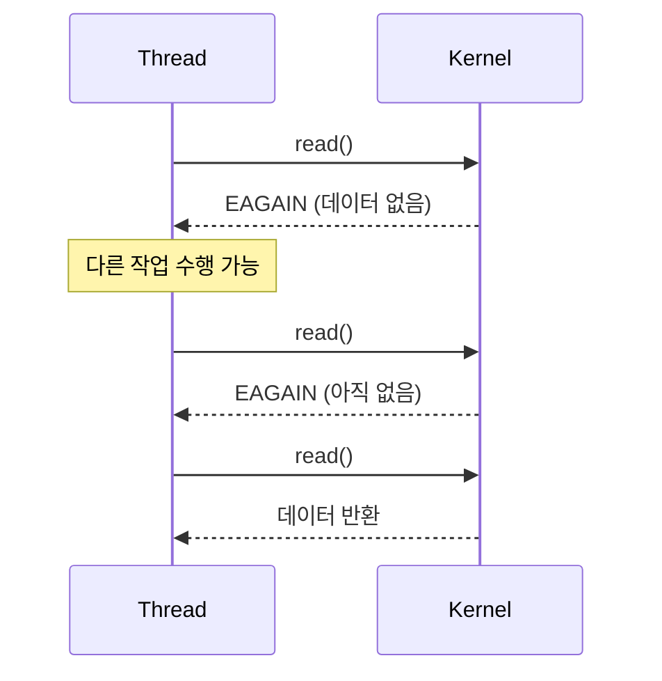
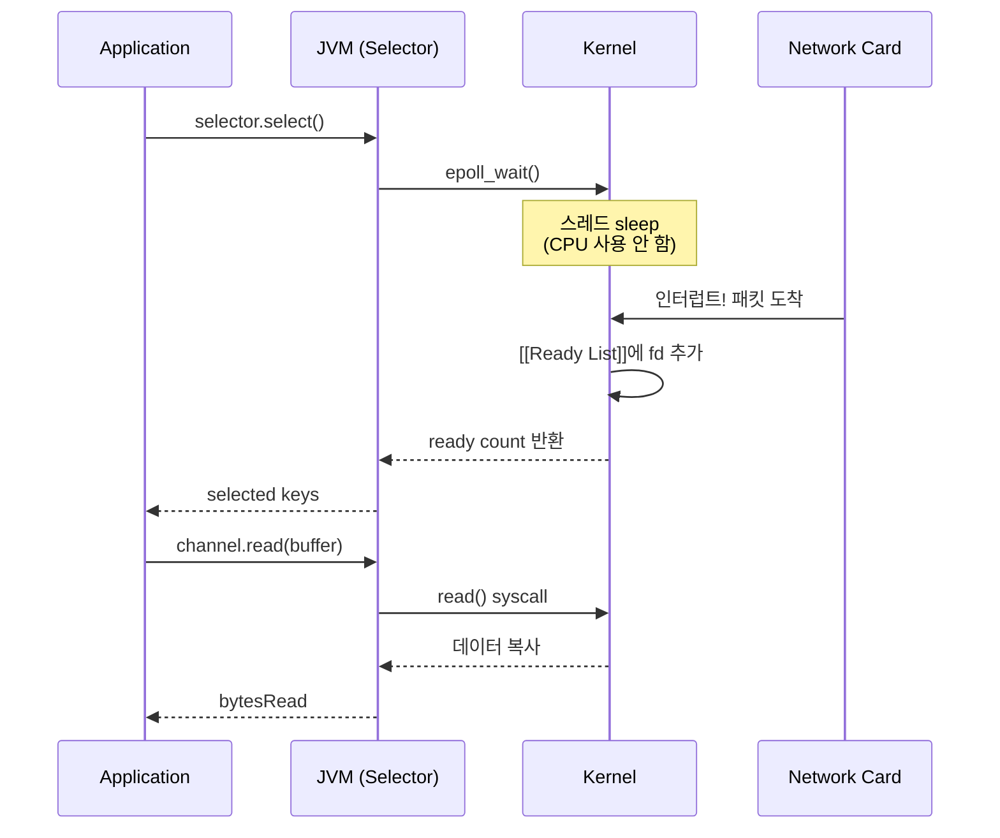

Java NIO(New I/O)는 JDK 1.4에서 도입된 [[논블로킹(Non-blocking)]] I/O API다. 기존의 java.io 패키지가 스트림 기반이고 [[블로킹(blocking)]] 방식인 것과 달리, NIO는 버퍼 기반이고 논블로킹 모드를 지원한다. [[IO 멀티플렉싱(IO Multiplexing)]]을 통해 단일 스레드로 여러 연결을 처리할 수 있다. [[Netty]]는 이 Java NIO를 기반으로 더 사용하기 쉬운 고수준 API를 제공한다.

---

## 기존 I/O vs NIO

| 특성     | 기존 I/O (java.io) | NIO (java.nio) |
| ------ | ---------------- | -------------- |
| 처리 단위  | 스트림 (바이트/문자)     | 버퍼             |
| 블로킹    | 항상 블로킹           | 논블로킹 가능        |
| 다중화    | 불가               | Selector로 가능   |
| 데이터 흐름 | 단방향              | 양방향 (Channel)  |

---

## 핵심 컴포넌트

### Buffer

데이터를 담는 컨테이너. 읽고 쓰는 작업의 기본 단위다.

```java
// 버퍼 생성
ByteBuffer buffer = ByteBuffer.allocate(1024);

// 데이터 쓰기
buffer.put((byte) 1);
buffer.putInt(42);
buffer.put("Hello".getBytes());

// 쓰기 → 읽기 모드 전환 (필수!)
buffer.flip();

// 데이터 읽기
byte b = buffer.get();
int i = buffer.getInt();

// 버퍼 초기화
buffer.clear();  // 또는 buffer.compact();
```

버퍼의 주요 속성:
- **capacity**: 버퍼의 총 크기
- **position**: 현재 읽기/쓰기 위치
- **limit**: 읽기/쓰기 가능한 범위
- **mark**: 기억해둔 position

```
0 <= mark <= position <= limit <= capacity
```

### Channel

데이터가 이동하는 통로. 양방향 읽기/쓰기가 가능하다.

```java
// 파일 채널
FileChannel fileChannel = FileChannel.open(Paths.get("data.txt"),
    StandardOpenOption.READ, StandardOpenOption.WRITE);

// 소켓 채널
SocketChannel socketChannel = SocketChannel.open();
socketChannel.configureBlocking(false);  // 논블로킹 모드
socketChannel.connect(new InetSocketAddress("localhost", 8080));

// 서버 소켓 채널
ServerSocketChannel serverChannel = ServerSocketChannel.open();
serverChannel.configureBlocking(false);
serverChannel.bind(new InetSocketAddress(8080));

// 데이터 읽기/쓰기
ByteBuffer buffer = ByteBuffer.allocate(1024);
int bytesRead = socketChannel.read(buffer);   // 채널 → 버퍼
buffer.flip();
int bytesWritten = socketChannel.write(buffer);  // 버퍼 → 채널
```

#### 채널 종류 비교

| 채널 | 역할 | 논블로킹 | 비유 |
|------|------|----------|------|
| FileChannel | 파일 읽기/쓰기 | 불가 | 파일 핸들 |
| ServerSocketChannel | 연결 수락 (listen) | 가능 | 호텔 프론트 |
| SocketChannel | 데이터 송수신 | 가능 | 호텔 객실 |

#### 데이터 읽기/쓰기 흐름

`read()` → `flip()` → `write()` 순서가 핵심이다.

```
1. allocate(1024) - 버퍼 생성
   [                    ] position=0, limit=1024

2. read(buffer) - 채널에서 버퍼로 데이터 읽기
   [H|e|l|l|o|          ] position=5, limit=1024
                ↑ 데이터가 여기까지 쓰여짐

3. flip() - 쓰기 모드 → 읽기 모드 전환
   [H|e|l|l|o|          ] position=0, limit=5
    ↑ position을 0으로, limit을 기존 position으로

4. write(buffer) - 버퍼에서 채널로 데이터 쓰기
   position(0)부터 limit(5)까지 → "Hello" 전송
```
### Selector

여러 채널의 이벤트를 감시하는 다중화 컴포넌트. [[Reactor 패턴]]의 핵심이다.

```java
Selector selector = Selector.open();

// 채널을 Selector에 등록
serverChannel.register(selector, SelectionKey.OP_ACCEPT);
socketChannel.register(selector, SelectionKey.OP_READ | SelectionKey.OP_WRITE);

// 이벤트 대기 (블로킹)
while (true) {
    int readyCount = selector.select();  // 이벤트 발생까지 대기

    if (readyCount == 0) continue;

    Set<SelectionKey> selectedKeys = selector.selectedKeys();
    Iterator<SelectionKey> iter = selectedKeys.iterator();

    while (iter.hasNext()) {
        SelectionKey key = iter.next();
        iter.remove();  // 반드시 제거

        if (key.isAcceptable()) {
            // 새 연결 수락
            ServerSocketChannel server = (ServerSocketChannel) key.channel();
            SocketChannel client = server.accept();
            client.configureBlocking(false);
            client.register(selector, SelectionKey.OP_READ);
        }

        if (key.isReadable()) {
            // 데이터 읽기 가능
            SocketChannel client = (SocketChannel) key.channel();
            ByteBuffer buffer = ByteBuffer.allocate(1024);
            int bytesRead = client.read(buffer);
            // 처리...
        }
    }
}
```

---

## SelectionKey 이벤트

| 상수 | 의미 |
|-----|------|
| OP_ACCEPT | 새 연결 수락 가능 (서버 소켓) |
| OP_CONNECT | 연결 완료 (클라이언트 소켓) |
| OP_READ | 읽기 가능 |
| OP_WRITE | 쓰기 가능 |

---

## 논블로킹 I/O

NIO 채널은 논블로킹 모드로 설정할 수 있다.

```java
socketChannel.configureBlocking(false);

// 논블로킹 읽기 - 데이터 없으면 즉시 반환
ByteBuffer buffer = ByteBuffer.allocate(1024);
int bytesRead = socketChannel.read(buffer);
// bytesRead가 0이면 읽을 데이터 없음
// bytesRead가 -1이면 연결 종료

// 논블로킹 연결
boolean connected = socketChannel.connect(address);
if (!connected) {
    // 연결 진행 중 - 나중에 finishConnect() 필요
    while (!socketChannel.finishConnect()) {
        // 다른 작업 수행 가능
    }
}
```

### 블로킹 vs 논블로킹 시스템 콜

블로킹 모드에서는 데이터가 올 때까지 스레드가 멈추지만, 논블로킹 모드에서는 즉시 반환된다.

#### 블로킹 I/O



#### 논블로킹 I/O



### 커널 레벨 동작

`configureBlocking(false)` 호출 시 내부적으로 시스템 콜이 실행된다:

```c
// Linux 시스템 콜
int flags = fcntl(fd, F_GETFL, 0);
fcntl(fd, F_SETFL, flags | O_NONBLOCK);  // 논블로킹 플래그 설정
```

| 모드 | read() 시 데이터 없으면 | write() 시 버퍼 가득 차면 |
|------|------------------------|--------------------------|
| 블로킹 | 데이터 올 때까지 대기 | 공간 생길 때까지 대기 |
| 논블로킹 | 즉시 반환 (0 또는 -1) | 즉시 반환 (부분 쓰기/0) |

### Selector 내부 동작

Selector는 OS의 I/O 멀티플렉싱 시스템 콜을 래핑한다:

| OS | 시스템 콜 | Java Selector 내부 |
|----|----------|-------------------|
| Linux | [[epoll]] | `epoll_create()`, `epoll_wait()` |
| macOS | kqueue | `kqueue()`, `kevent()` |
| Windows | IOCP | `CreateIoCompletionPort()` |

#### select() 호출 시 내부 흐름



### I/O 멀티플렉싱 시스템 콜 비교

Java NIO Selector의 성능은 내부적으로 사용하는 시스템 콜에 따라 달라진다. 각 시스템 콜의 특성을 이해하면 Selector의 동작을 더 잘 이해할 수 있다.

| 시스템 콜 | fd 제한 | 시간복잡도 | 특징 |
|-----------|---------|------------|------|
| [[select]] | 1024 (FD_SETSIZE) | O(n) | 가장 오래됨, 이식성 좋음 |
| [[poll]] | 없음 | O(n) | select 개선, 여전히 전체 순회 |
| [[epoll]] | 없음 | O(1) | Linux 전용, 콜백 기반 [[Ready List]] |

[[epoll]]이 O(1)인 이유는 커널이 이벤트 발생 시 콜백으로 Ready List에 추가하기 때문이다. 10,000개 fd 중 2개만 ready면 2개만 반환한다. 자세한 동작 원리는 각 문서 참고.

### 논블로킹 read() 반환값

| 반환값 | 의미 | 처리 |
|--------|------|------|
| `> 0` | 읽은 바이트 수 | 데이터 처리 |
| `0` | 읽을 데이터 없음 | 나중에 다시 시도 |
| `-1` | 연결 종료 (EOF) | 채널 닫기 |

```java
int bytesRead = channel.read(buffer);

if (bytesRead > 0) {
    buffer.flip();
    processData(buffer);
} else if (bytesRead == 0) {
    // 데이터 없음 - Selector에 다시 등록
    key.interestOps(SelectionKey.OP_READ);
} else {
    // bytesRead == -1: 연결 종료
    channel.close();
}
```

---

## Direct Buffer vs Heap Buffer

```java
// Heap Buffer: JVM 힙에 할당
ByteBuffer heapBuffer = ByteBuffer.allocate(1024);

// Direct Buffer: 네이티브 메모리에 할당
ByteBuffer directBuffer = ByteBuffer.allocateDirect(1024);
```

| 특성 | Heap Buffer | Direct Buffer |
|-----|------------|---------------|
| 메모리 위치 | JVM 힙 | 네이티브 메모리 |
| GC 영향 | 있음 | 없음 |
| 할당 속도 | 빠름 | 느림 |
| I/O 성능 | 중간 복사 필요 | 직접 전송 (빠름) |

I/O가 많은 서버에서는 Direct Buffer가 유리하다. 시스템 콜 시 JVM 힙에서 네이티브 메모리로 복사하는 과정이 생략되기 때문이다.

---

## 간단한 Echo 서버 예제

```java
public class NioEchoServer {
    public static void main(String[] args) throws IOException {
        Selector selector = Selector.open();
        ServerSocketChannel serverChannel = ServerSocketChannel.open();
        serverChannel.bind(new InetSocketAddress(8080));
        serverChannel.configureBlocking(false);
        serverChannel.register(selector, SelectionKey.OP_ACCEPT);

        System.out.println("서버 시작: 8080");

        while (true) {
            selector.select();
            Set<SelectionKey> keys = selector.selectedKeys();
            Iterator<SelectionKey> iter = keys.iterator();

            while (iter.hasNext()) {
                SelectionKey key = iter.next();
                iter.remove();

                if (key.isAcceptable()) {
                    SocketChannel client = serverChannel.accept();
                    client.configureBlocking(false);
                    client.register(selector, SelectionKey.OP_READ);
                    System.out.println("새 연결: " + client.getRemoteAddress());
                }

                if (key.isReadable()) {
                    SocketChannel client = (SocketChannel) key.channel();
                    ByteBuffer buffer = ByteBuffer.allocate(256);
                    int bytesRead = client.read(buffer);

                    if (bytesRead == -1) {
                        client.close();
                        continue;
                    }

                    buffer.flip();
                    client.write(buffer);  // Echo
                }
            }
        }
    }
}
```

---

## NIO의 어려움

Java NIO를 직접 사용하면 여러 어려움이 있다.

1. **버퍼 관리 복잡**: flip(), clear(), compact() 호출 시점
2. **불완전한 읽기/쓰기**: 한 번의 read/write가 전체 데이터를 처리하지 않을 수 있음
3. **Selector 버그**: Linux epoll에서의 spin bug (JDK-6670302)
4. **예외 처리**: 연결 끊김, 타임아웃 등 다양한 상황 처리
5. **프로토콜 프레이밍**: 메시지 경계 처리

[[Netty]]는 이런 복잡성을 추상화해서 더 쉽게 네트워크 프로그래밍을 할 수 있게 해준다.

```java
// NIO 직접 사용
while (buffer.hasRemaining()) {
    channel.write(buffer);  // 부분 쓰기 가능
}

// Netty 사용
ctx.writeAndFlush(message);  // 완료까지 자동 처리
```

---

## NIO.2 (Java 7)

Java 7에서 추가된 NIO.2는 비동기 I/O를 지원한다.

```java
AsynchronousSocketChannel asyncChannel = AsynchronousSocketChannel.open();

// 비동기 읽기 - 콜백 방식
ByteBuffer buffer = ByteBuffer.allocate(1024);
asyncChannel.read(buffer, buffer, new CompletionHandler<Integer, ByteBuffer>() {
    @Override
    public void completed(Integer result, ByteBuffer attachment) {
        // 읽기 완료
    }

    @Override
    public void failed(Throwable exc, ByteBuffer attachment) {
        // 실패
    }
});

// 비동기 읽기 - Future 방식
Future<Integer> future = asyncChannel.read(buffer);
int bytesRead = future.get();  // 완료까지 블로킹
```

---

## References

- [[Netty]]
- [[Reactor 패턴]]
- [[Netty ByteBuf]]
- [Java NIO Tutorial - Oracle](https://docs.oracle.com/javase/tutorial/essential/io/)
