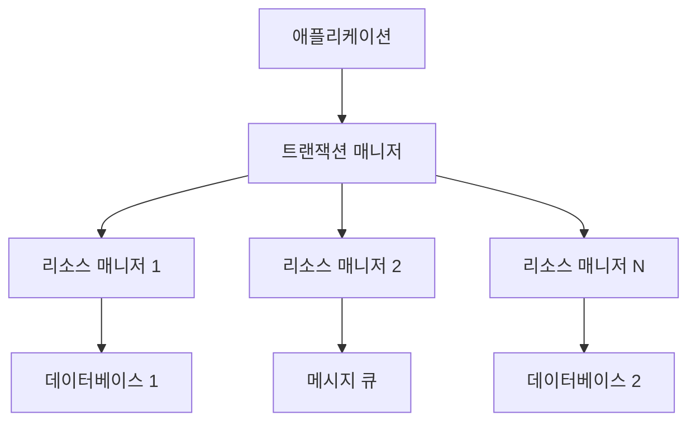

Java Transaction API(JTA)는 자바 애플리케이션에서 분산 트랜잭션을 처리하기 위한 고수준 API입니다. JTA는 여러 리소스(다중 데이터베이스, JMS 큐 등)에 걸친 작업의 원자성을 보장하여 데이터 일관성을 유지하는 데 중요한 역할을 합니다.

## JTA의 기본 개념

JTA는 [[X/Open XA 표준]]을 기반으로 하며, 분산 환경에서 [[ACID 속성]]을 가진 트랜잭션을 지원합니다. JTA는 자바 엔터프라이즈 에디션(Java EE, 현재 Jakarta EE)의 핵심 컴포넌트이지만, 스탠드얼론 자바 애플리케이션에서도 사용할 수 있습니다.

## JTA 아키텍처

JTA 아키텍처는 다음과 같은 주요 컴포넌트로 구성됩니다:



1. **트랜잭션 매니저(Transaction Manager)**: 분산 트랜잭션을 조정하고 제어하는 중앙 컴포넌트
2. **리소스 매니저(Resource Manager)**: 데이터베이스, JMS 제공자 등 관리되는 리소스
3. **애플리케이션(Application)**: 트랜잭션을 시작, 커밋, 롤백하는 비즈니스 로직

## JTA 주요 인터페이스

JTA는 다음과 같은 주요 인터페이스를 제공합니다:

### 1. javax.transaction.UserTransaction

애플리케이션 코드에서 직접 사용하는 인터페이스로, 트랜잭션을 시작, 커밋, 롤백할 수 있습니다.

```java
@Resource
UserTransaction userTransaction;

public void performOperation() throws Exception {
    userTransaction.begin();
    
    try {
        // 데이터베이스 작업 수행
        orderDao.saveOrder(order);
        
        // JMS 메시지 전송
        jmsTemplate.convertAndSend("orderQueue", order);
        
        userTransaction.commit();
    } catch (Exception e) {
        userTransaction.rollback();
        throw e;
    }
}
```

### 2. javax.transaction.TransactionManager

트랜잭션 매니저에 접근하기 위한 인터페이스로, 주로 애플리케이션 서버나 프레임워크 내부에서 사용됩니다.

```java
@Resource
TransactionManager transactionManager;

public void suspendAndResumeTransaction() throws Exception {
    Transaction tx = transactionManager.suspend();
    
    try {
        // 새로운 트랜잭션에서 작업 수행
        performOperationInNewTransaction();
    } finally {
        if (tx != null) {
            transactionManager.resume(tx);
        }
    }
}
```

### 3. javax.transaction.Transaction

현재 트랜잭션을 나타내는 인터페이스로, 트랜잭션 매니저를 통해 접근할 수 있습니다.

## 분산 트랜잭션의 작동 방식

JTA를 사용한 분산 트랜잭션은 [[2단계 커밋 프로토콜(Two-Phase Commit)]]을 사용하여 여러 리소스 간의 일관성을 보장합니다:

1. **준비 단계(Prepare Phase)**:
    
    - 트랜잭션 매니저는 모든 리소스 매니저에게 트랜잭션을 커밋할 준비가 되었는지 확인
    - 각 리소스 매니저는 트랜잭션을 커밋할 수 있으면 '준비됨' 응답, 그렇지 않으면 '실패' 응답
2. **커밋 단계(Commit Phase)**:
    
    - 모든 리소스 매니저가 '준비됨' 응답을 보내면 트랜잭션 매니저는 모든 리소스 매니저에게 커밋 명령
    - 하나라도 '실패' 응답을 보내면 트랜잭션 매니저는 모든 리소스 매니저에게 롤백 명령

2단계 커밋 프로토콜에 대한 자세한 내용은 [[2단계 커밋 프로토콜]]을 참고해주세요.

## JTA 구현체

다양한 JTA 구현체가 있으며, 대표적인 것들은 다음과 같습니다:

1. **Java EE 애플리케이션 서버 내장 JTA**: WebLogic, WebSphere, JBoss/WildFly, GlassFish 등
2. **독립형 JTA 구현체**:
    - **Atomikos TransactionsEssentials**: 가장 널리 사용되는 독립형 JTA 구현체
    - **Bitronix Transaction Manager(BTM)**: 경량 JTA 구현체
    - **Narayana**: JBoss/WildFly의 트랜잭션 매니저

## 스프링 프레임워크에서의 JTA 사용

스프링 프레임워크는 JTA를 쉽게 통합할 수 있는 방법을 제공합니다:

### JtaTransactionManager 설정

```java
@Configuration
@EnableTransactionManagement
public class JtaConfig {
    
    @Bean
    public PlatformTransactionManager transactionManager() {
        return new JtaTransactionManager();
    }
}
```

### 트랜잭션 설정

```java
@Service
public class OrderService {
    
    @Autowired
    private OrderRepository orderRepository;
    
    @Autowired
    private PaymentService paymentService;
    
    @Transactional
    public void processOrder(Order order) {
        // 주문 저장 (데이터베이스 1)
        orderRepository.save(order);
        
        // 결제 처리 (데이터베이스 2)
        paymentService.processPayment(order.getPayment());
        
        // JTA는 두 작업이 모두 성공하거나 모두 실패하도록 보장
    }
}
```

스프링 부트에서 JTA를 사용하려면 다음과 같이 의존성을 추가합니다:

```xml
<!-- Maven -->
<dependency>
    <groupId>org.springframework.boot</groupId>
    <artifactId>spring-boot-starter-jta-atomikos</artifactId>
</dependency>
```

## JTA의 장단점

### 장점

1. **데이터 일관성**: 여러 리소스에 걸친 작업의 원자성을 보장
2. **표준화**: J2EE/Java EE(현 Jakarta EE) 표준의 일부로 널리 채택
3. **추상화**: 개발자가 저수준 트랜잭션 세부사항을 처리할 필요 없음

### 단점

1. **성능 오버헤드**: 2단계 커밋 프로토콜은 추가적인 네트워크 통신과 디스크 I/O 발생
2. **복잡성**: 설정 및 관리가 복잡할 수 있음
3. **가용성 문제**: 트랜잭션 매니저가 단일 장애점(SPOF)이 될 수 있음

## JTA 대안: 보상 트랜잭션(Compensating Transaction)

분산 트랜잭션의 성능 오버헤드를 피하기 위해 [[보상 트랜잭션(Compensating Transaction)]]을 고려할 수 있습니다. 이 패턴은 실패 시 이전에 성공한 작업을 취소하는 별도의 트랜잭션을 구현합니다.

```java
@Service
public class OrderService {
    
    @Autowired
    private OrderRepository orderRepository;
    
    @Autowired
    private PaymentService paymentService;
    
    @Transactional
    public void processOrder(Order order) {
        // 주문 저장
        Order savedOrder = orderRepository.save(order);
        
        try {
            // 결제 처리
            paymentService.processPayment(order.getPayment());
        } catch (Exception e) {
            // 보상 트랜잭션: 주문 취소
            orderRepository.updateStatus(savedOrder.getId(), OrderStatus.CANCELLED);
            throw e;
        }
    }
}
```

보상 트랜잭션에 대한 자세한 내용은 [[보상 트랜잭션 패턴]]을 참고해주세요.

## JTA vs. 로컬 트랜잭션

|특성|JTA(글로벌 트랜잭션)|로컬 트랜잭션|
|---|---|---|
|범위|여러 리소스에 걸친 트랜잭션|단일 리소스 내 트랜잭션|
|성능|상대적으로 느림|상대적으로 빠름|
|복잡성|높음|낮음|
|유즈케이스|여러 데이터베이스, JMS 작업 등이 포함된 분산 작업|단일 데이터베이스 작업|

## JTA 사용 시 모범 사례

1. **필요한 경우에만 JTA 사용**: 단일 리소스 트랜잭션에는 로컬 트랜잭션을 사용
2. **트랜잭션 경계 최소화**: 트랜잭션 범위를 가능한 한 작게 유지
3. **적절한 타임아웃 설정**: 무한정 대기하는 트랜잭션 방지
4. **예외 처리 전략 수립**: 트랜잭션 실패 시 적절한 복구 메커니즘 구현
5. **모니터링 및 로깅**: 트랜잭션 동작 모니터링을 위한 로깅 활성화

## JTA 디버깅 및 문제 해결

JTA 트랜잭션 디버깅을 위한 몇 가지 팁:

1. **로깅 활성화**: JTA 구현체의 로깅을 활성화하여 트랜잭션 흐름 추적
    
    ```properties
    # Atomikos 로깅 예시
    com.atomikos.level=DEBUG
    ```
    
2. **트랜잭션 타임아웃 확인**: 장기 실행 트랜잭션은 타임아웃 설정 확인
    
    ```java
    @Transactional(timeout = 60) // 60초 타임아웃
    public void longRunningOperation() {
        // ...
    }
    ```
    
3. **리소스 매니저 설정 확인**: XA 데이터소스 및 JMS 연결 팩토리가 올바르게 구성되었는지 확인
    

## 결론

JTA는 분산 트랜잭션 관리를 위한 강력한 API로, 여러 리소스에 걸친 작업의 데이터 일관성을 보장합니다. 그러나 성능 오버헤드와 복잡성으로 인해 항상 최선의 선택은 아닙니다. 애플리케이션의 요구사항과 트랜잭션 특성을 고려하여 JTA와 로컬 트랜잭션, 또는 보상 트랜잭션 패턴 중 적절한 방식을 선택하는 것이 중요합니다.

현대 마이크로서비스 아키텍처에서는 [[사가 패턴(Saga Pattern)]]과 같은 대안적인 분산 트랜잭션 관리 방식도 널리 사용되고 있습니다. 각 시스템의 특성에 맞는 트랜잭션 관리 전략을 수립하는 것이 성공적인 애플리케이션 개발의 핵심입니다.

## 참고 자료

- Java EE Platform Specification
- Spring Framework 공식 문서(https://docs.spring.io/spring-framework/docs/current/reference/html/data-access.html#transaction-strategies)
- Enterprise Integration Patterns - Gregor Hohpe, Bobby Woolf
- Patterns of Enterprise Application Architecture - Martin Fowler