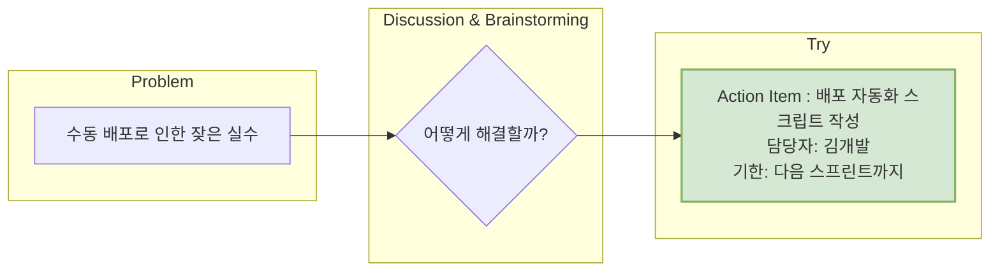

**KPT**는 **Keep, Problem, Try**의 앞 글자를 딴, 가장 널리 알려지고 직관적인 [[회고(Retrospective)]] 프레임워크 중 하나입니다. 팀이 지난 업무 주기를 되돌아보며 좋았던 점은 이어가고, 문제점은 개선하며, 이를 위한 구체적인 시도를 약속하기 위해 사용됩니다.

단순하고 명확한 구조 덕분에 [[애자일(Agile)]] 방법론을 처음 도입하는 팀이나 회고가 익숙하지 않은 팀도 쉽게 시작할 수 있습니다.

## KPT의 세 가지 구성 요소

KPT는 이름 그대로 세 가지 핵심 질문에 집중합니다.

### 1. Keep (유지할 점)

> **"이번 주기 동안 좋았던 점, 앞으로도 계속 이어가고 싶은 것은 무엇인가?"**

- **목적:** 팀의 성공적인 경험과 긍정적인 행동을 명확히 인식하고, 이를 팀의 표준적인 문화와 프로세스로 정착시키기 위함입니다. 팀의 사기를 높이고 강점을 강화하는 역할을 합니다.
- **예시:**
    - "매일 아침 10분씩 진행한 데일리 스크럼 덕분에 팀의 진행 상황 공유가 원활했습니다."
    - "새로 도입한 코드 리뷰 템플릿을 사용하니 리뷰의 질이 높아지고 시간이 단축되었습니다."
    - "슬랙의 특정 채널을 통해 기획 변경사항을 공유하니 놓치는 부분이 없어서 좋았습니다."

### 2. Problem (개선할 점)

> **"이번 주기 동안 아쉬웠던 점, 불편했거나 개선이 필요하다고 느끼는 것은 무엇인가?"**

- **목적:** 팀의 성장을 방해하는 문제점과 비효율을 솔직하게 드러내고 공유하는 것입니다. 이 과정에서는 개인을 비난하는 것이 아니라, 현상과 프로세스 자체에 집중하는 [[심리적 안정감(Psychological Safety)]]이 매우 중요합니다.
- **예시:**
    - "수동으로 진행하는 배포 과정에서 실수가 발생하여 시간이 지연되었습니다."
    - "급하게 추가된 기능의 요구사항이 불명확해서 재작업이 많았습니다."
    - "칸반 보드의 태스크 상태가 제때 업데이트되지 않아 업무 현황 파악이 어려웠습니다."

### 3. Try (시도할 점)

> **"Problem을 해결하기 위해 다음 주기 동안 구체적으로 시도해볼 것은 무엇인가?"**

- **목적:** 회고가 단순한 불만 토로로 끝나지 않게 만드는 가장 중요한 단계입니다. 'Problem'에서 제기된 문제를 해결하기 위한 **실행 가능한(Actionable)** 아이디어를 도출하고, 이를 다음 업무 주기에 적용하기로 약속하는 것입니다.
- **핵심:** 'Try'는 막연한 다짐("소통을 잘하자")이 아니라, 구체적인 행동 계획("매주 월요일 10시에 15분간 주간 계획 공유 미팅을 하자")이어야 합니다.

## KPT 회고의 진행 방식 (예시)

1. **준비:** 화이트보드나 온라인 협업 툴에 Keep, Problem, Try 세 개의 영역을 나눕니다.
2. **아이디어 발상 (5~10분):** 각자 포스트잇에 Keep과 Problem에 해당하는 내용을 조용히 작성합니다. (한 장에 하나씩)
3. **공유 및 그룹핑 (15~20분):** 작성한 포스트잇을 해당 영역에 붙이고, 돌아가며 어떤 내용인지 간략히 설명합니다. 비슷한 내용끼리 그룹핑합니다.
4. **Problem 논의 및 Try 도출 (20~30분):** 그룹핑된 Problem 중 중요하거나 시급한 이슈를 2~3개 선정합니다. 해당 문제들을 해결하기 위한 구체적인 Try 아이디어를 논의하고 확정합니다.
5. **마무리 (5분):** 최종 결정된 Try 항목(액션 아이템)을 모두에게 다시 한번 공유하고, 담당자와 기한을 명확히 합니다.

## 성공적인 KPT를 위한 팁

- **Try는 구체적으로:** 누가, 무엇을, 언제까지 할 것인지 명확히 정의해야 실행으로 이어질 확률이 높습니다.
- **한 번에 하나씩:** 너무 많은 Try를 정하면 모두 흐지부지될 수 있습니다. 가장 중요한 1~3개의 문제에 집중하고, 해결 가능한 작은 시도를 정하는 것이 효과적입니다.
- **결과를 추적하세요:** 다음 회고 시작 시, 이전 회고에서 정했던 Try 항목들이 실제로 어떠했는지(효과가 있었는지, 어려움은 없었는지)를 먼저 검토하는 시간을 가지세요. 이는 회고의 연속성을 만들고 팀의 실행력을 높입니다.

KPT는 회고의 본질인 '지속적인 개선의 순환'을 만드는 데 매우 효과적인 도구입니다. 이 간단한 프레임워크를 통해 팀의 문제 해결 능력을 키우고 함께 성장하는 문화를 만들어갈 수 있습니다.