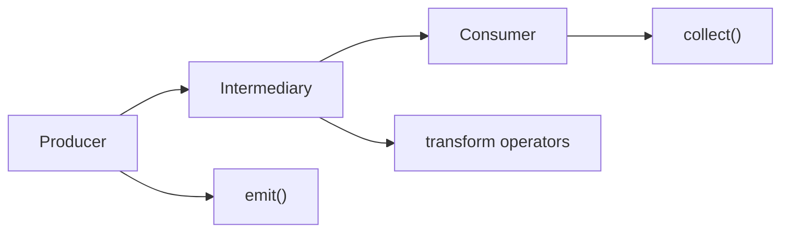

Kotlin Flow는 Kotlin 코루틴 라이브러리에서 제공하는 비동기 스트림 처리 API입니다. Flow는 시간에 따라 순차적으로 방출되는 여러 값들을 비동기적으로 처리할 수 있게 해주는 강력한 도구입니다. [[Kotlin 코루틴]]과 완벽하게 통합되어 있으며, 반응형 프로그래밍의 개념을 Kotlin의 suspend 함수와 결합한 형태입니다.

Flow는 Cold Stream의 특성을 가지고 있어, 실제로 collect가 호출되기 전까지는 실행되지 않습니다. 이는 RxJava의 Observable과 유사하지만, 코루틴의 구조화된 동시성과 취소 기능을 완전히 지원한다는 점에서 차별화됩니다.

## Flow의 등장 배경

기존의 비동기 프로그래밍에서는 단일 값을 반환하는 suspend 함수만으로는 여러 값을 시간에 따라 방출하는 상황을 처리하기 어려웠습니다. 예를 들어, 실시간 데이터 스트림, 센서 데이터, 사용자 입력 이벤트, 데이터베이스 변경 사항 감지 등의 경우에는 연속적인 값들을 처리해야 합니다.

전통적인 방법들의 한계:
- **콜백 기반**: 콜백 지옥과 메모리 누수 위험
- **Observable(RxJava)**: 학습 곡선이 가파르고 코루틴과의 통합이 완벽하지 않음
- **Channel**: 저수준 API로 직접 사용하기에는 복잡함

Flow는 이러한 문제들을 해결하기 위해 설계되었으며, 코루틴의 장점을 그대로 활용하면서 스트림 처리를 간편하게 만들어줍니다.

## Flow의 핵심 구성 요소

Flow는 다음 세 가지 핵심 구성 요소로 이루어집니다:



1. **Producer (생산자)**: 데이터를 방출하는 부분으로, `emit()` 함수를 통해 값을 방출합니다.
2. **Intermediary (중간 연산자)**: 방출된 데이터를 변환, 필터링, 결합하는 연산자들입니다.
3. **Consumer (소비자)**: 최종적으로 데이터를 수집하는 부분으로, `collect()` 함수를 통해 값을 소비합니다.

## 기본 Flow 생성과 사용

### Flow 빌더 함수들

Kotlin Flow는 다양한 빌더 함수를 제공하여 상황에 맞는 Flow를 생성할 수 있습니다:

```kotlin
import kotlinx.coroutines.*
import kotlinx.coroutines.flow.*

class BasicFlowExample {
    
    // 1. flow 빌더 - 가장 기본적인 방법
    fun createBasicFlow(): Flow<Int> = flow {
        for (i in 1..5) {
            delay(100) // 비동기 지연
            emit(i) // 값 방출
        }
    }
    
    // 2. flowOf - 고정된 값들로 Flow 생성
    fun createStaticFlow(): Flow<String> = flowOf("Hello", "World", "Flow")
    
    // 3. asFlow - 컬렉션을 Flow로 변환
    fun createFromCollection(): Flow<Int> = listOf(1, 2, 3, 4, 5).asFlow()
    
    // 4. channelFlow - 여러 코루틴에서 동시에 방출 가능
    fun createChannelFlow(): Flow<Int> = channelFlow {
        launch {
            repeat(3) {
                delay(100)
                send(it)
            }
        }
        launch {
            repeat(3) {
                delay(150)
                send(it + 10)
            }
        }
    }
    
    suspend fun demonstrateBasicUsage() {
        println("=== 기본 Flow 사용 ===")
        
        createBasicFlow().collect { value ->
            println("수신된 값: $value")
        }
        
        println("\n=== 정적 Flow ===")
        createStaticFlow().collect { value ->
            println("문자열: $value")
        }
    }
}
```

### Flow의 Cold Stream 특성

Flow는 Cold Stream으로, collect가 호출되어야만 실행됩니다:

```kotlin
class ColdStreamExample {
    
    fun createFlow(): Flow<Int> = flow {
        println("Flow 실행 시작")
        for (i in 1..3) {
            delay(100)
            emit(i)
        }
        println("Flow 실행 완료")
    }
    
    suspend fun demonstrateColdBehavior() {
        val myFlow = createFlow()
        println("Flow 생성 완료 (아직 실행되지 않음)")
        
        // 첫 번째 수집 - 새로운 실행
        println("\n첫 번째 collect:")
        myFlow.collect { println("값: $it") }
        
        // 두 번째 수집 - 또 다른 새로운 실행
        println("\n두 번째 collect:")
        myFlow.collect { println("값: $it") }
    }
}
```

## Flow 연산자들

Flow는 풍부한 연산자들을 제공하여 데이터를 변환하고 조작할 수 있습니다:

### 변환 연산자

```kotlin
class TransformationOperators {
    
    fun sourceFlow(): Flow<Int> = flowOf(1, 2, 3, 4, 5)
    
    suspend fun demonstrateTransformations() {
        println("=== map 연산자 ===")
        sourceFlow()
            .map { it * 2 }
            .collect { println("2배 값: $it") }
        
        println("\n=== filter 연산자 ===")
        sourceFlow()
            .filter { it % 2 == 0 }
            .collect { println("짝수: $it") }
        
        println("\n=== transform 연산자 ===")
        sourceFlow()
            .transform { value ->
                emit("문자열: $value")
                if (value % 2 == 0) {
                    emit("짝수: $value")
                }
            }
            .collect { println(it) }
    }
    
    // 복잡한 변환 예시
    suspend fun complexTransformation() {
        flowOf("apple", "banana", "cherry")
            .map { it.uppercase() }
            .filter { it.length > 5 }
            .map { "과일: $it" }
            .collect { println(it) }
    }
}
```

### 시간 기반 연산자

```kotlin
class TimeBasedOperators {
    
    fun createTimedFlow(): Flow<Int> = flow {
        repeat(10) {
            delay(100)
            emit(it)
        }
    }
    
    suspend fun demonstrateTimeOperators() {
        println("=== take 연산자 ===")
        createTimedFlow()
            .take(3) // 처음 3개만 가져옴
            .collect { println("값: $it") }
        
        println("\n=== drop 연산자 ===")
        createTimedFlow()
            .drop(3) // 처음 3개 제외
            .take(3) // 그 다음 3개만
            .collect { println("값: $it") }
        
        println("\n=== sample 연산자 ===")
        createTimedFlow()
            .sample(250) // 250ms마다 최신 값 하나씩
            .collect { println("샘플된 값: $it") }
    }
    
    suspend fun demonstrateDebounce() {
        println("=== debounce 연산자 ===")
        flow {
            emit(1)
            delay(50)
            emit(2)
            delay(50)
            emit(3)
            delay(200) // debounce 시간보다 긴 지연
            emit(4)
        }
        .debounce(100) // 100ms 동안 새로운 값이 없으면 방출
        .collect { println("디바운스된 값: $it") }
    }
}
```

### 결합 연산자

```kotlin
class CombiningOperators {
    
    fun flow1(): Flow<Int> = flowOf(1, 2, 3).onEach { delay(100) }
    fun flow2(): Flow<String> = flowOf("A", "B", "C", "D").onEach { delay(150) }
    
    suspend fun demonstrateCombining() {
        println("=== zip 연산자 ===")
        flow1().zip(flow2()) { num, letter ->
            "$num$letter"
        }.collect { println("결합된 값: $it") }
        
        println("\n=== combine 연산자 ===")
        flow1().combine(flow2()) { num, letter ->
            "$num-$letter"
        }.collect { println("조합된 값: $it") }
    }
    
    suspend fun demonstrateMerge() {
        println("=== merge 연산자 ===")
        merge(
            flowOf(1, 3, 5).onEach { delay(100) },
            flowOf(2, 4, 6).onEach { delay(150) }
        ).collect { println("병합된 값: $it") }
    }
    
    suspend fun demonstrateFlatMap() {
        println("=== flatMapConcat 연산자 ===")
        flowOf(1, 2, 3)
            .flatMapConcat { value ->
                flow {
                    emit("$value-A")
                    delay(100)
                    emit("$value-B")
                }
            }
            .collect { println("평면화된 값: $it") }
    }
}
```

## 에러 처리

Flow에서의 예외 처리는 코루틴의 구조화된 예외 처리와 일관성을 유지합니다:

```kotlin
class ErrorHandlingExample {
    
    fun createErrorFlow(): Flow<Int> = flow {
        for (i in 1..5) {
            if (i == 3) {
                throw RuntimeException("의도된 오류 발생")
            }
            emit(i)
        }
    }
    
    suspend fun demonstrateErrorHandling() {
        println("=== try-catch를 사용한 에러 처리 ===")
        try {
            createErrorFlow().collect { value ->
                println("값: $value")
            }
        } catch (e: Exception) {
            println("예외 발생: ${e.message}")
        }
        
        println("\n=== catch 연산자를 사용한 에러 처리 ===")
        createErrorFlow()
            .catch { exception ->
                println("Flow에서 예외 발생: ${exception.message}")
                emit(-1) // 기본값 방출
            }
            .collect { value ->
                println("값: $value")
            }
    }
    
    suspend fun demonstrateRetry() {
        println("\n=== retry 연산자 ===")
        var attemptCount = 0
        
        flow {
            attemptCount++
            println("시도 #$attemptCount")
            
            if (attemptCount < 3) {
                throw RuntimeException("일시적 오류")
            }
            
            emit("성공!")
        }
        .retry(2) // 최대 2번 재시도
        .catch { exception ->
            println("최종 실패: ${exception.message}")
        }
        .collect { value ->
            println("결과: $value")
        }
    }
}
```

## 기본 Flow의 제약사항과 한계

기본 Flow는 Cold Stream의 특성으로 인해 몇 가지 제약사항이 있습니다:

### 1. Cold Stream의 한계

```kotlin
class FlowLimitationsExample {
    
    fun createDataFlow(): Flow<String> = flow {
        println("Flow 시작 - 데이터 로딩 중...")
        delay(1000) // 무거운 작업 시뮬레이션
        emit("데이터 1")
        delay(500)
        emit("데이터 2")
        delay(500)
        emit("데이터 3")
        println("Flow 완료")
    }
    
    suspend fun demonstrateColdStreamProblem() {
        val dataFlow = createDataFlow()
        
        println("=== 첫 번째 구독자 ===")
        val subscriber1 = GlobalScope.launch {
            dataFlow.collect { data ->
                println("구독자 1: $data")
            }
        }
        
        delay(1500) // 중간에 새로운 구독자 추가
        
        println("\n=== 두 번째 구독자 추가 ===")
        val subscriber2 = GlobalScope.launch {
            dataFlow.collect { data ->
                println("구독자 2: $data")
            }
        }
        
        delay(3000)
        subscriber1.cancel()
        subscriber2.cancel()
        
        // 문제점: 각 구독자마다 별도로 Flow가 실행되어 중복 작업 발생
    }
}
```

### 2. 상태 관리의 어려움

기본 Flow로는 현재 상태를 유지하고 관리하기 어렵습니다:

```kotlin
class StateManagementProblem {
    
    // 문제가 있는 상태 관리 시도
    private var currentCounter = 0
    
    fun createCounterFlow(): Flow<Int> = flow {
        while (true) {
            emit(currentCounter)
            delay(1000)
        }
    }
    
    fun increment() {
        currentCounter++ // 이 변경이 기존 Flow 구독자들에게 즉시 반영되지 않음
    }
    
    suspend fun demonstrateStateProblem() {
        val counterFlow = createCounterFlow()
        
        // 구독 시작
        val job = GlobalScope.launch {
            counterFlow.collect { count ->
                println("카운터: $count")
            }
        }
        
        delay(2000)
        increment() // 이 변경이 바로 반영되지 않음
        delay(2000)
        increment()
        
        job.cancel()
    }
}
```

### 3. 이벤트 방송의 한계

기본 Flow는 여러 구독자에게 동일한 이벤트를 효율적으로 방송하기 어렵습니다:

```kotlin
class EventBroadcastProblem {
    
    fun createEventFlow(): Flow<String> = flow {
        // 실제로는 서버에서 이벤트를 받아오는 무거운 작업
        println("서버 연결 시작...")
        delay(1000)
        
        repeat(5) { i ->
            delay(500)
            emit("이벤트 $i")
        }
    }
    
    suspend fun demonstrateBroadcastProblem() {
        val eventFlow = createEventFlow()
        
        // 여러 컴포넌트가 같은 이벤트를 구독하려고 함
        val uiSubscriber = GlobalScope.launch {
            eventFlow.collect { event ->
                println("UI 업데이트: $event")
            }
        }
        
        val analyticsSubscriber = GlobalScope.launch {
            eventFlow.collect { event ->
                println("분석 데이터: $event")
            }
        }
        
        val loggingSubscriber = GlobalScope.launch {
            eventFlow.collect { event ->
                println("로그 기록: $event")
            }
        }
        
        delay(5000)
        uiSubscriber.cancel()
        analyticsSubscriber.cancel()
        loggingSubscriber.cancel()
        
        // 문제점: 각 구독자마다 별도로 서버 연결이 발생하여 비효율적
    }
}
```

### 4. 구독자 간 값 공유의 어려움

```kotlin
class ValueSharingProblem {
    
    suspend fun demonstrateValueSharingIssue() {
        val expensiveDataFlow = flow {
            println("비싼 계산 시작...")
            delay(2000) // 무거운 계산
            val result = (1..1000000).sum()
            emit(result)
            println("비싼 계산 완료")
        }
        
        // 여러 곳에서 같은 결과가 필요함
        println("=== 첫 번째 사용처 ===")
        expensiveDataFlow.collect { result ->
            println("UI에서 사용: $result")
        }
        
        println("\n=== 두 번째 사용처 ===")
        expensiveDataFlow.collect { result ->
            println("저장소에서 사용: $result")
        }
        
        // 문제점: 같은 비싼 계산이 두 번 실행됨
    }
}
```

## 해결책: StateFlow와 SharedFlow

이러한 기본 Flow의 제약사항들을 해결하기 위해 Kotlin 코루틴 팀은 Hot Stream의 특성을 가진 StateFlow와 SharedFlow를 도입했습니다:

- **StateFlow**: 상태 관리에 특화된 Hot Stream
- **SharedFlow**: 이벤트 방송에 특화된 Hot Stream

이들은 기본 Flow의 Cold Stream 특성을 보완하여, 상태 관리와 이벤트 방송 시나리오에서 더 효율적이고 직관적인 API를 제공합니다.

## StateFlow와 SharedFlow

StateFlow와 SharedFlow는 Hot Stream의 특성을 가진 특별한 Flow입니다:

### StateFlow

StateFlow는 앞서 살펴본 상태 관리 문제를 해결하기 위해 설계된 Hot Stream입니다. 항상 현재 값을 가지고 있으며, 새로운 구독자는 즉시 현재 상태를 받을 수 있습니다:

```kotlin
class StateFlowExample {
    
    class CounterViewModel {
        private val _counter = MutableStateFlow(0)
        val counter: StateFlow<Int> = _counter.asStateFlow()
        
        private val _userState = MutableStateFlow<UserState>(UserState.Loading)
        val userState: StateFlow<UserState> = _userState.asStateFlow()
        
        fun increment() {
            _counter.value++
        }
        
        fun decrement() {
            _counter.value--
        }
        
        suspend fun loadUser() {
            _userState.value = UserState.Loading
            try {
                delay(1000) // 네트워크 요청 시뮬레이션
                _userState.value = UserState.Success("John Doe")
            } catch (e: Exception) {
                _userState.value = UserState.Error(e.message ?: "Unknown error")
            }
        }
    }
    
    sealed class UserState {
        object Loading : UserState()
        data class Success(val userName: String) : UserState()
        data class Error(val message: String) : UserState()
    }
    
    suspend fun demonstrateStateFlow() {
        val viewModel = CounterViewModel()
        
        // StateFlow 구독
        val job = GlobalScope.launch {
            viewModel.counter.collect { count ->
                println("카운터 값: $count")
            }
        }
        
        // 값 변경
        viewModel.increment()
        delay(100)
        viewModel.increment()
        delay(100)
        viewModel.decrement()
        
        job.cancel()
        
        // 사용자 상태 관리 예시
        val userJob = GlobalScope.launch {
            viewModel.userState.collect { state ->
                when (state) {
                    is UserState.Loading -> println("사용자 정보 로딩 중...")
                    is UserState.Success -> println("사용자: ${state.userName}")
                    is UserState.Error -> println("오류: ${state.message}")
                }
            }
        }
        
        viewModel.loadUser()
        delay(1500)
        userJob.cancel()
    }
}
```

### SharedFlow

SharedFlow는 앞서 살펴본 이벤트 방송과 값 공유 문제를 해결하기 위해 설계된 Hot Stream입니다. 여러 구독자가 동일한 이벤트를 효율적으로 받을 수 있으며, 구독자별로 별도의 Flow 실행이 발생하지 않습니다:

```kotlin
class SharedFlowExample {
    
    class EventBus {
        private val _events = MutableSharedFlow<Event>(
            replay = 1, // 마지막 1개 이벤트를 새 구독자에게 재전송
            extraBufferCapacity = 10 // 추가 버퍼 용량
        )
        val events: SharedFlow<Event> = _events.asSharedFlow()
        
        suspend fun sendEvent(event: Event) {
            _events.emit(event)
        }
    }
    
    sealed class Event {
        data class UserLoggedIn(val userId: String) : Event()
        data class MessageReceived(val message: String) : Event()
        object UserLoggedOut : Event()
    }
    
    suspend fun demonstrateSharedFlow() {
        val eventBus = EventBus()
        
        // 첫 번째 구독자
        val subscriber1 = GlobalScope.launch {
            eventBus.events.collect { event ->
                println("구독자 1이 받은 이벤트: $event")
            }
        }
        
        // 이벤트 발송
        eventBus.sendEvent(Event.UserLoggedIn("user123"))
        delay(100)
        
        // 두 번째 구독자 (replay로 인해 이전 이벤트도 받음)
        val subscriber2 = GlobalScope.launch {
            eventBus.events.collect { event ->
                println("구독자 2가 받은 이벤트: $event")
            }
        }
        
        delay(100)
        eventBus.sendEvent(Event.MessageReceived("안녕하세요!"))
        delay(100)
        eventBus.sendEvent(Event.UserLoggedOut)
        
        delay(500)
        subscriber1.cancel()
        subscriber2.cancel()
    }
}
```

## 실제 사용 사례

### 서버 애플리케이션에서의 Flow 활용

```kotlin
class ServerFlowExample {
    
    class OrderProcessingService {
        
        fun processOrderStream(): Flow<OrderEvent> = channelFlow {
            val orders = getOrdersFromQueue()
            
            orders.forEach { order ->
                launch {
                    try {
                        send(OrderEvent.Processing(order.id))
                        
                        // 병렬 처리
                        val validationResult = async { validateOrder(order) }
                        val inventoryResult = async { checkInventory(order) }
                        val paymentResult = async { processPayment(order) }
                        
                        awaitAll(validationResult, inventoryResult, paymentResult)
                        
                        send(OrderEvent.Completed(order.id))
                    } catch (e: Exception) {
                        send(OrderEvent.Failed(order.id, e.message ?: "Unknown error"))
                    }
                }
            }
        }
        
        fun monitorSystemHealth(): Flow<SystemHealth> = flow {
            while (true) {
                val health = SystemHealth(
                    cpuUsage = getCpuUsage(),
                    memoryUsage = getMemoryUsage(),
                    activeConnections = getActiveConnections()
                )
                emit(health)
                delay(5000) // 5초마다 확인
            }
        }
        
        private suspend fun getOrdersFromQueue(): List<Order> {
            delay(100)
            return listOf(
                Order("order1", 100.0),
                Order("order2", 200.0),
                Order("order3", 150.0)
            )
        }
        
        private suspend fun validateOrder(order: Order): Boolean {
            delay(200)
            return true
        }
        
        private suspend fun checkInventory(order: Order): Boolean {
            delay(300)
            return true
        }
        
        private suspend fun processPayment(order: Order): Boolean {
            delay(400)
            return true
        }
        
        private fun getCpuUsage(): Double = (20..80).random().toDouble()
        private fun getMemoryUsage(): Double = (30..70).random().toDouble()
        private fun getActiveConnections(): Int = (50..200).random()
    }
    
    data class Order(val id: String, val amount: Double)
    
    sealed class OrderEvent {
        data class Processing(val orderId: String) : OrderEvent()
        data class Completed(val orderId: String) : OrderEvent()
        data class Failed(val orderId: String, val error: String) : OrderEvent()
    }
    
    data class SystemHealth(
        val cpuUsage: Double,
        val memoryUsage: Double,
        val activeConnections: Int
    )
    
    suspend fun demonstrateServerUsage() {
        val service = OrderProcessingService()
        
        // 주문 처리 모니터링
        val orderJob = GlobalScope.launch {
            service.processOrderStream()
                .collect { event ->
                    when (event) {
                        is OrderEvent.Processing -> 
                            println("주문 ${event.orderId} 처리 시작")
                        is OrderEvent.Completed -> 
                            println("주문 ${event.orderId} 처리 완료")
                        is OrderEvent.Failed -> 
                            println("주문 ${event.orderId} 처리 실패: ${event.error}")
                    }
                }
        }
        
        // 시스템 상태 모니터링
        val healthJob = GlobalScope.launch {
            service.monitorSystemHealth()
                .filter { it.cpuUsage > 70 || it.memoryUsage > 60 }
                .collect { health ->
                    println("⚠️ 시스템 리소스 경고 - CPU: ${health.cpuUsage}%, 메모리: ${health.memoryUsage}%")
                }
        }
        
        delay(10000) // 10초 동안 실행
        orderJob.cancel()
        healthJob.cancel()
    }
}
```

## Flow 최적화와 성능

### 백프레셔 처리

Flow에서 생산자가 소비자보다 빠른 경우 백프레셔를 처리할 수 있습니다:

```kotlin
class BackpressureExample {
    
    fun fastProducer(): Flow<Int> = flow {
        repeat(1000) {
            emit(it)
        }
    }
    
    suspend fun demonstrateBackpressure() {
        println("=== buffer 연산자 ===")
        fastProducer()
            .onEach { delay(10) } // 느린 소비자 시뮬레이션
            .buffer(capacity = 50) // 버퍼링으로 성능 향상
            .take(10)
            .collect { println("처리된 값: $it") }
        
        println("\n=== conflate 연산자 ===")
        fastProducer()
            .onEach { delay(10) }
            .conflate() // 최신 값만 유지
            .take(5)
            .collect { println("최신 값: $it") }
        
        println("\n=== collectLatest ===")
        flow {
            repeat(5) {
                emit(it)
                delay(100)
            }
        }
        .collectLatest { value ->
            println("처리 시작: $value")
            delay(200) // 오래 걸리는 처리
            println("처리 완료: $value")
        }
    }
}
```

### Flow 컨텍스트와 디스패처

Flow의 실행 컨텍스트를 제어할 수 있습니다:

```kotlin
class FlowContextExample {
    
    fun createFlow(): Flow<String> = flow {
        println("Flow 실행 스레드: ${Thread.currentThread().name}")
        repeat(3) {
            emit("값 $it")
            delay(100)
        }
    }
    
    suspend fun demonstrateContext() {
        println("=== flowOn 연산자 ===")
        createFlow()
            .map { value ->
                println("변환 스레드: ${Thread.currentThread().name}")
                value.uppercase()
            }
            .flowOn(Dispatchers.IO) // Flow를 IO 디스패처에서 실행
            .collect { value ->
                println("수집 스레드: ${Thread.currentThread().name} - $value")
            }
    }
    
    suspend fun demonstrateDispatchers() {
        println("\n=== 다양한 디스패처 사용 ===")
        
        flow {
            // CPU 집약적 작업
            val result = (1..1000000).sum()
            emit("계산 결과: $result")
        }
        .flowOn(Dispatchers.Default) // CPU 집약적 작업은 Default
        .map { result ->
            // I/O 작업
            println("데이터 저장 중...")
            delay(100) // 파일 저장 시뮬레이션
            "저장됨: $result"
        }
        .flowOn(Dispatchers.IO) // I/O 작업은 IO 디스패처
        .collect { message ->
            println("메인에서 수신: $message")
        }
    }
}
```

## 테스팅

Flow를 테스트하는 방법들을 살펴보겠습니다:

```kotlin
class FlowTestingExample {
    
    class DataService {
        fun fetchData(): Flow<String> = flow {
            delay(100)
            emit("데이터1")
            delay(100)
            emit("데이터2")
            delay(100)
            emit("데이터3")
        }
        
        fun fetchDataWithError(): Flow<String> = flow {
            emit("성공 데이터")
            delay(100)
            throw RuntimeException("네트워크 오류")
        }
    }
    
    suspend fun testBasicFlow() {
        val service = DataService()
        val results = mutableListOf<String>()
        
        service.fetchData().collect { data ->
            results.add(data)
        }
        
        // 결과 검증
        assert(results.size == 3)
        assert(results[0] == "데이터1")
        println("기본 Flow 테스트 통과")
    }
    
    suspend fun testFlowWithError() {
        val service = DataService()
        val results = mutableListOf<String>()
        var exceptionCaught = false
        
        try {
            service.fetchDataWithError().collect { data ->
                results.add(data)
            }
        } catch (e: Exception) {
            exceptionCaught = true
        }
        
        assert(results.size == 1)
        assert(exceptionCaught)
        println("에러 처리 테스트 통과")
    }
    
    suspend fun testFlowOperators() {
        val originalFlow = flowOf(1, 2, 3, 4, 5)
        val results = mutableListOf<Int>()
        
        originalFlow
            .filter { it % 2 == 0 }
            .map { it * 2 }
            .collect { results.add(it) }
        
        assert(results == listOf(4, 8))
        println("연산자 테스트 통과")
    }
    
    suspend fun runAllTests() {
        println("=== Flow 테스트 실행 ===")
        testBasicFlow()
        testFlowWithError()
        testFlowOperators()
        println("모든 테스트 통과!")
    }
}
```

## 주의사항과 모범 사례

### 1. Flow 생성자에서의 블로킹 호출 금지

```kotlin
class FlowBestPractices {
    
    // 잘못된 예시 - 블로킹 호출
    fun badFlow(): Flow<String> = flow {
        Thread.sleep(1000) // 블로킹 호출 - 피해야 함
        emit("데이터")
    }
    
    // 올바른 예시 - suspend 함수 사용
    fun goodFlow(): Flow<String> = flow {
        delay(1000) // suspend 함수 사용
        emit("데이터")
    }
    
    // 블로킹 호출이 필요한 경우
    fun handleBlockingCall(): Flow<String> = flow {
        val result = withContext(Dispatchers.IO) {
            // 블로킹 호출을 IO 디스패처에서 실행
            blockingApiCall()
        }
        emit(result)
    }
    
    private fun blockingApiCall(): String {
        Thread.sleep(1000)
        return "API 결과"
    }
}
```

### 2. 적절한 스코프 관리

```kotlin
class ScopeManagementExample {
    
    class FlowManager {
        private val scope = CoroutineScope(Dispatchers.Default + SupervisorJob())
        
        fun startFlow(): Flow<String> = flow {
            repeat(100) {
                delay(100)
                emit("데이터 $it")
            }
        }
        
        fun launchCollection() {
            scope.launch {
                startFlow()
                    .catch { exception ->
                        println("Flow 에러: ${exception.message}")
                    }
                    .collect { data ->
                        println("수신: $data")
                    }
            }
        }
        
        fun cleanup() {
            scope.cancel() // 메모리 누수 방지
        }
    }
}
```

### 3. StateFlow 사용 시 주의사항

```kotlin
class StateFlowBestPractices {
    
    class ViewModel {
        private val _state = MutableStateFlow<UiState>(UiState.Loading)
        val state: StateFlow<UiState> = _state.asStateFlow()
        
        // 상태 업데이트 시 동기화 고려
        fun updateState(newState: UiState) {
            _state.value = newState
        }
        
        // 복잡한 상태 업데이트
        fun updateStateComplex(transform: (UiState) -> UiState) {
            _state.update { currentState ->
                transform(currentState)
            }
        }
    }
    
    sealed class UiState {
        object Loading : UiState()
        data class Success(val data: String) : UiState()
        data class Error(val message: String) : UiState()
    }
}
```

### 4. 리소스 정리

```kotlin
class ResourceManagementExample {
    
    class DatabaseFlow {
        private val connection = DatabaseConnection()
        
        fun observeData(): Flow<String> = flow {
            try {
                connection.open()
                
                while (connection.isOpen()) {
                    val data = connection.readData()
                    emit(data)
                    delay(1000)
                }
            } finally {
                // 리소스 정리
                connection.close()
                println("데이터베이스 연결 종료")
            }
        }.onCompletion { cause ->
            // 정상 완료든 예외든 항상 실행
            println("Flow 완료: ${cause?.message ?: "정상 완료"}")
        }
    }
    
    class DatabaseConnection {
        private var isConnected = false
        
        fun open() {
            isConnected = true
            println("데이터베이스 연결 시작")
        }
        
        fun isOpen(): Boolean = isConnected
        
        suspend fun readData(): String {
            delay(100)
            return "데이터 ${System.currentTimeMillis()}"
        }
        
        fun close() {
            isConnected = false
            println("데이터베이스 연결 종료")
        }
    }
}
```

## 결론

Kotlin Flow는 비동기 스트림 처리를 위한 강력하고 유연한 도구입니다. 코루틴과의 완벽한 통합을 통해 구조화된 동시성과 취소 기능을 제공하며, 풍부한 연산자들로 복잡한 데이터 변환과 조작을 간단하게 구현할 수 있습니다.

Flow의 핵심은 Cold Stream의 특성을 이해하고, 적절한 연산자를 선택하며, 에러 처리와 리소스 관리를 올바르게 하는 것입니다. StateFlow와 SharedFlow를 적절히 활용하면 상태 관리와 이벤트 처리도 효과적으로 할 수 있습니다.

특히 안드로이드 개발에서는 UI 상태 관리와 리액티브 프로그래밍의 핵심 도구가 되었으며, 서버 사이드 개발에서도 스트림 처리와 실시간 데이터 처리에 매우 유용합니다.

## 참고 자료

- Kotlin Flow 공식 문서 (https://kotlinlang.org/docs/flow.html)
- "Kotlin Coroutines in Practice" - KotlinConf 발표 자료
- Android Developers - Flow (https://developer.android.com/kotlin/flow)
- "Modern Android Development with Kotlin Coroutines and Flow" - Roman Elizarov
