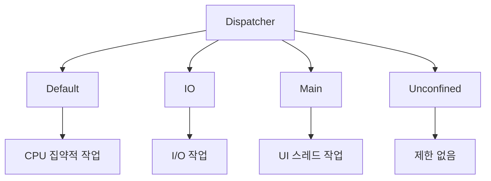
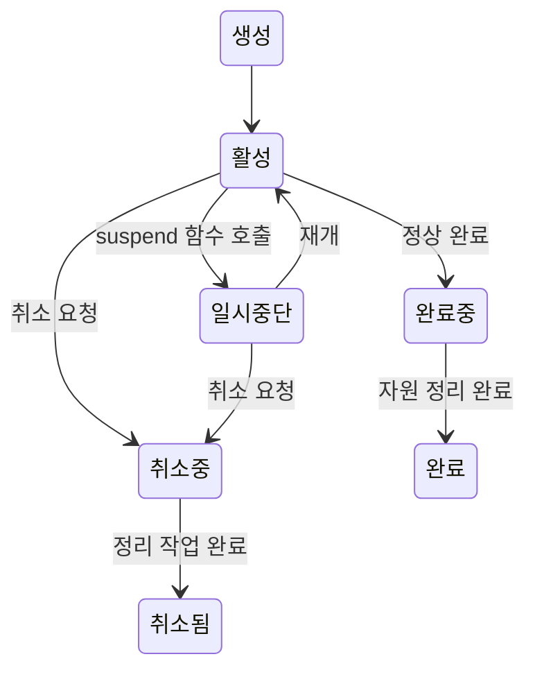

Kotlin 코루틴은 Kotlin 언어에서 제공하는 강력한 비동기 프로그래밍 도구입니다. [[코루틴(Coroutine)]]의 개념을 기반으로 하여, Kotlin은 언어 차원에서 코루틴을 지원하며 매우 직관적이고 안전한 API를 제공합니다.

Kotlin의 코루틴은 단순히 다른 언어의 코루틴을 이식한 것이 아니라, Kotlin의 언어적 특성과 JVM 환경에 최적화되어 설계되었습니다. 특히 suspend 키워드와 Continuation 메커니즘을 통해 컴파일 타임에 코루틴 코드를 효율적인 상태 머신으로 변환합니다.

## 기본 코루틴 사용법

Kotlin에서 코루틴을 사용하는 가장 기본적인 방법을 살펴보겠습니다:

```kotlin
import kotlinx.coroutines.*

class CoroutineExample {
    
    fun basicCoroutineExample() = runBlocking {
        // 코루틴 스코프에서 실행
        val job = launch {
            println("코루틴 시작")
            
            // 1초 지연 (비동기적으로)
            delay(1000)
            
            println("코루틴 완료")
        }
        
        // 코루틴이 완료될 때까지 대기
        job.join()
    }
}
```

이 예시에서 `runBlocking`은 메인 스레드를 블로킹하면서 코루틴을 실행하는 빌더이고, `launch`는 새로운 코루틴을 시작하는 빌더입니다. `delay()`는 스레드를 블로킹하지 않고 코루틴만 일시 중단시키는 suspend 함수입니다.

## 코루틴 빌더

Kotlin에서는 다양한 코루틴 빌더를 제공하여 상황에 맞는 코루틴을 생성할 수 있습니다:

### 1. launch
독립적인 코루틴을 시작하며 Job을 반환합니다. 결과값을 반환하지 않는 "fire-and-forget" 방식의 작업에 적합합니다.

### 2. async
결과값을 반환하는 코루틴을 시작하며 Deferred를 반환합니다. 병렬 처리가 필요한 경우에 유용합니다.

### 3. runBlocking
현재 스레드를 블로킹하면서 코루틴을 실행합니다. 주로 테스트나 메인 함수에서 사용됩니다.

```kotlin
class AsyncExample {
    
    suspend fun parallelProcessing() {
        // 두 개의 비동기 작업을 동시에 시작
        val deferred1 = async {
            delay(1000)
            "결과 1"
        }
        
        val deferred2 = async {
            delay(1500)
            "결과 2"
        }
        
        // 두 결과를 모두 기다림
        val result1 = deferred1.await()
        val result2 = deferred2.await()
        
        println("$result1, $result2")
    }
}
```

## 코루틴 컨텍스트와 디스패처

코루틴은 컨텍스트(Context)를 통해 실행 환경을 관리합니다. 컨텍스트에는 디스패처(Dispatcher), Job, 예외 핸들러 등이 포함됩니다.

### 디스패처 종류



1. **Dispatchers.Default**: CPU 집약적인 작업에 최적화되어 있으며, 기본적으로 CPU 코어 수만큼의 스레드를 사용합니다.
2. **Dispatchers.IO**: I/O 작업에 최적화되어 있으며, 필요에 따라 스레드 수를 64개까지 확장할 수 있습니다.
3. **Dispatchers.Main**: UI 스레드에서 실행됩니다. Android나 JavaFX 애플리케이션에서 사용됩니다.
4. **Dispatchers.Unconfined**: 특정 스레드에 제한되지 않으며, 호출한 스레드에서 시작되어 첫 번째 suspend 지점 이후에는 다른 스레드에서 재개될 수 있습니다.

```kotlin
class DispatcherExample {
    
    suspend fun useDispatcher() {
        // I/O 작업
        launch(Dispatchers.IO) {
            // 데이터베이스 조회, 파일 읽기 등
            val data = readFromDatabase()
            println("데이터 읽기 완료: $data")
        }
        
        // CPU 집약적 작업
        launch(Dispatchers.Default) {
            // 복잡한 계산, 이미지 처리 등
            val result = performHeavyCalculation()
            println("계산 완료: $result")
        }
    }
    
    private suspend fun readFromDatabase(): String {
        delay(1000) // I/O 시뮬레이션
        return "데이터베이스 결과"
    }
    
    private suspend fun performHeavyCalculation(): Int {
        delay(2000) // CPU 집약적 작업 시뮬레이션
        return 42
    }
}
```

## 코루틴의 생명주기

Kotlin 코루틴은 다음과 같은 생명주기를 가집니다:



각 상태는 Job의 속성을 통해 확인할 수 있습니다:
- `isActive`: 코루틴이 활성 상태인지 확인
- `isCompleted`: 코루틴이 완료되었는지 확인
- `isCancelled`: 코루틴이 취소되었는지 확인

## 구조화된 동시성

Kotlin 코루틴의 핵심 개념 중 하나는 구조화된 동시성(Structured Concurrency)입니다. 이는 코루틴이 특정 스코프 내에서 실행되며, 부모 코루틴이 완료되기 전에 모든 자식 코루틴이 완료되어야 한다는 원칙입니다.

```kotlin
class StructuredConcurrencyExample {
    
    suspend fun structuredExample() = coroutineScope {
        println("부모 코루틴 시작")
        
        // 자식 코루틴들
        launch {
            delay(1000)
            println("자식 1 완료")
        }
        
        launch {
            delay(2000)
            println("자식 2 완료")
        }
        
        println("부모 코루틴 완료 대기")
        // coroutineScope는 모든 자식 코루틴이 완료될 때까지 자동으로 대기
    }
}
```

구조화된 동시성의 장점:
- **메모리 누수 방지**: 부모 스코프가 취소되면 모든 자식 코루틴도 자동으로 취소
- **예외 전파**: 자식 코루틴의 예외가 부모로 전파되어 일관된 예외 처리 가능
- **생명주기 관리**: 애플리케이션의 생명주기와 코루틴의 생명주기를 연동 가능

## 코루틴의 예외 처리

코루틴에서의 예외 처리는 일반적인 try-catch 구문과 CoroutineExceptionHandler를 통해 할 수 있습니다.

```kotlin
class ExceptionHandlingExample {
    
    fun handleExceptions() {
        val handler = CoroutineExceptionHandler { _, exception ->
            println("코루틴 예외 발생: ${exception.message}")
        }
        
        val scope = CoroutineScope(Dispatchers.Default + handler)
        
        scope.launch {
            try {
                // 위험한 작업
                performRiskyOperation()
            } catch (e: Exception) {
                println("예외 처리: ${e.message}")
            }
        }
    }
    
    private suspend fun performRiskyOperation() {
        delay(100)
        throw RuntimeException("의도된 예외")
    }
}
```

### 예외 처리 주의사항

1. **launch vs async**: `launch`에서 발생한 예외는 즉시 전파되지만, `async`에서 발생한 예외는 `await()` 호출 시점에 전파됩니다.
2. **SupervisorJob**: 자식 코루틴의 실패가 부모나 다른 자식에게 영향을 주지 않도록 하려면 SupervisorJob을 사용합니다.
3. **CancellationException**: 취소 예외는 정상적인 취소로 간주되어 부모로 전파되지 않습니다.

## 코루틴의 취소

코루틴은 협력적 취소(Cooperative Cancellation)를 지원합니다. 이는 코루틴이 취소 요청을 받으면 적절한 시점에 스스로 종료한다는 의미입니다.

```kotlin
class CancellationExample {
    
    suspend fun cancellationExample() = coroutineScope {
        val job = launch {
            try {
                for (i in 0 until 1000) {
                    // 취소 확인 (delay 함수가 자동으로 취소를 확인함)
                    ensureActive()
                    
                    println("작업 진행 중: $i")
                    delay(100)
                }
            } catch (e: CancellationException) {
                println("코루틴이 취소되었습니다.")
                // 정리 작업 수행
                cleanup()
                throw e // CancellationException은 다시 던져야 함
            }
        }
        
        // 3초 후 취소
        delay(3000)
        job.cancel("작업 시간 초과")
        job.join() // 취소 완료까지 대기
    }
    
    private fun cleanup() {
        println("정리 작업 수행 중...")
    }
}
```

### 취소 가능한 코드 작성 방법

1. **suspend 함수 사용**: `delay()`, `yield()` 같은 suspend 함수는 자동으로 취소를 확인합니다.
2. **ensureActive() 호출**: 긴 계산 작업 중간에 취소 상태를 확인합니다.
3. **isActive 확인**: Job의 isActive 속성을 주기적으로 확인합니다.

## withContext를 통한 컨텍스트 전환

`withContext`를 사용하면 코루틴 실행 중에 디스패처를 변경할 수 있습니다:

```kotlin
class ContextSwitchingExample {
    
    suspend fun processData() {
        // 메인 로직은 Default 디스패처에서
        val data = withContext(Dispatchers.Default) {
            performCpuIntensiveTask()
        }
        
        // I/O 작업은 IO 디스패처로 전환
        withContext(Dispatchers.IO) {
            saveToDatabase(data)
        }
        
        // UI 업데이트는 Main 디스패처로
        // withContext(Dispatchers.Main) {
        //     updateUI(data)
        // }
    }
    
    private fun performCpuIntensiveTask(): String {
        // CPU 집약적 작업
        return "처리된 데이터"
    }
    
    private suspend fun saveToDatabase(data: String) {
        delay(100) // 데이터베이스 저장 시뮬레이션
        println("데이터 저장 완료: $data")
    }
}
```

## suspend 함수

`suspend` 키워드는 함수가 코루틴을 일시 중단할 수 있음을 나타냅니다. suspend 함수는 다른 suspend 함수나 코루틴 내에서만 호출할 수 있습니다.

```kotlin
class SuspendFunctionExample {
    
    suspend fun performNetworkCall(): String {
        // 네트워크 호출 시뮬레이션
        delay(1000)
        return "네트워크 응답"
    }
    
    suspend fun processUserData(userId: String): UserData {
        // 여러 suspend 함수들을 순차적으로 호출
        val user = fetchUser(userId)
        val profile = fetchProfile(user.id)
        val settings = fetchSettings(profile.id)
        
        return UserData(user, profile, settings)
    }
    
    private suspend fun fetchUser(userId: String): User {
        delay(100)
        return User(userId, "User $userId")
    }
    
    private suspend fun fetchProfile(userId: String): Profile {
        delay(150)
        return Profile(userId, "Profile for $userId")
    }
    
    private suspend fun fetchSettings(profileId: String): Settings {
        delay(80)
        return Settings("default")
    }
}

data class User(val id: String, val name: String)
data class Profile(val userId: String, val description: String)
data class Settings(val theme: String)
data class UserData(val user: User, val profile: Profile, val settings: Settings)
```

## 코루틴 스코프

코루틴 스코프는 코루틴의 생명주기를 관리하는 영역을 정의합니다. 다양한 스코프를 상황에 맞게 사용할 수 있습니다:

### 1. GlobalScope
애플리케이션 전체 생명주기와 함께하는 글로벌 스코프입니다. 일반적으로 사용을 권장하지 않습니다.

### 2. runBlocking
현재 스레드를 블로킹하는 스코프입니다. 주로 테스트나 메인 함수에서 사용됩니다.

### 3. coroutineScope
새로운 스코프를 생성하며, 모든 자식 코루틴이 완료될 때까지 대기합니다.

### 4. supervisorScope
SupervisorJob을 사용하는 스코프로, 자식 코루틴의 실패가 다른 자식에게 영향을 주지 않습니다.

```kotlin
class ScopeExample {
    
    suspend fun scopeComparison() {
        // coroutineScope - 하나의 자식이 실패하면 모든 자식이 취소됨
        try {
            coroutineScope {
                launch {
                    delay(1000)
                    println("작업 1 완료")
                }
                
                launch {
                    delay(500)
                    throw RuntimeException("작업 2 실패")
                }
            }
        } catch (e: Exception) {
            println("coroutineScope에서 예외 발생: ${e.message}")
        }
        
        // supervisorScope - 자식의 실패가 다른 자식에게 영향을 주지 않음
        supervisorScope {
            launch {
                delay(1000)
                println("작업 3 완료")
            }
            
            launch {
                try {
                    delay(500)
                    throw RuntimeException("작업 4 실패")
                } catch (e: Exception) {
                    println("작업 4에서 예외 처리: ${e.message}")
                }
            }
        }
    }
}
```

## 플로우(Flow)

Flow는 Kotlin 코루틴에서 제공하는 비동기 스트림 처리 API입니다. 여러 값을 비동기적으로 방출할 수 있습니다:

```kotlin
class FlowExample {
    
    fun createFlow(): Flow<Int> = flow {
        for (i in 1..5) {
            delay(100)
            emit(i)
        }
    }
    
    suspend fun consumeFlow() {
        createFlow()
            .map { it * 2 }
            .filter { it > 4 }
            .collect { value ->
                println("수신된 값: $value")
            }
    }
    
    // StateFlow와 SharedFlow
    class FlowTypesExample {
        private val _stateFlow = MutableStateFlow(0)
        val stateFlow: StateFlow<Int> = _stateFlow.asStateFlow()
        
        private val _sharedFlow = MutableSharedFlow<String>()
        val sharedFlow: SharedFlow<String> = _sharedFlow.asSharedFlow()
        
        fun updateState(value: Int) {
            _stateFlow.value = value
        }
        
        suspend fun emitEvent(event: String) {
            _sharedFlow.emit(event)
        }
    }
}
```

Flow에 대한 자세한 내용은 [[Kotlin Flow]]를 참고해주세요.

## 실제 사용 예시

### Android에서의 코루틴 사용

```kotlin
class UserRepository {
    
    suspend fun getUser(userId: String): User = withContext(Dispatchers.IO) {
        // 네트워크 API 호출
        apiService.getUser(userId)
    }
    
    suspend fun updateUser(user: User): User = withContext(Dispatchers.IO) {
        // 데이터베이스 업데이트
        database.updateUser(user)
    }
}

class UserViewModel : ViewModel() {
    private val repository = UserRepository()
    
    fun loadUser(userId: String) {
        viewModelScope.launch {
            try {
                val user = repository.getUser(userId)
                // UI 업데이트 (Main 디스패처에서 실행됨)
                updateUI(user)
            } catch (e: Exception) {
                handleError(e)
            }
        }
    }
    
    private fun updateUI(user: User) {
        // UI 상태 업데이트
    }
    
    private fun handleError(error: Exception) {
        // 에러 처리
    }
}
```

### 서버 애플리케이션에서의 코루틴 사용

```kotlin
class OrderService {
    
    suspend fun processOrder(orderId: String): OrderResult = coroutineScope {
        // 여러 작업을 병렬로 실행
        val orderDeferred = async { fetchOrder(orderId) }
        val inventoryDeferred = async { checkInventory(orderId) }
        val paymentDeferred = async { processPayment(orderId) }
        
        val order = orderDeferred.await()
        val inventory = inventoryDeferred.await()
        val payment = paymentDeferred.await()
        
        OrderResult(order, inventory, payment)
    }
    
    private suspend fun fetchOrder(orderId: String): Order {
        delay(100) // 데이터베이스 조회
        return Order(orderId)
    }
    
    private suspend fun checkInventory(orderId: String): Inventory {
        delay(200) // 재고 확인
        return Inventory(true)
    }
    
    private suspend fun processPayment(orderId: String): Payment {
        delay(300) // 결제 처리
        return Payment(true)
    }
}

data class Order(val id: String)
data class Inventory(val available: Boolean)
data class Payment(val success: Boolean)
data class OrderResult(val order: Order, val inventory: Inventory, val payment: Payment)
```

## 코루틴 디버깅

Kotlin 코루틴을 디버깅할 때는 다음과 같은 방법을 사용할 수 있습니다:

### 1. 코루틴 이름 설정

```kotlin
class DebuggingExample {
    
    suspend fun namedCoroutines() = coroutineScope {
        launch(CoroutineName("UserDataLoader")) {
            loadUserData()
        }
        
        launch(CoroutineName("ImageProcessor")) {
            processImages()
        }
    }
    
    private suspend fun loadUserData() {
        delay(1000)
        println("사용자 데이터 로딩 완료")
    }
    
    private suspend fun processImages() {
        delay(2000)
        println("이미지 처리 완료")
    }
}
```

### 2. 로깅을 통한 추적

```kotlin
class LoggingExample {
    
    suspend fun trackedOperation() = withContext(CoroutineName("TrackedOperation")) {
        println("[${Thread.currentThread().name}] 작업 시작")
        
        delay(1000)
        
        println("[${Thread.currentThread().name}] 작업 완료")
    }
}
```

## 성능 최적화

### 1. 적절한 디스패처 선택

```kotlin
class OptimizationExample {
    
    suspend fun optimizedDataProcessing() {
        // CPU 집약적 작업은 Default 디스패처
        val processedData = withContext(Dispatchers.Default) {
            heavyComputation()
        }
        
        // I/O 작업은 IO 디스패처
        withContext(Dispatchers.IO) {
            saveToFile(processedData)
        }
    }
    
    private fun heavyComputation(): String {
        // CPU 집약적 계산
        return "계산 결과"
    }
    
    private suspend fun saveToFile(data: String) {
        delay(100) // 파일 저장 시뮬레이션
    }
}
```

### 2. 코루틴 풀 크기 조정

```kotlin
class CustomDispatcherExample {
    
    // 커스텀 디스패처 생성
    private val customDispatcher = Executors.newFixedThreadPool(4).asCoroutineDispatcher()
    
    suspend fun useCustomDispatcher() {
        withContext(customDispatcher) {
            // 특정 스레드 풀에서 실행
            performSpecializedTask()
        }
    }
    
    private fun performSpecializedTask() {
        // 특화된 작업
    }
    
    fun cleanup() {
        customDispatcher.close()
    }
}
```

## 주의사항과 모범 사례

### 1. 블로킹 호출 피하기

```kotlin
class BestPracticesExample {
    
    // 잘못된 예시 - 블로킹 호출
    suspend fun badExample() {
        Thread.sleep(1000) // 블로킹 호출 - 피해야 함
    }
    
    // 올바른 예시 - 비블로킹 호출
    suspend fun goodExample() {
        delay(1000) // 비블로킹 호출
    }
    
    // 블로킹 호출이 필요한 경우
    suspend fun handleBlockingCall() {
        withContext(Dispatchers.IO) {
            // I/O 디스패처에서 블로킹 호출 실행
            Thread.sleep(1000)
        }
    }
}
```

### 2. 메모리 누수 방지

```kotlin
class MemoryLeakPreventionExample {
    
    private val scope = CoroutineScope(Dispatchers.Default + SupervisorJob())
    
    fun startBackgroundWork() {
        scope.launch {
            // 백그라운드 작업
            performBackgroundTask()
        }
    }
    
    fun cleanup() {
        // 스코프 취소로 메모리 누수 방지
        scope.cancel()
    }
    
    private suspend fun performBackgroundTask() {
        repeat(1000) {
            delay(100)
            println("백그라운드 작업 $it")
        }
    }
}
```

### 3. 예외 처리 전략

```kotlin
class ExceptionStrategyExample {
    
    suspend fun robustErrorHandling() {
        supervisorScope {
            // 개별 작업의 실패가 다른 작업에 영향을 주지 않음
            launch {
                try {
                    riskyOperation1()
                } catch (e: Exception) {
                    handleError("Operation 1", e)
                }
            }
            
            launch {
                try {
                    riskyOperation2()
                } catch (e: Exception) {
                    handleError("Operation 2", e)
                }
            }
        }
    }
    
    private suspend fun riskyOperation1() {
        delay(100)
        throw RuntimeException("Operation 1 failed")
    }
    
    private suspend fun riskyOperation2() {
        delay(200)
        println("Operation 2 completed")
    }
    
    private fun handleError(operation: String, error: Exception) {
        println("$operation failed: ${error.message}")
    }
}
```

## 결론

Kotlin 코루틴은 현대적인 비동기 프로그래밍을 위한 강력하고 직관적인 도구입니다. 언어 차원의 지원을 통해 복잡한 비동기 로직을 간단하고 읽기 쉬운 코드로 작성할 수 있게 해줍니다.

핵심은 올바른 스코프 관리, 적절한 디스패처 선택, 구조화된 동시성 원칙 준수입니다. 이러한 개념들을 잘 이해하고 적용하면 안전하고 효율적인 비동기 애플리케이션을 구축할 수 있습니다.

특히 Android 개발이나 서버 사이드 Kotlin 개발에서 코루틴은 필수적인 기술이 되었으므로, 이러한 개념들을 숙지하는 것이 중요합니다.

## 참고 자료

- Kotlin Coroutines 공식 문서 (https://kotlinlang.org/docs/coroutines-overview.html)
- "Kotlin in Action" - Dmitry Jemerov, Svetlana Isakova
- "Concurrency in Kotlin" - Alexey Soshin
- Android Developers - Kotlin Coroutines (https://developer.android.com/kotlin/coroutines)
