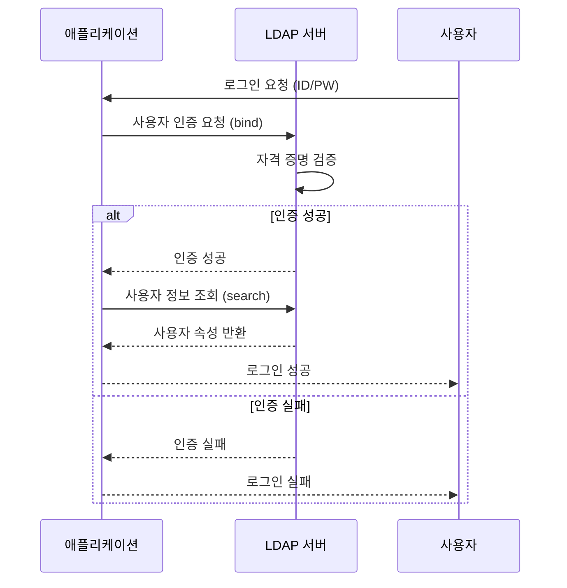
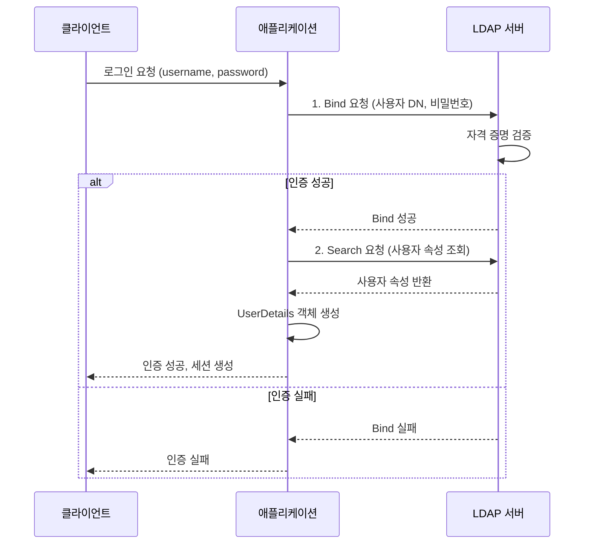

**LDAP(Lightweight Directory Access Protocol)**은 디렉토리 서비스에 접근하기 위한 **경량화된 네트워크 프로토콜**입니다. 디렉토리 서비스는 사용자 정보, 조직 구조, 네트워크 리소스 등과 같은 계층적이고 읽기 중심의 데이터를 효율적으로 저장하고 조회하기 위한 특수한 데이터베이스입니다.

LDAP은 기업 환경에서 중앙화된 사용자 인증과 권한 관리의 핵심 인프라로 널리 사용되며, [[Authentication|인증]] 시스템과 밀접하게 연관되어 있습니다. 특히 [[SSO (Single Sign-On)]] 환경에서 사용자 정보를 제공하는 백엔드 저장소로 자주 활용됩니다.

---

## LDAP의 핵심 개념

### 디렉토리 서비스란?

디렉토리 서비스는 전화번호부와 비슷한 개념입니다. 전화번호부에서 이름으로 전화번호를 찾는 것처럼, 디렉토리 서비스에서는 사용자 이름이나 이메일 주소 같은 속성으로 사용자 정보를 빠르게 조회할 수 있습니다.

일반적인 관계형 데이터베이스와 달리, 디렉토리 서비스는 다음과 같은 특징을 가집니다:

- **읽기 최적화**: 쓰기보다 읽기 작업이 훨씬 많습니다.
- **계층적 구조**: 트리 형태로 데이터를 조직화합니다.
- **속성 기반 검색**: 복잡한 쿼리보다는 속성 기반의 빠른 검색에 최적화되어 있습니다.
- **분산 저장**: 여러 서버에 데이터를 분산하여 저장할 수 있습니다.

### LDAP의 데이터 구조

LDAP은 데이터를 **DIT(Directory Information Tree)**라는 계층적 트리 구조로 저장합니다. 이 트리는 다음과 같은 요소들로 구성됩니다.

#### DN (Distinguished Name)

DN은 LDAP 디렉토리에서 각 엔트리를 고유하게 식별하는 완전한 경로입니다. 마치 파일 시스템의 절대 경로와 같습니다.

```
cn=홍길동,ou=개발팀,dc=example,dc=com
```

이 DN의 의미는:
- `cn=홍길동`: 이름(Common Name)이 "홍길동"인 엔트리
- `ou=개발팀`: 조직 단위(Organizational Unit)가 "개발팀"
- `dc=example,dc=com`: 도메인 구성 요소(Domain Component)가 "example.com"

#### RDN (Relative Distinguished Name)

RDN은 DN의 최상위 구성 요소입니다. 위 예시에서 `cn=홍길동`이 RDN입니다.

#### ObjectClass

ObjectClass는 엔트리가 어떤 종류의 객체인지를 정의하는 스키마입니다. 각 ObjectClass는 해당 엔트리가 가져야 할 필수 속성과 선택적 속성을 정의합니다.

주요 ObjectClass 예시:
- `inetOrgPerson`: 일반적인 사용자 정보를 담는 객체
- `organizationalUnit`: 조직 단위를 나타내는 객체
- `groupOfNames`: 그룹을 나타내는 객체

#### 속성 (Attribute)

각 엔트리는 여러 속성을 가질 수 있습니다. 속성은 키-값 쌍으로 저장됩니다.

주요 속성 예시:
- `cn` (Common Name): 일반 이름
- `sn` (Surname): 성
- `mail`: 이메일 주소
- `uid`: 사용자 ID
- `userPassword`: 비밀번호 (해시된 형태로 저장)
- `memberOf`: 소속 그룹

---

## LDAP의 주요 용도

### 1. 중앙화된 사용자 인증

LDAP은 기업 내 여러 애플리케이션이 공통으로 사용하는 사용자 정보 저장소 역할을 합니다. 사용자가 애플리케이션에 로그인할 때, 애플리케이션은 LDAP 서버에 연결하여 사용자의 자격 증명(ID/비밀번호)을 검증합니다.



### 2. SSO와의 통합

LDAP은 [[SSO (Single Sign-On)]] 시스템의 백엔드 저장소로 자주 사용됩니다. [[SAML(Security Assertion Markup Language)]]이나 [[OIDC(OpenID Connect)]]를 사용하는 IdP(Identity Provider)가 사용자 정보를 LDAP에서 조회하여 인증을 수행합니다.

### 3. 조직 구조 관리

기업의 조직도, 부서 구조, 직원 정보 등을 LDAP에 저장하여 중앙에서 관리할 수 있습니다. 이를 통해 여러 시스템에서 일관된 조직 정보를 활용할 수 있습니다.

### 4. 그룹 및 권한 관리

LDAP의 그룹 기능을 활용하여 사용자들을 그룹으로 묶고, 그룹 단위로 권한을 부여할 수 있습니다. 이는 [[역할 기반 접근 제어(RBAC)]]와 연계하여 사용됩니다.

---

## LDAP vs Active Directory

많은 사람들이 LDAP과 Active Directory(AD)를 혼동하지만, 이 둘은 다른 개념입니다.

| 구분 | **LDAP** | **Active Directory** |
|------|----------|---------------------|
| **본질** | **프로토콜** (통신 규약) | **디렉토리 서비스** (Microsoft의 구현체) |
| **역할** | 디렉토리에 접근하는 방법을 정의 | 실제 디렉토리 데이터를 저장하고 관리 |
| **관계** | AD는 LDAP 프로토콜을 사용하여 접근 가능 | LDAP은 AD에 접근하는 여러 방법 중 하나 |

**Active Directory**는 Microsoft가 개발한 디렉토리 서비스로, LDAP 프로토콜을 지원합니다. 따라서 LDAP 클라이언트를 사용하여 Active Directory에 접근할 수 있습니다.

다른 LDAP 구현체로는:
- **OpenLDAP**: 오픈소스 LDAP 서버
- **389 Directory Server**: Red Hat의 LDAP 서버
- **Apache Directory Server**: Apache 소프트웨어 재단의 LDAP 서버

---

## Spring Security를 이용한 LDAP 인증 구현

Spring Security는 LDAP 인증을 위한 강력한 지원을 제공합니다. `spring-boot-starter-security`와 `spring-ldap-core` 의존성을 사용하여 LDAP 기반 인증을 구현할 수 있습니다.

### 1. 의존성 추가 (`build.gradle.kts`)

```kotlin
dependencies {
    implementation("org.springframework.boot:spring-boot-starter-security")
    implementation("org.springframework.boot:spring-boot-starter-web")
    implementation("org.springframework.ldap:spring-ldap-core")
    implementation("org.springframework.security:spring-security-ldap")
    implementation("com.unboundid:unboundid-ldapsdk") // 내장 LDAP 서버 (테스트용)
}
```

### 2. 설정 파일 작성 (`application.yml`)

```yaml
spring:
  ldap:
    urls: ldap://localhost:389
    base: dc=example,dc=com
    username: cn=admin,dc=example,dc=com
    password: admin
    base-environment:
      java.naming.security.authentication: simple
```

### 3. 보안 설정 클래스 작성

```java
import org.springframework.context.annotation.Bean;
import org.springframework.context.annotation.Configuration;
import org.springframework.security.config.annotation.web.builders.HttpSecurity;
import org.springframework.security.config.annotation.web.configuration.EnableWebSecurity;
import org.springframework.security.ldap.authentication.ad.ActiveDirectoryLdapAuthenticationProvider;
import org.springframework.security.web.SecurityFilterChain;

@Configuration
@EnableWebSecurity
public class SecurityConfig {

    @Bean
    public SecurityFilterChain securityFilterChain(HttpSecurity http) throws Exception {
        http
            .authorizeHttpRequests(authorize -> authorize
                .anyRequest().authenticated()
            )
            .formLogin(withDefaults())
            .ldapAuthentication()
                .userDnPatterns("uid={0},ou=people")
                .groupSearchBase("ou=groups")
                .contextSource()
                    .url("ldap://localhost:389/dc=example,dc=com")
                    .managerDn("cn=admin,dc=example,dc=com")
                    .managerPassword("admin");
        return http.build();
    }
}
```

### 4. Active Directory 연동 예시

Active Directory를 사용하는 경우, `ActiveDirectoryLdapAuthenticationProvider`를 사용하면 더 간단하게 설정할 수 있습니다.

```java
@Configuration
@EnableWebSecurity
public class SecurityConfig {

    @Bean
    public ActiveDirectoryLdapAuthenticationProvider activeDirectoryLdapAuthenticationProvider() {
        ActiveDirectoryLdapAuthenticationProvider provider = 
            new ActiveDirectoryLdapAuthenticationProvider("example.com", "ldap://ad.example.com:389");
        provider.setConvertSubErrorCodesToExceptions(true);
        provider.setUseAuthenticationRequestCredentials(true);
        return provider;
    }

    @Bean
    public SecurityFilterChain securityFilterChain(HttpSecurity http) throws Exception {
        http
            .authorizeHttpRequests(authorize -> authorize
                .anyRequest().authenticated()
            )
            .formLogin(withDefaults())
            .authenticationProvider(activeDirectoryLdapAuthenticationProvider());
        return http.build();
    }
}
```

### 5. 커스텀 UserDetailsService와 통합

LDAP 인증 후 추가 사용자 정보를 데이터베이스에서 가져와야 하는 경우, `LdapUserDetailsMapper`를 커스터마이징하거나 별도의 `UserDetailsService`를 구현할 수 있습니다.

```java
@Service
public class CustomUserDetailsService implements UserDetailsService {

    @Autowired
    private UserRepository userRepository;

    @Override
    public UserDetails loadUserByUsername(String username) throws UsernameNotFoundException {
        // LDAP 인증은 이미 완료된 상태
        // 추가 사용자 정보를 DB에서 조회
        User user = userRepository.findByUsername(username)
                .orElseThrow(() -> new UsernameNotFoundException("User not found: " + username));

        return org.springframework.security.core.userdetails.User.builder()
                .username(user.getUsername())
                .password(user.getPassword()) // LDAP에서 이미 인증되었으므로 실제로는 사용되지 않음
                .authorities(user.getAuthorities())
                .build();
    }
}
```

---

## LDAP 인증 흐름

LDAP 인증은 크게 두 단계로 이루어집니다:

1. **Bind (바인딩)**: 사용자의 자격 증명(ID/비밀번호)을 LDAP 서버에 제출하여 인증을 수행합니다. 성공하면 인증된 세션이 생성됩니다.

2. **Search (검색)**: 인증이 완료된 후, 사용자의 추가 정보(이름, 이메일, 그룹 등)를 조회합니다.



---

## LDAP과 다른 인증 기술의 관계

### LDAP과 SAML

[[SAML(Security Assertion Markup Language)]]을 사용하는 IdP는 사용자 인증을 위해 LDAP을 백엔드 저장소로 사용할 수 있습니다. 사용자가 IdP에 로그인할 때, IdP는 LDAP 서버에 연결하여 사용자의 자격 증명을 검증합니다.

### LDAP과 OIDC

[[OIDC(OpenID Connect)]]를 사용하는 IdP도 마찬가지로 LDAP을 사용자 정보 저장소로 활용할 수 있습니다. OIDC의 UserInfo Endpoint가 LDAP에서 사용자 정보를 조회하여 반환할 수 있습니다.

### LDAP과 ABAC

[[ABAC 개발 가이드]]에서 언급된 것처럼, LDAP은 ABAC(Attribute-Based Access Control) 시스템에서 사용자 속성을 제공하는 중요한 속성 소스 중 하나입니다. 사용자의 부서, 역할, 그룹 등의 속성 정보를 LDAP에서 조회하여 접근 제어 정책을 평가하는 데 활용됩니다.

---

## LDAP 보안 고려사항

LDAP을 사용할 때 다음 보안 사항들을 반드시 고려해야 합니다:

1. **LDAPS (LDAP over SSL/TLS) 사용**: 평문 LDAP은 네트워크에서 자격 증명이 노출될 수 있으므로, 프로덕션 환경에서는 반드시 LDAPS(포트 636)를 사용해야 합니다.

2. **바인딩 전략**: 
   - **Anonymous Bind**: 인증 없이 접근 (보안 위험, 비권장)
   - **Simple Bind**: 사용자 DN과 비밀번호로 인증 (일반적)
   - **SASL Bind**: 더 강력한 인증 메커니즘 사용

3. **접근 제어 (ACL)**: LDAP 서버에서 사용자별, 그룹별로 접근 권한을 세밀하게 제어해야 합니다.

4. **비밀번호 정책**: LDAP 서버에 강력한 비밀번호 정책을 적용하여 보안을 강화해야 합니다.

5. **연결 풀 관리**: LDAP 연결을 효율적으로 관리하고, 적절한 타임아웃을 설정해야 합니다.

---

## 실제 사용 사례

LDAP은 다음과 같은 시나리오에서 널리 사용됩니다:

- **기업 내부 시스템**: 직원들이 회사 LDAP 계정으로 여러 내부 시스템에 로그인
- **교육 기관**: 학생과 교직원이 학교 LDAP 계정으로 교육 플랫폼에 접근
- **대규모 조직**: 수천, 수만 명의 사용자를 중앙에서 관리
- **SSO 환경**: IdP가 LDAP을 백엔드로 사용하여 여러 SP에 SSO 제공

---

## 결론

LDAP은 기업 환경에서 중앙화된 사용자 인증과 정보 관리를 위한 핵심 인프라입니다. 단순한 프로토콜이지만, [[Authentication|인증]], [[SSO (Single Sign-On)]], 그리고 접근 제어 시스템의 기반이 되는 중요한 기술입니다.

LDAP의 계층적 구조와 속성 기반 검색은 조직의 복잡한 구조를 효율적으로 표현하고 관리할 수 있게 해줍니다. Spring Security와 같은 프레임워크를 활용하면 LDAP 기반 인증을 비교적 간단하게 구현할 수 있지만, 보안 설정과 성능 최적화에 주의를 기울여야 합니다.

현대의 분산된 시스템 환경에서도 LDAP은 여전히 중요한 역할을 하며, [[SAML(Security Assertion Markup Language)]], [[OIDC(OpenID Connect)]] 같은 최신 인증 프로토콜과 함께 사용되어 강력한 SSO 솔루션을 구축할 수 있습니다.

---

## 참고 자료

- [RFC 4511 - LDAP: The Protocol](https://tools.ietf.org/html/rfc4511)
- [RFC 4512 - LDAP: Directory Information Models](https://tools.ietf.org/html/rfc4512)
- [Spring Security LDAP Documentation](https://docs.spring.io/spring-security/reference/servlet/authentication/passwords/ldap.html)
- [OpenLDAP 공식 문서](https://www.openldap.org/doc/)
- [Microsoft Active Directory Documentation](https://docs.microsoft.com/en-us/windows-server/identity/ad-ds/get-started/virtual-dc/active-directory-domain-services-overview)

