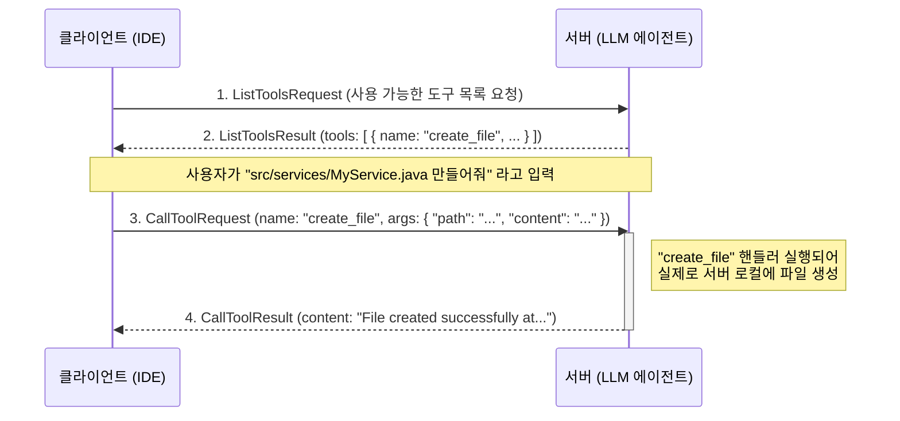

[[Model Context Protocol (MCP)]]의 가장 강력한 기능 중 하나는 바로 **'Tools(도구)'**입니다. 단순히 LLM과 대화하는 것을 넘어, 개발 도구가 LLM 에이전트의 특정 기능을 직접 호출하고 실행 결과를 받을 수 있게 하는 핵심적인 개념입니다.

MCP에서 **Tool**이란, **서버(LLM 에이전트) 측에 정의된, 원격으로 호출 가능한 명명된 함수(Named Function)**를 의미합니다. 이는 마치 서버가 클라이언트에게 특정 기능들을 API 엔드포인트처럼 노출하는 것과 같습니다. 클라이언트(IDE)는 이 '도구' 목록을 보고, 필요에 따라 특정 도구를 호출하여 서버의 기능을 활용할 수 있습니다.

예를 들어, 사용자가 IDE에 "현재 파일에 대한 단위 테스트 코드를 작성해 줘"라고 요청하면, IDE는 LLM에게 단순히 텍스트를 생성하라고 요청하는 대신, 서버에 등록된 `create_unit_test`라는 이름의 Tool을 직접 호출하여 안정적으로 테스트 코드를 생성하고 파일에 반영할 수 있습니다.

---

## Tool의 구조

MCP에서 모든 Tool은 명확하고 표준화된 구조를 가집니다. 이를 통해 클라이언트는 어떤 Tool이 어떤 역할을 하며, 어떻게 사용해야 하는지 명확하게 이해할 수 있습니다.

- **`name` (이름)**: Tool을 식별하는 고유한 문자열입니다. (예: `create_file`, `run_tests`, `refactor_code`)
- **`description` (설명)**: Tool의 기능을 사람이 이해할 수 있도록 설명하는 텍스트입니다. 이 설명은 단순히 사용자에게 보여주기 위한 것을 넘어, **LLM이 각 Tool의 용도를 파악하고 특정 작업에 가장 적합한 Tool을 스스로 선택하는 데 결정적인 힌트**가 됩니다.
- **`inputSchema` (입력 스키마)**: Tool을 호출할 때 필요한 파라미터들을 JSON Schema 형식으로 정의합니다. 예를 들어, `create_file` Tool은 `path` (파일 경로)와 `content` (파일 내용)라는 두 개의 문자열 파라미터가 필요하다고 명시할 수 있습니다. 이를 통해 타입과 필수 여부를 강제하여 잘못된 호출을 방지합니다.

---

## Tool 상호작용 흐름

클라이언트와 서버가 Tool을 이용하여 상호작용하는 과정은 다음과 같은 명확한 단계를 따릅니다.

1. **도구 목록 조회 (`tools/list`)**: 클라이언트는 `ListToolsRequest`를 서버에 보내 어떤 Tool들을 사용할 수 있는지 질의합니다. 서버는 `ListToolsResult`를 통해 `Tool` 객체의 목록을 반환합니다.
2. **도구 호출 (`tools/call`)**: 클라이언트는 사용자의 요청이나 내부 로직에 따라 특정 Tool을 실행하기로 결정합니다. 이때 `CallToolRequest` 메시지를 사용하며, 호출할 Tool의 `name`과 `inputSchema`에 맞는 `arguments`를 `JsonObject` 형태로 전달합니다.
3. **결과 반환**: 서버는 요청을 받아 등록된 Tool의 핸들러(실제 로직)를 실행하고, 그 결과를 `CallToolResult`에 담아 클라이언트에게 반환합니다.
4. **목록 변경 알림 (`notifications/tools/list_changed`)**: 만약 서버에서 사용 가능한 Tool 목록이 동적으로 추가되거나 제거되면, 서버는 `ToolListChangedNotification`을 클라이언트에 보내 목록을 갱신하도록 할 수 있습니다.

코드 스니펫

---

- **신뢰성과 제어**: LLM이 파일 생성 방법을 추측하여 코드를 생성하도록 하는 대신, 안정적으로 테스트된 `create_file` Tool을 호출하게 함으로써 작업의 신뢰성을 크게 높일 수 있습니다.
- **행동 지향 AI**: Tool은 LLM이 수동적인 정보 제공자를 넘어, 개발 프로세스에 능동적으로 참여하는 '행위자'가 되게 합니다.
- **무한한 확장성**: 개발자는 필요한 기능을 Tool로 만들어 서버에 계속 추가할 수 있습니다. 이를 통해 특정 도메인에 고도로 맞춤화된 강력한 AI 어시스턴트를 구축할 수 있습니다.

결론적으로 Tool은 MCP 아키텍처의 핵심적인 실행 유닛으로, LLM 기반의 개발 자동화를 현실로 만드는 가장 중요한 요소라고 할 수 있습니다. Tool에 대한 이해는 [[MCP 아키텍처]] 전체를 파악하는 데 필수적입니다.