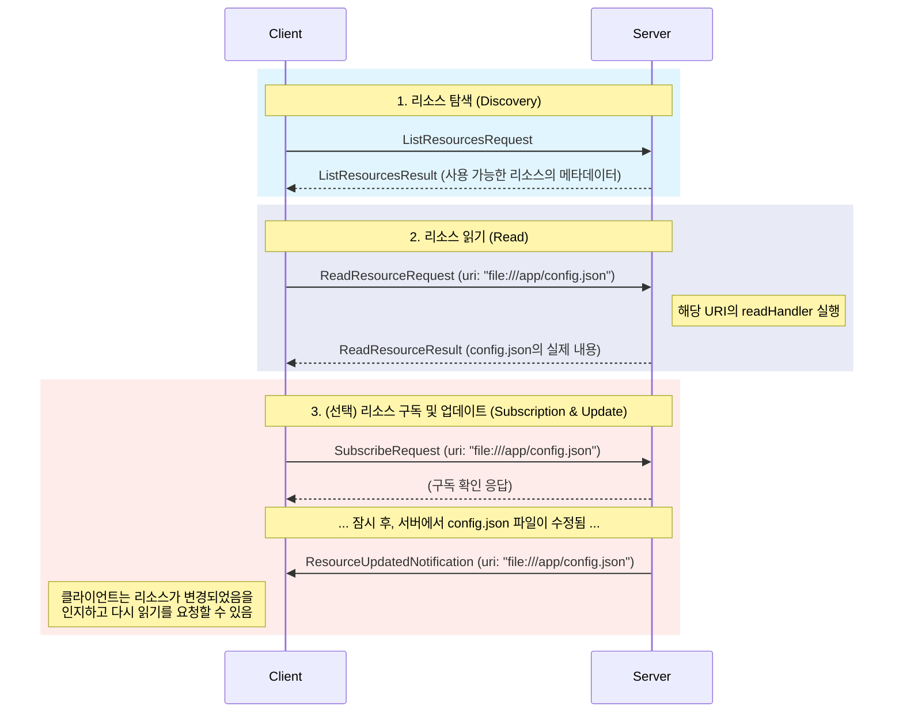

MCP의 **리소스 공유(Resource Sharing)** 기능은 서버가 자신의 내부에 있는 데이터나 파일, 상태 정보 등을 '리소스(Resource)'로 정의하여 클라이언트가 이를 발견하고, 읽고, 심지어 변경 사항을 구독할 수 있도록 허용하는 체계적인 메커니즘입니다.

이 기능은 AI 에이전트나 클라이언트 애플리케이션이 서버 측의 **컨텍스트(Context)** 에 접근하고 이를 바탕으로 추론할 수 있게 해주는 핵심적인 통로입니다. 예를 들어, LLM은 코드 분석을 위해 특정 소스 파일의 내용을 읽어달라고 요청하거나, 시스템의 현재 상태를 파악하기 위해 설정 파일을 조회하는 등의 작업을 수행할 수 있습니다.

---

### 리소스 공유의 전체 흐름

MCP의 리소스 공유는 크게 **탐색**, **읽기**, 그리고 **구독**이라는 세 가지 상호작용으로 구성됩니다.

### 1. 리소스의 정의와 내용

MCP에서 리소스는 두 가지 요소로 구성됩니다.

1. **`Resource` 객체 (메타데이터)**
    
    - 리소스의 "목록"이나 "카탈로그 항목"에 해당합니다. 여기에는 실제 데이터가 아닌, 리소스를 설명하는 정보가 담겨 있습니다.
    - **`uri`**: 리소스를 식별하는 고유 주소(예: `file:///path/to/file.txt`).
    - **`name`**: 사람이 읽기 좋은 이름.
    - **`description`**: 리소스의 내용이나 목적에 대한 설명.
    - **`mimeType`**: 데이터의 형식을 나타내는 타입(예: `text/plain`, `application/json`).
2. **`ResourceContents` 객체 (실제 내용)**
    
    - 리소스를 실제로 읽었을 때 반환되는 데이터입니다. 데이터의 종류에 따라 다른 타입을 가집니다.
    - **`TextResourceContents`**: 일반 텍스트 데이터를 담습니다.
    - **`BlobResourceContents`**: 이미지나 바이너리 파일과 같은 이진 데이터를 Base64로 인코딩하여 담습니다.

### 2. 리소스 상호작용 3단계

클라이언트는 다음과 같은 3단계 과정을 통해 서버의 리소스를 활용합니다.

- **탐색 (Discovery)**
    
    클라이언트는 ListResourcesRequest를 보내 서버가 제공할 수 있는 리소스들의 목록(List<Resource>)을 받습니다. 이는 마치 파일 탐색기에서 디렉토리의 파일 목록을 보는 것과 같습니다. 이 단계에서는 리소스의 내용이 아닌 메타데이터만 전송되어 효율적입니다.
    
- **읽기 (Read)**
    
    탐색을 통해 원하는 리소스의 uri를 알게 된 클라이언트는, 이 uri를 담아 ReadResourceRequest를 보냅니다. 서버는 해당 uri에 등록된 readHandler 로직을 실행하여 리소스의 실제 내용을 가져오고, ReadResourceResult에 담아 클라이언트에게 반환합니다.
    
- **구독 (Subscription)**
    
    로그 파일이나 상태 파일처럼 내용이 실시간으로 변경될 수 있는 리소스의 경우, 클라이언트는 SubscribeRequest를 보내 변경 알림을 구독할 수 있습니다.
    
    - 서버는 구독 요청을 받은 후 해당 리소스의 변경을 감지하면(예: 파일 시스템 감시), 클라이언트에게 `ResourceUpdatedNotification`을 **먼저** 보냅니다.
    - 이 알림을 받은 클라이언트는 자신이 가지고 있던 리소스의 내용이 오래된 것(stale)임을 인지하고, 필요할 경우 새로운 `ReadResourceRequest`를 보내 최신 내용을 가져올 수 있습니다.
    - 이 **반응형(Reactive)** 모델 덕분에 클라이언트는 리소스가 변경되었는지 확인하기 위해 주기적으로 서버에 요청을 보내는(Polling) 비효율을 피할 수 있습니다.

### 3. 동적인 리소스 관리

MCP의 리소스 관리는 정적인 파일 서빙에 그치지 않습니다.

- **동적 컨텐츠 생성**: 서버에 리소스를 등록할 때 사용되는 `readHandler`는 고정된 값을 반환하는 대신, 요청이 올 때마다 특정 로직을 수행하는 함수입니다. 예를 들어, `process://status`라는 가상의 `uri`에 대한 `readHandler`는 호출될 때마다 서버의 현재 CPU 사용량과 메모리 상태를 계산하여 반환하도록 만들 수 있습니다.
    
- **리소스 목록 변경 알림**: `ResourceListChangedNotification`을 통해 서버는 새로운 파일이 추가되거나 기존 파일이 삭제되는 등, 제공 가능한 리소스의 목록 자체가 변경되었음을 모든 클라이언트에게 알릴 수 있습니다.
    

## 결론

MCP의 리소스 공유 기능은 서버 측의 컨텍스트를 클라이언트에 노출하는 다재다능하고 포괄적인 프레임워크입니다. 단순한 파일 접근을 넘어 **탐색, 타입이 있는 콘텐츠(텍스트/바이너리), 동적 생성, 그리고 반응형 구독 모델**을 모두 제공합니다.

이를 통해 AI 애플리케이션은 서버 환경의 상태를 '보고' 그에 맞춰 반응하는 고도로 상황 인식적인(Context-Aware) 동작을 수행할 수 있게 됩니다.