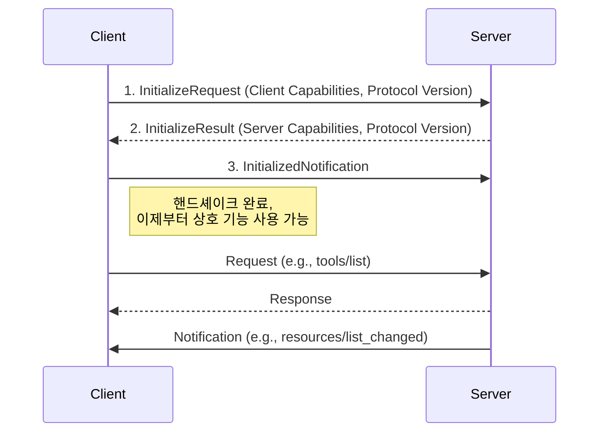

## 1. MCP의 핵심 설계 철학

MCP 아키텍처는 세 가지 핵심적인 설계 철학을 바탕으로 합니다. 이는 MCP를 유연하고 확장 가능하게 만드는 기반이 됩니다.

1. 전송 계층의 독립성 (Transport Agnosticism)
    
    MCP는 특정 통신 기술에 종속되지 않습니다. 코드를 보면 WebSocket, SSE(Server-Sent Events), Stdio(Standard Input/Output) 등 다양한 통신 방식을 지원하는 Transport 구현체들을 확인할 수 있습니다. 이는 시스템 환경에 따라 최적의 통신 방식을 선택할 수 있는 유연성을 제공합니다. 예를 들어, 실시간 양방향 통신이 중요할 때는 [[WebSocketClientTransport]]을, 서버에서 클라이언트로의 단방향 이벤트 스트림이 필요할 때는 [[SseClientTransport]]를 사용할 수 있습니다. 이 모든 것은 [[MCP 전송 계층 (Transport Layer)]]에서 추상화되어있어 프로토콜의 핵심 로직에 영향을 주지 않습니다.
    
2. [[기능 협상(Capability Negotiation)]]
    
    MCP의 가장 강력한 특징 중 하나는 '역량 협상' 메커니즘입니다. 클라이언트와 서버는 연결이 시작될 때, 서로가 어떤 기능을 지원하는지(capabilities) 교환하는 초기화 과정을 거칩니다. 예를 들어, 서버가 '원격 도구 호출' 기능을 지원하는지, 클라이언트가 'LLM 추론(sampling)'을 수행할 수 있는지 등을 미리 파악합니다. 이를 통해 한쪽이 지원하지 않는 기능을 호출하여 오류를 발생시키는 상황을 미연에 방지하고, 프로토콜이 새로운 기능으로 확장되더라도 하위 호환성을 유지할 수 있습니다.
    
3. 명확한 메시지 구조
    
    MCP는 산업 표준인 [[JSON-RPC]]을 메시지 형식으로 채택했습니다. 이는 메시지 구조를 단순화하고, 다양한 프로그래밍 언어 환경에서 쉽게 구현할 수 있게 합니다. 모든 메시지는 크게 세 종류로 나뉩니다.
    
    - **Request**: 응답을 요구하는 요청입니다. 고유한 `id`를 가집니다.
    - **Response**: `Request`에 대한 응답입니다. 요청과 동일한 `id`를 가집니다.
    - **Notification**: 응답이 필요 없는 단방향 알림입니다.

이러한 명확한 구분 덕분에 복잡한 비동기 통신 흐름을 안정적으로 관리할 수 있습니다.

## 2. MCP 통신 흐름

클라이언트와 서버 간의 통신은 정해진 절차에 따라 이루어지며, 가장 중요한 과정은 초기화 핸드셰이크입니다.

1. **초기화 요청 (`InitializeRequest`)**: 클라이언트가 서버에 연결하며 자신이 지원하는 기능 목록(`ClientCapabilities`)과 사용하려는 프로토콜 버전을 보냅니다.
2. **초기화 응답 (`InitializeResult`)**: 서버는 요청을 받고, 자신이 지원하는 기능 목록(`ServerCapabilities`)과 최종적으로 사용할 프로토콜 버전을 응답합니다. 만약 클라이언트가 서버의 프로토콜 버전을 지원할 수 없다면, 연결을 해제해야 합니다.
3. **초기화 완료 (`InitializedNotification`)**: 클라이언트는 서버의 정보를 성공적으로 수신했음을 알리는 통지를 보냅니다.

이 핸드셰이크 과정이 끝나면, 양측은 서로의 '역량'을 인지한 상태에서 약속된 기능들을 자유롭게 요청하고 알림을 보낼 수 있습니다.

## 3. 주요 구성 요소

MCP SDK는 여러 계층으로 나뉘어 각자의 역할에 집중하도록 설계되었습니다.

- **[[MCP 전송 계층 (Transport Layer)]]**: `WebSocketMcpTransport`, `SseServerTransport` 와 같이 실제 데이터 전송을 담당하는 최하위 계층입니다. 통신 방식의 복잡성을 숨기고 일관된 인터페이스를 제공합니다.
- **[[MCP 프로토콜 계층 (Protocol Layer)]]**: `Transport` 계층 위에서 동작하는 MCP의 '두뇌'입니다. 이 계층은 비동기적으로 오가는 메시지들을 관리하고, 어떤 요청에 어떤 응답이 와야 하는지 추적하며, 수신된 메시지를 적절한 로직으로 연결하는 복잡한 역할을 수행합니다. 개발자는 이 계층 덕분에 복잡한 네트워크 통신을 신경 쓰지 않고 비즈니스 로직에만 집중할 수 있습니다.
- **[[MCP 메시지 구조 (Message Structure)]]**: `Request`, `Notification`, `CallToolResult` 등 프로토콜에서 사용되는 모든 데이터 모델을 정의합니다. `kotlinx.serialization`의 다형성(Polymorphic) 직렬화기를 사용하여 메시지 내용에 따라 적절한 데이터 클래스로 변환되는 점이 특징입니다. 이는 코드의 유연성과 확장성을 크게 높여줍니다.

## 4. MCP가 제공하는 핵심 기능

역량 협상을 통해 활성화될 수 있는 MCP의 핵심 기능들은 다음과 같으며, 각 기능은 모듈화되어 필요에 따라 선택적으로 사용할 수 있습니다.

- **[[MCP 원격 도구 호출 (Remote Tool Calling)]]**: 클라이언트가 서버에 정의된 도구를 원격으로 실행하고 그 결과를 받아볼 수 있는 기능입니다. (예: `tools/call`)
- **[[MCP 프롬프트 관리 (Prompt Management)]]**: 서버가 미리 정의된 프롬프트 템플릿을 제공하고, 클라이언트는 이를 가져와 활용할 수 있습니다. (예: `prompts/get`)
- **[[MCP 리소스 공유 (Resource Sharing)]]**: 서버가 가진 파일이나 데이터 같은 리소스를 클라이언트가 읽거나, 변경 사항을 구독할 수 있습니다. (예: `resources/read`, `resources/subscribe`)
- **[[MCP 역방향 LLM 샘플링 (Reverse LLM Sampling)]]**: 서버가 오히려 클라이언트에게 LLM 추론을 요청하는 독특한 기능입니다. 이는 사용자의 API 키나 로컬 모델을 활용해야 할 때 매우 유용합니다. (예: `sampling/createMessage`)

## 결론

MCP(Model Context Protocol)는 AI 에이전트와 관련 도구들이 복잡한 상호작용을 할 수 있도록 설계된 강력하고 유연한 아키텍처입니다. 전송 계층의 독립성, 역량 협상 메커니즘, 그리고 지능적인 프로토콜 계층을 통해 확장 가능하고 안정적인 AI 시스템을 구축할 수 있는 기반을 제공합니다.

단순히 API를 호출하는 것을 넘어, 시스템의 각 구성 요소가 서로의 능력을 이해하고 유기적으로 협력하는 지능형 애플리케이션을 구상하고 있다면, MCP 아키텍처는 분명 훌륭한 참고 자료가 될 것입니다.
