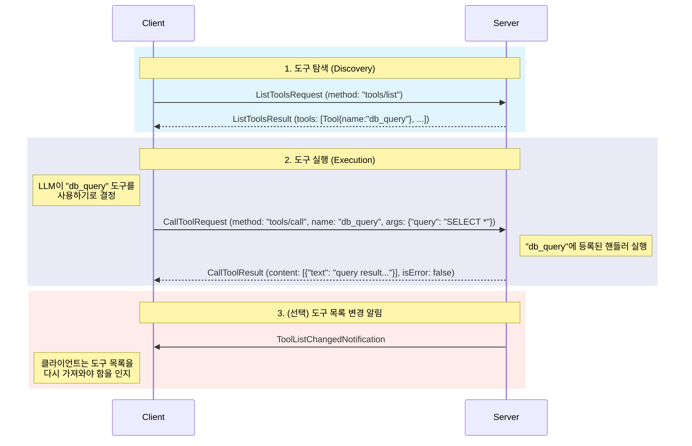

MCP(Model Context Protocol)의 **원격 도구 호출** 기능은 AI 에이전트(서버)가 외부 세계와 상호작용할 수 있도록 만드는 핵심적인 메커니즘입니다. 단순히 원격에 있는 함수를 실행하는 RPC(Remote Procedure Call)를 넘어, **탐색(Discovery)**, **실행(Execution)**, 그리고 **결과 활용(Result Utilization)**에 이르는 전체 과정을 체계적으로 정의합니다.

이 기능을 통해 LLM과 같은 AI 모델은 자신이 직접 수행할 수 없는 작업, 예를 들어 데이터베이스 조회, 파일 시스템 조작, 외부 API 호출 등을 서버에 위임하여 처리하고 그 결과를 받아 후속 작업을 이어갈 수 있습니다. 이는 자율 에이전트(Autonomous Agent)를 구축하는 데 있어 가장 기본적이면서도 중요한 기능입니다.

---

### 도구 호출의 전체 과정

MCP의 원격 도구 호출은 크게 **탐색**과 **실행**이라는 두 단계로 이루어지며, 동적인 환경을 위해 **변경 알림**을 추가로 지원합니다.

### 1. 서버: 도구의 정의와 등록

도구 호출 기능의 시작은 서버 개발자가 어떤 도구를 제공할 것인지 정의하고 등록하는 것입니다. `Server` SDK의 `addTool`과 같은 메서드를 사용하여 다음 네 가지 요소를 등록합니다.

1. **`name` (이름)**
    - 도구를 식별하는 고유한 문자열입니다 (예: `database_query`, `send_email`).
2. **`description` (설명)**
    - **LLM을 위한 프롬프트** 역할을 하는 매우 중요한 요소입니다. "이 도구가 무엇을 하는지, 어떤 상황에서 사용해야 하는지"를 자연어로 상세히 기술합니다. LLM은 이 설명을 보고 주어진 문제를 해결하기 위해 어떤 도구를 사용해야 할지 판단합니다.
3. **`inputSchema` (입력 스키마)**
    - 도구가 필요로 하는 파라미터들을 JSON 스키마 형태로 정의한 **API 명세서**입니다. 각 파라미터의 이름, 타입, 필수 여부 등을 명시합니다. LLM은 이 스키마를 보고 도구를 호출하기 위해 어떤 인자(argument)를 생성해야 하는지 정확히 알 수 있습니다.
4. **`handler` (핸들러)**
    - 실제로 도구가 호출되었을 때 실행될 **비즈니스 로직**입니다. 이 함수는 `CallToolRequest`를 인자로 받아 실제 작업을 수행하고, 그 결과를 `CallToolResult` 객체로 반환합니다.

### 2. 클라이언트: 도구 탐색 및 실행

클라이언트(또는 클라이언트를 사용하는 LLM)는 다음과 같은 절차로 도구를 사용합니다.

- **탐색 (Discovery)**
    
    1. 클라이언트는 먼저 `ListToolsRequest`를 서버에 보내 어떤 도구들을 사용할 수 있는지 문의합니다.
    2. 서버는 `ListToolsResult`를 통해 현재 등록된 모든 `Tool`의 정의(이름, 설명, 입력 스키마) 목록을 응답합니다.
    3. 클라이언트는 이 "도구 메뉴"를 LLM의 컨텍스트에 포함시켜, LLM이 사용 가능한 도구를 인지하도록 합니다.
- **실행 (Execution)**
    
    1. LLM은 사용자의 질문과 탐색 단계에서 얻은 도구 설명을 바탕으로 특정 도구(예: `database_query`)를 사용해야겠다고 결정합니다.
    2. LLM은 도구의 `inputSchema`에 맞춰 필요한 인자(예: `{"query": "SELECT * FROM users"}`)를 생성합니다.
    3. 클라이언트 애플리케이션은 LLM이 생성한 정보를 바탕으로 `CallToolRequest` 메시지를 구성하여 서버에 전송합니다.
    4. 서버는 해당 도구의 핸들러를 실행하고, 결과를 `CallToolResult`에 담아 클라이언트에게 돌려줍니다.

### 3. 결과의 활용

MCP의 `CallToolResult`는 단순히 성공/실패 여부나 텍스트 값만 반환하지 않습니다. 결과는 `content` 필드에 담기며, 이는 텍스트, 이미지 등 다양한 내용을 포함할 수 있는 `PromptMessageContent`의 리스트입니다.

이 구조는 매우 중요합니다. 도구 실행 결과가 [[MCP 메시지 구조 (Message Structure)]]에서 정의된 표준 형식으로 반환되기 때문에, 이 결과를 **그대로 대화 기록에 추가하여 다시 LLM의 다음 입력으로** 사용할 수 있습니다. 이는 LLM이 외부 도구와 상호작용하며 연속적인 추론을 이어나가는 'ReAct(Reason + Act)'와 같은 에이전트 패턴을 원활하게 구현할 수 있도록 돕습니다.

### 4. 동적 환경을 위한 변경 알림

만약 서버의 플러그인 시스템 등을 통해 런타임에 도구가 추가되거나 제거된다면 어떻게 될까요? MCP는 이런 동적인 환경을 위해 `ToolListChangedNotification`이라는 알림 메시지를 지원합니다.

서버는 도구 목록에 변화가 생겼을 때, 연결된 모든 클라이언트에게 이 알림을 보낼 수 있습니다. 이 알림을 받은 클라이언트는 도구 목록 정보가 더 이상 유효하지 않음을 인지하고, 다시 `ListToolsRequest`를 보내 최신 목록을 가져와 LLM의 컨텍스트를 갱신할 수 있습니다.

## 결론

MCP의 원격 도구 호출은 단순한 RPC를 넘어, AI 에이전트가 필요로 하는 **탐색, 명세 기반 실행, 구조화된 결과, 동적 갱신**의 전 과정을 지원하는 포괄적인 프레임워크입니다. 이처럼 잘 설계된 프로토콜은 LLM이 단순히 대답만 하는 것을 넘어, 실질적인 '행동'을 통해 복잡한 문제를 해결하는 강력한 AI 에이전트를 구축하는 기반이 됩니다.