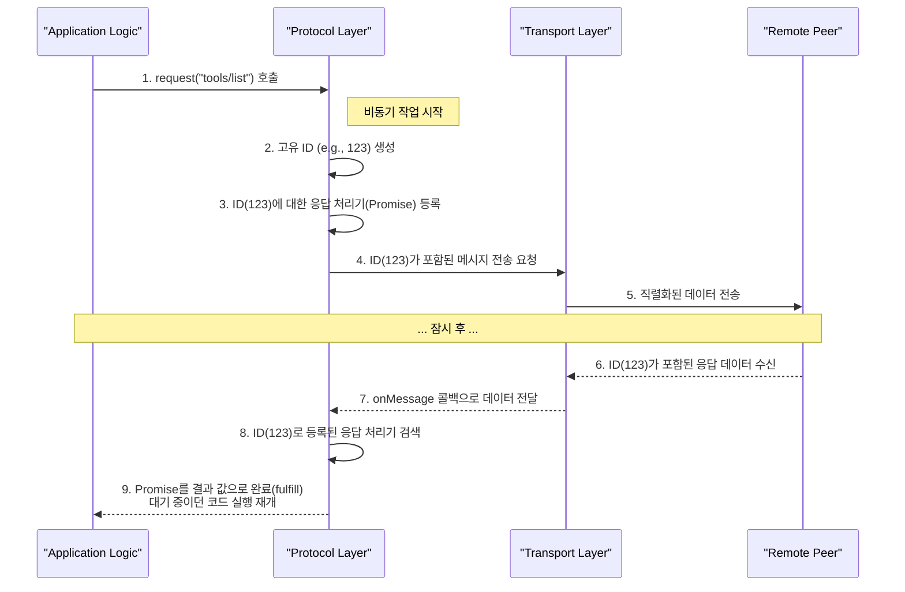

MCP 아키텍처에서 **프로토콜 계층(Protocol Layer)** 은 [[MCP 전송 계층 (Transport Layer)]] 바로 위에서 동작하는 지능적인 **중앙 관제 시스템**입니다. 전송 계층이 단순히 데이터를 실어 나르는 물리적인 역할에 충실하다면, 프로토콜 계층은 그 데이터를 해석하고, 통신 흐름을 관리하며, 애플리케이션의 비즈니스 로직과 연결하는 핵심적인 '두뇌' 역할을 수행합니다.

이 계층의 존재 덕분에 개발자는 복잡한 비동기 네트워크의 세부 사항을 몰라도, 마치 일반적인 함수를 호출하듯 쉽고 안정적으로 상대방과 상호작용할 수 있습니다. `Protocol` 추상 클래스와 이를 상속하는 `Client`, `Server` 클래스가 바로 이 계층을 구성합니다.

---

## `Protocol` 클래스의 핵심 책임

프로토콜 계층은 크게 네 가지 핵심적인 책임을 통해 안정적인 통신을 보장합니다.

### 1. 요청-응답 사이클 관리 (Request-Response Cycle Management)

네트워크 통신은 본질적으로 비동기적입니다. 요청을 보낸다고 해서 응답이 즉시 오는 것이 아니며, 여러 요청을 보냈을 때 응답이 순서대로 온다는 보장도 없습니다. 프로토콜 계층은 이 문제를 **요청 ID 기반의 매칭**으로 해결합니다.

개발자가 `protocol.request(...)`를 호출했을 때 내부적으로 일어나는 과정은 다음과 같습니다.

코드 스니펫

1. **요청 시작**: 애플리케이션 로직에서 `request()` 메서드를 호출합니다. 이 메서드는 즉시 반환되지 않고, 결과가 올 때까지 비동기적으로 대기하는 `Promise`(코루틴에서는 `Deferred`)를 반환합니다.
2. **ID 생성 및 핸들러 등록**: 프로토콜 계층은 요청을 식별할 고유한 `RequestId`를 생성합니다. 그리고 이 ID를 키로 사용하여, 나중에 응답이 왔을 때 `Promise`를 완료시킬 로직이 담긴 **응답 핸들러**를 내부에 저장합니다 (`responseHandlers` 맵).
3. **응답 수신 및 매칭**: 시간이 흘러 상대방으로부터 응답이 도착하면, 프로토콜 계층은 응답에 포함된 `RequestId`를 확인합니다.
4. **Promise 완료**: 저장해 두었던 응답 핸들러를 ID로 찾아 실행합니다. 이 핸들러는 대기 중이던 `Promise`를 성공 또는 실패로 완료시키고, 이로써 `request()`를 호출했던 애플리케이션 코드는 마침내 결과 값을 얻고 다음 로직을 실행하게 됩니다.

이 정교한 메커니즘 덕분에 개발자는 콜백 지옥 없이 동기 코드처럼 간결하게 비동기 통신을 다룰 수 있습니다.

### 2. 메시지 라우팅 및 핸들러 실행 (Message Routing & Handler Execution)

프로토콜 계층은 전송 계층으로부터 들어오는 모든 메시지를 받는 단일 진입점(`onMessage`)을 가집니다. 여기서 메시지의 종류를 판별하여 적절한 곳으로 분배(라우팅)합니다.

- **`JSONRPCResponse` (응답)**: 위에서 설명한 '요청-응답 사이클'에 따라 처리됩니다.
- **`JSONRPCRequest` (요청)**: 메시지에 포함된 `method` 이름(예: "tools/call")을 확인하고, `requestHandlers` 맵에서 해당 이름으로 등록된 핸들러를 찾아 실행합니다. 만약 등록된 핸들러가 없다면, "메서드를 찾을 수 없음(`MethodNotFound`)" 오류를 자동으로 상대방에게 응답합니다.
- **`JSONRPCNotification` (알림)**: `notificationHandlers` 맵에서 핸들러를 찾아 실행합니다. 응답이 필요 없는 메시지이므로 별도의 응답을 보내지 않습니다.

### 3. 생명주기 및 상태 관리 (Lifecycle and State Management)

- **연결 (`connect`)**: `connect` 메서드가 호출되면, 프로토콜 계층은 전송 계층의 `onMessage`, `onClose` 등 주요 이벤트 콜백에 자신의 라우팅 및 상태 관리 로직을 연결합니다. 이로써 두 계층은 하나의 유기적인 시스템으로 동작하게 됩니다.
- **종료 (`close`)**: 연결이 종료되면, 프로토콜 계층은 단순히 연결을 끊는 것뿐만 아니라 중요한 상태 정리 작업을 수행합니다. 예를 들어, 아직 응답을 받지 못하고 대기 중인 모든 요청들(`responseHandlers`에 남아있는 항목)을 "연결 종료" 오류와 함께 강제로 실패 처리합니다. 이는 애플리케이션이 응답 없는 요청을 무한정 기다리며 멈추는 것을 방지하는 필수적인 로직입니다.

### 4. 에러 및 타임아웃 처리 (Error and Timeout Handling)

안정적인 통신을 위해 프로토콜 계층은 강력한 오류 처리 기능을 내장하고 있습니다.

- **타임아웃**: 모든 `request()` 호출은 내장된 타임아웃 타이머와 함께 동작합니다. 정해진 시간 내에 응답이 오지 않으면, 프로토콜 계층은 해당 요청이 실패했다고 간주합니다.
- **취소 알림**: 타임아웃이 발생하면, 프로토콜 계층은 상대방에게 더 이상 이 요청에 대한 작업이 필요 없다는 `CancelledNotification`을 보내 불필요한 리소스 낭비를 막아줍니다.
- **오류 변환**: 네트워크에서 발생한 `JSONRPCError`는 개발자가 애플리케이션 코드에서 쉽게 처리할 수 있도록 `McpError`와 같은 네이티브 예외(Exception)로 변환되어 전달됩니다.

## 결론

MCP 프로토콜 계층은 복잡하고 신뢰할 수 없는 비동기 통신 위에 추상화된 계층을 구축하여, 개발자에게는 간단하고 직관적인 API를 제공하는 핵심 요소입니다. 요청-응답 매칭, 메시지 라우팅, 강력한 오류 처리 기능을 통해 MCP 기반 애플리케이션의 안정성과 개발 생산성을 극적으로 향상시킵니다.