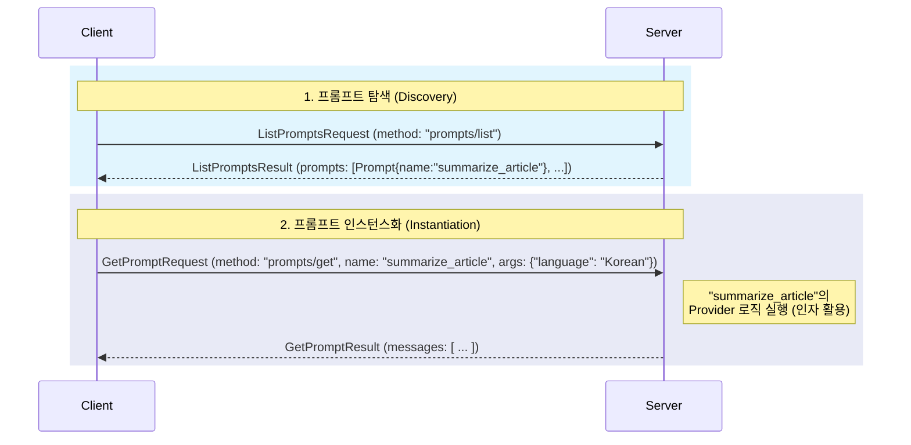

MCP(Model Context Protocol)의 **프롬프트 관리** 기능은 단순히 텍스트 조각을 저장하고 불러오는 것을 넘어, 서버가 클라이언트에게 동적으로 생성 가능한 **프롬프트 템플릿(Prompt Template)**을 서비스하는 강력한 시스템입니다.

이 기능의 핵심 목표는 고품질의 복잡한 프롬프트를 중앙에서 관리하고 재사용하는 것입니다. 각 클라이언트가 개별적으로 시스템 프롬프트나 Few-shot 예시를 하드코딩하는 대신, 서버로부터 표준화된 프롬프트 템플릿을 받아 사용함으로써 일관성을 유지하고, 프롬프트 엔지니어링의 결과를 모든 클라이언트에 손쉽게 배포할 수 있습니다.

---

### 프롬프트 관리의 전체 흐름

MCP의 프롬프트 관리는 크게 **탐색** 단계와 **인스턴스화** 단계로 나뉩니다.

1. **탐색 (Discovery)**: 클라이언트는 서버에 어떤 종류의 프롬프트 템플릿이 있는지 목록을 요청합니다.
2. **인스턴스화 (Instantiation)**: 클라이언트는 특정 템플릿을 선택하고, 필요한 인자(argument)를 전달하여 완전히 구성된 프롬프트 메시지를 생성(인스턴스화)해달라고 요청합니다.

### 1. 서버: 프롬프트 템플릿의 정의

서버 개발자가 MCP를 통해 프롬프트를 제공한다는 것은, 정적인 텍스트가 아니라 동적으로 생성될 수 있는 **템플릿**을 등록하는 것을 의미합니다. `server.addPrompt` 메서드를 사용하여 프롬프트 템플릿을 등록할 때 다음 요소들이 정의됩니다.

- **`Prompt` 객체 (템플릿 명세)**
    
    - **`name`**: 템플릿을 식별하는 고유한 이름입니다 (예: `summarize_article`, `code_generation_prompt`).
    - **`description`**: 이 템플릿이 어떤 종류의 프롬프트를 생성하는지에 대한 설명입니다.
    - **`arguments`**: 템플릿을 커스터마이징하는 데 사용될 파라미터 목록입니다. 예를 들어 `language`, `tone`, `max_length` 같은 인자를 정의하여 프롬프트의 결과물을 동적으로 변경할 수 있습니다.
- **`promptProvider` 람다 (프로바이더 로직)**
    
    - 이것이 동적 생성의 핵심입니다. 프로바이더는 `GetPromptRequest`가 도착했을 때 **실시간으로 실행되는 코드 블록**입니다.
    - 이 코드는 요청에 담겨온 `arguments` 값을 활용하여 최종 프롬프트 메시지를 조립합니다. 데이터베이스를 조회하거나, 현재 시간에 따라 다른 내용을 포함시키는 등 복잡한 로직 수행이 가능합니다.
    - 단순한 문자열 치환을 넘어, 프로그래밍 로직을 통해 프롬프트를 생성하는 'Prompt as a Service'의 역할을 합니다.

### 2. 클라이언트: 탐색 및 인스턴스화

클라이언트는 두 단계에 걸쳐 서버가 제공하는 프롬프트를 활용합니다.

- 탐색 (Discovery)
    
    클라이언트는 ListPromptsRequest를 서버로 보내 사용 가능한 프롬프트 템플릿의 "카탈로그"를 받습니다. 응답으로 오는 ListPromptsResult에는 각 템플릿의 이름, 설명, 그리고 어떤 인자를 받을 수 있는지에 대한 정보가 담겨 있습니다.
    
- **인스턴스화 (Instantiation)**
    
    1. 클라이언트는 카탈로그에서 원하는 템플릿(예: `summarize_article`)을 선택합니다.
    2. 템플릿 명세에 따라 필요한 인자(예: `{"language": "Korean"}`)를 준비합니다.
    3. 이 정보들을 `GetPromptRequest`에 담아 서버에 전송합니다.
    4. 서버에서는 해당 템플릿의 `promptProvider` 코드가 실행되어, 클라이언트가 보낸 인자를 반영한 최종 프롬프트 메시지가 생성됩니다.
    5. 클라이언트는 `GetPromptResult`를 통해 완전히 구성된 프롬프트 메시지를 수신합니다.

### 3. 구조화된 결과: `PromptMessage`

MCP 프롬프트 관리의 또 다른 강력한 특징은 결과물이 단순한 텍스트가 아니라는 점입니다. `GetPromptResult`는 **`PromptMessage` 객체의 리스트**를 반환합니다.

각 `PromptMessage`는 대화의 한 턴(turn)을 나타내며, 다음과 같은 정보를 포함합니다.

- `role`: 메시지의 화자를 나타냅니다 (`user` 또는 `assistant`).
- `content`: 메시지의 내용으로, 텍스트, 이미지, 오디오 등 복합적인 데이터를 담을 수 있습니다.

이 구조 덕분에 서버는 단순한 시스템 프롬프트뿐만 아니라, **LLM의 성능을 극대화하기 위한 Few-shot 예시나 특정 대화 패턴을 유도하는 다중 턴(multi-turn) 대화 예시**를 제공할 수 있습니다. 예를 들어, '고객 지원' 템플릿은 모범적인 고객 응대 예시를 담은 `[user, assistant, user, assistant]` 형태의 메시지 리스트를 반환할 수 있습니다.

클라이언트는 이 구조화된 메시지 리스트를 그대로 LLM과의 대화 시작 부분에 삽입하여, 모델이 특정 역할이나 스타일을 효과적으로 학습하도록 유도할 수 있습니다.

## 결론

MCP의 프롬프트 관리 기능은 단순한 문자열 저장을 넘어, 중앙에서 관리되는 동적 **프롬프트 템플릿 엔진**을 제공합니다. 이를 통해 복잡한 프롬프트를 체계적으로 관리하고, 여러 클라이언트에 걸쳐 일관된 품질을 보장하며, Few-shot 학습과 같은 고급 프롬프트 기법을 손쉽게 적용할 수 있습니다. 이는 AI 애플리케이션의 성능과 유지보수성을 크게 향상시키는 핵심적인 기능입니다.