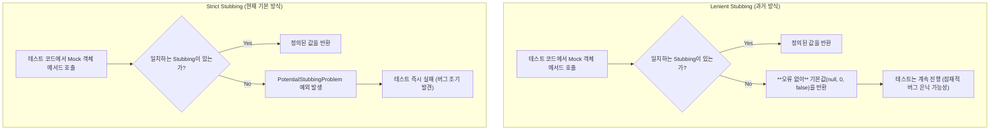

혹시 테스트 코드를 작성하면서 이런 경험 없으신가요? 분명히 모든 테스트가 성공했는데, 실제 운영 환경에서는 예상치 못한 버그가 발생하는 경우 말입니다. 또는, 예전에 작성된 테스트 코드를 리팩토링하려는데, 너무 많은 [[Mock 객체]]의 행위([[테스트 스텁(Test Stub)]])들이 정의되어 있어 어떤 것이 진짜 필요한 것인지 파악하기 어려웠던 경험은 없으신가요?

이러한 문제들은 테스트 코드의 신뢰성과 유지보수성을 크게 떨어트리는 주범입니다. 과거 Mockito 1.x 버전은 매우 유연한 스터빙을 허용했지만, 이로 인해 테스트가 불필요하게 복잡해지고 디버깅이 어려워지는 부작용이 있었습니다.

이러한 배경에서 Mockito 2.x 버전부터 '엄격함(strictness)'이 강조되기 시작했으며, **Strict Stubbing(엄격한 스터빙)** 은 이제 Mockito의 **기본 동작 방식**으로 자리 잡았습니다. 이는 우리가 더 깔끔하고, 의도가 명확하며, 신뢰도 높은 테스트를 작성하도록 돕는 강력한 안내자입니다.

---

## Strict Stubbing의 철학과 필요성

Mockito가 Strict Stubbing을 기본값으로 채택한 이유는 명확합니다. 더 깨끗하고 유지보수하기 쉬운 테스트 코드를 장려하기 위함이며, 주요 목표는 다음과 같습니다.

1. 방치된 스터빙 (Unused Stubs) 감지
    
    프로덕션 코드가 리팩토링되면서 더 이상 사용되지 않는 stub이 테스트 코드에 그대로 남아있는 경우입니다. 이는 '죽은 코드(dead code)'로, 테스트의 가독성을 해치고 동료 개발자에게 "이 stub은 왜 필요하지?"라는 혼란을 줍니다. 결국 테스트 코드의 유지보수 비용을 증가시키는 '테스트 냄새(Test Smells)'의 원인이 됩니다.
    
2. 스터빙 인수 불일치(Stubbing Argument Mismatch) 감지
    
    이것이 더 심각하고 찾기 어려운 문제입니다. stub에 설정된 인수와 실제 코드에서 호출된 인수가 다른 경우, 기존의 유연한(lenient) 방식에서는 예외를 발생시키지 않고 단순히 null이나 0과 같은 기본값을 반환합니다. 이로 인해 테스트는 성공한 것처럼 보이지만, 실제로는 우리가 의도한 로직을 전혀 검증하지 못한 채 넘어가게 됩니다. 이는 잠재적인 버그를 효과적으로 숨기는 결과를 낳습니다.
    

Strict Stubbing은 이 두 가지 흔한 개발자 실수를 사전에 방지하여 테스트의 신뢰도를 극대화합니다.

---

## Strict Stubbing과 Lenient Stubbing의 동작 방식 비교

Strict Stubbing이 어떻게 이 문제들을 해결하는지 이해하기 위해 기존의 `Lenient` 방식과 `Strict` 방식의 동작 흐름을 비교해 보겠습니다.




위 다이어그램에서 볼 수 있듯이, 가장 큰 차이점은 **예상치 못한 호출에 대한 반응**입니다. Strict Stubbing은 정의되지 않은 방식으로 Mock 객체가 사용되는 순간 즉시 테스트를 실패시켜, 개발자가 문제를 바로 인지하고 수정하도록 강제합니다.

---

## Strict Stubbing의 실제 적용 예시

현대적인 [[JUnit]] 5 환경에서 `@ExtendWith(MockitoExtension.class)`를 사용한다면, 우리는 이미 `Strictness.STRICT_STUBS` 정책의 혜택을 받고 있습니다. 실제 예외 발생 상황을 코드로 확인해 보겠습니다.

```java
// MemberServiceTest.java
import static org.mockito.Mockito.*;
import static org.junit.jupiter.api.Assertions.*;

import org.junit.jupiter.api.Test;
import org.junit.jupiter.api.extension.ExtendWith;
import org.mockito.InjectMocks;
import org.mockito.Mock;
import org.mockito.junit.jupiter.MockitoExtension;
import org.mockito.exceptions.misusing.PotentialStubbingProblem;
import org.mockito.exceptions.misusing.UnnecessaryStubbingException;

@ExtendWith(MockitoExtension.class) // 이 어노테이션이 Strict Stubbing을 기본으로 활성화합니다.
class MemberServiceTest {

    @InjectMocks
    private MemberService memberService;

    @Mock
    private MemberRepository memberRepository;

    @Test
    void findMember_인수가_일치하지_않아_실패하는_테스트() {
        // given: ID가 1L인 사용자에 대한 stubbing을 정의했습니다.
        when(memberRepository.findById(1L)).thenReturn(new Member("Kim"));

        // when/then: 하지만 실수로 2L을 조회하려고 합니다.
        // 이 때 Mockito는 stubbing에 설정된 인수와 다르다는 것을 감지하고
        // PotentialStubbingProblem 예외를 발생시켜 테스트를 즉시 실패시킵니다.
        assertThrows(PotentialStubbingProblem.class, () -> {
            memberService.findMemberNameById(2L);
        });
    }

    @Test
    void findMember_사용되지_않은_스터빙으로_실패하는_테스트() {
        // given: 이메일 중복 검사를 위한 stubbing을 정의했습니다.
        when(memberRepository.existsByEmail("test@example.com")).thenReturn(true);
        // 하지만 이 stubbing은 테스트 코드 내에서 아무데서도 사용되지 않습니다.

        when(memberRepository.findById(1L)).thenReturn(new Member("Park"));

        // when: ID로 사용자를 조회하는 로직만 실행합니다.
        memberService.findMemberNameById(1L);

        // then: 테스트 자체는 성공적으로 실행되지만,
        // 테스트가 끝나는 시점에 Mockito는 사용되지 않은 stub이 있음을 감지하고
        // UnnecessaryStubbingException 예외를 발생시켜 우리에게 알려줍니다.
        // (별도의 assertThrows 없이 테스트 실행 후 리포트에서 확인 가능)
    }
}
```

두 번째 테스트가 실패하면 다음과 같이 매우 친절한 예외 메시지를 볼 수 있습니다.

> ```
> org.mockito.exceptions.misusing.UnnecessaryStubbingException: 
> Unnecessary stubbings detected.
> Clean & maintainable test code requires zero unnecessary code.
> Following stubbings are unnecessary (click to navigate to relevant line of code):
>   1. -> at com.yourpackage.MemberServiceTest.findMember_사용되지_않은_스터빙으로_실패하는_테스트(MemberServiceTest.java:45)
> Please remove unnecessary stubbings or use 'lenient' strictness. More info: javadoc for UnnecessaryStubbingException class.
> ```

이 메시지는 어떤 stubbing이 불필요한지, 그리고 해당 코드가 몇 번째 줄에 있는지 정확히 알려주어 디버깅을 매우 용이하게 만듭니다.

---

## 때로는 유연함이 필요할 때: `lenient()`

모든 규칙에는 예외가 있듯이, 때로는 의도적으로 유연한(lenient) 동작이 필요할 수 있습니다. 예를 들어, 여러 테스트에서 공통으로 사용되지만 특정 테스트에서는 사용되지 않을 수 있는 `@BeforeEach` 내의 stubbing이 그런 경우입니다.

이럴 때는 `lenient()` 메서드를 사용하여 특정 stubbing에 대해서만 일시적으로 Strict 검사를 비활성화할 수 있습니다.

```java
@BeforeEach
void setUp() {
    // 이 stubbing은 일부 테스트에서는 사용되지 않을 수 있습니다.
    // lenient()를 사용하여 UnnecessaryStubbingException을 방지합니다.
    lenient().when(memberRepository.findSystemAdmin()).thenReturn(new Member("Admin"));
}

@Test
void admin_기능은_검증하지_않는_테스트() {
    // 위 lenient stubbing은 여기서 사용되지 않지만, 예외가 발생하지 않습니다.
    when(memberRepository.findById(1L)).thenReturn(new Member("Lee"));
    assertEquals("Lee", memberService.findMemberNameById(1L));
}
```

`lenient()`는 전체 테스트의 엄격함은 유지하면서 특정 케이스에만 유연성을 부여하는 매우 유용한 도구입니다. 

---

## 결론: 좋은 테스트를 위한 안내자

Strict Stubbing은 단순히 실수를 막아주는 기능을 넘어, 우리가 더 나은 테스트 습관을 갖도록 유도하는 일종의 '품질 가이드'입니다.

- **명확성**: 테스트는 오직 테스트에 필요한 행위만을 정의하게 됩니다.
- **유지보수성**: 불필요한 코드가 사라져 리팩토링이 쉬워집니다.
- **신뢰성**: '우연히 통과하는' 테스트가 사라져 테스트의 신뢰도가 극적으로 높아집니다.

Strict Stubbing은 [[Test-Driven Development (TDD)]]와 [[Given-When-Then]] 패턴과 같은 구조화된 테스트 전략과 함께할 때 더욱 큰 시너지를 발휘합니다. 테스트의 의도를 명확히 하고, 잠재적인 버그를 조기에 발견하며, 시간이 지나도 건강하게 유지되는 테스트 코드를 작성하고 싶다면, Strict Stubbing의 원칙을 이해하고 적극적으로 활용하는 것이 중요합니다.

---

## 참고 자료

- Baeldung - Mockito Strict Stubbing and The UnnecessaryStubbingException ([https://www.baeldung.com/mockito-unnecessary-stubbing-exception](https://www.baeldung.com/mockito-unnecessary-stubbing-exception))
- Mockito Javadoc - `Strictness` ([https://javadoc.io/doc/org.mockito/mockito-core/latest/org/mockito/quality/Strictness.html](https://www.google.com/search?q=https://javadoc.io/doc/org.mockito/mockito-core/latest/org/mockito/quality/Strictness.html))
- Mockito Official Site - "New default: strict stubbing" ([https://github.com/mockito/mockito/wiki/What's-new-in-Mockito-2#strict-stubbing-and-warning-about-incorrect-stubbing](https://www.google.com/search?q=https://github.com/mockito/mockito/wiki/What%27s-new-in-Mockito-2%23strict-stubbing-and-warning-about-incorrect-stubbing))