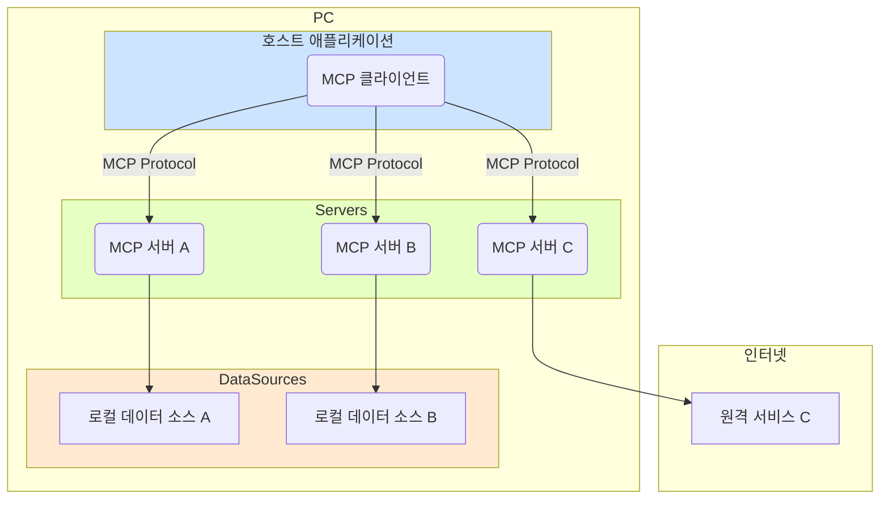

**Model Context Protocol(MCP)**는 애플리케이션이 LLM(거대 언어 모델)에게 컨텍스트를 제공하는 방식을 표준화하는 오픈 프로토콜입니다. 주변 기기를 연결하는 USB-C 포트처럼, MCP는 AI 모델을 다양한 데이터 소스와 도구에 표준화된 방식으로 연결하는 'AI 애플리케이션을 위한 USB-C 포트'라고 생각할 수 있습니다.

LLM의 활용 범위가 넓어지면서, 단순히 대화하는 것을 넘어 외부 데이터에 접근하고 특정 도구를 사용하는 '에이전트'로서의 역할이 중요해지고 있습니다. MCP는 바로 이 지점에서 개발자들이 겪는 어려움을 해결하기 위해 등장했습니다.

---

## MCP가 필요한 이유

LLM을 기반으로 에이전트나 복잡한 워크플로우를 구축할 때, 우리는 필연적으로 외부 데이터 및 도구와의 연동 문제를 마주하게 됩니다. MCP는 다음과 같은 이점을 제공하며 이 문제를 해결하는 데 도움을 줍니다.

- **사전 구축된 통합 기능**: LLM이 직접 연결하여 사용할 수 있는, 계속해서 성장하는 통합 기능 목록을 제공합니다.
- **유연성**: 특정 LLM 제공업체나 벤더에 종속되지 않고 자유롭게 전환할 수 있는 유연성을 확보할 수 있습니다.
- **보안**: 인프라 내에서 데이터를 안전하게 보호하기 위한 모범 사례를 제시합니다.

---

## MCP의 핵심 아키텍처

MCP의 핵심은 **클라이언트-서버 아키텍처**를 따릅니다. 하나의 호스트 애플리케이션이 여러 서버에 동시에 연결되어 필요한 기능을 확장하는 구조입니다.

이 구조는 각 기능이 독립적인 서버로 분리되어 있어 유지보수가 용이하고, 필요에 따라 기능을 쉽게 추가하거나 제거할 수 있는 장점이 있습니다. 더 자세한 내용은 [[MCP 핵심 아키텍처 심층 분석]] 문서를 참고해주세요.

코드 스니펫

- **MCP 호스트 (Host)**: Claude 데스크톱, IDE, AI 도구와 같이 MCP를 통해 데이터에 접근하고자 하는 메인 프로그램을 의미합니다.
- **[[MCP Client]]**: 호스트 내에 존재하며, 각 서버와 1:1 연결을 유지하는 프로토콜 클라이언트입니다.
- **MCP 서버 (Server)**: 표준화된 MCP를 통해 특정 기능을 외부에 노출하는 경량 프로그램입니다.
- **로컬 데이터 소스 (Local Data Sources)**: MCP 서버가 안전하게 접근할 수 있는 사용자의 컴퓨터 파일, 데이터베이스, 로컬 서비스 등입니다.
- **원격 서비스 (Remote Services)**: MCP 서버가 API 등을 통해 연결할 수 있는 외부 시스템입니다.

---

## MCP 핵심 개념 살펴보기

MCP를 더 깊이 이해하고 싶다면 다음 핵심 개념들을 살펴보는 것을 추천합니다. 각 항목은 별도의 노트에서 더 자세히 다룹니다.

- **[[MCP 리소스(Resources)]]**: 서버의 데이터와 콘텐츠를 LLM에 노출하는 방법
- **[[MCP 프롬프트(Prompts)]]**: 재사용 가능한 프롬프트 템플릿과 워크플로우 생성
- **[[MCP 도구(Tools)]]**: LLM이 서버를 통해 특정 작업을 수행하도록 하는 기능
- **[[MCP 샘플링(Sampling)]]**: 서버가 LLM에게 직접 Completion을 요청하는 방법
- **[[MCP 전송(Transports)]]**: MCP의 통신 메커니즘에 대한 이해

## 참고자료
1. https://modelcontextprotocol.io/introduction