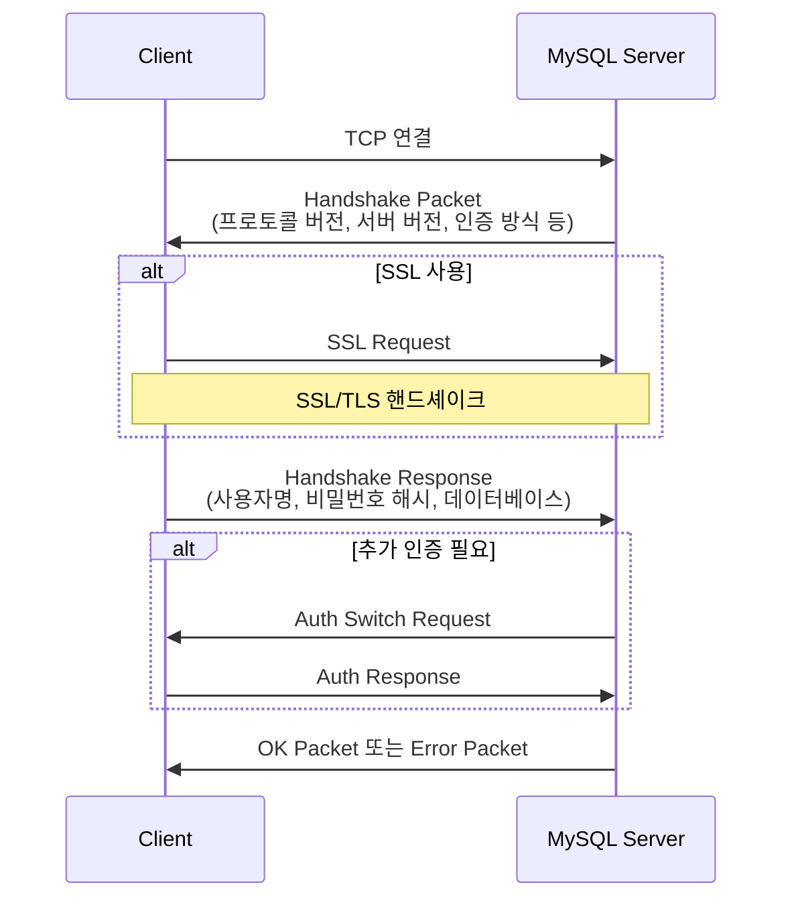
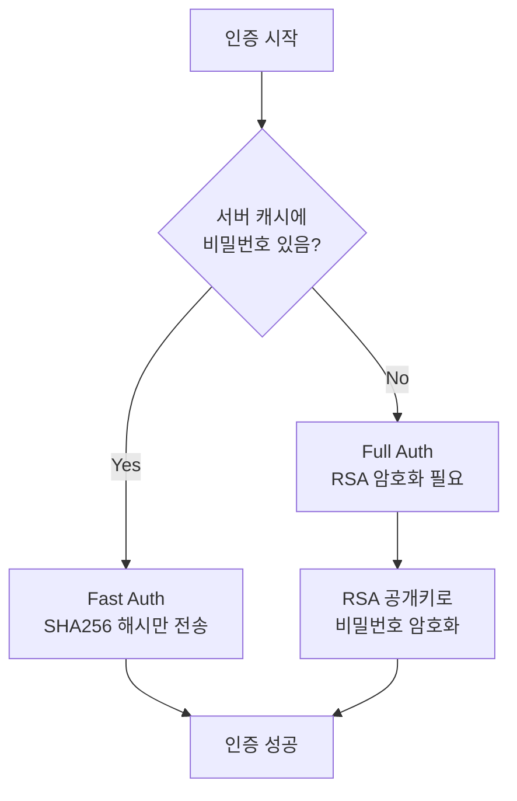
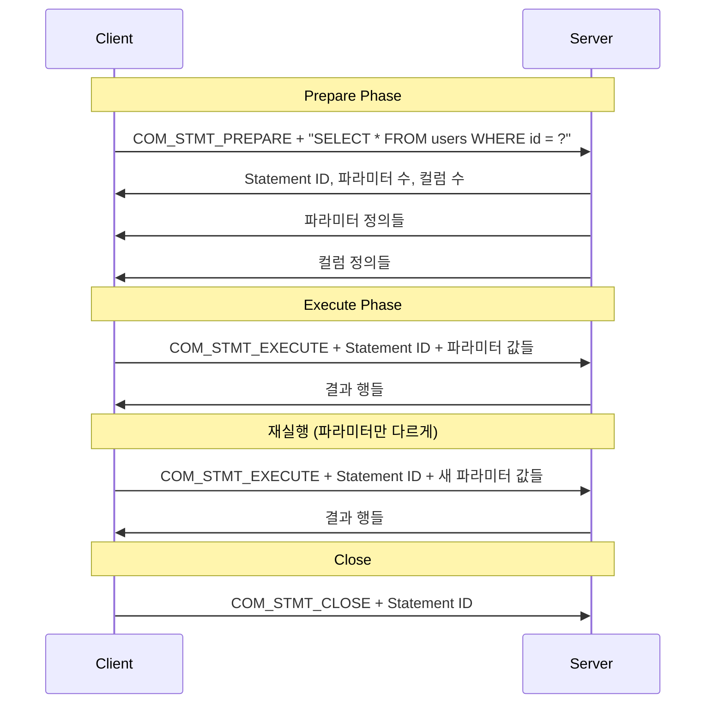
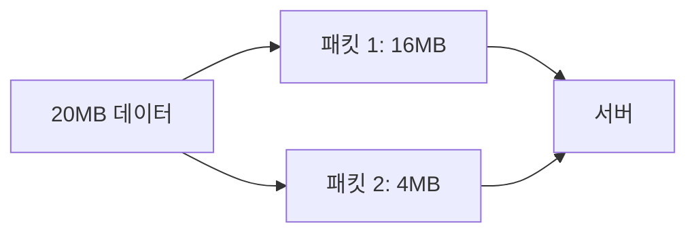

---
tags:
  - mysql
  - protocol
  - database
---

MySQL 프로토콜은 클라이언트와 MySQL 서버 간의 통신 규약이다. r2dbc-mysql 드라이버는 이 프로토콜을 직접 구현하여 비동기 논블로킹 방식으로 데이터베이스와 통신한다.

---

## 프로토콜 개요

MySQL 프로토콜은 TCP 위에서 동작하는 바이너리 프로토콜이다. 패킷 기반으로 메시지를 주고받으며, 각 패킷은 헤더와 페이로드로 구성된다.

```
+--------+--------+--------+--------+----------------+
| Length (3bytes) | Seq(1) | Payload (N bytes)      |
+--------+--------+--------+--------+----------------+
```

- **Length**: 페이로드 길이 (최대 16MB - 1)
- **Seq**: 시퀀스 번호 (0~255 순환)
- **Payload**: 실제 데이터

## 연결 수립 과정



## 인증 방식

r2dbc-mysql이 지원하는 인증 플러그인들이다.

| 플러그인 | 설명 |
|---------|------|
| mysql_native_password | SHA1 기반, MySQL 5.x 기본 |
| caching_sha2_password | SHA256 기반, MySQL 8.x 기본 |
| sha256_password | SHA256, RSA 암호화 필요 |

### caching_sha2_password 흐름

MySQL 8.x의 기본 인증이다. 서버 캐시 상태에 따라 동작이 달라진다.



## 쿼리 실행 프로토콜

### Text Protocol

단순 쿼리 실행에 사용된다. SQL을 문자열로 전송하고 결과를 받는다.

```
Client → Server: COM_QUERY + "SELECT * FROM users"
Server → Client: Column Count
Server → Client: Column Definition 1
Server → Client: Column Definition 2
Server → Client: ...
Server → Client: EOF Packet
Server → Client: Row Data 1
Server → Client: Row Data 2
Server → Client: ...
Server → Client: EOF Packet (또는 OK Packet)
```

### Binary Protocol (Prepared Statement)

파라미터화된 쿼리에 사용된다. 더 효율적이고 SQL 인젝션 방지에 유리하다.



## 패킷 타입

### 클라이언트 → 서버

| 커맨드 | 값 | 설명 |
|--------|---|------|
| COM_QUIT | 0x01 | 연결 종료 |
| COM_INIT_DB | 0x02 | 데이터베이스 선택 |
| COM_QUERY | 0x03 | SQL 쿼리 실행 |
| COM_PING | 0x0E | 연결 확인 |
| COM_STMT_PREPARE | 0x16 | Prepared Statement 준비 |
| COM_STMT_EXECUTE | 0x17 | Prepared Statement 실행 |
| COM_STMT_CLOSE | 0x19 | Prepared Statement 닫기 |
| COM_STMT_RESET | 0x1A | Prepared Statement 리셋 |

### 서버 → 클라이언트

| 패킷 | 첫 바이트 | 설명 |
|------|----------|------|
| OK Packet | 0x00 | 명령 성공 |
| Error Packet | 0xFF | 에러 발생 |
| EOF Packet | 0xFE | 결과 종료 표시 |
| Row Packet | varies | 결과 행 데이터 |

## OK Packet 구조

쿼리 성공 시 반환되는 패킷이다.

```
+--------+------------------------+------------------------+--------+---------+
| Header | Affected Rows (LenEnc) | Last Insert ID (LenEnc)| Status | Warnings|
+--------+------------------------+------------------------+--------+---------+
```

- **Affected Rows**: INSERT/UPDATE/DELETE로 영향받은 행 수
- **Last Insert ID**: AUTO_INCREMENT 값
- **Status**: 서버 상태 플래그
- **Warnings**: 경고 수

## Error Packet 구조

```
+--------+------------+--------+-----------+---------+
| 0xFF   | Error Code | # Mark | SQL State | Message |
+--------+------------+--------+-----------+---------+
```

r2dbc-mysql은 이를 파싱하여 적절한 R2DBC 예외로 변환한다.

```java
// MySQL Error Code → R2DBC Exception
1045 → R2dbcPermissionDeniedException  // Access denied
1062 → R2dbcDataIntegrityViolationException  // Duplicate entry
1064 → R2dbcBadGrammarException  // SQL syntax error
```

## 큰 패킷 처리

MySQL 프로토콜의 단일 패킷은 최대 16MB다. 더 큰 데이터는 여러 패킷으로 분할된다.



시퀀스 번호가 연속적으로 증가하여 순서를 보장한다.

## r2dbc-mysql의 프로토콜 구현

r2dbc-mysql은 Reactor Netty를 사용하여 이 프로토콜을 구현한다.

```
ReactorNettyClient
    ↓
MessageDuplexCodec (인코딩/디코딩)
    ↓
Netty Channel (TCP)
    ↓
MySQL Server
```

### 메시지 인코더

Java 객체를 MySQL 프로토콜 패킷으로 변환한다.

```java
// TextQueryMessage → COM_QUERY 패킷
ByteBuf packet = allocator.buffer();
packet.writeByte(0x03);  // COM_QUERY
packet.writeCharSequence(sql, charset);
```

### 메시지 디코더

MySQL 프로토콜 패킷을 Java 객체로 변환한다. 상태 머신을 사용하여 복잡한 응답 시퀀스를 처리한다.

```java
// 디코딩 컨텍스트에 따라 다른 파서 사용
switch (decodeContext.getState()) {
    case LOGIN: return parseHandshakePacket(packet);
    case RESULT_METADATA: return parseColumnDefinition(packet);
    case RESULT_ROWS: return parseRowData(packet);
}
```

## 압축

MySQL 프로토콜은 압축을 지원한다. r2dbc-mysql은 zlib과 zstd를 지원한다.

```java
// 압축 활성화
ConnectionFactoryOptions.builder()
    .option(Option.valueOf("zstdCompressionLevel"), 3)
    .build();
```

압축 시 패킷 구조:
```
+--------+--------+--------+--------+------------------+--------------+
| CompLen| Seq    | UncompLen       | Compressed Payload               |
+--------+--------+--------+--------+------------------+--------------+
```

## References

- [MySQL Protocol Documentation](https://dev.mysql.com/doc/dev/mysql-server/latest/page_protocol_basics.html)
- [[R2DBC 동작 원리]]
- [[Codec]]
- [[논블로킹(Non-blocking)|Non-blocking IO]]
