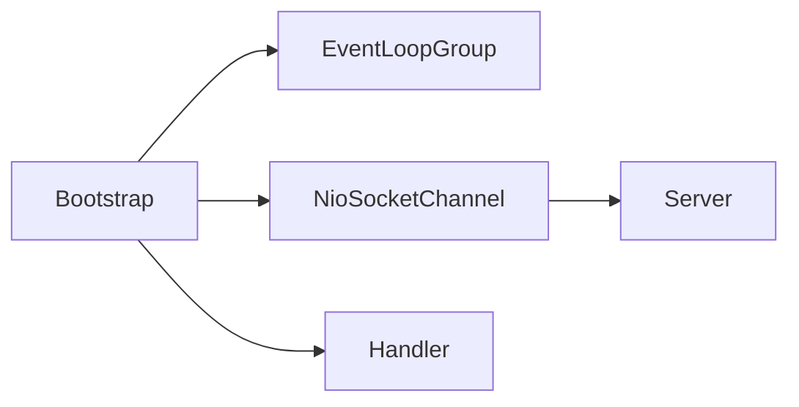
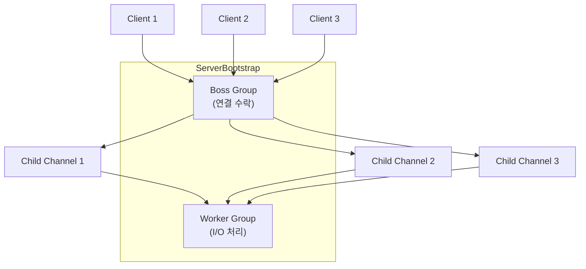

Bootstrap은 [[Netty]] 애플리케이션의 시작점이다. 채널 생성, [[Netty EventLoop]] 설정, [[Netty ChannelPipeline]] 초기화 등 네트워크 애플리케이션 구동에 필요한 모든 설정을 한 곳에서 관리한다. 서버용 `ServerBootstrap`과 클라이언트용 `Bootstrap` 두 가지가 있다.

---

## 클라이언트 Bootstrap

클라이언트 애플리케이션에서는 `Bootstrap` 클래스를 사용한다. 원격 서버에 연결하고 데이터를 주고받는 설정을 담당한다.

```java
public class EchoClient {
    public static void main(String[] args) throws Exception {
        EventLoopGroup group = new NioEventLoopGroup();

        try {
            Bootstrap b = new Bootstrap();
            b.group(group)                              // EventLoop 설정
             .channel(NioSocketChannel.class)           // 채널 타입 설정
             .option(ChannelOption.TCP_NODELAY, true)   // 소켓 옵션
             .handler(new ChannelInitializer<SocketChannel>() {
                 @Override
                 protected void initChannel(SocketChannel ch) {
                     ch.pipeline().addLast(new EchoClientHandler());
                 }
             });

            // 연결
            ChannelFuture f = b.connect("localhost", 8080).sync();

            // 연결이 닫힐 때까지 대기
            f.channel().closeFuture().sync();
        } finally {
            group.shutdownGracefully();
        }
    }
}
```



---

## 서버 ServerBootstrap

서버에서는 `ServerBootstrap`을 사용한다. 클라이언트 연결을 수락하고 각 연결에 대한 자식 채널을 생성한다.

```java
public class EchoServer {
    public static void main(String[] args) throws Exception {
        EventLoopGroup bossGroup = new NioEventLoopGroup(1);    // 연결 수락
        EventLoopGroup workerGroup = new NioEventLoopGroup();   // I/O 처리

        try {
            ServerBootstrap b = new ServerBootstrap();
            b.group(bossGroup, workerGroup)                     // Boss/Worker 분리
             .channel(NioServerSocketChannel.class)             // 서버 채널 타입
             .option(ChannelOption.SO_BACKLOG, 128)             // 서버 소켓 옵션
             .childOption(ChannelOption.SO_KEEPALIVE, true)     // 자식 채널 옵션
             .handler(new LoggingHandler(LogLevel.INFO))        // 서버 채널 핸들러
             .childHandler(new ChannelInitializer<SocketChannel>() {
                 @Override
                 protected void initChannel(SocketChannel ch) {
                     ch.pipeline().addLast(new EchoServerHandler());
                 }
             });

            // 바인딩
            ChannelFuture f = b.bind(8080).sync();

            // 서버 채널이 닫힐 때까지 대기
            f.channel().closeFuture().sync();
        } finally {
            bossGroup.shutdownGracefully();
            workerGroup.shutdownGracefully();
        }
    }
}
```

### Boss vs Worker 그룹



| 그룹 | 역할 | 권장 스레드 수 |
|-----|------|-------------|
| Boss | 클라이언트 연결 수락 | 1 (포트당) |
| Worker | 자식 채널 I/O 처리 | CPU 코어 * 2 |

---

## 설정 메서드

### group()

EventLoopGroup을 설정한다.

```java
// 클라이언트: 단일 그룹
bootstrap.group(group);

// 서버: Boss/Worker 분리
serverBootstrap.group(bossGroup, workerGroup);

// 서버: 단일 그룹 (같은 그룹이 양쪽 역할)
serverBootstrap.group(group);
```

### channel()

사용할 채널 클래스를 지정한다.

```java
// NIO (범용)
bootstrap.channel(NioSocketChannel.class);
serverBootstrap.channel(NioServerSocketChannel.class);

// Epoll (Linux)
bootstrap.channel(EpollSocketChannel.class);
serverBootstrap.channel(EpollServerSocketChannel.class);

// KQueue (macOS)
bootstrap.channel(KQueueSocketChannel.class);
serverBootstrap.channel(KQueueServerSocketChannel.class);
```

### option() / childOption()

소켓 옵션을 설정한다.

```java
// 부모 채널 (서버 소켓) 옵션
serverBootstrap.option(ChannelOption.SO_BACKLOG, 128);

// 자식 채널 (클라이언트 연결) 옵션
serverBootstrap.childOption(ChannelOption.SO_KEEPALIVE, true);
serverBootstrap.childOption(ChannelOption.TCP_NODELAY, true);

// 클라이언트
bootstrap.option(ChannelOption.CONNECT_TIMEOUT_MILLIS, 5000);
bootstrap.option(ChannelOption.TCP_NODELAY, true);
```

주요 옵션:

| 옵션 | 설명 |
|-----|------|
| SO_BACKLOG | 연결 대기 큐 크기 |
| SO_KEEPALIVE | TCP Keep-Alive 활성화 |
| TCP_NODELAY | Nagle 알고리즘 비활성화 |
| SO_RCVBUF | 수신 버퍼 크기 |
| SO_SNDBUF | 송신 버퍼 크기 |
| CONNECT_TIMEOUT_MILLIS | 연결 타임아웃 |

### handler() / childHandler()

파이프라인을 초기화한다.

```java
// 부모 채널 핸들러 (서버 자체의 이벤트 처리)
serverBootstrap.handler(new LoggingHandler(LogLevel.INFO));

// 자식 채널 핸들러 (각 클라이언트 연결 처리)
serverBootstrap.childHandler(new ChannelInitializer<SocketChannel>() {
    @Override
    protected void initChannel(SocketChannel ch) {
        ChannelPipeline p = ch.pipeline();
        p.addLast(new HttpServerCodec());
        p.addLast(new HttpObjectAggregator(65536));
        p.addLast(new MyBusinessHandler());
    }
});
```

### attr() / childAttr()

채널에 속성을 설정한다.

```java
AttributeKey<String> TOKEN_KEY = AttributeKey.valueOf("token");

// 부모 채널 속성
serverBootstrap.attr(TOKEN_KEY, "server-token");

// 자식 채널 속성
serverBootstrap.childAttr(TOKEN_KEY, "client-token");

// 핸들러에서 사용
public void channelActive(ChannelHandlerContext ctx) {
    String token = ctx.channel().attr(TOKEN_KEY).get();
}
```

---

## 연결과 바인딩

### 클라이언트 연결

```java
// 동기 연결
ChannelFuture f = bootstrap.connect("localhost", 8080).sync();
Channel channel = f.channel();

// 비동기 연결
ChannelFuture f = bootstrap.connect("localhost", 8080);
f.addListener((ChannelFutureListener) future -> {
    if (future.isSuccess()) {
        System.out.println("연결 성공");
        Channel channel = future.channel();
    } else {
        System.out.println("연결 실패");
        future.cause().printStackTrace();
    }
});
```

### 서버 바인딩

```java
// 동기 바인딩
ChannelFuture f = serverBootstrap.bind(8080).sync();

// 여러 포트 바인딩
ChannelFuture f1 = serverBootstrap.bind(8080).sync();
ChannelFuture f2 = serverBootstrap.bind(8443).sync();

// 비동기 바인딩
serverBootstrap.bind(8080).addListener((ChannelFutureListener) future -> {
    if (future.isSuccess()) {
        System.out.println("서버 시작됨: 8080");
    }
});
```

---

## ChannelInitializer

새로운 채널이 생성될 때마다 파이프라인을 초기화하는 특수한 핸들러다.

```java
public class MyChannelInitializer extends ChannelInitializer<SocketChannel> {

    private final SslContext sslContext;

    public MyChannelInitializer(SslContext sslContext) {
        this.sslContext = sslContext;
    }

    @Override
    protected void initChannel(SocketChannel ch) {
        ChannelPipeline p = ch.pipeline();

        // SSL 핸들러 (선택)
        if (sslContext != null) {
            p.addLast(sslContext.newHandler(ch.alloc()));
        }

        // 프레임 디코더
        p.addLast(new LengthFieldBasedFrameDecoder(65535, 0, 2, 0, 2));
        p.addLast(new LengthFieldPrepender(2));

        // 문자열 코덱
        p.addLast(new StringDecoder(CharsetUtil.UTF_8));
        p.addLast(new StringEncoder(CharsetUtil.UTF_8));

        // 비즈니스 로직
        p.addLast(new MyBusinessHandler());
    }
}

// 사용
serverBootstrap.childHandler(new MyChannelInitializer(sslContext));
```

`ChannelInitializer`는 `initChannel()` 호출 후 자동으로 파이프라인에서 제거된다.

---

## Bootstrap 복제

동일한 설정으로 여러 연결을 만들 때 `clone()`을 사용한다.

```java
Bootstrap bootstrap = new Bootstrap();
bootstrap.group(group)
         .channel(NioSocketChannel.class)
         .handler(new MyInitializer());

// 여러 서버에 연결
for (String host : hosts) {
    Bootstrap cloned = bootstrap.clone();
    cloned.connect(host, 8080);
}
```

---

## 완전한 예제: HTTP 서버

```java
public class HttpServer {
    public static void main(String[] args) throws Exception {
        EventLoopGroup bossGroup = new NioEventLoopGroup(1);
        EventLoopGroup workerGroup = new NioEventLoopGroup();

        try {
            ServerBootstrap b = new ServerBootstrap();
            b.group(bossGroup, workerGroup)
             .channel(NioServerSocketChannel.class)
             .option(ChannelOption.SO_BACKLOG, 1024)
             .childOption(ChannelOption.SO_KEEPALIVE, true)
             .childOption(ChannelOption.TCP_NODELAY, true)
             .childHandler(new ChannelInitializer<SocketChannel>() {
                 @Override
                 protected void initChannel(SocketChannel ch) {
                     ChannelPipeline p = ch.pipeline();

                     // HTTP 코덱
                     p.addLast(new HttpServerCodec());

                     // 청크 집계
                     p.addLast(new HttpObjectAggregator(65536));

                     // 압축
                     p.addLast(new HttpContentCompressor());

                     // 비즈니스 로직
                     p.addLast(new HttpRequestHandler());
                 }
             });

            Channel ch = b.bind(8080).sync().channel();
            System.out.println("HTTP 서버 시작: http://localhost:8080/");

            ch.closeFuture().sync();
        } finally {
            bossGroup.shutdownGracefully();
            workerGroup.shutdownGracefully();
        }
    }
}
```

---

## 종료 처리

```java
// EventLoopGroup 종료 (권장)
group.shutdownGracefully();

// 타임아웃 설정
group.shutdownGracefully(2, 15, TimeUnit.SECONDS);
// 2초: quiet period (새 태스크 없으면 즉시 종료)
// 15초: 최대 대기 시간

// 동기 대기
group.shutdownGracefully().sync();
```

---

## 플랫폼별 최적화

```java
public static EventLoopGroup createEventLoopGroup() {
    if (Epoll.isAvailable()) {
        return new EpollEventLoopGroup();
    } else if (KQueue.isAvailable()) {
        return new KQueueEventLoopGroup();
    } else {
        return new NioEventLoopGroup();
    }
}

public static Class<? extends ServerChannel> serverChannelClass() {
    if (Epoll.isAvailable()) {
        return EpollServerSocketChannel.class;
    } else if (KQueue.isAvailable()) {
        return KQueueServerSocketChannel.class;
    } else {
        return NioServerSocketChannel.class;
    }
}

// 사용
EventLoopGroup group = createEventLoopGroup();
serverBootstrap.channel(serverChannelClass());
```

---

## References

- [[Netty]]
- [[Netty Channel]]
- [[Netty EventLoop]]
- [[Netty ChannelPipeline]]
